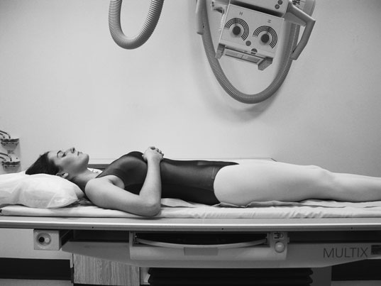
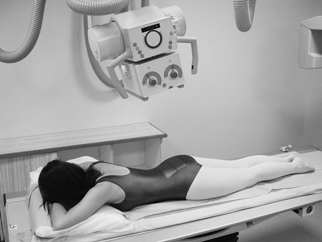
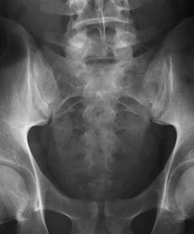
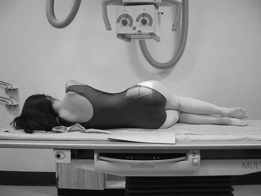
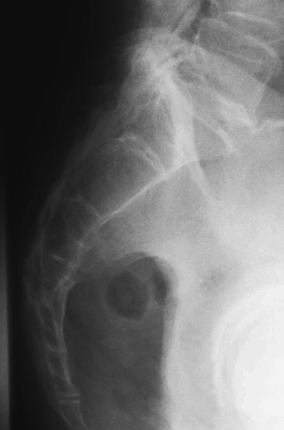

# Rx Sacru Antero-Posterior (AP)/Postero-Anterior (PA)

  📷 Radiografie Convențională (Rx)
  <strong>Actualizat:</strong> 2026-09-16
  <strong>Autor:</strong> Departamentul de Radiologie / Referință Clark (Ed. 12)

---

-   __1. Rezumat Clinic & Indicații__

    ---

    === "Indicații Clinice"

        - Sacru este thin bone. Problems cu expunere poate easily lead la important pathologies such ca suspiciune de fractură și metastases being missed. 190
        - suspiciune de fractură sunt easily missed if expunere este poor sau grade de rotație este present.

    === "Ghid Național IRIS"

        !!! info "Referință Primară: Ghidul Național IRIS (Ordinul MS 1342/2012)"
            - **Capitol Ghid IRIS:** *Ghidul Național IRIS*
            - **Grad de Recomandare:** **De verificat pe indicație; fără grad atribuit automat**
            - **Nivel de Iradiere Estimată:** `De verificat pentru examinarea și populația selectate`

            [:octicons-search-16: Deschide Ghidul IRIS](../../iris.md){ .md-button .md-button--primary } [:material-open-in-new: Aplicația Oficială PWA](https://radiologie-pediatrica.ro/iris/){ .md-button target="_blank" rel="noopener" }
-   __2. Poziționare & Centrare Fascicul__

    ---

    - **Poziție Pacient:** • pacientul este culcat Decubit dorsal sau Decubit ventral pe masa radiologică, cu planul mediosagital coincident cu, și la drept-angles la, linia mediană Bucky.
• anterior superior iliac spines trebuie să fie echidistant față de tabletop.
• If pacientul este examined Decubit dorsal (antero-posteriorly), genunchii poate fie flectat over foam pad pentru comfort. This will also reduce pelvic tilt.
• caseta este displaced cranially pentru Antero-posterior (AP) incidență, sau caudally pentru Postero-anterior (PA) incidențe, such that its centre coincides cu înclinat raza centrală.

• pacientul este culcat pe either side pe masa radiologică, cu brațele raised și mâinile resting pe pillow. Genunchii și șoldurile sunt ușor flectate pentru stabilitate și confort.
• Fața dorsală trunchiului trebuie să fie perpendiculară (în unghi drept) pe casetă. Alinierea corectă se verifică prin palparea crestelor iliace sau spinelor iliace postero-superioare. plan coronal running through centre de coloană vertebrală trebuie să coincide cu, și fie perpendicular la, linia mediană Bucky.
• caseta este centred la coincide cu raza centrală centrală la nivelul midpoint de Sacru.
    - **Punct de Centrare Fascicul:** • Antero-posterior (AP): se orientează raza centrală centrală 10–25 grade cranially de la vertical și spre point midway între level de anterior superior iliac spines și superior margine de simfiză pubiană.
• grade de angulation de raza centrală este normally greater pentru females than pentru males și will fie less pentru greater grade de flexion la șoldurile și genunchi.
• Postero-anterior (PA): palpate poziție de Sacru prin locating spină iliacă postero-superioară (SIPS) și Coccis. Centre la middle de Sacru în linia mediană.
• grade de fascicul angulation will depend pe pelvic tilt.
Palpate Sacru și then simply apply caudal angulation, astfel încât raza centrală este perpendicular pe axa longitudinală de Sacru (see photograph opposite).

• se orientează raza centrală centrală la drept-angles la axa longitudinală de Sacru și spre point în linia mediană mesei la level midway între posterior superior iliac spines și sacro-coccygeal junction.
    - **Distanță Focar-Film (DFF / SID):** 100 cm
    - **Comandă Respiratorie:** Apnee pe durata expunerii (apnee în inspir pentru torace; expir pentru Abdomen/bazin).

-   __3. Parametri Tehnici Expunere__

    ---

    | Parametru Tehnic | Valoare Configurare Generator / Tub |
    |:-----------------|:-------------------------------------|
    | **Tensiune Tub (kV)** | DE CONFIGURAT PE APARAT |
    | **Sarcină / Produs Curent-Timp (mAs)** | Conform AEC / grosime anatomică |
    | **Distanță Focar-Film (DFF / SID)** | 100 cm |
    | **Grilă Antidifuzoare (Bucky)** | Cu grilă antidifuzoare Bucky |
    | **Dimensiune Focar** | Focar Mic (0.6 mm) |
    | **Camere de Ionizare AEC** | Camerele laterale (sau camera centrală funcție de regiune) |
    | **Colimare Fascicul** | Colimare strictă la aria anatomică de interes diagnostic |
    | **Filtrare Tub** | Totală ≥ 2.5 mm Al echivalent (conform Clark: 3.0 mm Al eq.) |

-   __4. Criterii de Calitate & Reușită Imagine__

    ---

    - Erori de evitat / remedii: If using automatic expunere control, centring too far posteriorly will result în underexposed imagine.

-   __5. Protecție Radiologică (ALARA)__

    ---

    - Ecranare gonadică cu șorț plumbat dacă gonadele sunt în apropierea fasciculului util (regula ALARA).
    - Colimare precisă la dimensiunea anatomică strict necesară pentru reducerea dozei și a radiației difuze.
    - Verificarea posibilității unei sarcini la pacientele de vârstă fertilă înainte de expunere.

!!! note "Observații Clinice & Tehnice"
    Pregătirea pacientului prin îndepărtarea tuturor accesoriilor radio-opace.

### 🖼️ Imagini

<figure class="protocol-image-card" markdown>

<figcaption><strong>demonstration de Articulații Sacroiliace, ca spații articulare will</strong> — Poziționare pacient și centrare fascicul conform Clark (Ed. 12)</figcaption>

</figure>

<figure class="protocol-image-card" markdown>

<figcaption><strong>• grade de angulation de raza centrală este normally</strong> — Aspect radiografic / ghid de poziționare conform tratatului Clark (Ed. 12)</figcaption>

</figure>

<figure class="protocol-image-card" markdown>

<figcaption><strong>easily lead la important pathologies such ca suspiciune de fractură și</strong> — Aspect radiografic / ghid de poziționare conform tratatului Clark (Ed. 12)</figcaption>

</figure>

<figure class="protocol-image-card" markdown>

<figcaption><strong>• suspiciune de fractură sunt easily missed if expunere este poor sau grade</strong> — Aspect radiografic / ghid de poziționare conform tratatului Clark (Ed. 12)</figcaption>

</figure>

<figure class="protocol-image-card" markdown>

<figcaption><strong>Figura 5: Aspect radiografic / Poziționare (Clark Ed. 12)</strong> — Aspect radiografic / ghid de poziționare conform tratatului Clark (Ed. 12)</figcaption>

</figure>

=== "Ghid Rapid de Execuție"

    1. **Identificarea și verificarea pacientului:** verificare identitate, zonă de examinat, consimțământ conform procedurii și evaluarea posibilității unei sarcini, când este relevantă.
    2. **Pregătire:** îndepărtarea oricăror obiecte radiopace (bijuterii, agrafe, fermoare, proteze, pansamente dense).
    3. **Poziționare precisă:** alinierea receptorului de imagine și a tubului la distanța prescrisă (100 cm).
    4. **Colimare strictă:** adaptarea fasciculului strict la regiunea de diagnostic pentru scăderea iradierii și reducerea radiației difuze.
    5. **Radioprotecție:** verificarea [politicii RX](../radioprotectie.md), cu măsuri distincte pentru pacient, personal și însoțitor.

## Surse de documentare

- [Clark's Positioning in Radiography (Ed. 12), Pagina 205](../../assets/protocols/sources/Clark___Positioning_in_Radiography__12th_edition.pdf#page=205)
