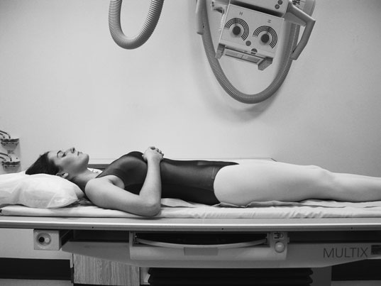
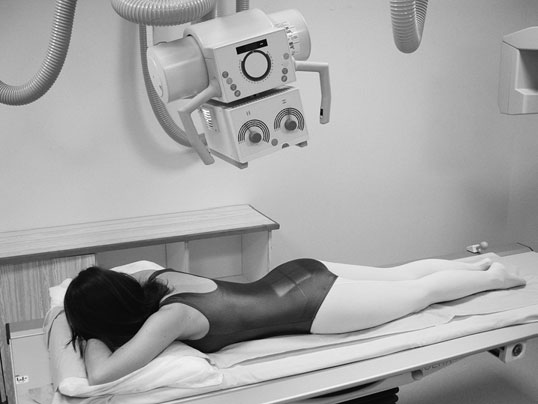
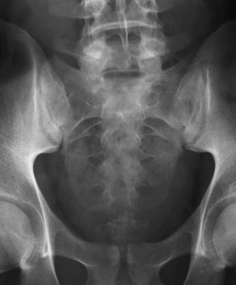
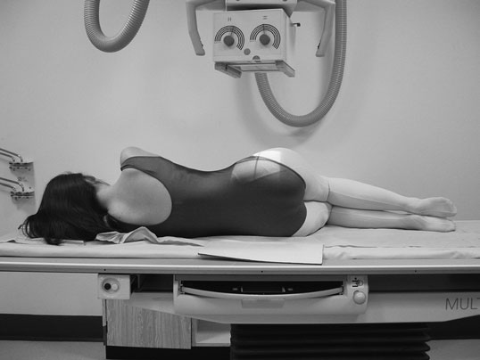
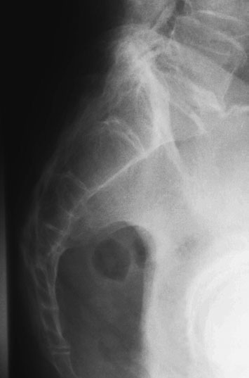

# Rx Sacru Antero-Posterior (AP)/Postero-Anterior (PA)

  📷 Radiografie Convențională (Rx)
  <strong>Actualizat:</strong> 2026-09-16
  <strong>Autor:</strong> Departamentul de Radiologie / Referință Clark (Ed. 12)

---

-   __1. Rezumat Clinic & Indicații__

    ---

    === "Indicații Clinice"

        - Sacrul este un os subțire. Problemele de expunere pot duce cu ușurință la omiterea unor patologii importante, precum suspiciunea de fractură și metastazele. 190
        - Suspiciunile de fractură sunt omise cu ușurință dacă expunerea este slabă sau există un grad de rotație.

    === "Ghid Național IRIS"

        !!! info "Referință Primară: Ghidul Național IRIS (Ordinul MS 1342/2012)"
            - **Capitol Ghid IRIS:** *Ghidul Național IRIS*
            - **Grad de Recomandare:** **De verificat pe indicație; fără grad atribuit automat**
            - **Nivel de Iradiere Estimată:** `De verificat pentru examinarea și populația selectate`

            [:octicons-search-16: Deschide Ghidul IRIS](../../iris.md){ .md-button .md-button--primary } [:material-open-in-new: Aplicația Oficială PWA](https://radiologie-pediatrica.ro/iris/){ .md-button target="_blank" rel="noopener" }
-   __2. Poziționare & Centrare Fascicul__

    ---

    - **Poziție Pacient:** • Pacientul este culcat în decubit dorsal sau decubit ventral pe masa radiologică, cu planul mediosagital coincident cu linia mediană Bucky și perpendicular pe aceasta.
• Spinele iliace antero-superioare trebuie să fie echidistante față de masa radiologică.
• Dacă pacientul este examinat în decubit dorsal (antero-posterior), genunchii pot fi flectați peste un suport din spumă pentru confort. Aceasta va reduce și înclinarea bazinului.
• Caseta este deplasată cranial pentru incidența Antero-posterior (AP) sau caudal pentru incidențele Postero-anterioare (PA), astfel încât centrul acesteia să coincidă cu raza centrală înclinată.

• Pacientul este culcat pe oricare dintre părți pe masa radiologică, cu brațele ridicate și mâinile sprijinite pe o pernă. Genunchii și șoldurile sunt ușor flectate pentru stabilitate și confort.
• Fața dorsală a trunchiului trebuie să fie perpendiculară (în unghi drept) pe casetă. Alinierea corectă se verifică prin palparea crestelor iliace sau a spinelor iliace postero-superioare. Planul coronal care trece prin centrul coloanei vertebrale trebuie să coincidă cu linia mediană Bucky și să fie perpendicular pe aceasta.
• Caseta este centrată astfel încât să coincidă cu raza centrală la nivelul punctului median al sacrului.
    - **Punct de Centrare Fascicul:** • Antero-posterior (AP): se orientează raza centrală 10–25 grade cranial față de verticală și spre punctul situat la jumătatea distanței dintre nivelul spinelor iliace antero-superioare și marginea superioară a simfizei pubiene.
• Gradul de angulare a razei centrale este în mod normal mai mare la femei decât la bărbați și va fi mai mic pentru grade mai mari de flexie a șoldurilor și genunchilor.
• Postero-anterior (PA): se palpează poziția sacrului prin localizarea spinelor iliace postero-superioare (SIPS) și a coccisului. Se centrează pe mijlocul sacrului, pe linia mediană.
• Gradul de angulare a fasciculului va depinde de înclinarea bazinului.
Se palpează sacrul și apoi se aplică simplu o angulare caudală, astfel încât raza centrală să fie perpendiculară pe axa longitudinală a sacrului (vezi fotografia alăturată).

• Se orientează raza centrală perpendicular pe axa longitudinală a sacrului și spre un punct situat pe linia mediană a mesei, la nivelul situat la jumătatea distanței dintre spinele iliace postero-superioare și joncțiunea sacrococcigiană.
    - **Distanță Focar-Film (DFF / SID):** 100 cm
    - **Comandă Respiratorie:** Apnee pe durata expunerii (apnee în inspir pentru torace; expir pentru Abdomen/bazin).

-   __3. Parametri Tehnici Expunere__

    ---

    | Parametru Tehnic | Valoare Configurare Generator / Tub |
    |:-----------------|:-------------------------------------|
    | **Tensiune Tub (kV)** | DE CONFIGURAT PE APARAT |
    | **Sarcină / Produs Curent-Timp (mAs)** | Conform AEC / grosimii anatomice |
    | **Distanță Focar-Film (DFF / SID)** | 100 cm |
    | **Grilă Antidifuzoare (Bucky)** | Cu grilă antidifuzoare Bucky |
    | **Dimensiune Focar** | Focar Mic (0.6 mm) |
    | **Camere de Ionizare AEC** | Camerele laterale (sau camera centrală, în funcție de regiune) |
    | **Colimare Fascicul** | Colimare strictă la aria anatomică de interes diagnostic |
    | **Filtrare Tub** | Totală ≥ 2.5 mm Al echivalent (conform Clark: 3.0 mm Al echivalent) |

-   __4. Criterii de Calitate & Reușită Imagine__

    ---

    - Erori de evitat / remedii: Dacă se utilizează controlul automat al expunerii, centrarea prea posterior va duce la o imagine subexpusă.

-   __5. Protecție Radiologică (ALARA)__

    ---

    - Ecranare gonadică cu șorț plumbat dacă gonadele sunt în apropierea fasciculului util (regula ALARA).
    - Colimare precisă la dimensiunea anatomică strict necesară pentru reducerea dozei și a radiației difuze.
    - Verificarea posibilității unei sarcini la pacientele de vârstă fertilă înainte de expunere.

!!! note "Observații Clinice & Tehnice"
    Pregătirea pacientului prin îndepărtarea tuturor accesoriilor radio-opace.

### 🖼️ Imagini

<figure class="protocol-image-card" markdown>

<figcaption><strong>Demonstrarea articulațiilor sacroiliace, deoarece spațiile articulare vor</strong> — Poziționarea pacientului și centrarea fasciculului conform Clark (Ed. 12)</figcaption>

</figure>

<figure class="protocol-image-card" markdown>

<figcaption><strong>• Gradul de angulare a razei centrale este în mod normal</strong> — Aspect radiografic / ghid de poziționare conform tratatului Clark (Ed. 12)</figcaption>

</figure>

<figure class="protocol-image-card" markdown>

<figcaption><strong>poate duce cu ușurință la patologii importante, precum suspiciunea de fractură și</strong> — Aspect radiografic / ghid de poziționare conform tratatului Clark (Ed. 12)</figcaption>

</figure>

<figure class="protocol-image-card" markdown>

<figcaption><strong>• Suspiciunile de fractură sunt omise cu ușurință dacă expunerea este slabă sau gradul</strong> — Aspect radiografic / ghid de poziționare conform tratatului Clark (Ed. 12)</figcaption>

</figure>

<figure class="protocol-image-card" markdown>

<figcaption><strong>Figura 5: Aspect radiografic / Poziționare (Clark Ed. 12)</strong> — Aspect radiografic / ghid de poziționare conform tratatului Clark (Ed. 12)</figcaption>

</figure>

=== "Ghid Rapid de Execuție"

    1. **Identificarea și verificarea pacientului:** verificare identitate, zonă de examinat, consimțământ conform procedurii și evaluarea posibilității unei sarcini, când este relevantă.
    2. **Pregătire:** îndepărtarea oricăror obiecte radiopace (bijuterii, agrafe, fermoare, proteze, pansamente dense).
    3. **Poziționare precisă:** alinierea receptorului de imagine și a tubului la distanța prescrisă (100 cm).
    4. **Colimare strictă:** adaptarea fasciculului strict la regiunea de diagnostic pentru scăderea iradierii și reducerea radiației difuze.
    5. **Radioprotecție:** verificarea [politicii RX](../radioprotectie.md), cu măsuri distincte pentru pacient, personal și însoțitor.

## Surse de documentare

- [Clark's Positioning in Radiography (Ed. 12), Pagina 205](https://books.google.com/books/about/Clark_s_Positioning_in_Radiography.html?id=Xxu6MwEACAAJ)
