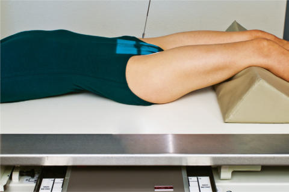
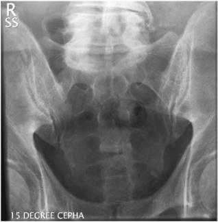
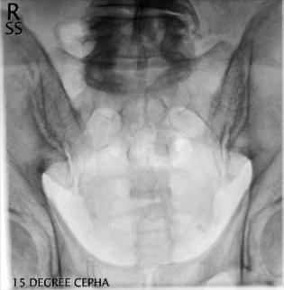

# Rx Sacru AP Axială

  📷 Radiografie Convențională (Rx)
  <strong>Actualizat:</strong> 2026-09-15
  <strong>Autor:</strong> Departamentul de Radiologie / Referință Bontrager

---

-   __1. Rezumat Clinic & Indicații__

    ---

    === "Indicații Clinice"

        - Patologia sacrului, inclusiv suspiciunea de fractură

    === "Ghid Național IRIS"

        !!! info "Referință Primară: Ghidul Național IRIS (Ordinul MS 1342/2012)"
            - **Capitol Ghid IRIS:** *Coloană vertebrală*
            - **Grad de Recomandare:** **Grad A**
            - **Nivel de Iradiere Estimată:** `Clasa 2 (Foarte mică ~ 1.0 - 1.5 mSv)`

            [:octicons-search-16: Deschide Ghidul IRIS](../../iris.md){ .md-button .md-button--primary } [:material-open-in-new: Aplicația Oficială PWA](https://radiologie-pediatrica.ro/iris/){ .md-button target="_blank" rel="noopener" }

-   __2. Poziționare & Centrare Fascicul__

    ---

    - **Poziție Pacient:** Pacient: poziția pacientului în decubit dorsal, cu brațele pe lângă corp, capul pe pernă și membrele inferioare extinse, cu suport sub genunchi pentru confort.; Regiune anatomică: Se aliniază planul mediosagital cu raza centrală și cu linia mediană a mesei și/sau a receptorului de imagine (Fig. 9.64). Se verifică absența rotației: claviculele sunt riguros echidistante față de linia proceselor spinoase. Bazin (bazin (pelvis)) există.
    - **Punct de Centrare Fascicul:** Raza centrală se înclină 15° cranial (spre cap). Se orientează raza centrală la 2 țoli (5 cm) superior de simfiza pubiană. Se centrează receptorul de imagine pe raza centrală.
    - **Distanță Focar-Film (DFF / SID):** 100 cm
    - **Comandă Respiratorie:** Apnee pe durata expunerii pentru prevenirea artefactelor de mișcare ale pacientului.

-   __3. Parametri Tehnici Expunere__

    ---

    | Parametru Tehnic | Valoare Configurare Generator / Tub |
    |:-----------------|:-------------------------------------|
    | **Tensiune Tub (kV)** | 75-90 kV |
    | **Sarcină / Produs Curent-Timp (mAs)** | DE CONFIGURAT PE APARAT |
    | **Distanță Focar-Film (DFF / SID)** | 100 cm |
    | **Grilă Antidifuzoare (Bucky)** | Cu grilă antidifuzoare Bucky |
    | **Dimensiune Focar** | Focar Mare (1.0 - 1.2 mm) |
    | **Camere de Ionizare AEC** | Camerele laterale (sau camera centrală, în funcție de regiune) |
    | **Colimare Fascicul** | Dimensiunea câmpului Colimați pe cele patru laturi la regiunea anatomică de interes. |
    | **Filtrare Tub** | Totală ≥ 2.5 mm Al echivalent |

-   __4. Criterii de Calitate & Reușită Imagine__

    ---

    - Sacrul, articulațiile SI și spațiile articulare intervertebrale L5–S1 (Figs. 9.65 și 9.66). poziție
    - Absența rotației anatomice: claviculele echidistante față de linia apofizelor spinoase, indicată prin alinierea crestelor mediene și a coccisului cu simfiza pubiană.
    - Alinierea corectă a sacrului și a razei centrale evidențiază sacrul fără scurtare proiectivă, iar pubisul și foramenele sacrale nu sunt suprapuse.
    - Colimarea câmpului la dimensiunea ariei de interes diagnostic. Expunere
    - expunerea optimă a receptorului de imagine și contrast. Evidențiere clară a marginilor osoase și a desenului trabecular al sacrului.
    - fără mișcare. 24 30 R proces articular superior al sacrului Foramene sacrale corp (L5) Ilium stâng articulație sacroiliacă Apexul coccisului Fig. 9.66 Sacru AP axial—15° cranial. Fig. 9.65 AP axial—15° cranial. Fig. 9.64 AP axial—15° cranial.

-   __5. Protecție Radiologică (ALARA)__

    ---

    - Ecranare gonadică și a organelor radiosensibile conform procedurilor locale de radioprotecție ALARA.
    - Colimare strictă la aria de interes pentru limitarea radiației difuze.
    - Verificarea posibilității unei sarcini la pacientele de vârstă fertilă înainte de expunere.

!!! note "Observații Clinice & Tehnice"
    S: Tehnologii pot crește unghiul razei centrale la 20° cranial pentru pacienții cu o curbură posterioară aparent mai mare sau cu înclinarea sacrului și bazinului (bazin (pelvis)). Sacrul feminin este în general mai scurt și mai lat decât sacrul masculin (aspect de luat în considerare la dimensiunea câmpului de colimare strâns, pe patru laturi). Această incidență poate fi efectuată și în decubit ventral (unghi de 15° caudal), dacă este necesar în funcție de starea pacientului. Sacru și Coccis RUTINĂ Sacru AP axial Coccis lateral

### 🖼️ Imagini

<figure class="protocol-image-card" markdown>

<figcaption><strong>Fig. 9.66 Sacru AP axial—15° cranial.</strong> — Poziționarea pacientului conform Ghidului Bontrager (Fig. 9.66 Sacru AP axial—15° cranial.)</figcaption>

</figure>

<figure class="protocol-image-card" markdown>

<figcaption><strong>Fig. 9.65 AP axial—15° cranial.</strong> — Aspect radiografic de referință conform Ghidului Bontrager (Fig. 9.65 AP axial—15° cranial.)</figcaption>

</figure>

<figure class="protocol-image-card" markdown>

<figcaption><strong>Fig. 9.64 AP axial—15° cranial.</strong> — Aspect radiografic de referință conform Ghidului Bontrager (Fig. 9.64 AP axial—15° cranial.)</figcaption>

</figure>

=== "Ghid Rapid de Execuție"

    1. **Identificarea și verificarea pacientului:** verificare identitate, zonă de examinat, consimțământ conform procedurii și evaluarea posibilității unei sarcini, când este relevantă.
    2. **Pregătire:** îndepărtarea oricăror obiecte radiopace (bijuterii, agrafe, fermoare, proteze, pansamente dense).
    3. **Poziționare precisă:** alinierea receptorului de imagine și a tubului la distanța prescrisă (100 cm).
    4. **Colimare strictă:** adaptarea fasciculului strict la regiunea de diagnostic pentru scăderea iradierii și reducerea radiației difuze.
    5. **Radioprotecție:** verificarea [politicii RX](../radioprotectie.md), cu măsuri distincte pentru pacient, personal și însoțitor.

## Surse de documentare

- [Bontrager's Textbook of Radiographic Positioning (Ed. 9/10), Pagina 372](https://www.elsevier.com/books/textbook-of-radiographic-positioning-and-related-anatomy/lampignano/978-0-323-65367-1)
