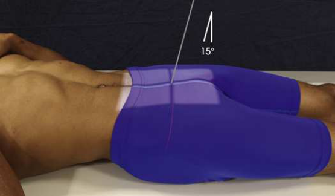
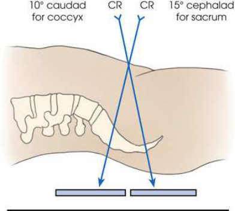
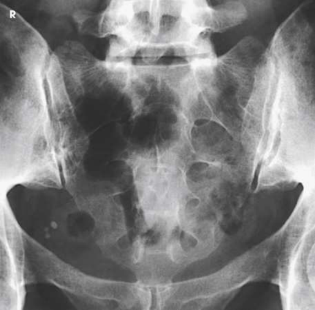
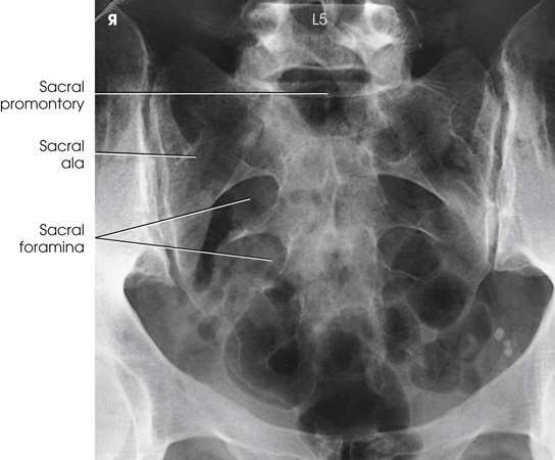
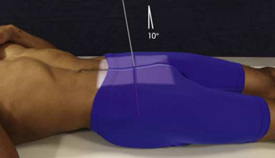
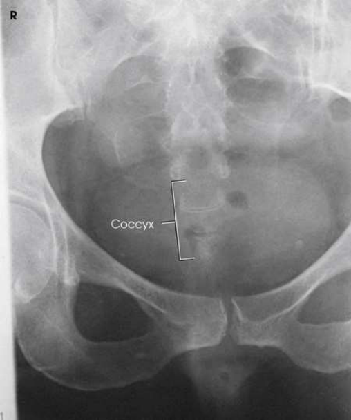

# Rx Sacru și Coccis — Ap And Pa Axial Incidență (Merrill)

  📷 Radiografie Convențională (Rx)
  <strong>Actualizat:</strong> 2026-09-16
  <strong>Autor:</strong> Referință Merrill

---

-   __1. Rezumat Clinic & Indicații__

    ---

    === "Indicații Clinice"

        - Conform reperelor anatomice standard din tratat

    === "Ghid Național IRIS"

        !!! info "Referință Primară: Ghidul Național IRIS (Ordinul MS 1342/2012)"
            - **Capitol Ghid IRIS:** *Ghidul Național IRIS*
            - **Grad de Recomandare:** **De verificat pe indicație; fără grad atribuit automat**
            - **Nivel de Iradiere Estimată:** `De verificat pentru examinarea și populația selectate`

            [:octicons-search-16: Deschide Ghidul IRIS](../../iris.md){ .md-button .md-button--primary } [:material-open-in-new: Aplicația Oficială PWA](https://radiologie-pediatrica.ro/iris/){ .md-button target="_blank" rel="noopener" }
-   __2. Poziționare & Centrare Fascicul__

    ---

    - **Poziție Pacient:** se așază pacientul în Decubit dorsal poziție. Decubit ventral poziție poate fie used fără appreciable loss de detail și este particularly appropriate pentru pacienți cu painful injury sau destructive disease.; cu pacientul either Decubit dorsal sau Decubit ventral, se centrează MSP de corp la linia mediană mesei grilă. se ajustează pacient astfel încât spină iliacă antero-superioară (SIAS) sunt echidistant față de grila. Se instruiește pacientul să se flectează coate și place brațele în comfortable, bilaterally simetric poziție. When Decubit dorsal poziție este used, place support under pacientul’s genunchi. se efectuează ecranarea gonadelor cu șorț plumbat pe men. Women cannot fie ecranat pentru this incidență.
    - **Punct de Centrare Fascicul:** Sacru cu pacientul Decubit dorsal, se orientează raza centrală centrală 15 grade cranial și center it la point 2 inches (5 cm) superior la simfiză pubiană (Figs. 9.118–9.120). cu pacientul Decubit ventral, angle raza centrală 15 grade caudal și center it la clearly vizibil sacral curve (Fig. 9.121). cu pacientul Decubit dorsal, se orientează raza centrală centrală 10 grade caudal și center it la point about 2 inches (5 cm) superior la simfiză pubiană (see Figs. 9.121 și 9.122). cu pacientul Decubit ventral, angle raza centrală 10 grade cranial și center it la easily palpable Coccis. Se centrează receptorul de imagine pe raza centrală.
    - **Distanță Focar-Film (DFF / SID):** Nespecificat în fragmentul extras; de verificat în sursă
    - **Comandă Respiratorie:** apnee (oprirea respirației).

-   __3. Parametri Tehnici Expunere__

    ---

    | Parametru Tehnic | Valoare Configurare Generator / Tub |
    |:-----------------|:-------------------------------------|
    | **Tensiune Tub (kV)** | DE CONFIGURAT PE APARAT |
    | **Sarcină / Produs Curent-Timp (mAs)** | DE CONFIGURAT PE APARAT |
    | **Distanță Focar-Film (DFF / SID)** | Nespecificat în fragmentul extras; de verificat în sursă |
    | **Grilă Antidifuzoare (Bucky)** | DE CONFIGURAT PE APARAT |
    | **Dimensiune Focar** | DE CONFIGURAT PE APARAT |
    | **Camere de Ionizare AEC** | DE CONFIGURAT PE APARAT |
    | **Colimare Fascicul** | Adjust câmp de iradiere la: Sacru: 10 × 12 inches (24 × 30 cm) pe collimator Coccis: 8 × 10 inches (18 × 24 cm) pe collimator Place marker de lateralitate (D/S) în collimated expunere field. |
    | **Filtrare Tub** | DE CONFIGURAT PE APARAT |

-   __4. Criterii de Calitate & Reușită Imagine__

    ---

    - Criterii radiologice de calitate imaginii:
    - Evidence de corect collimation și presence de marker de lateralitate (D/S) plasat clear de anatomy de interest
    - Bony detalii trabeculare osoase și surrounding soft tissues Sacru
    - Sacru centrat și seen în its entirety
    - Sacru liber de foreshortening, cu sacral curvature straightened
    - Pubic bones nu overlapping Sacru
    - Absența rotației anatomice (simetrie bilaterală perfectă) de Sacru, ca evidențiat prin simetric alae Coccis
    - Coccis centrat și seen în its entirety
    - Coccygeal segments nu superimposed prin pubic bones
    - Absența rotației anatomice (simetrie bilaterală perfectă) de Coccis, ca evidențiat prin distal segment în line cu simfiză pubiană Radiation protection
    - Because reproductive organs lie within expunere area, use colimare strânsă la limit irradiated area și amount de scatter radiation.

-   __5. Protecție Radiologică (ALARA)__

    ---

    - Nespecificat în fragmentul extras; de verificat în sursă

!!! note "Observații Clinice & Tehnice"
    Conform reperelor anatomice standard din tratat

### 🖼️ Imagini

<figure class="protocol-image-card" markdown>

<figcaption><strong>Merrill — pagina PDF 753, imaginea 1</strong> — Imagine din fragmentul sursă; asocierea necesită revizie.</figcaption>

</figure>

<figure class="protocol-image-card" markdown>

<figcaption><strong>Merrill — pagina PDF 753, imaginea 2</strong> — Imagine din fragmentul sursă; asocierea necesită revizie.</figcaption>

</figure>

<figure class="protocol-image-card" markdown>

<figcaption><strong>Merrill — pagina PDF 754, imaginea 3</strong> — Imagine din fragmentul sursă; asocierea necesită revizie.</figcaption>

</figure>

<figure class="protocol-image-card" markdown>

<figcaption><strong>Merrill — pagina PDF 755, imaginea 4</strong> — Imagine din fragmentul sursă; asocierea necesită revizie.</figcaption>

</figure>

<figure class="protocol-image-card" markdown>

<figcaption><strong>Merrill — pagina PDF 755, imaginea 5</strong> — Imagine din fragmentul sursă; asocierea necesită revizie.</figcaption>

</figure>

<figure class="protocol-image-card" markdown>

<figcaption><strong>Merrill — pagina PDF 756, imaginea 6</strong> — Imagine din fragmentul sursă; asocierea necesită revizie.</figcaption>

</figure>

=== "Ghid Rapid de Execuție"

    1. **Identificarea și verificarea pacientului:** verificare identitate, zonă de examinat, consimțământ conform procedurii și evaluarea posibilității unei sarcini, când este relevantă.
    2. **Pregătire:** îndepărtarea oricăror obiecte radiopace (bijuterii, agrafe, fermoare, proteze, pansamente dense).
    3. **Poziționare precisă:** alinierea receptorului de imagine și a tubului la distanța prescrisă (Nespecificat în fragmentul extras; de verificat în sursă).
    4. **Colimare strictă:** adaptarea fasciculului strict la regiunea de diagnostic pentru scăderea iradierii și reducerea radiației difuze.
    5. **Radioprotecție:** verificarea [politicii RX](../radioprotectie.md), cu măsuri distincte pentru pacient, personal și însoțitor.

## Surse de documentare

- [Merrill’s Atlas, 9. Vertebral Column, pagini PDF 752–756](../../assets/protocols/sources/a56d45c16829_Merrills_Atlas_of_Radiographic_Positioning__Procedures_3Vol_Set.pdf#page=752)

## Fragmente sursă traduse (referință tehnică)

### anatomy

sacrum sau coccyx liber de superimposition (see Figs. 9.120 și 9.123; see also Fig. 9.121).

### collimation

• Adjust câmp de iradiere la:
• Sacrum: 10 × 12 inches (24 × 30 cm) pe collimator
• Coccyx: 8 × 10 inches (18 × 24 cm) pe collimator
• Place marker de lateralitate (D/S) în collimated expunere field.

### cr

Sacrum
• cu pacientul în decubit dorsal, se orientează raza centrală centrală 15 grade cranial și center it la point 2 inches (5 cm) superior la pubic
simfiză (Figs. 9.118–9.120).
• cu pacientul în decubit ventral, angle raza centrală 15 grade caudal și center it la clearly vizibil sacral curve (Fig. 9.121).
• cu pacientul în decubit dorsal, se orientează raza centrală centrală 10 grade caudal și center it la point about 2 inches (5 cm) superior la pubic
simfiză (see Figs. 9.121 și 9.122).
• cu pacientul în decubit ventral, angle raza centrală 10 grade cranial și center it la easily palpable coccyx.
• Se centrează receptorul de imagine pe raza centrală.

### criteria

Criterii radiologice de calitate imaginii:
• Evidence de corect collimation și presence de marker de lateralitate (D/S) plasat clear de anatomy de interest
• Bony detalii trabeculare osoase și surrounding soft tissues
Sacrum
• Sacrum centrat și seen în its entirety
• Sacrum liber de foreshortening, cu sacral curvature straightened
• Pubic bones nu overlapping sacrum
• Absența rotației anatomice (simetrie bilaterală perfectă) de sacrum, ca evidențiat prin simetric alae
Coccyx
• Coccyx centrat și seen în its entirety
• Coccygeal segments nu superimposed prin pubic bones
• Absența rotației anatomice (simetrie bilaterală perfectă) de coccyx, ca evidențiat prin distal segment în line cu simfiză pubiană
Radiation protection
• Because reproductive organs lie within expunere area, use colimare strânsă la limit irradiated area și amount de
scatter radiation.

### part_pos

• cu pacientul either în decubit dorsal sau în decubit ventral, se centrează MSP de corp la linia mediană mesei grilă.
• se ajustează pacient astfel încât spină iliacă antero-superioară (SIAS) sunt echidistant față de grila.
• Se instruiește pacientul să se flectează coate și place brațele în comfortable, bilaterally simetric poziție.
• When decubit dorsal este used, place support under pacientul’s genunchi.
• se efectuează ecranarea gonadelor cu șorț plumbat pe men. Women cannot fie ecranat pentru this incidență.

### patient_pos

• se așază pacientul în decubit dorsal. decubit ventral poate fie used fără appreciable loss de detail și este particularly
appropriate pentru pacienți cu painful injury sau destructive disease.

### respiration

apnee (oprirea respirației).

### tech

poziționat prin manufacturer sau department protocol pentru corect anatomy display orientation; raza centrală plate: 10 × 12 inches (24
× 30 cm) longitudinal.

