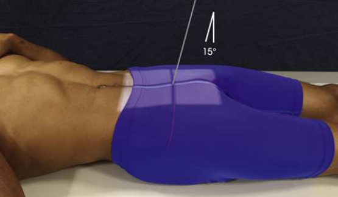
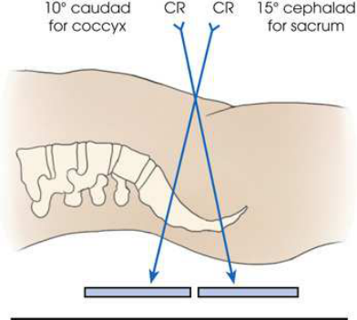
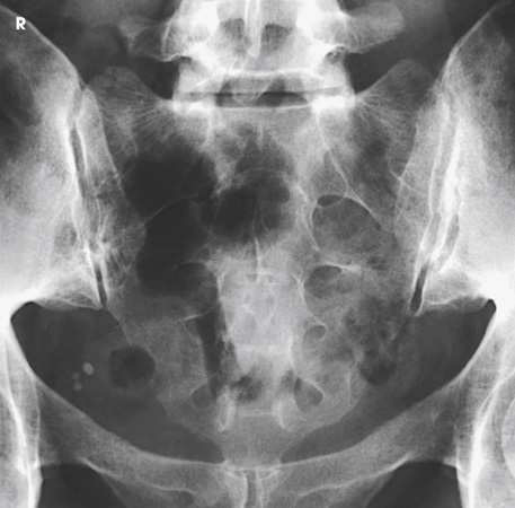
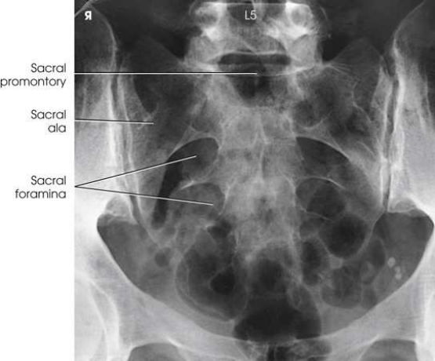
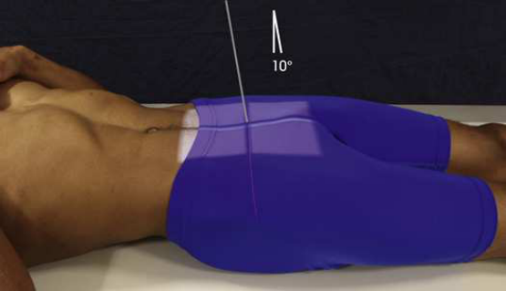
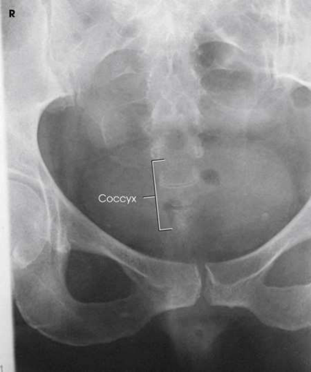

# Rx Sacru și Coccis — AP și PA, incidență axială (Merrill)

  📷 Radiografie Convențională (Rx)
  <strong>Actualizat:</strong> 2026-09-16
  <strong>Autor:</strong> Referință Merrill

---

-   __1. Rezumat Clinic & Indicații__

    ---

    === "Indicații Clinice"

        - Conform reperelor anatomice standard din tratat

    === "Ghid Național IRIS"

        !!! info "Referință Primară: Ghidul Național IRIS (Ordinul MS 1342/2012)"
            - **Capitol Ghid IRIS:** *Ghidul Național IRIS*
            - **Grad de Recomandare:** **De verificat pe indicație; fără grad atribuit automat**
            - **Nivel de Iradiere Estimată:** `De verificat pentru examinarea și populația selectate`

            [:octicons-search-16: Deschide Ghidul IRIS](../../iris.md){ .md-button .md-button--primary } [:material-open-in-new: Aplicația Oficială PWA](https://radiologie-pediatrica.ro/iris/){ .md-button target="_blank" rel="noopener" }
-   __2. Poziționare & Centrare Fascicul__

    ---

    - **Poziție Pacient:** Se așază pacientul în decubit dorsal. Poziția în decubit ventral poate fi utilizată fără pierdere apreciabilă de detalii și este deosebit de adecvată pentru pacienții cu leziuni dureroase sau boală distructivă.; Cu pacientul în decubit dorsal sau decubit ventral, se centrează MSP al corpului pe linia mediană a mesei-grilă. Se ajustează pacientul astfel încât spinele iliace antero-superioare (SIAS) să fie echidistante față de grilă. Se instruiește pacientul să-și flecteze coatele și să-și așeze brațele într-o poziție confortabilă, simetrică bilateral. Când se utilizează poziția în decubit dorsal, se plasează un suport sub genunchii pacientului. Se efectuează ecranarea gonadelor la bărbați cu șorț plumbat. Femeile nu pot fi ecranate pentru această incidență.
    - **Punct de Centrare Fascicul:** Sacru cu pacientul în decubit dorsal: se orientează raza centrală 15 grade cranial și se centrează la un punct situat 2 inches (5 cm) superior de simfiza pubiană (Figs. 9.118–9.120). Cu pacientul în decubit ventral, se angulează raza centrală 15 grade caudal și se centrează la nivelul curburii sacrale clar vizibile (Fig. 9.121). Cu pacientul în decubit dorsal, se orientează raza centrală 10 grade caudal și se centrează la un punct situat aproximativ 2 inches (5 cm) superior de simfiza pubiană (vezi Figs. 9.121 și 9.122). Cu pacientul în decubit ventral, se angulează raza centrală 10 grade cranial și se centrează la nivelul coccisului ușor palpabil. Se centrează receptorul de imagine pe raza centrală.
    - **Distanță Focar-Film (DFF / SID):** Nespecificat în fragmentul extras; de verificat în sursă
    - **Comandă Respiratorie:** apnee (oprirea respirației).

-   __3. Parametri Tehnici Expunere__

    ---

    | Parametru Tehnic | Valoare Configurare Generator / Tub |
    |:-----------------|:-------------------------------------|
    | **Tensiune Tub (kV)** | DE CONFIGURAT PE APARAT |
    | **Sarcină / Produs Curent-Timp (mAs)** | DE CONFIGURAT PE APARAT |
    | **Distanță Focar-Film (DFF / SID)** | Nespecificat în fragmentul extras; de verificat în sursă |
    | **Grilă Antidifuzoare (Bucky)** | DE CONFIGURAT PE APARAT |
    | **Dimensiune Focar** | DE CONFIGURAT PE APARAT |
    | **Camere de Ionizare AEC** | DE CONFIGURAT PE APARAT |
    | **Colimare Fascicul** | Se ajustează câmpul de iradiere la: Sacru: 10 × 12 inches (24 × 30 cm) pe colimator; Coccis: 8 × 10 inches (18 × 24 cm) pe colimator. Se plasează markerul de lateralitate (D/S) în câmpul de expunere colimat. |
    | **Filtrare Tub** | DE CONFIGURAT PE APARAT |

-   __4. Criterii de Calitate & Reușită Imagine__

    ---

    - Criterii radiologice de calitate a imaginii:
    - Evidențierea colimării corecte și prezența markerului de lateralitate (D/S), plasat fără a se suprapune peste anatomia de interes
    - Detaliile trabeculare osoase și țesuturile moi din jurul sacrului
    - Sacrul centrat și vizibil în întregime
    - Sacrul fără scurtare proiectivă, cu curbura sacrală îndreptată
    - Oasele pubiene nu se suprapun peste sacru
    - Absența rotației anatomice (simetrie bilaterală perfectă) a sacrului, evidențiată prin aripile sacrale simetrice
    - Coccisul centrat și vizibil în întregime
    - Segmentele coccigiene nu sunt suprapuse de oasele pubiene
    - Absența rotației anatomice (simetrie bilaterală perfectă) a coccisului, evidențiată prin alinierea segmentului distal cu simfiza pubiană. Protecția împotriva radiațiilor
    - Deoarece organele reproductive se află în aria de expunere, se utilizează colimare strânsă pentru a limita aria iradiată și cantitatea de radiație împrăștiată.

-   __5. Protecție Radiologică (ALARA)__

    ---

    - Nespecificat în fragmentul extras; de verificat în sursă

!!! note "Observații Clinice & Tehnice"
    Conform reperelor anatomice standard din tratat

### 🖼️ Imagini

<figure class="protocol-image-card" markdown>

<figcaption><strong>Merrill — pagina 753, imaginea 1</strong> — Imagine din fragmentul sursă; asocierea necesită revizie.</figcaption>

</figure>

<figure class="protocol-image-card" markdown>

<figcaption><strong>Merrill — pagina 753, imaginea 2</strong> — Imagine din fragmentul sursă; asocierea necesită revizie.</figcaption>

</figure>

<figure class="protocol-image-card" markdown>

<figcaption><strong>Merrill — pagina 754, imaginea 3</strong> — Imagine din fragmentul sursă; asocierea necesită revizie.</figcaption>

</figure>

<figure class="protocol-image-card" markdown>

<figcaption><strong>Merrill — pagina 755, imaginea 4</strong> — Imagine din fragmentul sursă; asocierea necesită revizie.</figcaption>

</figure>

<figure class="protocol-image-card" markdown>

<figcaption><strong>Merrill — pagina 755, imaginea 5</strong> — Imagine din fragmentul sursă; asocierea necesită revizie.</figcaption>

</figure>

<figure class="protocol-image-card" markdown>

<figcaption><strong>Merrill — pagina 756, imaginea 6</strong> — Imagine din fragmentul sursă; asocierea necesită revizie.</figcaption>

</figure>

=== "Ghid Rapid de Execuție"

    1. **Identificarea și verificarea pacientului:** verificare identitate, zonă de examinat, consimțământ conform procedurii și evaluarea posibilității unei sarcini, când este relevantă.
    2. **Pregătire:** îndepărtarea oricăror obiecte radiopace (bijuterii, agrafe, fermoare, proteze, pansamente dense).
    3. **Poziționare precisă:** alinierea receptorului de imagine și a tubului la distanța prescrisă (Nespecificat în fragmentul extras; de verificat în sursă).
    4. **Colimare strictă:** adaptarea fasciculului strict la regiunea de diagnostic pentru scăderea iradierii și reducerea radiației difuze.
    5. **Radioprotecție:** verificarea [politicii RX](../radioprotectie.md), cu măsuri distincte pentru pacient, personal și însoțitor.

## Surse de documentare

- [Merrill’s Atlas, 9. Vertebral Column, pagini 752–756](https://books.google.com/books/about/Merrill_s_Atlas_of_Radiographic_Position.html?id=BM0lEQAAQBAJ)

## Fragmente sursă traduse (referință tehnică)

### anatomie

sacrul sau coccisul fără suprapunere (vezi Figs. 9.120 și 9.123; vezi și Fig. 9.121).

### colimare

• Se ajustează câmpul de iradiere la:
• Sacru: 10 × 12 inches (24 × 30 cm) pe colimator
• Coccis: 8 × 10 inches (18 × 24 cm) pe colimator
• Se plasează markerul de lateralitate (D/S) în câmpul de expunere colimat.

### raza centrală

Sacru
• Cu pacientul în decubit dorsal, se orientează raza centrală 15 grade cranial și se centrează la un punct situat 2 inches (5 cm) superior de simfiza pubiană (Figs. 9.118–9.120).
• Cu pacientul în decubit ventral, se angulează raza centrală 15 grade caudal și se centrează la nivelul curburii sacrale clar vizibile (Fig. 9.121).
• Cu pacientul în decubit dorsal, se orientează raza centrală 10 grade caudal și se centrează la un punct situat aproximativ 2 inches (5 cm) superior de simfiza pubiană (vezi Figs. 9.121 și 9.122).
• Cu pacientul în decubit ventral, se angulează raza centrală 10 grade cranial și se centrează la nivelul coccisului ușor palpabil.
• Se centrează receptorul de imagine pe raza centrală.

### criterii

Criterii radiologice de calitate a imaginii:
• Dovezi ale colimării corecte și prezența markerului de lateralitate (D/S), plasat clar față de anatomia de interes
• Detaliile trabeculare osoase și țesuturile moi din jur
Sacru
• Sacrul centrat și vizibil în întregime
• Sacrul fără scurtare proiectivă, cu curbura sacrală îndreptată
• Oasele pubiene nu se suprapun peste sacru
• Absența rotației anatomice (simetrie bilaterală perfectă) a sacrului, evidențiată prin aripile simetrice
Coccis
• Coccisul centrat și vizibil în întregime
• Segmentele coccigiene nu sunt suprapuse de oasele pubiene
• Absența rotației anatomice (simetrie bilaterală perfectă) a coccisului, evidențiată prin alinierea segmentului distal cu simfiza pubiană
Protecția împotriva radiațiilor
• Deoarece organele reproductive se află în aria de expunere, se utilizează colimare strânsă pentru a limita aria iradiată și cantitatea de radiație împrăștiată.

### part_pos

• Cu pacientul fie în decubit dorsal, fie în decubit ventral, se centrează MSP al corpului pe linia mediană a mesei-grilă.
• Se ajustează pacientul astfel încât spinele iliace antero-superioare (SIAS) să fie echidistante față de grilă.
• Se instruiește pacientul să-și flecteze coatele și să-și așeze brațele într-o poziție confortabilă, simetrică bilateral.
• Când se utilizează decubitul dorsal, se plasează un suport sub genunchii pacientului.
• Se efectuează ecranarea gonadelor la bărbați cu șorț plumbat. Femeile nu pot fi ecranate pentru această incidență.

### patient_pos

• Se așază pacientul în decubit dorsal. Decubitul ventral poate fi utilizat fără pierdere apreciabilă de detalii și este deosebit de adecvat pentru pacienții cu leziuni dureroase sau boală distructivă.

### respirație

apnee (oprirea respirației).

### tehnică

poziționat conform indicațiilor producătorului sau protocolului departamentului pentru orientarea corectă a afișării anatomiei; placa razei centrale: 10 × 12 țoli (24
× 30 cm), longitudinal.

