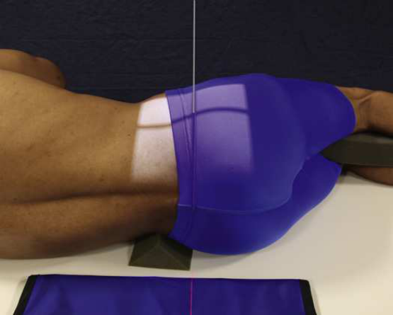
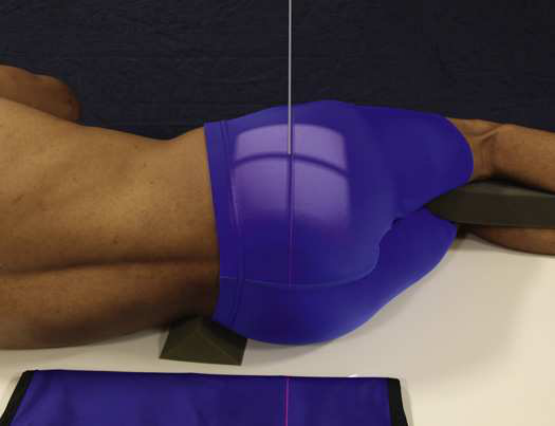
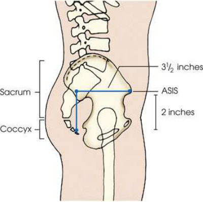

# Rx Sacru și Coccis — Incidență de Profil (Lateral) — Profil (Drept sau Stâng) (Merrill)

  📷 Radiografie Convențională (Rx)
  <strong>Actualizat:</strong> 2026-09-16
  <strong>Autor:</strong> Referință Merrill

---

-   __1. Rezumat Clinic & Indicații__

    ---

    === "Indicații Clinice"

        - Conform reperelor anatomice standard din tratat

    === "Ghid Național IRIS"

        !!! info "Referință Primară: Ghidul Național IRIS (Ordinul MS 1342/2012)"
            - **Capitol Ghid IRIS:** *Ghidul Național IRIS*
            - **Grad de Recomandare:** **De verificat pe indicație; fără grad atribuit automat**
            - **Nivel de Iradiere Estimată:** `De verificat pentru examinarea și populația selectate`

            [:octicons-search-16: Deschide Ghidul IRIS](../../iris.md){ .md-button .md-button--primary } [:material-open-in-new: Aplicația Oficială PWA](https://radiologie-pediatrica.ro/iris/){ .md-button target="_blank" rel="noopener" }
-   __2. Poziționare & Centrare Fascicul__

    ---

    - **Poziție Pacient:** Se instruiește pacientul să turn onto indicated side și se flectează hips și genunchi la comfortable poziție.; se ajustează brațe în poziție în unghi drept față de corp. Superimpose genunchii, și, if needed, place positioning sponges under și între ankles și între genunchi. Adjust support under corp la place axa longitudinală de coloană vertebrală orizontal. interiliac plane trebuie să fie perpendicular pe receptorul de imagine (RI). se ajustează Bazin (bazin (pelvis)) și umeri astfel încât true Incidență de Profil (lateral) este maintained (i.e., Absența rotației anatomice (simetrie bilaterală perfectă)) (Figs. 9.124 și 9.125). la prepare pentru precis positioning de raza centrală, se centrează Sacru sau Coccis la linia mediană grilă. se efectuează ecranarea gonadelor cu șorț plumbat.
    - **Punct de Centrare Fascicul:** ridicat spină iliacă antero-superioară (SIAS) este easily palpated și found pe toate pacienți when they sunt culcat pe their side și provides standardized reference point de la which la se centrează Sacru și Coccis (Fig. 9.126). Sacru perpendicular și orientat la level de spină iliacă antero-superioară (SIAS) și la point 3.5 inches (9 cm) posterior. This centering trebuie să work cu most pacienți. exact poziție de Sacru depends pe pelvic curve. Coccis perpendicular și orientat spre point 3.5 inches (9 cm) posterior la spină iliacă antero-superioară (SIAS) și 2 inches (5 cm) inferior. This centering trebuie să work pentru most pacienți. exact poziție de Coccis depends pe pelvic curve. Se centrează receptorul de imagine pe raza centrală.
    - **Distanță Focar-Film (DFF / SID):** Nespecificat în fragmentul extras; de verificat în sursă
    - **Comandă Respiratorie:** apnee (oprirea respirației).

-   __3. Parametri Tehnici Expunere__

    ---

    | Parametru Tehnic | Valoare Configurare Generator / Tub |
    |:-----------------|:-------------------------------------|
    | **Tensiune Tub (kV)** | DE CONFIGURAT PE APARAT |
    | **Sarcină / Produs Curent-Timp (mAs)** | DE CONFIGURAT PE APARAT |
    | **Distanță Focar-Film (DFF / SID)** | Nespecificat în fragmentul extras; de verificat în sursă |
    | **Grilă Antidifuzoare (Bucky)** | DE CONFIGURAT PE APARAT |
    | **Dimensiune Focar** | DE CONFIGURAT PE APARAT |
    | **Camere de Ionizare AEC** | DE CONFIGURAT PE APARAT |
    | **Colimare Fascicul** | Adjust câmp de iradiere la: Sacru: 10 × 12 inches (24 × 30 cm) pe collimator. Coccis: 6 × 8 inches (15 × 20 cm) pe collimator. Place marker de lateralitate (D/S) în collimated expunere field. |
    | **Filtrare Tub** | DE CONFIGURAT PE APARAT |

-   __4. Criterii de Calitate & Reușită Imagine__

    ---

    - Criterii radiologice de calitate imaginii:
    - Evidence de corect collimation, presence de lead rubber absorber behind Sacru și presence de marker de lateralitate (D/S) plasat clear de anatomy de interest
    - Sacru și Coccis
    - Closely superimposed posterior margins de ischia și ilia, evidențiind Absența rotației anatomice (simetrie bilaterală perfectă)
    - Bony detalii trabeculare osoase și surrounding soft tissues Improving radiographic quality quality de radiografie poate fie improved if sheet de leaded rubber este plasat pe masa de examinare behind pacientul (see Figs. 9.124 și 9.125). lead absorbs scatter radiation coming de la pacient. Scatter radiation decreases quality de radiografie. More importantly, cu AEC, scatter radiation coming de la pacient este often suficient la terminate expunere prematurely, resulting în underexposed radiografie. pentru same reason, colimare strânsă este necessary pentru lateral Sacru și Coccis imagini.

-   __5. Protecție Radiologică (ALARA)__

    ---

    - Nespecificat în fragmentul extras; de verificat în sursă

!!! note "Observații Clinice & Tehnice"
    Conform reperelor anatomice standard din tratat

### 🖼️ Imagini

<figure class="protocol-image-card" markdown>

<figcaption><strong>Merrill — pagina PDF 757, imaginea 1</strong> — Imagine din fragmentul sursă; asocierea necesită revizie.</figcaption>

</figure>

<figure class="protocol-image-card" markdown>

<figcaption><strong>Merrill — pagina PDF 757, imaginea 2</strong> — Imagine din fragmentul sursă; asocierea necesită revizie.</figcaption>

</figure>

<figure class="protocol-image-card" markdown>

<figcaption><strong>Merrill — pagina PDF 758, imaginea 3</strong> — Imagine din fragmentul sursă; asocierea necesită revizie.</figcaption>

</figure>

=== "Ghid Rapid de Execuție"

    1. **Identificarea și verificarea pacientului:** verificare identitate, zonă de examinat, consimțământ conform procedurii și evaluarea posibilității unei sarcini, când este relevantă.
    2. **Pregătire:** îndepărtarea oricăror obiecte radiopace (bijuterii, agrafe, fermoare, proteze, pansamente dense).
    3. **Poziționare precisă:** alinierea receptorului de imagine și a tubului la distanța prescrisă (Nespecificat în fragmentul extras; de verificat în sursă).
    4. **Colimare strictă:** adaptarea fasciculului strict la regiunea de diagnostic pentru scăderea iradierii și reducerea radiației difuze.
    5. **Radioprotecție:** verificarea [politicii RX](../radioprotectie.md), cu măsuri distincte pentru pacient, personal și însoțitor.

## Surse de documentare

- [Merrill’s Atlas, 9. Vertebral Column, pagini PDF 756–758](../../assets/protocols/sources/a56d45c16829_Merrills_Atlas_of_Radiographic_Positioning__Procedures_3Vol_Set.pdf#page=756)

## Fragmente sursă traduse (referință tehnică)

### anatomy

sacrum sau coccyx (Figs. 9.127 și 9.128).

### collimation

• Adjust câmp de iradiere la:
• Sacrum: 10 × 12 inches (24 × 30 cm) pe collimator.
• Coccyx: 6 × 8 inches (15 × 20 cm) pe collimator.
• Place marker de lateralitate (D/S) în collimated expunere field.

### cr

• ridicat spină iliacă antero-superioară (SIAS) este easily palpated și found pe toate pacienți when they sunt culcat pe their side și provides standardized reference
point de la which la se centrează sacru și coccis (Fig. 9.126).
Sacrum
• perpendicular și orientat la level de spină iliacă antero-superioară (SIAS) și la point 3.5 inches (9 cm) posterior. This centering trebuie să work cu most
pacienți. exact poziție de sacrum depends pe pelvic curve.
Coccyx
• perpendicular și orientat spre point 3.5 inches (9 cm) posterior la spină iliacă antero-superioară (SIAS) și 2 inches (5 cm) inferior. This centering trebuie să
work pentru most pacienți. exact poziție de coccyx depends pe pelvic curve.
• Se centrează receptorul de imagine pe raza centrală.

### criteria

Criterii radiologice de calitate imaginii:
• Evidence de corect collimation, presence de lead rubber absorber behind sacrum și presence de marker de lateralitate (D/S) plasat clear de
anatomy de interest
• sacru și coccis
• Closely superimposed posterior margins de ischia și ilia, evidențiind Absența rotației anatomice (simetrie bilaterală perfectă)
• Bony detalii trabeculare osoase și surrounding soft tissues
Improving radiographic quality
quality de radiografie poate fie improved if sheet de leaded rubber este plasat pe masa de examinare behind pacientul (see Figs. 9.124 și 9.125). lead absorbs scatter radiation coming de la pacient. Scatter radiation decreases quality de radiografie. More importantly, cu
AEC, scatter radiation coming de la pacient este often suficient la terminate expunere prematurely, resulting în underexposed
radiografie. pentru same reason, colimare strânsă este necessary pentru lateral sacru și coccis imagini.

### part_pos

• se ajustează brațe în poziție în unghi drept față de corp.
• Superimpose genunchii, și, if needed, place positioning sponges under și între ankles și între genunchi.
• Adjust support under corp la place axa longitudinală de coloană vertebrală orizontal. interiliac plane trebuie să fie perpendicular pe receptorul de imagine (RI).
• se ajustează bazin (pelvis) și umeri astfel încât true poziție de profil (lateral) este maintained (i.e., Absența rotației anatomice (simetrie bilaterală perfectă)) (Figs. 9.124 și 9.125).
• la prepare pentru precis positioning de raza centrală, se centrează sacrum sau coccyx la linia mediană grilă.
• se efectuează ecranarea gonadelor cu șorț plumbat.

### patient_pos

• Se instruiește pacientul să turn onto indicated side și se flectează hips și genunchi la comfortable poziție.

### respiration

apnee (oprirea respirației).

### tech

poziționat prin manufacturer sau department protocol pentru corect anatomy display orientation; raza centrală plate: 10 × 12 inches (24 ×
30 cm) longitudinal.

