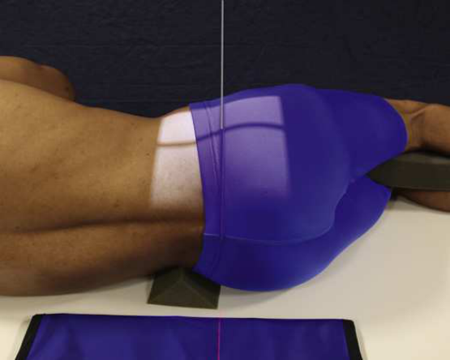
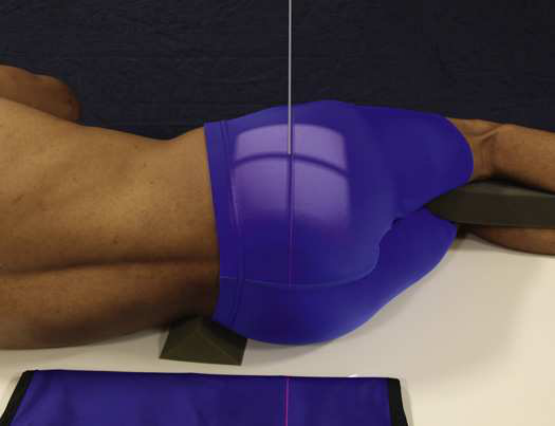
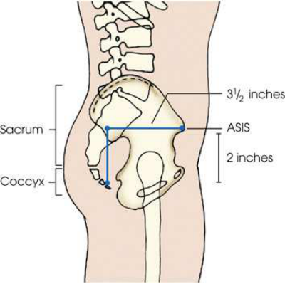

# Rx sacru și coccis — incidență de profil (lateral) — profil (drept sau stâng) (Merrill)

  📷 Radiografie Convențională (Rx)
  <strong>Actualizat:</strong> 2026-09-16
  <strong>Autor:</strong> Referință Merrill

---

-   __1. Rezumat Clinic & Indicații__

    ---

    === "Indicații Clinice"

        - Conform reperelor anatomice standard din tratat

    === "Ghid Național IRIS"

        !!! info "Referință Primară: Ghidul Național IRIS (Ordinul MS 1342/2012)"
            - **Capitol Ghid IRIS:** *Coloană vertebrală*
            - **Grad de Recomandare:** **Grad A**
            - **Nivel de Iradiere Estimată:** `Clasa 2 (Foarte mică ~ 1.0 - 1.5 mSv)`

            [:octicons-search-16: Deschide Ghidul IRIS](../../iris.md){ .md-button .md-button--primary } [:material-open-in-new: Aplicația Oficială PWA](https://radiologie-pediatrica.ro/iris/){ .md-button target="_blank" rel="noopener" }

-   __2. Poziționare & Centrare Fascicul__

    ---

    - **Poziție Pacient:** Se instruiește pacientul să se întoarcă pe partea indicată și să-și flecteze șoldurile și genunchii într-o poziție confortabilă.; Se ajustează brațele în poziție perpendiculară pe corp. Se suprapun genunchii și, dacă este necesar, se plasează bureți de poziționare sub glezne și între glezne și genunchi. Se ajustează suportul de sub corp pentru a plasa axa longitudinală a coloanei vertebrale orizontal. Planul interiliac trebuie să fie perpendicular pe receptorul de imagine (RI). Se ajustează bazinul și umerii astfel încât să se mențină o incidență de profil adevărată (laterală) (adică absența rotației anatomice (simetrie bilaterală perfectă)) (Figs. 9.124 și 9.125). Pentru a pregăti poziționarea precisă a razei centrale, se centrează sacrul sau coccisul pe linia mediană a grilei. Se efectuează ecranarea gonadelor cu șorț plumbat.
    - **Punct de Centrare Fascicul:** Spina iliacă antero-superioară (SIAS) proeminentă este ușor palpabilă și poate fi identificată la toți pacienții când sunt culcați pe o parte și oferă un punct de reper standardizat de la care se centrează sacrul și coccisul (Fig. 9.126). Sacru: perpendicular și orientat la nivelul spinei iliace antero-superioare (SIAS) și la un punct situat 3.5 țoli (9 cm) posterior. Această centrare ar trebui să funcționeze la majoritatea pacienților. Poziția exactă a sacrului depinde de curbura bazinului. Coccis: perpendicular și orientat spre un punct situat 3.5 țoli (9 cm) posterior de spina iliacă antero-superioară (SIAS) și 2 țoli (5 cm) inferior. Această centrare ar trebui să funcționeze pentru majoritatea pacienților. Poziția exactă a coccisului depinde de curbura bazinului. Se centrează receptorul de imagine pe raza centrală.
    - **Distanță Focar-Film (DFF / SID):** Nespecificat în fragmentul extras; de verificat în sursă
    - **Comandă Respiratorie:** apnee (oprirea respirației).

-   __3. Parametri Tehnici Expunere__

    ---

    | Parametru Tehnic | Valoare Configurare Generator / Tub |
    |:-----------------|:-------------------------------------|
    | **Tensiune Tub (kV)** | DE CONFIGURAT PE APARAT |
    | **Sarcină / Produs Curent-Timp (mAs)** | DE CONFIGURAT PE APARAT |
    | **Distanță Focar-Film (DFF / SID)** | Nespecificat în fragmentul extras; de verificat în sursă |
    | **Grilă Antidifuzoare (Bucky)** | DE CONFIGURAT PE APARAT |
    | **Dimensiune Focar** | DE CONFIGURAT PE APARAT |
    | **Camere de Ionizare AEC** | DE CONFIGURAT PE APARAT |
    | **Colimare Fascicul** | Se ajustează câmpul de iradiere la: Sacru: 10 × 12 țoli (24 × 30 cm) pe colimator. Coccis: 6 × 8 țoli (15 × 20 cm) pe colimator. Se plasează markerul de lateralitate (D/S) în câmpul de expunere colimat. |
    | **Filtrare Tub** | DE CONFIGURAT PE APARAT |

-   __4. Criterii de Calitate & Reușită Imagine__

    ---

    - Criterii radiologice de calitate a imaginii:
    - Dovezi ale colimării corecte, prezența unui absorbant de cauciuc plumbat în spatele sacrului și prezența markerului de lateralitate (D/S), plasat clar față de anatomia de interes
    - Sacru și coccis
    - Marginile posterioare ale ischiilor și iliilor sunt suprapuse îndeaproape, evidențiind absența rotației anatomice (simetrie bilaterală perfectă)
    - Detalii trabeculare osoase și țesuturile moi adiacente Îmbunătățirea calității radiografiei: calitatea radiografiei poate fi îmbunătățită dacă o foaie de cauciuc plumbat este plasată pe masa de examinare, în spatele pacientului (vezi Fig. 9.124 și 9.125). Plumbul absoarbe radiația împrăștiată provenită de la pacient. Radiația împrăștiată scade calitatea radiografiei. Mai important, în cazul AEC, radiația împrăștiată provenită de la pacient este adesea suficientă pentru a termina prematur expunerea, rezultând o radiografie subexpusă. Din același motiv, colimarea strânsă este necesară pentru imaginile laterale ale sacrului și coccisului.

-   __5. Protecție Radiologică (ALARA)__

    ---

    - Nespecificat în fragmentul extras; de verificat în sursă

!!! note "Observații Clinice & Tehnice"
    Conform reperelor anatomice standard din tratat

### 🖼️ Imagini

<figure class="protocol-image-card" markdown>

<figcaption><strong>Merrill — pagina 757, imaginea 1</strong> — Imagine din fragmentul sursă; asocierea necesită revizie.</figcaption>

</figure>

<figure class="protocol-image-card" markdown>

<figcaption><strong>Merrill — pagina 757, imaginea 2</strong> — Imagine din fragmentul sursă; asocierea necesită revizie.</figcaption>

</figure>

<figure class="protocol-image-card" markdown>

<figcaption><strong>Merrill — pagina 758, imaginea 3</strong> — Imagine din fragmentul sursă; asocierea necesită revizie.</figcaption>

</figure>

=== "Ghid Rapid de Execuție"

    1. **Identificarea și verificarea pacientului:** verificare identitate, zonă de examinat, consimțământ conform procedurii și evaluarea posibilității unei sarcini, când este relevantă.
    2. **Pregătire:** îndepărtarea oricăror obiecte radiopace (bijuterii, agrafe, fermoare, proteze, pansamente dense).
    3. **Poziționare precisă:** alinierea receptorului de imagine și a tubului la distanța prescrisă (Nespecificat în fragmentul extras; de verificat în sursă).
    4. **Colimare strictă:** adaptarea fasciculului strict la regiunea de diagnostic pentru scăderea iradierii și reducerea radiației difuze.
    5. **Radioprotecție:** verificarea [politicii RX](../radioprotectie.md), cu măsuri distincte pentru pacient, personal și însoțitor.

## Surse de documentare

- [Merrill’s Atlas, 9. Vertebral Column, pagini 756–758](https://books.google.com/books/about/Merrill_s_Atlas_of_Radiographic_Position.html?id=BM0lEQAAQBAJ)
