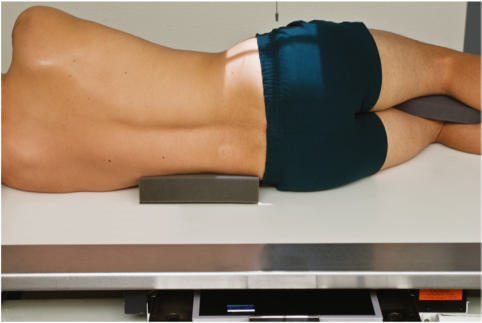
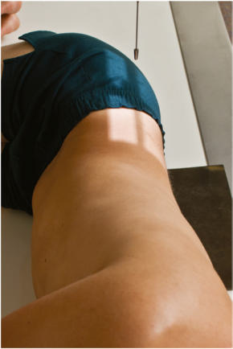
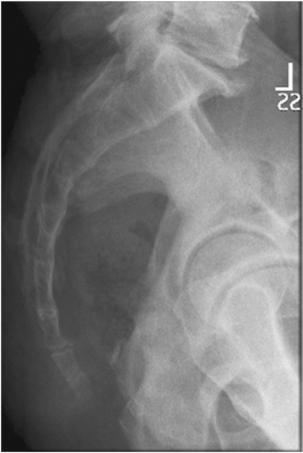

# Rx Sacru și Coccis Profil (Lateral)

  📷 Radiografie Convențională (Rx)
  <strong>Actualizat:</strong> 2026-09-15
  <strong>Autor:</strong> Departamentul de Radiologie / Referință Bontrager

---

-   __1. Rezumat Clinic & Indicații__

    ---

    === "Indicații Clinice"

        - Pathology of the Sacru și Coccis, including suspiciune de fractură

    === "Ghid Național IRIS"

        !!! info "Referință Primară: Ghidul Național IRIS (Ordinul MS 1342/2012)"
            - **Capitol Ghid IRIS:** *Ghidul Național IRIS*
            - **Grad de Recomandare:** **De verificat pe indicație; fără grad atribuit automat**
            - **Nivel de Iradiere Estimată:** `De verificat pentru examinarea și populația selectate`

            [:octicons-search-16: Deschide Ghidul IRIS](../../iris.md){ .md-button .md-button--primary } [:material-open-in-new: Aplicația Oficială PWA](https://radiologie-pediatrica.ro/iris/){ .md-button target="_blank" rel="noopener" }
-   __2. Poziționare & Centrare Fascicul__

    ---

    - **Poziție Pacient:** Pacient: Incidență de Profil (Lateral) Place patient in the lateral Decubit position, with head on pillow, and knees flexed.; Regiune anatomică: Align long axis of Sacru și Coccis to CR and midline of table and/or IR (Figs. 9.69 and 9.70). Ensure that Absența rotației anatomice: clavicule echidistante față de linia apofizelor spinoase of thorax or Bazin (Pelvis) exists.
    - **Punct de Centrare Fascicul:** perpendicular to IR. Direct CR 3 to 4 inches (8 to 10 cm) posterior to ASiS (centering for Sacru). Center IR to CR.
    - **Distanță Focar-Film (DFF / SID):** 100 cm
    - **Comandă Respiratorie:** Suspend respiration to limit patient motion.

-   __3. Parametri Tehnici Expunere__

    ---

    | Parametru Tehnic | Valoare Configurare Generator / Tub |
    |:-----------------|:-------------------------------------|
    | **Tensiune Tub (kV)** | 85-95 kV |
    | **Sarcină / Produs Curent-Timp (mAs)** | DE CONFIGURAT PE APARAT |
    | **Distanță Focar-Film (DFF / SID)** | 100 cm |
    | **Grilă Antidifuzoare (Bucky)** | Cu grilă antidifuzoare Bucky |
    | **Dimensiune Focar** | Focar Mare (1.0 - 1.2 mm) |
    | **Camere de Ionizare AEC** | Camerele laterale (sau camera centrală funcție de regiune) |
    | **Colimare Fascicul** | Field Size Collimate on four sides to anatomy of interest. |
    | **Filtrare Tub** | Totală ≥ 2.5 mm Al echivalent |

-   __4. Criterii de Calitate & Reușită Imagine__

    ---

    - Sacru, L5–S1 joint, and Coccis (Fig. 9.71). Position
    - Absența rotației anatomice: clavicule echidistante față de linia apofizelor spinoase indicated by superimposed greater sciatic notches and femoral heads.
    - Collimation field size to area of interest. Exposure
    - Optimal image receptor exposure and contrast. Clear demonstration of bony margins and trabecular markings of Sacru și Coccis.
    - no motion. 24 30 L

-   __5. Protecție Radiologică (ALARA)__

    ---

    - Ecranare gonadică și a organelor radiosensibile conform procedurilor locale de radioprotecție ALARA.
    - Colimare strictă la aria de interes pentru limitarea radiației difuze.
    - Verificarea posibilității unei sarcini la pacientele de vârstă fertilă înainte de expunere.

!!! note "Observații Clinice & Tehnice"
    High amounts of secondary and scatter radiation are generated. Close collimation is essential to reduce patient dose and obtain a highquality image. Fig. 9.71 Lateral Sacru și Coccis. Sacru și Coccis ROUTINE AP axial Sacru AP axial Coccis Lateral Sacru și Coccis Fig. 9.69 Lateral Sacru și Coccis. Fig. 9.70 Lateral Sacru și Coccis.

### 🖼️ Imagini

<figure class="protocol-image-card" markdown>

<figcaption><strong>Fig. 9.71 Lateral Sacru și Coccis.</strong> — Poziționare pacient conform Ghidului Bontrager (Fig. 9.71 Lateral sacrum and coccyx.)</figcaption>

</figure>

<figure class="protocol-image-card" markdown>

<figcaption><strong>Fig. 9.69 Lateral Sacru și Coccis.</strong> — Aspect radiografic de referință conform Ghidului Bontrager (Fig. 9.69 Lateral sacrum and coccyx.)</figcaption>

</figure>

<figure class="protocol-image-card" markdown>

<figcaption><strong>Fig. 9.70 Lateral Sacru și Coccis.</strong> — Aspect radiografic de referință conform Ghidului Bontrager (Fig. 9.70 Lateral sacrum and coccyx.)</figcaption>

</figure>

=== "Ghid Rapid de Execuție"

    1. **Identificarea și verificarea pacientului:** verificare identitate, zonă de examinat, consimțământ conform procedurii și evaluarea posibilității unei sarcini, când este relevantă.
    2. **Pregătire:** îndepărtarea oricăror obiecte radiopace (bijuterii, agrafe, fermoare, proteze, pansamente dense).
    3. **Poziționare precisă:** alinierea receptorului de imagine și a tubului la distanța prescrisă (100 cm).
    4. **Colimare strictă:** adaptarea fasciculului strict la regiunea de diagnostic pentru scăderea iradierii și reducerea radiației difuze.
    5. **Radioprotecție:** verificarea [politicii RX](../radioprotectie.md), cu măsuri distincte pentru pacient, personal și însoțitor.

## Surse de documentare

- [Bontrager's Textbook of Radiographic Positioning (Ed. 9/10), Pagina 374](https://www.elsevier.com/books/textbook-of-radiographic-positioning-and-related-anatomy/lampignano/978-0-323-65367-1)
