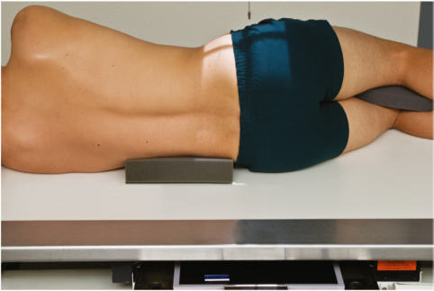
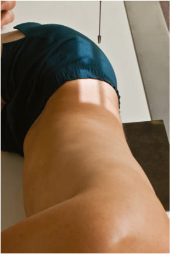
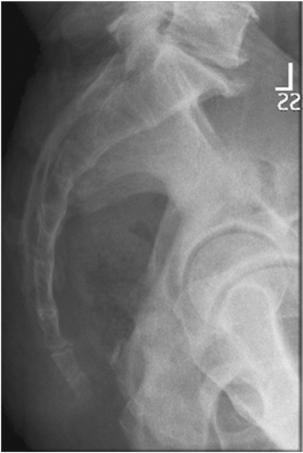

# Rx sacru și coccis profil (lateral)

  📷 Radiografie Convențională (Rx)
  <strong>Actualizat:</strong> 2026-09-15
  <strong>Autor:</strong> Departamentul de Radiologie / Referință Bontrager

---

-   __1. Rezumat Clinic & Indicații__

    ---

    === "Indicații Clinice"

        - Patologia sacrului și coccisului, inclusiv suspiciunea de fractură

    === "Ghid Național IRIS"

        !!! info "Referință Primară: Ghidul Național IRIS (Ordinul MS 1342/2012)"
            - **Capitol Ghid IRIS:** *Coloană vertebrală*
            - **Grad de Recomandare:** **Grad A**
            - **Nivel de Iradiere Estimată:** `Clasa 2 (Foarte mică ~ 1.0 - 1.5 mSv)`

            [:octicons-search-16: Deschide Ghidul IRIS](../../iris.md){ .md-button .md-button--primary } [:material-open-in-new: Aplicația Oficială PWA](https://radiologie-pediatrica.ro/iris/){ .md-button target="_blank" rel="noopener" }

-   __2. Poziționare & Centrare Fascicul__

    ---

    - **Poziție Pacient:** Pacient: Incidență de profil (lateral). Se plasează pacientul în decubit lateral, cu capul pe pernă și genunchii flectați.; Regiune anatomică: Se aliniază axa longitudinală a sacrului și coccisului cu raza centrală și linia mediană a mesei și/sau receptorul de imagine (Fig. 9.69 și 9.70). Se verifică absența rotației: claviculele sunt riguros echidistante față de linia proceselor spinoase ale toracelui sau bazinului, dacă bazinul există.
    - **Punct de Centrare Fascicul:** Perpendicular pe receptorul de imagine. Se direcționează raza centrală 3 la 4 țoli (8 la 10 cm) posterior față de spina iliacă antero-superioară (SIAS) (centrare pentru sacru). Se centrează receptorul de imagine pe raza centrală.
    - **Distanță Focar-Film (DFF / SID):** 100 cm
    - **Comandă Respiratorie:** Apnee pe durata expunerii pentru prevenirea artefactelor de mișcare ale pacientului.

-   __3. Parametri Tehnici Expunere__

    ---

    | Parametru Tehnic | Valoare Configurare Generator / Tub |
    |:-----------------|:-------------------------------------|
    | **Tensiune Tub (kV)** | 85-95 kV |
    | **Sarcină / Produs Curent-Timp (mAs)** | DE CONFIGURAT PE APARAT |
    | **Distanță Focar-Film (DFF / SID)** | 100 cm |
    | **Grilă Antidifuzoare (Bucky)** | Cu grilă antidifuzoare Bucky |
    | **Dimensiune Focar** | Focar Mare (1.0 - 1.2 mm) |
    | **Camere de Ionizare AEC** | Camerele laterale (sau camera centrală, în funcție de regiune) |
    | **Colimare Fascicul** | Dimensiunea câmpului Colimați pe cele patru laturi la regiunea anatomică de interes. |
    | **Filtrare Tub** | Totală ≥ 2.5 mm Al echivalent |

-   __4. Criterii de Calitate & Reușită Imagine__

    ---

    - Sacru, articulația L5–S1 și coccis (Fig. 9.71). Poziție
    - Absența rotației anatomice: clavicule echidistante față de linia apofizelor spinoase, indicată prin incizurile sciatice mari și capetele femurale suprapuse.
    - Colimarea câmpului la dimensiunea ariei de interes diagnostic. Expunere
    - Expunere optimă a receptorului de imagine și contrast. Evidențiere clară a marginilor osoase și a desenului trabecular al sacrului și coccisului.
    - Fără mișcare. 24 30 L

-   __5. Protecție Radiologică (ALARA)__

    ---

    - Ecranare gonadică și a organelor radiosensibile conform procedurilor locale de radioprotecție ALARA.
    - Colimare strictă la aria de interes pentru limitarea radiației difuze.
    - Verificarea posibilității unei sarcini la pacientele de vârstă fertilă înainte de expunere.

!!! note "Observații Clinice & Tehnice"
    Se generează cantități mari de radiație secundară și împrăștiată. Colimarea strânsă este esențială pentru a reduce doza administrată pacientului și a obține o imagine de înaltă calitate. Fig. 9.71 sacru și coccis lateral. Sacru și coccis INCIDENȚĂ AP axială Sacru AP axial Coccis Sacru și coccis lateral Fig. 9.69 sacru și coccis lateral. Fig. 9.70 sacru și coccis lateral.

### 🖼️ Imagini

<figure class="protocol-image-card" markdown>

<figcaption><strong>Fig. 9.71 sacru și coccis lateral.</strong> — Poziționarea pacientului conform Ghidului Bontrager (Fig. 9.71 sacru și coccis lateral.)</figcaption>

</figure>

<figure class="protocol-image-card" markdown>

<figcaption><strong>Fig. 9.69 sacru și coccis lateral.</strong> — Aspect radiografic de referință conform Ghidului Bontrager (Fig. 9.69 sacru și coccis lateral.)</figcaption>

</figure>

<figure class="protocol-image-card" markdown>

<figcaption><strong>Fig. 9.70 sacru și coccis lateral.</strong> — Aspect radiografic de referință conform Ghidului Bontrager (Fig. 9.70 sacru și coccis lateral.)</figcaption>

</figure>

=== "Ghid Rapid de Execuție"

    1. **Identificarea și verificarea pacientului:** verificare identitate, zonă de examinat, consimțământ conform procedurii și evaluarea posibilității unei sarcini, când este relevantă.
    2. **Pregătire:** îndepărtarea oricăror obiecte radiopace (bijuterii, agrafe, fermoare, proteze, pansamente dense).
    3. **Poziționare precisă:** alinierea receptorului de imagine și a tubului la distanța prescrisă (100 cm).
    4. **Colimare strictă:** adaptarea fasciculului strict la regiunea de diagnostic pentru scăderea iradierii și reducerea radiației difuze.
    5. **Radioprotecție:** verificarea [politicii RX](../radioprotectie.md), cu măsuri distincte pentru pacient, personal și însoțitor.

## Surse de documentare

- [Bontrager's Textbook of Radiographic Positioning (Ed. 9/10), Pagina 374](https://www.elsevier.com/books/textbook-of-radiographic-positioning-and-related-anatomy/lampignano/978-0-323-65367-1)
