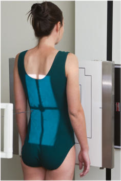
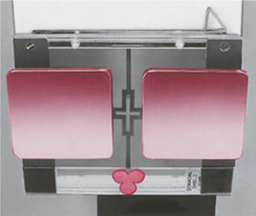
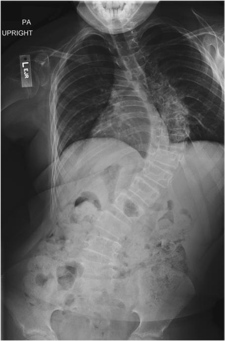

# Rx scolioză / vicii de postură ale coloanei SERIES PA (Postero-Anterior)

  📷 Radiografie Convențională (Rx)
  <strong>Actualizat:</strong> 2026-09-15
  <strong>Autor:</strong> Departamentul de Radiologie / Referință Bontrager

---

-   __1. Rezumat Clinic & Indicații__

    ---

    === "Indicații Clinice"

        - la determine grade și severity de scolioză / vicii de postură ale coloanei scolioză / vicii de postură ale coloanei series poate include two pA incidențe taken pentru comparison, one Ortostatism și one Decubit (see NOTES).

    === "Ghid Național IRIS"

        !!! info "Referință Primară: Ghidul Național IRIS (Ordinul MS 1342/2012)"
            - **Capitol Ghid IRIS:** *Ghidul Național IRIS*
            - **Grad de Recomandare:** **De verificat pe indicație; fără grad atribuit automat**
            - **Nivel de Iradiere Estimată:** `De verificat pentru examinarea și populația selectate`

            [:octicons-search-16: Deschide Ghidul IRIS](../../iris.md){ .md-button .md-button--primary } [:material-open-in-new: Aplicația Oficială PWA](https://radiologie-pediatrica.ro/iris/){ .md-button target="_blank" rel="noopener" }
-   __2. Poziționare & Centrare Fascicul__

    ---

    - **Poziție Pacient:** Pacient: Ortostatism și Decubit poziție Place pacient în Ortostatism și Decubit poziție cu brațe la side. Distribute weight evenly pe ambele picioare pentru Ortostatism poziție.; Regiune anatomică: Align plan mediosagital la raza centrală și linia mediană mesei și/sau receptorul de imagine (Fig. 9.45). Se verifică absența rotației: claviculele sunt riguros echidistante față de linia proceselor spinoase thorax sau Bazin (bazin (pelvis)) exists, if possible. scolioză / vicii de postură ale coloanei poate result în twisting și rotație de vertebre, making some rotație unavoidable. Place lower margin de receptorul de imagine minimum de 1 la 2 inches (3 la 5 cm) below creasta iliacă (corespunzător L4-L5) (centering height determined prin recommended field size și/sau area de scolioză / vicii de postură ale coloanei).
    - **Punct de Centrare Fascicul:** perpendicular pe receptorul de imagine. Se centrează receptorul de imagine pe raza centrală.
    - **Distanță Focar-Film (DFF / SID):** 150 cm
    - **Comandă Respiratorie:** Apnee pe durata expunerii pe expiration.

-   __3. Parametri Tehnici Expunere__

    ---

    | Parametru Tehnic | Valoare Configurare Generator / Tub |
    |:-----------------|:-------------------------------------|
    | **Tensiune Tub (kV)** | 75-90 kV |
    | **Sarcină / Produs Curent-Timp (mAs)** | DE CONFIGURAT PE APARAT |
    | **Distanță Focar-Film (DFF / SID)** | 150 cm |
    | **Grilă Antidifuzoare (Bucky)** | Cu grilă antidifuzoare Bucky |
    | **Dimensiune Focar** | Focar Mare (1.0 - 1.2 mm) |
    | **Camere de Ionizare AEC** | Camerele laterale (sau camera centrală funcție de regiune) |
    | **Colimare Fascicul** | Field Size Collimate pe two sides la anatomy de interest (four sides este possible). |
    | **Filtrare Tub** | Totală ≥ 2.5 mm Al echivalent |

-   __4. Criterii de Calitate & Reușită Imagine__

    ---

    - Vizualizarea completă regiunii anatomice explorate
    - Absența artefactelor de mișcare sau suprapunerilor neadecvate
    - Contrast și penetrare optime pentru decelarea structurilor osoase și părților moi

-   __5. Protecție Radiologică (ALARA)__

    ---

    - Ecranare gonadică și a organelor radiosensibile conform procedurilor locale de radioprotecție ALARA.
    - Colimare strictă la aria de interes pentru limitarea radiației difuze.
    - Verificarea posibilității unei sarcini la pacientele de vârstă fertilă înainte de expunere.

!!! note "Observații Clinice & Tehnice"
    S: PA rather than Incidență Antero-Posterioară (AP) este highly recommended because de significantly reduced dose la radiationsensitive areas, such ca female breasts și thyroid gland. Studies have vizualizat that this incidență results în approximately 90% reduction în dosage la breasts.4 scolioză / vicii de postură ale coloanei SERIES ROUTINE PA Ortostatism și/sau Decubit Ortostatism lateral Fig. 9.45 PA Ortostatism. Mamografie (Sân) shields Gonad shields Fig. 9.46 Clear, leadequivalent, compensating filters cu Mamografie (Sân) și gonadal shields attached la bottom de collimator cu magnets. (Courtesy Nuclear Associates, Carle Place, NY.) Fig. 9.47 PA Ortostatism—36inch (90cm) receptorul de imagine,. (de la Bachmann KR: Spinal deformities în adolescent athlete. Clin Sports Med 40[3]:541–554, 2021.) scolioză / vicii de postură ale coloanei generally requires repeat examinations over several years, especially pentru pediatric pacienți. Measures trebuie să fie taken la provide careful shielding. Fig. 9.46 evidențiază example de

### 🖼️ Imagini

<figure class="protocol-image-card" markdown>

<figcaption><strong>Fig. 9.45 PA Ortostatism.</strong> — Poziționare pacient conform Ghidului Bontrager (Fig. 9.45 PA în ortostatism.)</figcaption>

</figure>

<figure class="protocol-image-card" markdown>

<figcaption><strong>Fig. 9.46 Clear, lead-</strong> — Aspect radiografic de referință conform Ghidului Bontrager (Fig. 9.46 Clear, lead-)</figcaption>

</figure>

<figure class="protocol-image-card" markdown>

<figcaption><strong>Fig. 9.47 PA Ortostatism—36-</strong> — Aspect radiografic de referință conform Ghidului Bontrager (Fig. 9.47 PA în ortostatism—36-)</figcaption>

</figure>

=== "Ghid Rapid de Execuție"

    1. **Identificarea și verificarea pacientului:** verificare identitate, zonă de examinat, consimțământ conform procedurii și evaluarea posibilității unei sarcini, când este relevantă.
    2. **Pregătire:** îndepărtarea oricăror obiecte radiopace (bijuterii, agrafe, fermoare, proteze, pansamente dense).
    3. **Poziționare precisă:** alinierea receptorului de imagine și a tubului la distanța prescrisă (150 cm).
    4. **Colimare strictă:** adaptarea fasciculului strict la regiunea de diagnostic pentru scăderea iradierii și reducerea radiației difuze.
    5. **Radioprotecție:** verificarea [politicii RX](../radioprotectie.md), cu măsuri distincte pentru pacient, personal și însoțitor.

## Surse de documentare

- [Bontrager's Textbook of Radiographic Positioning (Ed. 9/10), Pagina 365](https://www.elsevier.com/books/textbook-of-radiographic-positioning-and-related-anatomy/lampignano/978-0-323-65367-1)
