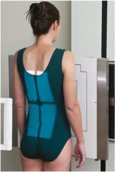
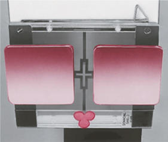
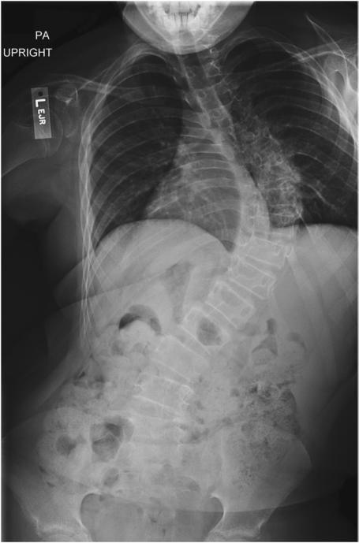

# Rx scolioză / vicii de postură ale coloanei SERIE PA (postero-anterioară)

  📷 Radiografie Convențională (Rx)
  <strong>Actualizat:</strong> 2026-09-15
  <strong>Autor:</strong> Departamentul de Radiologie / Referință Bontrager

---

-   __1. Rezumat Clinic & Indicații__

    ---

    === "Indicații Clinice"

        - Pentru determinarea gradului și severității scoliozei / viciilor de postură ale coloanei, seria poate include două incidențe PA efectuate pentru comparație, una în ortostatism și una în decubit (vezi NOTE).

    === "Ghid Național IRIS"

        !!! info "Referință Primară: Ghidul Național IRIS (Ordinul MS 1342/2012)"
            - **Capitol Ghid IRIS:** *Coloană vertebrală*
            - **Grad de Recomandare:** **Grad A**
            - **Nivel de Iradiere Estimată:** `Clasa 2 (Foarte mică ~ 1.0 - 1.5 mSv)`

            [:octicons-search-16: Deschide Ghidul IRIS](../../iris.md){ .md-button .md-button--primary } [:material-open-in-new: Aplicația Oficială PWA](https://radiologie-pediatrica.ro/iris/){ .md-button target="_blank" rel="noopener" }

-   __2. Poziționare & Centrare Fascicul__

    ---

    - **Poziție Pacient:** Pacient: Poziție în ortostatism și decubit. Se plasează pacientul în poziție de ortostatism și decubit, cu brațele pe lângă corp. Greutatea se distribuie uniform pe ambele picioare pentru poziția în ortostatism.; Regiune anatomică: Se aliniază planul mediosagital cu raza centrală și linia mediană a mesei și/sau receptorul de imagine (Fig. 9.45). Se verifică absența rotației: claviculele sunt riguros echidistante față de linia proceselor spinoase ale toracelui sau bazinului, dacă este posibil. Scolioza / viciile de postură ale coloanei pot determina torsionarea și rotația vertebrelor, făcând inevitabilă o anumită rotație. Se plasează marginea inferioară a receptorului de imagine la minimum 1 la 2 țoli (3 la 5 cm) sub creasta iliacă (corespunzător L4-L5) (înălțimea centrării determinată prin dimensiunea recomandată a câmpului și/sau zona de scolioză / vicii de postură ale coloanei).
    - **Punct de Centrare Fascicul:** Perpendicular pe receptorul de imagine. Se centrează receptorul de imagine pe raza centrală.
    - **Distanță Focar-Film (DFF / SID):** 150 cm
    - **Comandă Respiratorie:** Apnee pe durata expunerii, la sfârșitul expirului.

-   __3. Parametri Tehnici Expunere__

    ---

    | Parametru Tehnic | Valoare Configurare Generator / Tub |
    |:-----------------|:-------------------------------------|
    | **Tensiune Tub (kV)** | 75-90 kV |
    | **Sarcină / Produs Curent-Timp (mAs)** | DE CONFIGURAT PE APARAT |
    | **Distanță Focar-Film (DFF / SID)** | 150 cm |
    | **Grilă Antidifuzoare (Bucky)** | Cu grilă antidifuzoare Bucky |
    | **Dimensiune Focar** | Focar Mare (1.0 - 1.2 mm) |
    | **Camere de Ionizare AEC** | Camerele laterale (sau camera centrală, în funcție de regiune) |
    | **Colimare Fascicul** | Dimensiunea câmpului Se colimează pe două laturi până la anatomia de interes (este posibil pe patru laturi). |
    | **Filtrare Tub** | Totală ≥ 2.5 mm Al echivalent |

-   __4. Criterii de Calitate & Reușită Imagine__

    ---

    - Vizualizarea completă a regiunii anatomice explorate
    - Absența artefactelor de mișcare sau a suprapunerilor neadecvate
    - Contrast și penetrare optime pentru decelarea structurilor osoase și a părților moi

-   __5. Protecție Radiologică (ALARA)__

    ---

    - Ecranare gonadică și a organelor radiosensibile conform procedurilor locale de radioprotecție ALARA.
    - Colimare strictă la aria de interes pentru limitarea radiației difuze.
    - Verificarea posibilității unei sarcini la pacientele de vârstă fertilă înainte de expunere.

!!! note "Observații Clinice & Tehnice"
    S: Incidența PA, în locul incidenței antero-posterioare (AP), este recomandată cu insistență datorită dozei semnificativ reduse în zonele radiosensibile, cum ar fi sânii și glanda tiroidă. Studiile au arătat că această incidență determină o reducere de aproximativ 90% a dozei la nivelul sânilor.4 Scolioză / vicii de postură ale coloanei SERIE DE RUTINĂ PA Ortostatism și/sau decubit Ortostatism lateral Fig. 9.45 PA în ortostatism. Ecrane pentru sâni Ecrane pentru gonade Fig. 9.46 Filtre compensatoare clare, echivalente plumbului, cu ecrane pentru sâni și gonade atașate la partea inferioară a colimatorului cu magneți. (Cu amabilitatea Nuclear Associates, Carle Place, NY.) Fig. 9.47 PA în ortostatism—receptor de imagine de 36 țol (90cm). (din Bachmann KR: Deformări spinale la sportivul adolescent. Clin Sports Med 40[3]:541–554, 2021.) Scolioza / viciile de postură ale coloanei necesită în general examinări repetate pe parcursul mai multor ani, în special la pacienții pediatrici. Trebuie luate măsuri pentru asigurarea unei ecranări atente. Fig. 9.46 evidențiază un exemplu de

### 🖼️ Imagini

<figure class="protocol-image-card" markdown>

<figcaption><strong>Fig. 9.45 PA în ortostatism.</strong> — Poziționarea pacientului conform Ghidului Bontrager (Fig. 9.45 PA în ortostatism.)</figcaption>

</figure>

<figure class="protocol-image-card" markdown>

<figcaption><strong>Fig. 9.46 Clar, echivalent plumbului—</strong> — Aspect radiografic de referință conform Ghidului Bontrager (Fig. 9.46 Clar, echivalent plumbului—)</figcaption>

</figure>

<figure class="protocol-image-card" markdown>

<figcaption><strong>Fig. 9.47 PA în ortostatism—36-</strong> — Aspect radiografic de referință conform Ghidului Bontrager (Fig. 9.47 PA în ortostatism—36-)</figcaption>

</figure>

=== "Ghid Rapid de Execuție"

    1. **Identificarea și verificarea pacientului:** verificare identitate, zonă de examinat, consimțământ conform procedurii și evaluarea posibilității unei sarcini, când este relevantă.
    2. **Pregătire:** îndepărtarea oricăror obiecte radiopace (bijuterii, agrafe, fermoare, proteze, pansamente dense).
    3. **Poziționare precisă:** alinierea receptorului de imagine și a tubului la distanța prescrisă (150 cm).
    4. **Colimare strictă:** adaptarea fasciculului strict la regiunea de diagnostic pentru scăderea iradierii și reducerea radiației difuze.
    5. **Radioprotecție:** verificarea [politicii RX](../radioprotectie.md), cu măsuri distincte pentru pacient, personal și însoțitor.

## Surse de documentare

- [Bontrager's Textbook of Radiographic Positioning (Ed. 9/10), Pagina 365](https://www.elsevier.com/books/textbook-of-radiographic-positioning-and-related-anatomy/lampignano/978-0-323-65367-1)
