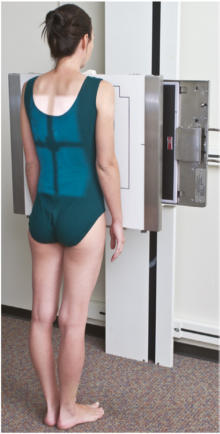
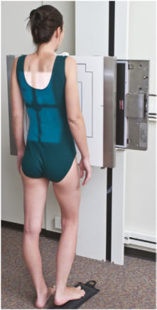
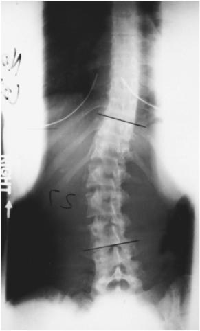
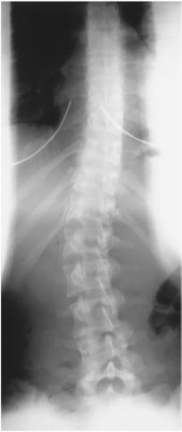

# Rx scolioză / vicii de postură ale coloanei SERIE PA (postero-anterioară) (incidență pentru scolioză / joncțiunea L5-S1 (metoda Ferguson))

  📷 Radiografie Convențională (Rx)
  <strong>Actualizat:</strong> 2026-09-15
  <strong>Autor:</strong> Departamentul de Radiologie / Referință Bontrager

---

-   __1. Rezumat Clinic & Indicații__

    ---

    === "Indicații Clinice"

        - Această metodă ajută la diferențierea curbei deformante (primare) de curba compensatorie. Se obțin două imagini—una PA standard în ortostatism și una cu piciorul sau șoldul de pe partea convexă a curbei ridicat.

    === "Ghid Național IRIS"

        !!! info "Referință Primară: Ghidul Național IRIS (Ordinul MS 1342/2012)"
            - **Capitol Ghid IRIS:** *Ghidul Național IRIS*
            - **Grad de Recomandare:** **De verificat pe indicație; fără grad atribuit automat**
            - **Nivel de Iradiere Estimată:** `De verificat pentru examinarea și populația selectate`

            [:octicons-search-16: Deschide Ghidul IRIS](../../iris.md){ .md-button .md-button--primary } [:material-open-in-new: Aplicația Oficială PWA](https://radiologie-pediatrica.ro/iris/){ .md-button target="_blank" rel="noopener" }
-   __2. Poziționare & Centrare Fascicul__

    ---

    - **Poziție Pacient:** Pacient: Ortostatism. Se plasează pacientul în ortostatism (poziție șezândă sau în ortostatism), cu fața spre masa de examinare și brațele pe lângă corp (Fig. 9.52). Pentru a doua imagine, se plasează un bloc sub picior (sau sub șold, dacă pacientul este în poziție șezândă) pe partea convexă a curbei, astfel încât pacientul să-și poată menține cu greu poziția fără asistență. Se poate utiliza un bloc de 3 la 4inch (8 la 10cm), de orice tip, sub fese dacă pacientul este așezat sau sub picior dacă este în ortostatism (Fig. 9.53).; Regiune anatomică: Se aliniază planul mediosagital cu raza centrală și linia mediană a mesei și/sau receptorul de imagine. Se verifică absența rotației: claviculele sunt riguros echidistante față de linia proceselor spinoase ale toracelui sau bazinului, dacă este posibil. Se plasează receptorul de imagine astfel încât să includă minimum 1 la 2 inches (2.5 la 5 cm) sub creasta iliacă (corespunzător L4-L5).
    - **Punct de Centrare Fascicul:** Se direcționează raza centrală (RC) perpendicular pe receptorul de imagine. Se centrează receptorul de imagine pe raza centrală.
    - **Distanță Focar-Film (DFF / SID):** 150 cm
    - **Comandă Respiratorie:** Apnee pe durata expunerii, la sfârșitul expirului.

-   __3. Parametri Tehnici Expunere__

    ---

    | Parametru Tehnic | Valoare Configurare Generator / Tub |
    |:-----------------|:-------------------------------------|
    | **Tensiune Tub (kV)** | DE CONFIGURAT PE APARAT |
    | **Sarcină / Produs Curent-Timp (mAs)** | DE CONFIGURAT PE APARAT |
    | **Distanță Focar-Film (DFF / SID)** | 150 cm |
    | **Grilă Antidifuzoare (Bucky)** | Conform grosimii anatomice (> 10 cm cu grilă) |
    | **Dimensiune Focar** | Focar Mare (1.0 - 1.2 mm) |
    | **Camere de Ionizare AEC** | DE CONFIGURAT PE APARAT |
    | **Colimare Fascicul** | Dimensiunea câmpului Se colimează pe două laturi până la anatomia de interes (este posibil pe patru laturi). |
    | **Filtrare Tub** | Totală ≥ 2.5 mm Al echivalent |

-   __4. Criterii de Calitate & Reușită Imagine__

    ---

    - Coloana toracică și lombară, inclusiv 1 la 2 inches (2.5 la 5 cm) din creasta iliacă (corespunzător L4-L5)s (Fig. 9.54 și 9.55). Poziție
    - Fără rotația pacientului, indicată prin coloana toracică și lombară cu procesele spinoase aliniate cu linia mediană vertebrală și simetria aripilor iliace și a sacrului superior.
    - Colimarea câmpului la dimensiunea ariei de interes diagnostic. Expunere
    - Evidențiere clară a marginilor osoase și a desenului trabecular al coloanei toracice și lombare.
    - Fără mișcare. Fig. 9.52 PA în ortostatism. Fig. 9.53 PA cu bloc sub picior pe partea convexă a curbei. Fig. 9.55 Ortostatism, cu înălțător pe dreapta.

-   __5. Protecție Radiologică (ALARA)__

    ---

    - Ecranare gonadică și a organelor radiosensibile conform procedurilor locale de radioprotecție ALARA.
    - Colimare strictă la aria de interes pentru limitarea radiației difuze.
    - Verificarea posibilității unei sarcini la pacientele de vârstă fertilă înainte de expunere.

!!! note "Observații Clinice & Tehnice"
    S: În această examinare nu trebuie utilizată nicio formă de susținere (de exemplu, o bandă de compresie). Pentru a doua imagine, pacientul trebuie să stea în picioare sau să șadă cu un bloc sub o parte, fără ajutor. Se efectuează incidențe PA pentru a reduce doza în zonele radiosensibile ale tiroidei și sânilor. Fig. 9.54 Ortostatism, fără înălțător. Scolioză / vicii de postură ale coloanei SERIE SPECIALĂ PA—Incidență pentru scolioză / joncțiunea L5-S1 (metoda Ferguson) AP—înclinare spre dreapta și spre stânga

### 🖼️ Imagini

<figure class="protocol-image-card" markdown>

<figcaption><strong>Fig. 9.54 Ortostatism, fără înălțător.</strong> — Poziționarea pacientului conform Ghidului Bontrager (Fig. 9.54 în ortostatism, fără înălțător.)</figcaption>

</figure>

<figure class="protocol-image-card" markdown>

<figcaption><strong>Fig. 9.52 PA în ortostatism.</strong> — Aspect radiografic de referință conform Ghidului Bontrager (Fig. 9.52 PA în ortostatism.)</figcaption>

</figure>

<figure class="protocol-image-card" markdown>

<figcaption><strong>Fig. 9.53 PA cu bloc sub picior pe partea convexă a curbei.</strong> — Aspect radiografic de referință conform Ghidului Bontrager (Fig. 9.53 PA cu bloc sub picior pe partea convexă a curbei.)</figcaption>

</figure>

<figure class="protocol-image-card" markdown>

<figcaption><strong>Fig. 9.55 Ortostatism, cu înălțător</strong> — Aspect radiografic de referință conform Ghidului Bontrager (Fig. 9.55 în ortostatism, cu înălțător)</figcaption>

</figure>

=== "Ghid Rapid de Execuție"

    1. **Identificarea și verificarea pacientului:** verificare identitate, zonă de examinat, consimțământ conform procedurii și evaluarea posibilității unei sarcini, când este relevantă.
    2. **Pregătire:** îndepărtarea oricăror obiecte radiopace (bijuterii, agrafe, fermoare, proteze, pansamente dense).
    3. **Poziționare precisă:** alinierea receptorului de imagine și a tubului la distanța prescrisă (150 cm).
    4. **Colimare strictă:** adaptarea fasciculului strict la regiunea de diagnostic pentru scăderea iradierii și reducerea radiației difuze.
    5. **Radioprotecție:** verificarea [politicii RX](../radioprotectie.md), cu măsuri distincte pentru pacient, personal și însoțitor.

## Surse de documentare

- [Bontrager's Textbook of Radiographic Positioning (Ed. 9/10), Pagina 368](https://www.elsevier.com/books/textbook-of-radiographic-positioning-and-related-anatomy/lampignano/978-0-323-65367-1)
