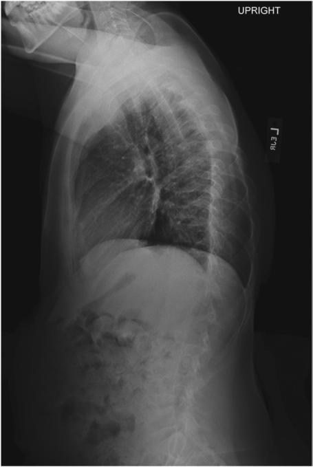
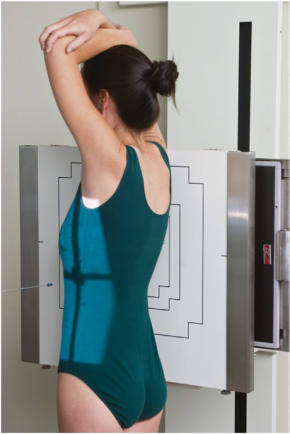
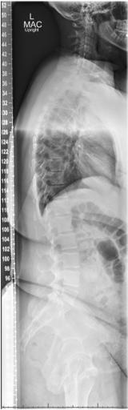

# Rx scolioză / vicii de postură ale coloanei SERIES Profil (Lateral) (Ortostatism)

  📷 Radiografie Convențională (Rx)
  <strong>Actualizat:</strong> 2026-09-15
  <strong>Autor:</strong> Departamentul de Radiologie / Referință Bontrager

---

-   __1. Rezumat Clinic & Indicații__

    ---

    === "Indicații Clinice"

        - Spondylolisthesis, grade de kyphosis, sau lordosis

    === "Ghid Național IRIS"

        !!! info "Referință Primară: Ghidul Național IRIS (Ordinul MS 1342/2012)"
            - **Capitol Ghid IRIS:** *Ghidul Național IRIS*
            - **Grad de Recomandare:** **De verificat pe indicație; fără grad atribuit automat**
            - **Nivel de Iradiere Estimată:** `De verificat pentru examinarea și populația selectate`

            [:octicons-search-16: Deschide Ghidul IRIS](../../iris.md){ .md-button .md-button--primary } [:material-open-in-new: Aplicația Oficială PWA](https://radiologie-pediatrica.ro/iris/){ .md-button target="_blank" rel="noopener" }
-   __2. Poziționare & Centrare Fascicul__

    ---

    - **Poziție Pacient:** Pacient: Ortostatism Incidență de Profil (lateral) Place pacient în Ortostatism Incidență de Profil (lateral) cu brațe ridicat, sau, if unsteady, grasping support în front. Place convex side de curve pe / sprijinit de receptorul de imagine.; Regiune anatomică: Align plan mediocoronal la raza centrală și linia mediană mesei și/sau receptorul de imagine (Fig. 9.50). Se verifică absența rotației: claviculele sunt riguros echidistante față de linia proceselor spinoase thorax sau Bazin (bazin (pelvis)) exists. Place lower margin de receptorul de imagine minimum de 1 la 2 inches (2.5 la 5 cm) below level de creasta iliacă (corespunzător L4-L5)s (centering determined prin recommended field size și pacient size).
    - **Punct de Centrare Fascicul:** perpendicular pe receptorul de imagine. Se centrează receptorul de imagine pe raza centrală.
    - **Distanță Focar-Film (DFF / SID):** 150 cm
    - **Comandă Respiratorie:** Apnee pe durata expunerii pe expiration. scolioză / vicii de postură ale coloanei SERIES ROUTINE PA Ortostatism și/sau Decubit Ortostatism lateral Fig. 9.49 Ortostatism lateral. Clear Pb lateral thoracic compensating filter în place. (de la Bachmann KR: Spinal deformities în adolescent athlete. Clin Sports Med 40[3]:541–554, 2021.)

-   __3. Parametri Tehnici Expunere__

    ---

    | Parametru Tehnic | Valoare Configurare Generator / Tub |
    |:-----------------|:-------------------------------------|
    | **Tensiune Tub (kV)** | 85-95 kV |
    | **Sarcină / Produs Curent-Timp (mAs)** | DE CONFIGURAT PE APARAT |
    | **Distanță Focar-Film (DFF / SID)** | 150 cm |
    | **Grilă Antidifuzoare (Bucky)** | Cu grilă antidifuzoare Bucky |
    | **Dimensiune Focar** | Focar Mare (1.0 - 1.2 mm) |
    | **Camere de Ionizare AEC** | Camerele laterale (sau camera centrală funcție de regiune) |
    | **Colimare Fascicul** | Field Size Collimate pe two sides la anatomy de interest (four sides este possible). |
    | **Filtrare Tub** | Totală ≥ 2.5 mm Al echivalent |

-   __4. Criterii de Calitate & Reușită Imagine__

    ---

    - Thoracic și coloană lombară including 1 la 2 inches (2.5 la 5 cm) de creasta iliacă (corespunzător L4-L5)s (Figs. 9.49 și 9.51). poziție
    - Thoracic și coloană lombară aliniat paralel cu receptorul de imagine (RI), ca indicated prin open intervertebral foramina și open intervertebral spații articulare.
    - Absența rotației anatomice: clavicule echidistante față de linia apofizelor spinoase indicated prin superimposed greater sciatic notches și posterior vertebral corpuri. However, scolioză / vicii de postură ale coloanei este often accompanied prin twisting sau rotație de involved vertebre.
    - Collimation field size la aria de interes diagnostic. expunere
    - optim receptorul de imagine expunere și contrast. Clear demonstration de bony margins și trabecular markings de thoracic și coloană lombară.
    - fără mișcare. Fig. 9.50 Ortostatism drept lateral. Fig. 9.51 Ortostatism stâng lateral.

-   __5. Protecție Radiologică (ALARA)__

    ---

    - Ecranare gonadică și a organelor radiosensibile conform procedurilor locale de radioprotecție ALARA.
    - Colimare strictă la aria de interes pentru limitarea radiației difuze.
    - Verificarea posibilității unei sarcini la pacientele de vârstă fertilă înainte de expunere.

### 🖼️ Imagini

<figure class="protocol-image-card" markdown>

<figcaption><strong>Fig. 9.49 Ortostatism lateral. Clear Pb lateral thoracic compensating filter</strong> — Poziționare pacient conform Ghidului Bontrager (Fig. 9.49 în ortostatism lateral. Clear Pb lateral thoracic compensating filter)</figcaption>

</figure>

<figure class="protocol-image-card" markdown>

<figcaption><strong>Fig. 9.50 Ortostatism drept lateral.</strong> — Aspect radiografic de referință conform Ghidului Bontrager (Fig. 9.50 în ortostatism drept lateral.)</figcaption>

</figure>

<figure class="protocol-image-card" markdown>

<figcaption><strong>Fig. 9.51 Ortostatism stâng lateral.</strong> — Aspect radiografic de referință conform Ghidului Bontrager (Fig. 9.51 în ortostatism stâng lateral.)</figcaption>

</figure>

=== "Ghid Rapid de Execuție"

    1. **Identificarea și verificarea pacientului:** verificare identitate, zonă de examinat, consimțământ conform procedurii și evaluarea posibilității unei sarcini, când este relevantă.
    2. **Pregătire:** îndepărtarea oricăror obiecte radiopace (bijuterii, agrafe, fermoare, proteze, pansamente dense).
    3. **Poziționare precisă:** alinierea receptorului de imagine și a tubului la distanța prescrisă (150 cm).
    4. **Colimare strictă:** adaptarea fasciculului strict la regiunea de diagnostic pentru scăderea iradierii și reducerea radiației difuze.
    5. **Radioprotecție:** verificarea [politicii RX](../radioprotectie.md), cu măsuri distincte pentru pacient, personal și însoțitor.

## Surse de documentare

- [Bontrager's Textbook of Radiographic Positioning (Ed. 9/10), Pagina 367](https://www.elsevier.com/books/textbook-of-radiographic-positioning-and-related-anatomy/lampignano/978-0-323-65367-1)
