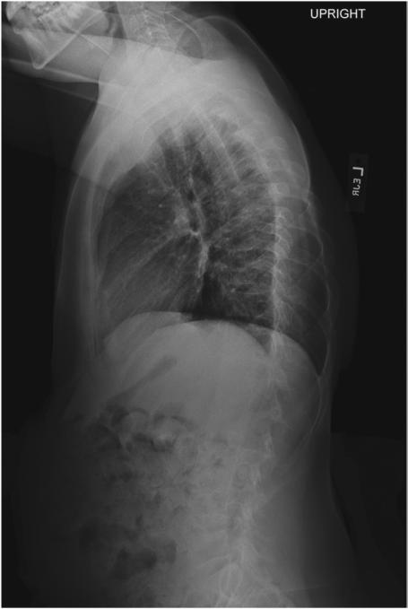
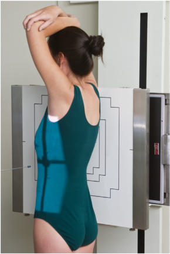
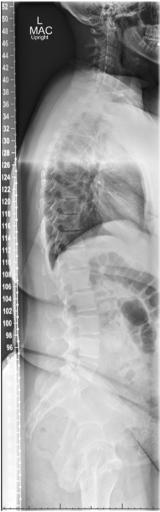

# Rx scolioză / vicii de postură ale coloanei — serie de incidențe de profil (lateral), în ortostatism

  📷 Radiografie Convențională (Rx)
  <strong>Actualizat:</strong> 2026-09-15
  <strong>Autor:</strong> Departamentul de Radiologie / Referință Bontrager

---

-   __1. Rezumat Clinic & Indicații__

    ---

    === "Indicații Clinice"

        - Spondilolistezis, gradul cifozei sau lordozei

    === "Ghid Național IRIS"

        !!! info "Referință Primară: Ghidul Național IRIS (Ordinul MS 1342/2012)"
            - **Capitol Ghid IRIS:** *Coloană vertebrală*
            - **Grad de Recomandare:** **Grad A**
            - **Nivel de Iradiere Estimată:** `Clasa 2 (Foarte mică ~ 1.0 - 1.5 mSv)`

            [:octicons-search-16: Deschide Ghidul IRIS](../../iris.md){ .md-button .md-button--primary } [:material-open-in-new: Aplicația Oficială PWA](https://radiologie-pediatrica.ro/iris/){ .md-button target="_blank" rel="noopener" }

-   __2. Poziționare & Centrare Fascicul__

    ---

    - **Poziție Pacient:** Pacient: Ortostatism, incidență de profil (lateral). Se plasează pacientul în ortostatism, în incidență de profil (lateral), cu brațele ridicate sau, dacă este instabil, apucând un suport în față. Se plasează partea convexă a curbei pe/lângă receptorul de imagine.; Regiune anatomică: Se aliniază planul mediocoronal cu raza centrală și linia mediană a mesei și/sau receptorul de imagine (Fig. 9.50). Se verifică absența rotației: claviculele sunt riguros echidistante față de linia proceselor spinoase ale toracelui sau bazinului, dacă există. Se plasează marginea inferioară a receptorului de imagine la minimum 1 la 2 țoli (2.5 la 5 cm) sub nivelul crestei iliace (corespunzător L4-L5)s (centrarea determinată prin dimensiunea recomandată a câmpului și dimensiunea pacientului).
    - **Punct de Centrare Fascicul:** Perpendicular pe receptorul de imagine. Se centrează receptorul de imagine pe raza centrală.
    - **Distanță Focar-Film (DFF / SID):** 150 cm
    - **Comandă Respiratorie:** Apnee pe durata expunerii, în expir. Scolioză / vicii de postură ale coloanei SERIE DE RUTINĂ PA Ortostatism și/sau decubit Ortostatism lateral Fig. 9.49 Ortostatism lateral. Filtru compensator lateral toracic clar, din Pb, montat. (din Bachmann KR: Deformări spinale la sportivul adolescent. Clin Sports Med 40[3]:541–554, 2021.)

-   __3. Parametri Tehnici Expunere__

    ---

    | Parametru Tehnic | Valoare Configurare Generator / Tub |
    |:-----------------|:-------------------------------------|
    | **Tensiune Tub (kV)** | 85-95 kV |
    | **Sarcină / Produs Curent-Timp (mAs)** | DE CONFIGURAT PE APARAT |
    | **Distanță Focar-Film (DFF / SID)** | 150 cm |
    | **Grilă Antidifuzoare (Bucky)** | Cu grilă antidifuzoare Bucky |
    | **Dimensiune Focar** | Focar Mare (1.0 - 1.2 mm) |
    | **Camere de Ionizare AEC** | Camerele laterale (sau camera centrală, în funcție de regiune) |
    | **Colimare Fascicul** | Dimensiunea câmpului Se colimează pe două laturi până la anatomia de interes (este posibil pe patru laturi). |
    | **Filtrare Tub** | Totală ≥ 2.5 mm Al echivalent |

-   __4. Criterii de Calitate & Reușită Imagine__

    ---

    - Coloana toracală și lombară, incluzând 1 la 2 țoli (2.5 la 5 cm) din creasta iliacă (corespunzătoare L4-L5) (Fig. 9.49 și 9.51). poziție
    - Coloana toracală și lombară aliniată paralel cu receptorul de imagine (RI), după cum indică foramenele intervertebrale deschise și spațiile articulare intervertebrale deschise.
    - Absența rotației anatomice: claviculele echidistante față de linia apofizelor spinoase, indicată prin incizurile sciatice mari suprapuse și corpurile vertebrale posterioare. Totuși, scolioza / viciile de postură ale coloanei sunt adesea însoțite de răsucirea sau rotația vertebrelor implicate.
    - Colimarea câmpului la dimensiunea ariei de interes diagnostic. Expunere
    - Expunere și contrast optime la receptorul de imagine. Demonstrarea clară a marginilor osoase și a desenului trabecular al coloanei toracale și lombare.
    - fără mișcare. Fig. 9.50 Ortostatism drept lateral. Fig. 9.51 Ortostatism stâng lateral.

-   __5. Protecție Radiologică (ALARA)__

    ---

    - Ecranare gonadică și a organelor radiosensibile conform procedurilor locale de radioprotecție ALARA.
    - Colimare strictă la aria de interes pentru limitarea radiației difuze.
    - Verificarea posibilității unei sarcini la pacientele de vârstă fertilă înainte de expunere.

### 🖼️ Imagini

<figure class="protocol-image-card" markdown>

<figcaption><strong>Fig. 9.49 Ortostatism lateral. Filtru compensatoriu toracic lateral Pb detașabil</strong> — Poziționarea pacientului conform Ghidului Bontrager (Fig. 9.49 în ortostatism lateral. Filtru compensatoriu toracic lateral Pb detașabil)</figcaption>

</figure>

<figure class="protocol-image-card" markdown>

<figcaption><strong>Fig. 9.50 Ortostatism drept lateral.</strong> — Aspect radiografic de referință conform Ghidului Bontrager (Fig. 9.50 în ortostatism drept lateral.)</figcaption>

</figure>

<figure class="protocol-image-card" markdown>

<figcaption><strong>Fig. 9.51 Ortostatism stâng lateral.</strong> — Aspect radiografic de referință conform Ghidului Bontrager (Fig. 9.51 în ortostatism stâng lateral.)</figcaption>

</figure>

=== "Ghid Rapid de Execuție"

    1. **Identificarea și verificarea pacientului:** verificare identitate, zonă de examinat, consimțământ conform procedurii și evaluarea posibilității unei sarcini, când este relevantă.
    2. **Pregătire:** îndepărtarea oricăror obiecte radiopace (bijuterii, agrafe, fermoare, proteze, pansamente dense).
    3. **Poziționare precisă:** alinierea receptorului de imagine și a tubului la distanța prescrisă (150 cm).
    4. **Colimare strictă:** adaptarea fasciculului strict la regiunea de diagnostic pentru scăderea iradierii și reducerea radiației difuze.
    5. **Radioprotecție:** verificarea [politicii RX](../radioprotectie.md), cu măsuri distincte pentru pacient, personal și însoțitor.

## Surse de documentare

- [Bontrager's Textbook of Radiographic Positioning (Ed. 9/10), Pagina 367](https://www.elsevier.com/books/textbook-of-radiographic-positioning-and-related-anatomy/lampignano/978-0-323-65367-1)
