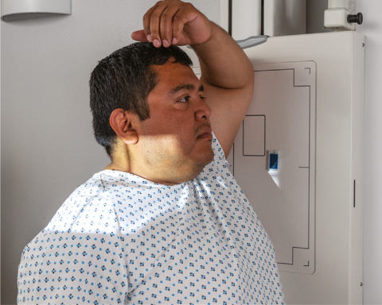
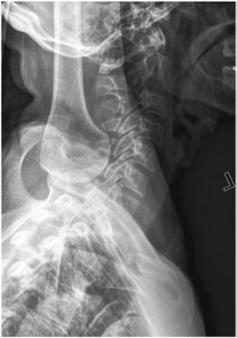
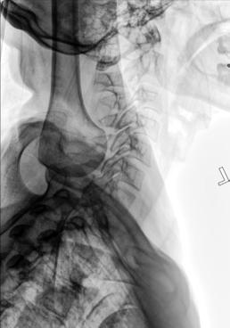

# Rx T3) Incidență de Profil (Lateral) CERVICOTHORACIC (C5 (Coloană Cervicală - SWIMMER’S)

  📷 Radiografie Convențională (Rx)
  <strong>Actualizat:</strong> 2026-09-15
  <strong>Autor:</strong> Departamentul de Radiologie / Referință Bontrager

---

-   __1. Rezumat Clinic & Indicații__

    ---

    === "Indicații Clinice"

        - Pathology involving the inferior Coloană Cervicală, superior Coloană Toracală, and adjacent soft tissue structures
        - Various suspiciune de fractură (including compression suspiciune de fractură) and subluxation
        - This is a good projection when C7 to T1 is not visualized on the lateral Coloană Cervicală or when the upper thoracic vertebrae are of special interest on a lateral Coloană Toracală.

    === "Ghid Național IRIS"

        !!! info "Referință Primară: Ghidul Național IRIS (Ordinul MS 1342/2012)"
            - **Capitol Ghid IRIS:** *Ghidul Național IRIS*
            - **Grad de Recomandare:** **De verificat pe indicație; fără grad atribuit automat**
            - **Nivel de Iradiere Estimată:** `De verificat pentru examinarea și populația selectate`

            [:octicons-search-16: Deschide Ghidul IRIS](../../iris.md){ .md-button .md-button--primary } [:material-open-in-new: Aplicația Oficială PWA](https://radiologie-pediatrica.ro/iris/){ .md-button target="_blank" rel="noopener" }
-   __2. Poziționare & Centrare Fascicul__

    ---

    - **Poziție Pacient:** Pacient: Ortostatism or Decubit Position Place patient in preferred Ortostatism position (sitting or standing). The radiograph may be performed in the Decubit position if the patient’s condition requires.; Regiune anatomică: Align midcoronal plane to CR and midline of table and/or IR. Place patient’s arm and Umăr closest to the IR up, flexing Cot and resting Antebraț on head for support. Position arm and Umăr furthest from the IR down and rotate slightly posterior, to place the remote humeral head posterior to vertebrae (Fig. 8.62). Ensure that Absența rotației anatomice: clavicule echidistante față de linia apofizelor spinoase of thorax and head exists.
    - **Punct de Centrare Fascicul:** perpendicular to IR (see NOTE). Direct CR to T1, which is approximately 1 inch (2.5 cm) above level of incizura jugulară (manubriul sternal) anteriorly and at level of vertebra proeminentă (apofiza spinoasă C7) posteriorly. Center IR to CR.
    - **Distanță Focar-Film (DFF / SID):** 180 cm
    - **Comandă Respiratorie:** Suspend respiration on full expiration.

-   __3. Parametri Tehnici Expunere__

    ---

    | Parametru Tehnic | Valoare Configurare Generator / Tub |
    |:-----------------|:-------------------------------------|
    | **Tensiune Tub (kV)** | 75-95 kV |
    | **Sarcină / Produs Curent-Timp (mAs)** | DE CONFIGURAT PE APARAT |
    | **Distanță Focar-Film (DFF / SID)** | 180 cm |
    | **Grilă Antidifuzoare (Bucky)** | Cu grilă antidifuzoare Bucky |
    | **Dimensiune Focar** | Focar Mare (1.0 - 1.2 mm) |
    | **Camere de Ionizare AEC** | Camerele laterale (sau camera centrală funcție de regiune) |
    | **Colimare Fascicul** | Collimate on four sides to anatomy of interest. |
    | **Filtrare Tub** | Totală ≥ 2.5 mm Al echivalent |

-   __4. Criterii de Calitate & Reușită Imagine__

    ---

    - Vertebral bodies and intervertebral disk spaces of C5 to T3 are shown.
    - The humeral head and arm farthest from the IR are magnified and appear inferior to T4 or T5 (if visible) (Figs. 8.63 and 8.64). Position
    - Minimal vertebral rotation indicated by superimposition of cervical zygapophyseal joints and articular pillars, and posterior Coaste (Grilaj Costal).
    - The humeral heads should be separated vertically.
    - Collimation to area of interest. Exposure
    - Optimal image receptor exposure and contrast. Clear demonstration of bony margins and trabecular markings of lower cervical and upper thoracic vertebrae.
    - no motion. Fig. 8.62 Cervicothoracic (swimmer’s) lateral.

-   __5. Protecție Radiologică (ALARA)__

    ---

    - Ecranare gonadică și a organelor radiosensibile conform procedurilor locale de radioprotecție ALARA.
    - Colimare strictă la aria de interes pentru limitarea radiației difuze.
    - Verificarea posibilității unei sarcini la pacientele de vârstă fertilă înainte de expunere.

!!! note "Observații Clinice & Tehnice"
    A slight caudad angulation of 3° to 5° may be necessary to help separate the shoulders farthest on the image. Orthostatic (Breathing) Technique If patient can cooperate and remain immobilized, a low mA and 3or 4second exposure time can be used, with patient breathing short, even breaths during the exposure to blur out overlying lung structures. Coloană Cervicală SPECIAL Cervicothoracic lateral (Swimmer’s) Fig. 8.63 Cervicothoracic (swimmer’s) lateral. Left Claviculă Left Humerus T1 C7 Fig. 8.64 Cervicothoracic (swimmer’s) lateral.

### 🖼️ Imagini

<figure class="protocol-image-card" markdown>

<figcaption><strong>Fig. 8.63 Cervicothoracic</strong> — Poziționare pacient conform Ghidului Bontrager (Fig. 8.63 Cervicothoracic)</figcaption>

</figure>

<figure class="protocol-image-card" markdown>

<figcaption><strong>Fig. 8.64 Cervicothoracic</strong> — Aspect radiografic de referință conform Ghidului Bontrager (Fig. 8.64 Cervicothoracic)</figcaption>

</figure>

<figure class="protocol-image-card" markdown>

<figcaption><strong>Fig. 8.62 Cervicothoracic (swimmer’s) lateral.</strong> — Aspect radiografic de referință conform Ghidului Bontrager (Fig. 8.62 Cervicothoracic (swimmer’s) lateral.)</figcaption>

</figure>

=== "Ghid Rapid de Execuție"

    1. **Identificarea și verificarea pacientului:** verificare identitate, zonă de examinat, consimțământ conform procedurii și evaluarea posibilității unei sarcini, când este relevantă.
    2. **Pregătire:** îndepărtarea oricăror obiecte radiopace (bijuterii, agrafe, fermoare, proteze, pansamente dense).
    3. **Poziționare precisă:** alinierea receptorului de imagine și a tubului la distanța prescrisă (180 cm).
    4. **Colimare strictă:** adaptarea fasciculului strict la regiunea de diagnostic pentru scăderea iradierii și reducerea radiației difuze.
    5. **Radioprotecție:** verificarea [politicii RX](../radioprotectie.md), cu măsuri distincte pentru pacient, personal și însoțitor.

## Surse de documentare

- [Bontrager's Textbook of Radiographic Positioning (Ed. 9/10), Pagina 337](https://www.elsevier.com/books/textbook-of-radiographic-positioning-and-related-anatomy/lampignano/978-0-323-65367-1)
