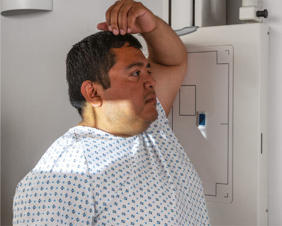
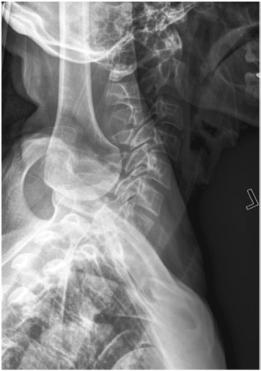
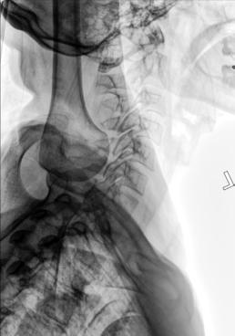

# Rx T3) Incidență de Profil (Lateral) CERVICOTHORACIC (C5 (Coloană Cervicală - SWIMMER’S)

  📷 Radiografie Convențională (Rx)
  <strong>Actualizat:</strong> 2026-09-15
  <strong>Autor:</strong> Departamentul de Radiologie / Referință Bontrager

---

-   __1. Rezumat Clinic & Indicații__

    ---

    === "Indicații Clinice"

        - Patologie care implică porțiunea inferioară a coloanei cervicale, porțiunea superioară a coloanei toracale și structurile adiacente ale părților moi
        - Diverse suspiciuni de fractură (inclusiv suspiciune de fractură prin compresie) și subluxație
        - Aceasta este o incidență bună atunci când C7 până la T1 nu sunt vizualizate pe incidența laterală a coloanei cervicale sau când partea superioară a coloanei toracale prezintă un interes deosebit pe incidența laterală a coloanei toracale.

    === "Ghid Național IRIS"

        !!! info "Referință Primară: Ghidul Național IRIS (Ordinul MS 1342/2012)"
            - **Capitol Ghid IRIS:** *Ghidul Național IRIS*
            - **Grad de Recomandare:** **De verificat pe indicație; fără grad atribuit automat**
            - **Nivel de Iradiere Estimată:** `De verificat pentru examinarea și populația selectate`

            [:octicons-search-16: Deschide Ghidul IRIS](../../iris.md){ .md-button .md-button--primary } [:material-open-in-new: Aplicația Oficială PWA](https://radiologie-pediatrica.ro/iris/){ .md-button target="_blank" rel="noopener" }
-   __2. Poziționare & Centrare Fascicul__

    ---

    - **Poziție Pacient:** Pacient: Ortostatism sau decubit Poziție: Se plasează pacientul în poziția preferată de ortostatism (așezat sau în ortostatism). Radiografia poate fi efectuată în decubit dacă starea pacientului o impune.; Regiune anatomică: Se aliniază planul mediocoronal cu raza centrală și linia mediană a mesei și/sau a receptorului de imagine. Se ridică brațul și umărul pacientului cel mai apropiat de receptorul de imagine, flectând cotul și sprijinind antebrațul pe cap. Brațul și umărul cel mai îndepărtat de receptorul de imagine se coboară și se rotește ușor posterior, pentru a plasa capul humeral îndepărtat posterior față de vertebre (Fig. 8.62). Se verifică absența rotației: claviculele sunt riguros echidistante față de linia proceselor spinoase ale toracelui, iar capetele există.
    - **Punct de Centrare Fascicul:** perpendicular pe receptorul de imagine (vezi NOTA). Raza centrală se orientează spre T1, care se află la aproximativ 1 inch (2.5 cm) deasupra nivelului incizurii jugulare (manubriul sternal), anterior, și la nivelul vertebrei proeminente (apofiza spinoasă C7), posterior. Se centrează receptorul de imagine pe raza centrală.
    - **Distanță Focar-Film (DFF / SID):** 180 cm
    - **Comandă Respiratorie:** Apnee pe durata expunerii, în expir complet.

-   __3. Parametri Tehnici Expunere__

    ---

    | Parametru Tehnic | Valoare Configurare Generator / Tub |
    |:-----------------|:-------------------------------------|
    | **Tensiune Tub (kV)** | 75-95 kV |
    | **Sarcină / Produs Curent-Timp (mAs)** | DE CONFIGURAT PE APARAT |
    | **Distanță Focar-Film (DFF / SID)** | 180 cm |
    | **Grilă Antidifuzoare (Bucky)** | Cu grilă antidifuzoare Bucky |
    | **Dimensiune Focar** | Focar Mare (1.0 - 1.2 mm) |
    | **Camere de Ionizare AEC** | Camerele laterale (sau camera centrală, în funcție de regiune) |
    | **Colimare Fascicul** | Colimați pe cele patru laturi la anatomia de interes. |
    | **Filtrare Tub** | Totală ≥ 2.5 mm Al echivalent |

-   __4. Criterii de Calitate & Reușită Imagine__

    ---

    - Corpurile vertebrale și spațiile discale intervertebrale de la C5 la T3 sunt vizualizate.
    - Capul humeral și brațul cel mai îndepărtat de receptorul de imagine sunt mărite și apar inferior față de T4 sau T5 (dacă sunt vizibile) (Fig. 8.63 și 8.64). poziție
    - Rotație vertebrală minimă, indicată prin suprapunerea articulațiilor zigapofizare cervicale și a pilierilor articulari, precum și a coastelor posterioare (grilaj costal).
    - Capetele humerale trebuie să fie separate vertical.
    - Colimare la aria de interes diagnostic. Expunere
    - Expunere optimă a receptorului de imagine și contrast. Evidențiere clară a marginilor osoase și a desenului trabecular al coloanei cervicale inferioare și al coloanei toracale superioare.
    - fără mișcare. Fig. 8.62 Incidență laterală cervicotoracică (swimmer’s).

-   __5. Protecție Radiologică (ALARA)__

    ---

    - Ecranare gonadică și a organelor radiosensibile conform procedurilor locale de radioprotecție ALARA.
    - Colimare strictă la aria de interes pentru limitarea radiației difuze.
    - Verificarea posibilității unei sarcini la pacientele de vârstă fertilă înainte de expunere.

!!! note "Observații Clinice & Tehnice"
    O angulație caudală ușoară de 3° la 5° poate fi necesară pentru a ajuta la separarea umerilor cât mai mult pe imagine. Tehnica ortostatică (respirație): dacă pacientul poate coopera și rămâne imobilizat, se poate utiliza un mA mic și un timp de expunere de 3or 4secunde, pacientul respirând scurt, uniform în timpul expunerii, pentru a estompa structurile pulmonare suprapuse. Coloană Cervicală SPECIAL Incidență laterală cervicotoracică (Swimmer’s) Fig. 8.63 Incidență laterală cervicotoracică (swimmer’s). stâng Claviculă stângă Humerus T1 C7 Fig. 8.64 Incidență laterală cervicotoracică (swimmer’s).

### 🖼️ Imagini

<figure class="protocol-image-card" markdown>

<figcaption><strong>Fig. 8.63 Cervicotoracică</strong> — Poziționarea pacientului conform Ghidului Bontrager (Fig. 8.63 Cervicotoracică)</figcaption>

</figure>

<figure class="protocol-image-card" markdown>

<figcaption><strong>Fig. 8.64 Cervicotoracică</strong> — Aspect radiografic de referință conform Ghidului Bontrager (Fig. 8.64 Cervicotoracică)</figcaption>

</figure>

<figure class="protocol-image-card" markdown>

<figcaption><strong>Fig. 8.62 Incidență laterală cervicotoracică (swimmer’s).</strong> — Aspect radiografic de referință conform Ghidului Bontrager (Fig. 8.62 Incidență laterală cervicotoracică (swimmer’s).)</figcaption>

</figure>

=== "Ghid Rapid de Execuție"

    1. **Identificarea și verificarea pacientului:** verificare identitate, zonă de examinat, consimțământ conform procedurii și evaluarea posibilității unei sarcini, când este relevantă.
    2. **Pregătire:** îndepărtarea oricăror obiecte radiopace (bijuterii, agrafe, fermoare, proteze, pansamente dense).
    3. **Poziționare precisă:** alinierea receptorului de imagine și a tubului la distanța prescrisă (180 cm).
    4. **Colimare strictă:** adaptarea fasciculului strict la regiunea de diagnostic pentru scăderea iradierii și reducerea radiației difuze.
    5. **Radioprotecție:** verificarea [politicii RX](../radioprotectie.md), cu măsuri distincte pentru pacient, personal și însoțitor.

## Surse de documentare

- [Bontrager's Textbook of Radiographic Positioning (Ed. 9/10), Pagina 337](https://www.elsevier.com/books/textbook-of-radiographic-positioning-and-related-anatomy/lampignano/978-0-323-65367-1)
