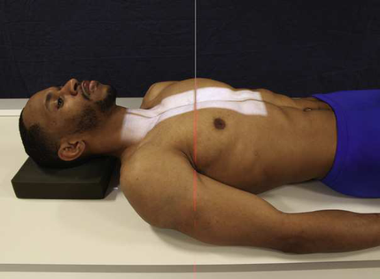
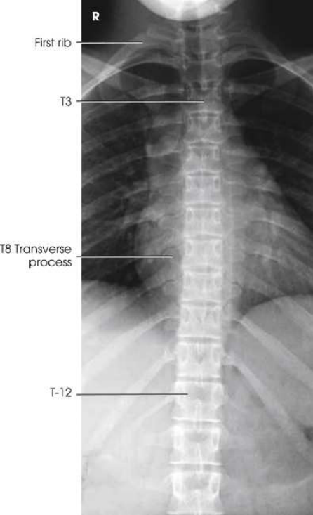
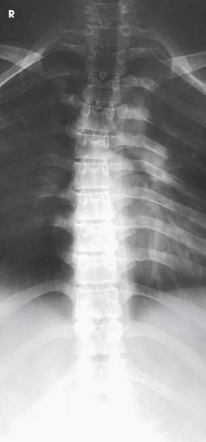
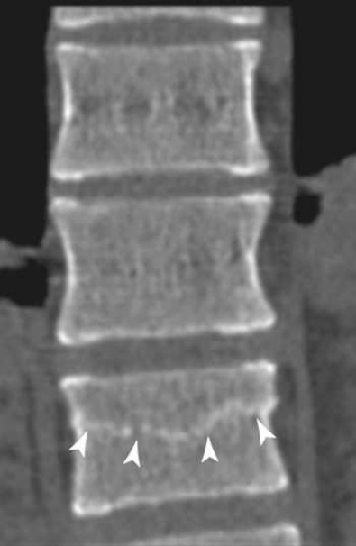

# Rx Coloană Toracală — Incidență Antero-Posterioară (AP) (Merrill)

  📷 Radiografie Convențională (Rx)
  <strong>Actualizat:</strong> 2026-09-16
  <strong>Autor:</strong> Referință Merrill

---

-   __1. Rezumat Clinic & Indicații__

    ---

    === "Indicații Clinice"

        - Conform reperelor anatomice standard din tratat

    === "Ghid Național IRIS"

        !!! info "Referință Primară: Ghidul Național IRIS (Ordinul MS 1342/2012)"
            - **Capitol Ghid IRIS:** *Ghidul Național IRIS*
            - **Grad de Recomandare:** **De verificat pe indicație; fără grad atribuit automat**
            - **Nivel de Iradiere Estimată:** `De verificat pentru examinarea și populația selectate`

            [:octicons-search-16: Deschide Ghidul IRIS](../../iris.md){ .md-button .md-button--primary } [:material-open-in-new: Aplicația Oficială PWA](https://radiologie-pediatrica.ro/iris/){ .md-button target="_blank" rel="noopener" }
-   __2. Poziționare & Centrare Fascicul__

    ---

    - **Poziție Pacient:** se așază pacientul în Decubit dorsal sau ortostatism. se poziționează pacientul’s brațe along sides de corp și se ajustează umeri la lie în same plan orizontal. If pacientul este Decubit dorsal, let capul rest directly pe masa de examinare sau pe thin pillow la avoid accentuating thoracic kyphosis. If possible, orient pacientul so lower thorax este la cathode end de x-ray tube. This orientation takes advantage de “anode heel efect” la ensure more uniform expunere de thoracic anatomy. If ortostatism este used, Se instruiește pacientul să sit sau stand up ca straight ca possible.; se centrează MSP de corp la linia mediană grilă. pentru Decubit dorsal poziție, la reduce kyphosis, se flectează pacient’s hips și genunchi la place thighs în vertical poziție. se imobilizează picioare cu săculeți cu nisip (Fig. 9.68). If pacientul’s limbs cannot fie flectat, support genunchii la relieve strain. pentru ortostatism, Se instruiește pacientul să stand astfel încât pacient’s weight este equally distributed pe picioarele la prevent rotație de coloană vertebrală. If pacientul’s lower limbs sunt de unequal length, place support de correct height under Picior de shorter side. Place superior edge de receptorul de imagine 1½ la 2 inches (3.8 la 5 cm) above umerii pe average pacient. This poziții receptorul de imagine so that T7 appears near center de imagine și toate coloană toracală sunt vizualizat. se efectuează ecranarea gonadelor cu șorț plumbat.
    - **Punct de Centrare Fascicul:** perpendicular pe receptorul de imagine (RI). center de raza centrală trebuie să fie approximately halfway între incizură jugulară (furculiță sternală) și apendice xifoid (see Fig. 9.68). Collimate closely la coloană vertebrală.
    - **Distanță Focar-Film (DFF / SID):** Nespecificat în fragmentul extras; de verificat în sursă
    - **Comandă Respiratorie:** Suspended la end de Expir complet. This minimizes air în plămânii, which results în less attenuation diferences și more uniform expunere de thoracic anatomy.

-   __3. Parametri Tehnici Expunere__

    ---

    | Parametru Tehnic | Valoare Configurare Generator / Tub |
    |:-----------------|:-------------------------------------|
    | **Tensiune Tub (kV)** | DE CONFIGURAT PE APARAT |
    | **Sarcină / Produs Curent-Timp (mAs)** | DE CONFIGURAT PE APARAT |
    | **Distanță Focar-Film (DFF / SID)** | Nespecificat în fragmentul extras; de verificat în sursă |
    | **Grilă Antidifuzoare (Bucky)** | DE CONFIGURAT PE APARAT |
    | **Dimensiune Focar** | DE CONFIGURAT PE APARAT |
    | **Camere de Ionizare AEC** | DE CONFIGURAT PE APARAT |
    | **Colimare Fascicul** | Se ajustează câmpul de iradiere la formatul 18 × 43 cm pe colimator. Place marker de lateralitate (D/S) în collimated expunere field. |
    | **Filtrare Tub** | DE CONFIGURAT PE APARAT |

-   __4. Criterii de Calitate & Reușită Imagine__

    ---

    - Criterii radiologice de calitate imaginii:
    - Evidence de corect collimation și presence de marker de lateralitate (D/S) plasat clear de anatomy de interest
    - toate 12 coloană toracală
    - Absența rotației anatomice (simetrie bilaterală perfectă) ca evidențiat prin procese spinoase la linia mediană vertebral corpuri
    - coloană vertebrală aliniat la middle de imagine
    - Bony detalii trabeculare osoase și surrounding soft tissues

-   __5. Protecție Radiologică (ALARA)__

    ---

    - Nespecificat în fragmentul extras; de verificat în sursă

!!! note "Observații Clinice & Tehnice"
    ca suСested prin Fuchs, 16 more uniform expunere de coloană toracală poate fie obtained if “heel efect” de tubul este used (Figs. 9.69 și 9.70). cu tubul poziționat astfel încât cathode end este spre picioarele, greatest percentage de radiation goes through thickest part de thorax.

### 🖼️ Imagini

<figure class="protocol-image-card" markdown>

<figcaption><strong>Merrill — pagina PDF 709, imaginea 1</strong> — Imagine din fragmentul sursă; asocierea necesită revizie.</figcaption>

</figure>

<figure class="protocol-image-card" markdown>

<figcaption><strong>Merrill — pagina PDF 710, imaginea 2</strong> — Imagine din fragmentul sursă; asocierea necesită revizie.</figcaption>

</figure>

<figure class="protocol-image-card" markdown>

<figcaption><strong>Merrill — pagina PDF 711, imaginea 3</strong> — Imagine din fragmentul sursă; asocierea necesită revizie.</figcaption>

</figure>

<figure class="protocol-image-card" markdown>

<figcaption><strong>Merrill — pagina PDF 712, imaginea 4</strong> — Imagine din fragmentul sursă; asocierea necesită revizie.</figcaption>

</figure>

=== "Ghid Rapid de Execuție"

    1. **Identificarea și verificarea pacientului:** verificare identitate, zonă de examinat, consimțământ conform procedurii și evaluarea posibilității unei sarcini, când este relevantă.
    2. **Pregătire:** îndepărtarea oricăror obiecte radiopace (bijuterii, agrafe, fermoare, proteze, pansamente dense).
    3. **Poziționare precisă:** alinierea receptorului de imagine și a tubului la distanța prescrisă (Nespecificat în fragmentul extras; de verificat în sursă).
    4. **Colimare strictă:** adaptarea fasciculului strict la regiunea de diagnostic pentru scăderea iradierii și reducerea radiației difuze.
    5. **Radioprotecție:** verificarea [politicii RX](../radioprotectie.md), cu măsuri distincte pentru pacient, personal și însoțitor.

## Surse de documentare

- [Merrill’s Atlas, 9. Vertebral Column, pagini PDF 708–712](../../assets/protocols/sources/a56d45c16829_Merrills_Atlas_of_Radiographic_Positioning__Procedures_3Vol_Set.pdf#page=708)

## Fragmente sursă traduse (referință tehnică)

### anatomy

thoracic corpuri, intervertebral disk spaces, procese transverse, costovertebral articulations, și surrounding structures (see Fig. 9.69). thoracic coloană vertebrală poate fie dificult la evaluate cu radiografie pentru extremely large pacienți și those cu lichid-filled chest. CT este often used la see
vertebre în detail (Fig. 9.71).

### collimation

• Se ajustează câmpul de iradiere la formatul 18 × 43 cm pe colimator. Place marker de lateralitate (D/S) în collimated expunere field.

### cr

• perpendicular pe receptorul de imagine (RI). center de raza centrală trebuie să fie approximately halfway între incizură jugulară (furculiță sternală) și xiphoid
process (see Fig. 9.68).
• Collimate closely la coloană vertebrală.

### criteria

Criterii radiologice de calitate imaginii:
• Evidence de corect collimation și presence de marker de lateralitate (D/S) plasat clear de anatomy de interest
• toate 12 coloană toracală
• Absența rotației anatomice (simetrie bilaterală perfectă) ca evidențiat prin procese spinoase la linia mediană vertebral corpuri
• coloană vertebrală aliniat la middle de imagine
• Bony detalii trabeculare osoase și surrounding soft tissues

### notes

ca suСested prin Fuchs, 16 more uniform expunere de coloană toracală poate fie obtained if “heel efect” de tubul este used
(Figs. 9.69 și 9.70). cu tubul poziționat astfel încât cathode end este spre picioarele, greatest percentage de radiation goes through thickest part de thorax.

### part_pos

• se centrează MSP de corp la linia mediană grilă.
• pentru decubit dorsal, la reduce kyphosis, se flectează pacient’s hips și genunchi la place thighs în vertical poziție. se imobilizează picioare
cu săculeți cu nisip (Fig. 9.68).
• If pacientul’s limbs cannot fie flectat, support genunchii la relieve strain.
• pentru ortostatism, Se instruiește pacientul să stand astfel încât pacient’s weight este equally distributed pe picioarele la prevent rotație de coloană vertebrală.
• If pacientul’s lower limbs sunt de unequal length, place support de correct height under picior de shorter side.
• Place superior edge de receptorul de imagine 1½ la 2 inches (3.8 la 5 cm) above umerii pe average pacient. This poziții receptorul de imagine so that T7
appears near center de imagine și toate coloană toracală sunt vizualizat.
• se efectuează ecranarea gonadelor cu șorț plumbat.

### patient_pos

• se așază pacientul în decubit dorsal sau ortostatism.
• se poziționează pacientul’s brațe along sides de corp și se ajustează umeri la lie în same plan orizontal.
• If pacientul este în decubit dorsal, let capul rest directly pe masa de examinare sau pe thin pillow la avoid accentuating thoracic kyphosis. If
possible, orient pacientul so lower thorax este la cathode end de x-ray tube. This orientation takes advantage de “anode
heel efect” la ensure more uniform expunere de thoracic anatomy.
• If ortostatism este used, Se instruiește pacientul să sit sau stand up ca straight ca possible.

### respiration

Suspended la end de Expir complet. This minimizes air în plămânii, which results în less attenuation diferences și
more uniform expunere de thoracic anatomy.

### tech

poziționat prin manufacturer sau department protocol pentru corect anatomy display orientation; raza centrală plate: 14 × 17 inches (35 ×
43 cm) longitudinal.

