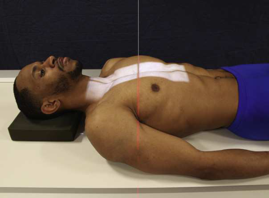
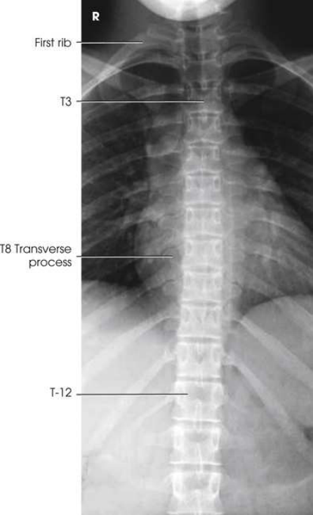
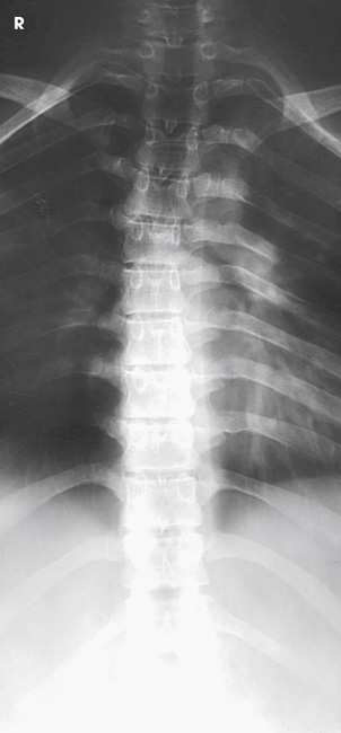
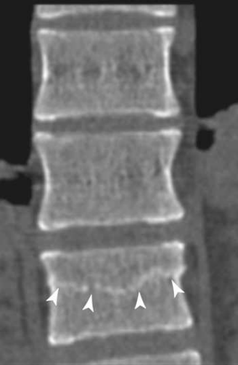

# Rx Coloană Toracală — Incidență Antero-Posterioară (AP) (Merrill)

  📷 Radiografie Convențională (Rx)
  <strong>Actualizat:</strong> 2026-09-16
  <strong>Autor:</strong> Referință Merrill

---

-   __1. Rezumat Clinic & Indicații__

    ---

    === "Indicații Clinice"

        - Conform reperelor anatomice standard din tratat

    === "Ghid Național IRIS"

        !!! info "Referință Primară: Ghidul Național IRIS (Ordinul MS 1342/2012)"
            - **Capitol Ghid IRIS:** *Ghidul Național IRIS*
            - **Grad de Recomandare:** **De verificat pe indicație; fără grad atribuit automat**
            - **Nivel de Iradiere Estimată:** `De verificat pentru examinarea și populația selectate`

            [:octicons-search-16: Deschide Ghidul IRIS](../../iris.md){ .md-button .md-button--primary } [:material-open-in-new: Aplicația Oficială PWA](https://radiologie-pediatrica.ro/iris/){ .md-button target="_blank" rel="noopener" }
-   __2. Poziționare & Centrare Fascicul__

    ---

    - **Poziție Pacient:** Se așază pacientul în decubit dorsal sau în ortostatism. Se poziționează brațele pacientului de-a lungul corpului și se ajustează umerii pentru a se afla în același plan orizontal. Dacă pacientul este în decubit dorsal, se lasă capul să se sprijine direct pe masa de examinare sau pe o pernă subțire, pentru a evita accentuarea cifozei toracale. Dacă este posibil, se orientează pacientul astfel încât toracele inferior să fie la capătul catodic al tubului de raze X. Această orientare profită de efectul de călcâi anodic pentru a asigura o expunere mai uniformă a anatomiei toracale. Dacă se utilizează ortostatismul, pacientul este instruit să șadă sau să stea cât mai drept posibil.; Se centrează MSP al corpului pe linia mediană a grilei. Pentru poziția în decubit dorsal, pentru reducerea cifozei, se flectează șoldurile și genunchii pacientului pentru a plasa coapsele în poziție verticală. Se imobilizează picioarele cu săculeți cu nisip (Fig. 9.68). Dacă membrele pacientului nu pot fi flectate, se susțin genunchii pentru a reduce solicitarea. Pentru ortostatism, pacientul este instruit să stea astfel încât greutatea sa să fie distribuită egal pe picioare, pentru a preveni rotația coloanei vertebrale. Dacă membrele inferioare ale pacientului au lungimi inegale, se plasează un suport de înălțime corespunzătoare sub piciorul părții mai scurte. Se plasează marginea superioară a receptorului de imagine la 1½ la 2 inches (3.8 la 5 cm) deasupra umerilor pacientului mediu. Aceasta poziționează receptorul de imagine astfel încât T7 să apară în apropierea centrului imaginii și să fie vizualizată întreaga coloană toracală. Se efectuează ecranarea gonadelor cu șorț plumbat.
    - **Punct de Centrare Fascicul:** perpendicular pe receptorul de imagine (RI). Centrul razei centrale trebuie să fie aproximativ la jumătatea distanței dintre incizura jugulară (furculița sternală) și apendicele xifoid (vezi Fig. 9.68). Se colimează strâns coloana vertebrală.
    - **Distanță Focar-Film (DFF / SID):** Nespecificat în fragmentul extras; de verificat în sursă
    - **Comandă Respiratorie:** Se menține apneea la sfârșitul expirului complet. Acest lucru minimizează aerul din plămâni, ceea ce are ca rezultat diferențe mai mici de atenuare și o expunere mai uniformă a anatomiei toracale.

-   __3. Parametri Tehnici Expunere__

    ---

    | Parametru Tehnic | Valoare Configurare Generator / Tub |
    |:-----------------|:-------------------------------------|
    | **Tensiune Tub (kV)** | DE CONFIGURAT PE APARAT |
    | **Sarcină / Produs Curent-Timp (mAs)** | DE CONFIGURAT PE APARAT |
    | **Distanță Focar-Film (DFF / SID)** | Nespecificat în fragmentul extras; de verificat în sursă |
    | **Grilă Antidifuzoare (Bucky)** | DE CONFIGURAT PE APARAT |
    | **Dimensiune Focar** | DE CONFIGURAT PE APARAT |
    | **Camere de Ionizare AEC** | DE CONFIGURAT PE APARAT |
    | **Colimare Fascicul** | Se ajustează câmpul de iradiere la formatul 18 × 43 cm pe colimator. Se plasează markerul de lateralitate (D/S) în câmpul de expunere colimat. |
    | **Filtrare Tub** | DE CONFIGURAT PE APARAT |

-   __4. Criterii de Calitate & Reușită Imagine__

    ---

    - Criterii radiologice de calitate a imaginii:
    - Evidențierea colimării corecte și prezența markerului de lateralitate (D/S), plasat fără a se suprapune peste anatomia de interes
    - toate cele 12 vertebre toracale
    - Absența rotației anatomice (simetrie bilaterală perfectă), evidențiată prin procesele spinoase situate pe linia mediană a corpurilor vertebrale
    - coloana vertebrală aliniată în centrul imaginii
    - Detalii trabeculare osoase și țesuturile moi înconjurătoare

-   __5. Protecție Radiologică (ALARA)__

    ---

    - Nespecificat în fragmentul extras; de verificat în sursă

!!! note "Observații Clinice & Tehnice"
    După cum a sugerat Fuchs, 16 se poate obține o expunere mai uniformă a coloanei toracale dacă se utilizează efectul de călcâi al tubului (Fig. 9.69 și 9.70). Cu tubul poziționat astfel încât anodul să fie orientat spre picioare, cel mai mare procent de radiație trece prin partea cea mai groasă a toracelui.

### 🖼️ Imagini

<figure class="protocol-image-card" markdown>

<figcaption><strong>Merrill — pagina 709, imaginea 1</strong> — Imagine din fragmentul sursă; asocierea necesită revizie.</figcaption>

</figure>

<figure class="protocol-image-card" markdown>

<figcaption><strong>Merrill — pagina 710, imaginea 2</strong> — Imagine din fragmentul sursă; asocierea necesită revizie.</figcaption>

</figure>

<figure class="protocol-image-card" markdown>

<figcaption><strong>Merrill — pagina 711, imaginea 3</strong> — Imagine din fragmentul sursă; asocierea necesită revizie.</figcaption>

</figure>

<figure class="protocol-image-card" markdown>

<figcaption><strong>Merrill — pagina 712, imaginea 4</strong> — Imagine din fragmentul sursă; asocierea necesită revizie.</figcaption>

</figure>

=== "Ghid Rapid de Execuție"

    1. **Identificarea și verificarea pacientului:** verificare identitate, zonă de examinat, consimțământ conform procedurii și evaluarea posibilității unei sarcini, când este relevantă.
    2. **Pregătire:** îndepărtarea oricăror obiecte radiopace (bijuterii, agrafe, fermoare, proteze, pansamente dense).
    3. **Poziționare precisă:** alinierea receptorului de imagine și a tubului la distanța prescrisă (Nespecificat în fragmentul extras; de verificat în sursă).
    4. **Colimare strictă:** adaptarea fasciculului strict la regiunea de diagnostic pentru scăderea iradierii și reducerea radiației difuze.
    5. **Radioprotecție:** verificarea [politicii RX](../radioprotectie.md), cu măsuri distincte pentru pacient, personal și însoțitor.

## Surse de documentare

- [Merrill’s Atlas, 9. Vertebral Column, pagini 708–712](https://books.google.com/books/about/Merrill_s_Atlas_of_Radiographic_Position.html?id=BM0lEQAAQBAJ)

## Fragmente sursă traduse (referință tehnică)

### anatomie

Corpurile vertebrale toracale, spațiile discale intervertebrale, procesele transverse, articulațiile costovertebrale și structurile înconjurătoare (vezi Fig. 9.69). Coloana vertebrală toracală poate fi dificil de evaluat prin radiografie la pacienții extrem de voluminoși și la cei cu torace plin cu lichid. CT este utilizat adesea pentru vizualizarea detaliată a vertebrelor (Fig. 9.71).

### colimare

• Se ajustează câmpul de iradiere la formatul 18 × 43 cm pe colimator. Se plasează markerul de lateralitate (D/S) în câmpul de expunere colimat.

### raza centrală

• perpendicular pe receptorul de imagine (RI). Centrul razei centrale trebuie să fie aproximativ la jumătatea distanței dintre incizura jugulară (furculița sternală) și procesul xifoid (vezi Fig. 9.68).
• Se colimează strâns coloana vertebrală.

### criterii

Criterii radiologice de calitate a imaginii:
• Dovada colimării corecte și prezența markerului de lateralitate (D/S), plasat clar în afara anatomiei de interes
• toate cele 12 vertebre toracale
• Absența rotației anatomice (simetrie bilaterală perfectă), evidențiată prin procesele spinoase situate pe linia mediană a corpurilor vertebrale
• coloana vertebrală aliniată în centrul imaginii
• Detalii osoase trabeculare și țesuturi moi înconjurătoare

### note

După cum a sugerat Fuchs, 16 se poate obține o expunere mai uniformă a coloanei toracale dacă se utilizează efectul de călcâi al tubului (Fig. 9.69 și 9.70). Cu tubul poziționat astfel încât anodul să fie orientat spre picioare, cel mai mare procent de radiație trece prin partea cea mai groasă a toracelui.

### part_pos

• Se centrează MSP al corpului pe linia mediană a grilei.
• Pentru decubit dorsal, pentru reducerea cifozei, se flectează șoldurile și genunchii pacientului pentru a plasa coapsele în poziție verticală. Se imobilizează picioarele cu săculeți cu nisip (Fig. 9.68).
• Dacă membrele pacientului nu pot fi flectate, se susțin genunchii pentru a reduce solicitarea.
• Pentru ortostatism, pacientul este instruit să stea astfel încât greutatea sa să fie distribuită egal pe picioare, pentru a preveni rotația coloanei vertebrale.
• Dacă membrele inferioare ale pacientului au lungimi inegale, se plasează un suport de înălțime corespunzătoare sub piciorul părții mai scurte.
• Se plasează marginea superioară a receptorului de imagine la 1½ la 2 inches (3.8 la 5 cm) deasupra umerilor pacientului mediu. Aceasta poziționează receptorul de imagine astfel încât T7 să apară în apropierea centrului imaginii și să fie vizualizată întreaga coloană toracală.
• Se efectuează ecranarea gonadelor cu șorț plumbat.

### patient_pos

• Se așază pacientul în decubit dorsal sau în ortostatism.
• Se poziționează brațele pacientului de-a lungul corpului și se ajustează umerii pentru a se afla în același plan orizontal.
• Dacă pacientul este în decubit dorsal, se lasă capul să se sprijine direct pe masa de examinare sau pe o pernă subțire, pentru a evita accentuarea cifozei toracale. Dacă este posibil, se orientează pacientul astfel încât toracele inferior să fie la capătul catodic al tubului de raze X. Această orientare profită de efectul de călcâi anodic pentru a asigura o expunere mai uniformă a anatomiei toracale.
• Dacă se utilizează ortostatismul, pacientul este instruit să șadă sau să stea cât mai drept posibil.

### respirație

Se menține apneea la sfârșitul expirului complet. Acest lucru minimizează aerul din plămâni, ceea ce are ca rezultat diferențe mai mici de atenuare și o expunere mai uniformă a anatomiei toracale.

### tehnică

Poziționat conform indicațiilor producătorului sau protocolului departamentului pentru orientarea corectă a afișării structurilor anatomice; raza centrală, placă: 14 × 17 țoli (35 ×
43 cm), longitudinal.

