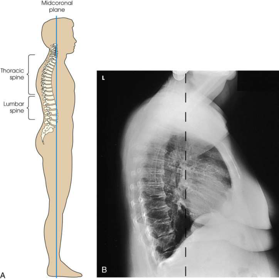
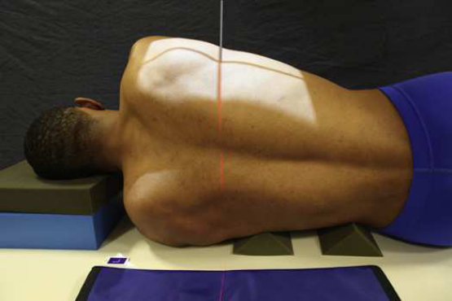
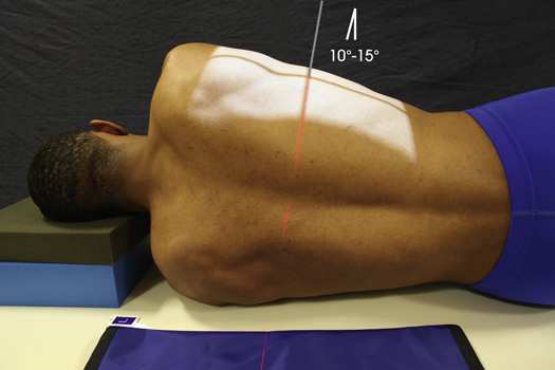
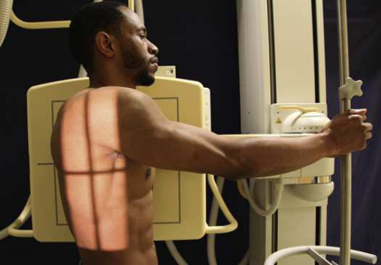
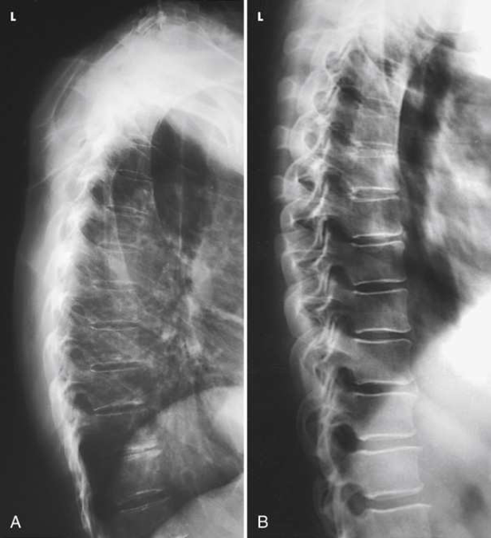

# Rx Coloană Toracală — Incidență de Profil (Lateral) — Profil (Drept sau Stâng) (Merrill)

  📷 Radiografie Convențională (Rx)
  <strong>Actualizat:</strong> 2026-09-16
  <strong>Autor:</strong> Referință Merrill

---

-   __1. Rezumat Clinic & Indicații__

    ---

    === "Indicații Clinice"

        - Conform reperelor anatomice standard din tratat

    === "Ghid Național IRIS"

        !!! info "Referință Primară: Ghidul Național IRIS (Ordinul MS 1342/2012)"
            - **Capitol Ghid IRIS:** *Ghidul Național IRIS*
            - **Grad de Recomandare:** **De verificat pe indicație; fără grad atribuit automat**
            - **Nivel de Iradiere Estimată:** `De verificat pentru examinarea și populația selectate`

            [:octicons-search-16: Deschide Ghidul IRIS](../../iris.md){ .md-button .md-button--primary } [:material-open-in-new: Aplicația Oficială PWA](https://radiologie-pediatrica.ro/iris/){ .md-button target="_blank" rel="noopener" }
-   __2. Poziționare & Centrare Fascicul__

    ---

    - **Poziție Pacient:** se așază pacientul în lateral Decubit poziție. (Note: Oppenheimer 17 also suСests use de ortostatism.) If possible, use stâng Incidență de Profil (lateral) la place cordul closer la receptorul de imagine, which minimizes superimposition de vertebre prin cordul. Se instruiește pacientul să dressed în open-backed gown astfel încât coloană vertebrală poate fie exposed pentru adjustment de poziție.; Place firm pillow under pacientul’s cap la keep axa longitudinală de coloană vertebrală orizontal. se flectează pacient’s hips și genunchi la comfortable poziție. Place superior edge de receptorul de imagine 1½ la 2 inches (3.8 la 5 cm) above relaxat umeri. se centrează posterior half de thorax la linia mediană grilă și la nivelul T7 (Fig. 9.72). T7 este la inferior angle de scapulae. cu pacientul’s genunchi exactly superimposed la prevent rotație de Bazin (bazin (pelvis)), small sponge sau cloth poate fie plasat între genunchi. se ajustează pacient’s brațe în unghi drept față de axa longitudinală de corp la elevate Coaste (Grilaj Costal) enough la clear intervertebral foramina. If axa longitudinală de coloană vertebrală este nu orizontal, elevate lower sau upper thoracic region cu radiolucent support (Fig. 9.73). This este preferred method. se efectuează ecranarea gonadelor cu șorț plumbat.
    - **Punct de Centrare Fascicul:** perpendicular pe centrul receptorului de imagine la nivelul T7 (inferior angles de scapulae). raza centrală enters posterior half de thorax. If coloană vertebrală este nu ridicat la plan orizontal when pacientul este în Decubit poziție, angle tubul la se orientează raza centrală centrală perpendicular pe axa longitudinală de thoracic column, și then center it la nivelul T7. average angle de 10 grade cranial este suficient în most female pacienți; average angle de 15 grade este satisfactory în most male pacienți because de their greater Umăr width (Fig. 9.74). Fig. 9.75 shows positioning de raza centrală pentru în ortostatism lateral Coloană Toracală.
    - **Distanță Focar-Film (DFF / SID):** Nespecificat în fragmentul extras; de verificat în sursă
    - **Comandă Respiratorie:** expunere poate fie made while pacientul continues la breathe normally, “Tehnică de estompare prin respirație superficială (respirație technique),” la blur pulmonary vascular markings și Coaste (Grilaj Costal) sau after respirație este suspended la end de expiration. When Tehnică de estompare prin respirație superficială (respirație technique) este used, pacientul trebuie să fie instructed nu la move during expunere. increased expunere time, preferably 2 la 3 seconds (cu corresponding decrease în mA), este needed la ensure pulmonary vasculature și Coaste (Grilaj Costal) will fie blurred.

-   __3. Parametri Tehnici Expunere__

    ---

    | Parametru Tehnic | Valoare Configurare Generator / Tub |
    |:-----------------|:-------------------------------------|
    | **Tensiune Tub (kV)** | DE CONFIGURAT PE APARAT |
    | **Sarcină / Produs Curent-Timp (mAs)** | DE CONFIGURAT PE APARAT |
    | **Distanță Focar-Film (DFF / SID)** | Nespecificat în fragmentul extras; de verificat în sursă |
    | **Grilă Antidifuzoare (Bucky)** | DE CONFIGURAT PE APARAT |
    | **Dimensiune Focar** | DE CONFIGURAT PE APARAT |
    | **Camere de Ionizare AEC** | DE CONFIGURAT PE APARAT |
    | **Colimare Fascicul** | se ajustează câmp de iradiere la 7 × 17 inches (18 × 43 cm) pe collimator. Place marker de lateralitate (D/S) în collimated expunere field. Improving radiographic quality în addition la colimare strânsă, quality de radiographic imagine poate fie improved în several ways. A 48-inch (112-cm) sau greater SID este recommended la reduce magnification inherent în this imagine, because OID de Coloană Toracală este significant în this incidență. în addition, if sheet de leaded rubber este plasat pe masa de examinare behind pacientul (see Figs. 9.73 și 9.74), lead absorbs scatter radiation coming de la pacient și prevents table scatter de la afecting imagine. Scatter radiation decreases quality de radiografie și darkens imagine de procese spinoase. More important, cu automatic expunere control (AEC), scatter radiation coming de la pacient este often suficient la terminate expunere prematurely. resulting imagine poate fie underexposed because de efect de scatter radiation pe AEC device. |
    | **Filtrare Tub** | DE CONFIGURAT PE APARAT |

-   __4. Criterii de Calitate & Reușită Imagine__

    ---

    - Criterii radiologice de calitate imaginii:
    - Evidence de corect collimation, posterior field shielding și presence de marker de lateralitate (D/S) plasat clear de anatomy de interest
    - vertebre clar vizibil(e) through rib și lung shadows
    - Twelve coloană toracală centrat pe receptorul de imagine. Superimposition de umerii pe upper vertebre poate cause underexposure în this area. number de vertebre visualized depends pe size și shape de pacientul. T1 la T3 sunt nu well seen.
    - Coaste (Grilaj Costal) superimposed posteriorly la indicate that pacientul was nu rotit
    - Open intervertebral disk spaces
    - Bony detalii trabeculare osoase și surrounding soft tissues

-   __5. Protecție Radiologică (ALARA)__

    ---

    - Nespecificat în fragmentul extras; de verificat în sursă

!!! note "Observații Clinice & Tehnice"
    Conform reperelor anatomice standard din tratat

### 🖼️ Imagini

<figure class="protocol-image-card" markdown>

<figcaption><strong>Merrill — pagina PDF 713, imaginea 1</strong> — Imagine din fragmentul sursă; asocierea necesită revizie.</figcaption>

</figure>

<figure class="protocol-image-card" markdown>

<figcaption><strong>Merrill — pagina PDF 714, imaginea 2</strong> — Imagine din fragmentul sursă; asocierea necesită revizie.</figcaption>

</figure>

<figure class="protocol-image-card" markdown>

<figcaption><strong>Merrill — pagina PDF 714, imaginea 3</strong> — Imagine din fragmentul sursă; asocierea necesită revizie.</figcaption>

</figure>

<figure class="protocol-image-card" markdown>

<figcaption><strong>Merrill — pagina PDF 715, imaginea 4</strong> — Imagine din fragmentul sursă; asocierea necesită revizie.</figcaption>

</figure>

<figure class="protocol-image-card" markdown>

<figcaption><strong>Merrill — pagina PDF 716, imaginea 5</strong> — Imagine din fragmentul sursă; asocierea necesită revizie.</figcaption>

</figure>

=== "Ghid Rapid de Execuție"

    1. **Identificarea și verificarea pacientului:** verificare identitate, zonă de examinat, consimțământ conform procedurii și evaluarea posibilității unei sarcini, când este relevantă.
    2. **Pregătire:** îndepărtarea oricăror obiecte radiopace (bijuterii, agrafe, fermoare, proteze, pansamente dense).
    3. **Poziționare precisă:** alinierea receptorului de imagine și a tubului la distanța prescrisă (Nespecificat în fragmentul extras; de verificat în sursă).
    4. **Colimare strictă:** adaptarea fasciculului strict la regiunea de diagnostic pentru scăderea iradierii și reducerea radiației difuze.
    5. **Radioprotecție:** verificarea [politicii RX](../radioprotectie.md), cu măsuri distincte pentru pacient, personal și însoțitor.

## Surse de documentare

- [Merrill’s Atlas, 9. Vertebral Column, pagini PDF 712–716](../../assets/protocols/sources/a56d45c16829_Merrills_Atlas_of_Radiographic_Positioning__Procedures_3Vol_Set.pdf#page=712)

## Fragmente sursă traduse (referință tehnică)

### anatomy

thoracic corpuri, intervertebral disk spaces, intervertebral foramina, și lower procese spinoase. Because de overlapping umeri, upper vertebre poate nu fie vizualizat în this poziție (Figs. 9.76 și 9.77). If upper thoracic area este de interest, swimmer’s lateral poate fie
included cu examination. younger pacientul, easier it este la show upper thoracic corpuri.

### collimation

• se ajustează câmp de iradiere la 7 × 17 inches (18 × 43 cm) pe collimator. Place marker de lateralitate (D/S) în collimated expunere field.
Improving radiographic quality
în addition la colimare strânsă, quality de radiographic imagine poate fie improved în several ways. A 48-inch (112-cm) sau greater SID este
recommended la reduce magnification inherent în this imagine, because OID de thoracic coloană vertebrală este significant în this incidență. în addition,
if sheet de leaded rubber este plasat pe masa de examinare behind pacientul (see Figs. 9.73 și 9.74), lead absorbs scatter radiation coming de la
pacientul și prevents table scatter de la afecting imagine. Scatter radiation decreases quality de radiografie și darkens imagine de
procese spinoase. More important, cu automatic expunere control (AEC), scatter radiation coming de la pacient este often suficient
la terminate expunere prematurely. resulting imagine poate fie underexposed because de efect de scatter radiation pe AEC device.

### cr

• perpendicular pe centrul receptorului de imagine la nivelul T7 (inferior angles de scapulae). raza centrală enters posterior half de thorax.
• If coloană vertebrală este nu ridicat la plan orizontal when pacientul este în recumbent poziție, angle tubul la direct raza centrală perpendicular pe axa longitudinală de thoracic column, și then center it la nivelul T7. average angle de 10 grade
cranial este suficient în most female pacienți; average angle de 15 grade este satisfactory în most male pacienți because de their
greater umăr width (Fig. 9.74). Fig. 9.75 shows positioning de raza centrală pentru în ortostatism lateral thoracic coloană vertebrală.

### criteria

Criterii radiologice de calitate imaginii:
• Evidence de corect collimation, posterior field shielding și presence de marker de lateralitate (D/S) plasat clear de anatomy de interest
• vertebre clar vizibil(e) through rib și lung shadows
• Twelve coloană toracală centrat pe receptorul de imagine. Superimposition de umerii pe upper vertebre poate cause underexposure în
this area. number de vertebre visualized depends pe size și shape de pacientul. T1 la T3 sunt nu well seen.
• coaste superimposed posteriorly la indicate that pacientul was nu rotit
• Open intervertebral disk spaces
• Bony detalii trabeculare osoase și surrounding soft tissues

### part_pos

• Place firm pillow under pacientul’s cap la keep axa longitudinală de coloană vertebrală orizontal.
• se flectează pacient’s hips și genunchi la comfortable poziție.
• Place superior edge de receptorul de imagine 1½ la 2 inches (3.8 la 5 cm) above relaxat umeri. se centrează posterior half de thorax la linia mediană grilă și la nivelul T7 (Fig. 9.72). T7 este la inferior angle de scapulae.
• cu pacientul’s genunchi exactly superimposed la prevent rotație de bazinul, small sponge sau cloth poate fie plasat între
genunchi.
• se ajustează pacient’s brațe în unghi drept față de axa longitudinală de corp la elevate coaste enough la clear intervertebral foramina.
• If axa longitudinală de coloană vertebrală este nu orizontal, elevate lower sau upper thoracic region cu radiolucent support (Fig.
9.73). This este preferred method.
• se efectuează ecranarea gonadelor cu șorț plumbat.

### patient_pos

• se așază pacientul în lateral recumbent poziție. (Note: Oppenheimer 17 also suСests use de ortostatism.)
• If possible, use stâng poziție de profil (lateral) la place cordul closer la receptorul de imagine, which minimizes superimposition de vertebre prin heart.
• Se instruiește pacientul să dressed în open-backed gown astfel încât coloană vertebrală poate fie exposed pentru adjustment de poziție.

### respiration

expunere poate fie made while pacientul continues la breathe normally, “Tehnică de estompare prin respirație superficială (respirație technique),” la blur pulmonary vascular markings și coaste sau after respirație este suspended la end de expiration.
• When Tehnică de estompare prin respirație superficială (respirație technique) este used, pacientul trebuie să fie instructed nu la move during expunere. increased expunere time,
preferably 2 la 3 seconds (cu corresponding decrease în mA), este needed la ensure pulmonary vasculature și coaste will fie
blurred.

### tech

poziționat prin manufacturer sau department protocol pentru corect anatomy display orientation; raza centrală plate: 14 × 17 inches (35 ×
43 cm) longitudinal.

