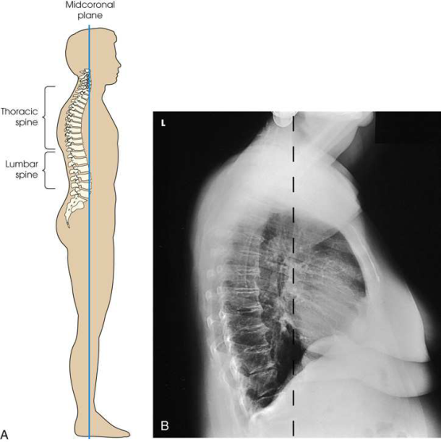
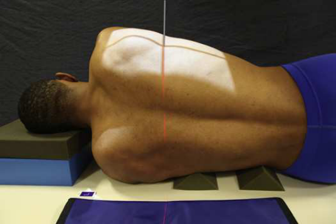
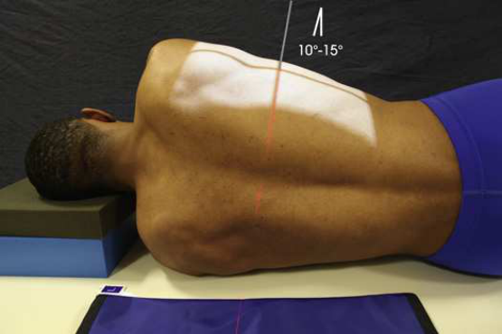
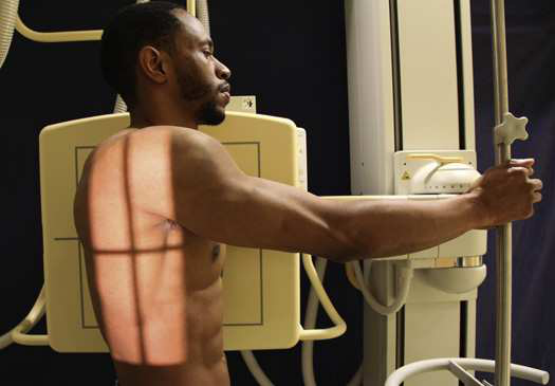
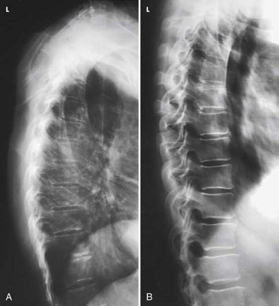

# Rx Coloană Toracală — Incidență de Profil (Lateral) — Profil (Drept sau Stâng) (Merrill)

  📷 Radiografie Convențională (Rx)
  <strong>Actualizat:</strong> 2026-09-16
  <strong>Autor:</strong> Referință Merrill

---

-   __1. Rezumat Clinic & Indicații__

    ---

    === "Indicații Clinice"

        - Conform reperelor anatomice standard din tratat

    === "Ghid Național IRIS"

        !!! info "Referință Primară: Ghidul Național IRIS (Ordinul MS 1342/2012)"
            - **Capitol Ghid IRIS:** *Coloană vertebrală*
            - **Grad de Recomandare:** **Grad A**
            - **Nivel de Iradiere Estimată:** `Clasa 2 (Foarte mică ~ 0.7 - 1.0 mSv)`

            [:octicons-search-16: Deschide Ghidul IRIS](../../iris.md){ .md-button .md-button--primary } [:material-open-in-new: Aplicația Oficială PWA](https://radiologie-pediatrica.ro/iris/){ .md-button target="_blank" rel="noopener" }

-   __2. Poziționare & Centrare Fascicul__

    ---

    - **Poziție Pacient:** Se așază pacientul în decubit lateral. (Notă: Oppenheimer 17 sugerează, de asemenea, utilizarea ortostatismului.) Dacă este posibil, se utilizează incidența de profil (laterală) stângă pentru a plasa cordul mai aproape de receptorul de imagine, ceea ce minimizează suprapunerea vertebrelor prin cord. Se instruiește pacientul să îmbrace un halat cu deschidere posterior, astfel încât coloana vertebrală să poată fi expusă pentru ajustarea poziției. Se plasează o pernă fermă sub capul pacientului pentru a menține axa longitudinală a coloanei vertebrale orizontală. Se flectează șoldurile și genunchii pacientului într-o poziție confortabilă. Se plasează marginea superioară a receptorului de imagine la 1½–2 țoli (3.8–5 cm) deasupra umerilor relaxați. Se centrează jumătatea posterioară a toracelui pe linia mediană a grilei și la nivelul T7 (Fig. 9.72). T7 se află la nivelul unghiurilor inferioare ale scapulelor. Cu genunchii pacientului exact suprapuși pentru a preveni rotația bazinului, se poate plasa un burete mic sau o bucată de material între genunchi. Se ajustează brațele pacientului în unghi drept față de axa longitudinală a corpului pentru a ridica coastele suficient ca să elibereze foramenele intervertebrale. Dacă axa longitudinală a coloanei vertebrale nu este orizontală, se ridică regiunea toracică inferioară sau superioară cu un suport radiotransparent (Fig. 9.73). Aceasta este metoda preferată. Se efectuează ecranarea gonadelor cu șorț plumbat.
    - **Punct de Centrare Fascicul:** perpendicular pe centrul receptorului de imagine la nivelul T7 (unghiurile inferioare ale scapulelor). Raza centrală pătrunde în jumătatea posterioară a toracelui. Dacă coloana vertebrală nu este ridicată la planul orizontal când pacientul se află în decubit, se angulează tubul astfel încât raza centrală să fie perpendiculară pe axa longitudinală a coloanei toracale, apoi se centrează la nivelul T7. O angulație cranială medie de 10 grade este suficientă la majoritatea pacientelor; o angulație medie de 15 grade este satisfăcătoare la majoritatea pacienților, din cauza lățimii mai mari a umerilor lor (Fig. 9.74). Fig. 9.75 prezintă poziționarea razei centrale pentru coloana toracală în ortostatism lateral.
    - **Distanță Focar-Film (DFF / SID):** Nespecificat în fragmentul extras; de verificat în sursă
    - **Comandă Respiratorie:** Expunerea poate fi efectuată în timp ce pacientul continuă să respire normal, folosind „Tehnica de estompare prin respirație superficială (tehnica respirației)”, pentru a estompa desenul vascular pulmonar și coastele (grilajul costal), sau după menținerea apneei la sfârșitul expirului. Când se utilizează Tehnica de estompare prin respirație superficială (tehnica respirației), pacientul trebuie instruit să nu se miște în timpul expunerii. Este necesar un timp de expunere mai lung, preferabil de 2 la 3 secunde (cu scăderea corespunzătoare a mA), pentru a asigura estomparea vasculaturii pulmonare și a coastelor (grilajului costal).

-   __3. Parametri Tehnici Expunere__

    ---

    | Parametru Tehnic | Valoare Configurare Generator / Tub |
    |:-----------------|:-------------------------------------|
    | **Tensiune Tub (kV)** | DE CONFIGURAT PE APARAT |
    | **Sarcină / Produs Curent-Timp (mAs)** | DE CONFIGURAT PE APARAT |
    | **Distanță Focar-Film (DFF / SID)** | Nespecificat în fragmentul extras; de verificat în sursă |
    | **Grilă Antidifuzoare (Bucky)** | DE CONFIGURAT PE APARAT |
    | **Dimensiune Focar** | DE CONFIGURAT PE APARAT |
    | **Camere de Ionizare AEC** | DE CONFIGURAT PE APARAT |
    | **Colimare Fascicul** | Se ajustează câmpul de iradiere la 7 × 17 țoli (18 × 43 cm) pe colimator. Se plasează markerul de lateralitate (D/S) în câmpul de expunere colimat. Îmbunătățirea calității radiografice: pe lângă colimarea strânsă, calitatea imaginii radiografice poate fi îmbunătățită în mai multe moduri. Se recomandă un SID de 48 țoli (112 cm) sau mai mare pentru a reduce mărirea inerentă acestei imagini, deoarece OID-ul coloanei toracale este semnificativ în această incidență. În plus, dacă pe masa de examinare, în spatele pacientului, este plasată o folie de cauciuc plumbat (vezi Fig. 9.73 și 9.74), plumbul absoarbe radiația difuzată provenită de la pacient și împiedică radiația difuzată de masă să afecteze imaginea. Radiația difuzată reduce calitatea radiografiei și întunecă imaginea proceselor spinoase. Mai important, în cazul controlului automat al expunerii (AEC), radiația difuzată provenită de la pacient este adesea suficientă pentru a termina prematur expunerea. Imaginea rezultată poate fi subexpusă din cauza efectului radiației difuzate asupra dispozitivului AEC. |
    | **Filtrare Tub** | DE CONFIGURAT PE APARAT |

-   __4. Criterii de Calitate & Reușită Imagine__

    ---

    - Criterii radiologice de calitate a imaginii:
    - Dovada colimării corecte, ecranarea posterioară a câmpului și prezența markerului de lateralitate (D/S), plasat clar în afara anatomiei de interes
    - Vertebre clar vizibile prin umbrele coastelor și plămânilor
    - Cele douăsprezece vertebre toracale sunt centrate pe receptorul de imagine. Suprapunerea umerilor peste vertebrele superioare poate cauza subexpunerea acestei zone. Numărul vertebrelor vizualizate depinde de dimensiunile și conformația pacientului. T1 până la T3 nu se văd bine.
    - Coastele suprapuse posterior indică faptul că pacientul nu a fost rotit
    - Spații discale intervertebrale deschise
    - Detalii trabeculare osoase și țesuturile moi înconjurătoare

-   __5. Protecție Radiologică (ALARA)__

    ---

    - Nespecificat în fragmentul extras; de verificat în sursă

!!! note "Observații Clinice & Tehnice"
    Conform reperelor anatomice standard din tratat

### 🖼️ Imagini

<figure class="protocol-image-card" markdown>

<figcaption><strong>Merrill — pagina 713, imaginea 1</strong> — Imagine din fragmentul sursă; asocierea necesită revizie.</figcaption>

</figure>

<figure class="protocol-image-card" markdown>

<figcaption><strong>Merrill — pagina 714, imaginea 2</strong> — Imagine din fragmentul sursă; asocierea necesită revizie.</figcaption>

</figure>

<figure class="protocol-image-card" markdown>

<figcaption><strong>Merrill — pagina 714, imaginea 3</strong> — Imagine din fragmentul sursă; asocierea necesită revizie.</figcaption>

</figure>

<figure class="protocol-image-card" markdown>

<figcaption><strong>Merrill — pagina 715, imaginea 4</strong> — Imagine din fragmentul sursă; asocierea necesită revizie.</figcaption>

</figure>

<figure class="protocol-image-card" markdown>

<figcaption><strong>Merrill — pagina 716, imaginea 5</strong> — Imagine din fragmentul sursă; asocierea necesită revizie.</figcaption>

</figure>

=== "Ghid Rapid de Execuție"

    1. **Identificarea și verificarea pacientului:** verificare identitate, zonă de examinat, consimțământ conform procedurii și evaluarea posibilității unei sarcini, când este relevantă.
    2. **Pregătire:** îndepărtarea oricăror obiecte radiopace (bijuterii, agrafe, fermoare, proteze, pansamente dense).
    3. **Poziționare precisă:** alinierea receptorului de imagine și a tubului la distanța prescrisă (Nespecificat în fragmentul extras; de verificat în sursă).
    4. **Colimare strictă:** adaptarea fasciculului strict la regiunea de diagnostic pentru scăderea iradierii și reducerea radiației difuze.
    5. **Radioprotecție:** verificarea [politicii RX](../radioprotectie.md), cu măsuri distincte pentru pacient, personal și însoțitor.

## Surse de documentare

- [Merrill’s Atlas, 9. Vertebral Column, pagini 712–716](https://books.google.com/books/about/Merrill_s_Atlas_of_Radiographic_Position.html?id=BM0lEQAAQBAJ)
