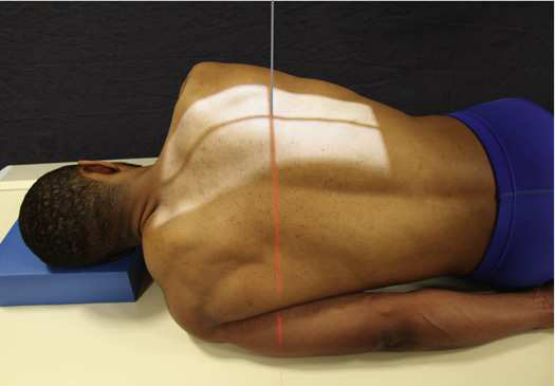
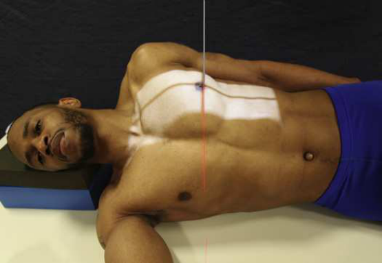
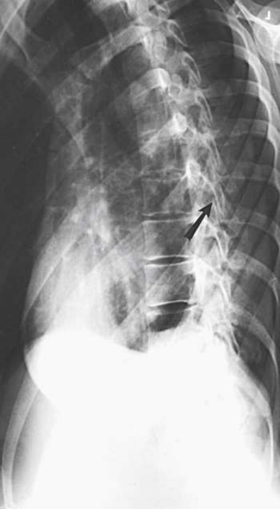

# Rx Thoracic Zygapophyseal Joints — Decubit Poziționare (Merrill)

  📷 Radiografie Convențională (Rx)
  <strong>Actualizat:</strong> 2026-09-16
  <strong>Autor:</strong> Referință Merrill

---

-   __1. Rezumat Clinic & Indicații__

    ---

    === "Indicații Clinice"

        - Conform reperelor anatomice standard din tratat

    === "Ghid Național IRIS"

        !!! info "Referință Primară: Ghidul Național IRIS (Ordinul MS 1342/2012)"
            - **Capitol Ghid IRIS:** *Ghidul Național IRIS*
            - **Grad de Recomandare:** **De verificat pe indicație; fără grad atribuit automat**
            - **Nivel de Iradiere Estimată:** `De verificat pentru examinarea și populația selectate`

            [:octicons-search-16: Deschide Ghidul IRIS](../../iris.md){ .md-button .md-button--primary } [:material-open-in-new: Aplicația Oficială PWA](https://radiologie-pediatrica.ro/iris/){ .md-button target="_blank" rel="noopener" }
-   __2. Poziționare & Centrare Fascicul__

    ---

    - **Poziție Pacient:** se așază pacientul în lateral Decubit poziție. Elevate capul pe firm pillow so that its MSP este continuous cu that de coloană vertebrală. se flectează pacient’s hips și genunchi la comfortable poziție.; pentru PA oblic, place lower braț behind back și upper braț forward cu Mână pe masa de examinare pentru support (Fig. 9.79). pentru AP oblic, se ajustează lower braț în unghi drept față de axa longitudinală de corp, se flectează Cot, și place Mână under sau beside capul. Place upper braț posteriorly și support it (Fig. 9.80). se rotește corp slightly, either anteriorly sau posteriorly 20 grade, astfel încât plan coronal forms angle de 70 grade cu orizontal. se centrează coloană vertebrală la linia mediană grilă. se centrează receptorul de imagine 1½ la 2 inches (3.8 la 5 cm) above umerii la center it la nivelul T7. If needed, apply compression band across șoldurile, but fie careful nu la change poziție. se efectuează ecranarea gonadelor cu șorț plumbat.
    - **Punct de Centrare Fascicul:** perpendicular pe receptorul de imagine (RI) exiting sau entering level de T7
    - **Distanță Focar-Film (DFF / SID):** Nespecificat în fragmentul extras; de verificat în sursă
    - **Comandă Respiratorie:** Apnee la sfârșitul expirului complet.

-   __3. Parametri Tehnici Expunere__

    ---

    | Parametru Tehnic | Valoare Configurare Generator / Tub |
    |:-----------------|:-------------------------------------|
    | **Tensiune Tub (kV)** | DE CONFIGURAT PE APARAT |
    | **Sarcină / Produs Curent-Timp (mAs)** | DE CONFIGURAT PE APARAT |
    | **Distanță Focar-Film (DFF / SID)** | Nespecificat în fragmentul extras; de verificat în sursă |
    | **Grilă Antidifuzoare (Bucky)** | DE CONFIGURAT PE APARAT |
    | **Dimensiune Focar** | DE CONFIGURAT PE APARAT |
    | **Camere de Ionizare AEC** | DE CONFIGURAT PE APARAT |
    | **Colimare Fascicul** | Se ajustează câmpul de iradiere la formatul 18 × 43 cm pe colimator. Place marker de lateralitate (D/S) în collimated expunere field. |
    | **Filtrare Tub** | DE CONFIGURAT PE APARAT |

-   __4. Criterii de Calitate & Reușită Imagine__

    ---

    - Criterii radiologice de calitate imaginii:
    - Evidence de corect collimation și presence de marker de lateralitate (D/S) plasat clear de anatomy de interest
    - toate 12 coloană toracală
    - Zygapophyseal articulații cel mai apropiat de receptorul de imagine pe PA obliques și articulații farthest de la receptorul de imagine pe AP obliques
    - Bony detalii trabeculare osoase și surrounding soft tissues

-   __5. Protecție Radiologică (ALARA)__

    ---

    - Nespecificat în fragmentul extras; de verificat în sursă

!!! note "Observații Clinice & Tehnice"
    AP Incidență Oblică shows cervicothoracic procese spinoase well și este used pentru this purpose when pacientul cannot fie satisfactorily poziționat pentru direct Incidență de Profil (lateral).

### 🖼️ Imagini

<figure class="protocol-image-card" markdown>

<figcaption><strong>Merrill — pagina PDF 719, imaginea 1</strong> — Imagine din fragmentul sursă; asocierea necesită revizie.</figcaption>

</figure>

<figure class="protocol-image-card" markdown>

<figcaption><strong>Merrill — pagina PDF 720, imaginea 2</strong> — Imagine din fragmentul sursă; asocierea necesită revizie.</figcaption>

</figure>

<figure class="protocol-image-card" markdown>

<figcaption><strong>Merrill — pagina PDF 721, imaginea 3</strong> — Imagine din fragmentul sursă; asocierea necesită revizie.</figcaption>

</figure>

=== "Ghid Rapid de Execuție"

    1. **Identificarea și verificarea pacientului:** verificare identitate, zonă de examinat, consimțământ conform procedurii și evaluarea posibilității unei sarcini, când este relevantă.
    2. **Pregătire:** îndepărtarea oricăror obiecte radiopace (bijuterii, agrafe, fermoare, proteze, pansamente dense).
    3. **Poziționare precisă:** alinierea receptorului de imagine și a tubului la distanța prescrisă (Nespecificat în fragmentul extras; de verificat în sursă).
    4. **Colimare strictă:** adaptarea fasciculului strict la regiunea de diagnostic pentru scăderea iradierii și reducerea radiației difuze.
    5. **Radioprotecție:** verificarea [politicii RX](../radioprotectie.md), cu măsuri distincte pentru pacient, personal și însoțitor.

## Surse de documentare

- [Merrill’s Atlas, 9. Vertebral Column, pagini PDF 718–721](../../assets/protocols/sources/a56d45c16829_Merrills_Atlas_of_Radiographic_Positioning__Procedures_3Vol_Set.pdf#page=718)

## Fragmente sursă traduse (referință tehnică)

### anatomy

thoracic zygapophyseal articulații (arrows pe Figs. 9.81 și 9.82). number de articulații vizualizat depends pe thoracic curve. greater grade de
rotație de la poziție de profil (lateral) este required la show articulații la proximal și distal ends de region în pacienți cu accentuated
dorsal kyphosis. inferior articular processes de T12, having inclination de about 45 grade, sunt nu vizualizat în this incidență. (See Summary de oblic incidențe pe p. 440.)

### collimation

• Se ajustează câmpul de iradiere la formatul 18 × 43 cm pe colimator. Place marker de lateralitate (D/S) în collimated expunere field.

### cr

• perpendicular pe receptorul de imagine (RI) exiting sau entering level de T7

### criteria

Criterii radiologice de calitate imaginii:
• Evidence de corect collimation și presence de marker de lateralitate (D/S) plasat clear de anatomy de interest
• toate 12 coloană toracală
• Zygapophyseal articulații cel mai apropiat de receptorul de imagine pe PA obliques și articulații farthest de la receptorul de imagine pe AP obliques
• Bony detalii trabeculare osoase și surrounding soft tissues

### notes

AP oblic incidență shows cervicothoracic procese spinoase well și este used pentru this purpose when pacientul cannot fie
satisfactorily poziționat pentru direct lateral incidență.

### part_pos

• pentru PA oblic, place lower braț behind back și upper braț forward cu mână pe masa de examinare pentru support (Fig. 9.79).
• pentru AP oblic, se ajustează lower braț în unghi drept față de axa longitudinală de corp, se flectează cot, și place mână under sau beside
capul. Place upper braț posteriorly și support it (Fig. 9.80).
• se rotește corp slightly, either anteriorly sau posteriorly 20 grade, astfel încât plan coronal forms angle de 70 grade cu orizontal.
• se centrează coloană vertebrală la linia mediană grilă.
• se centrează receptorul de imagine 1½ la 2 inches (3.8 la 5 cm) above umerii la center it la nivelul T7.
• If needed, apply compression band across șoldurile, but fie careful nu la change poziție.
• se efectuează ecranarea gonadelor cu șorț plumbat.

### patient_pos

• se așază pacientul în lateral recumbent poziție.
• Elevate capul pe firm pillow so that its MSP este continuous cu that de coloană vertebrală.
• se flectează pacient’s hips și genunchi la comfortable poziție.

### respiration

Apnee la sfârșitul expirului complet.

### tech

poziționat prin manufacturer sau department protocol pentru corect anatomy display orientation; raza centrală plate: 14 × 17 inches (35 ×
43 cm) longitudinal.

