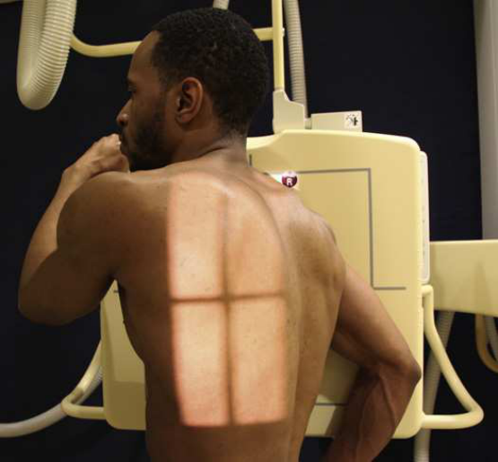

# Rx Thoracic Zygapophyseal Joints — UpProfil Drept (Merrill)

  📷 Radiografie Convențională (Rx)
  <strong>Actualizat:</strong> 2026-09-16
  <strong>Autor:</strong> Referință Merrill

---

-   __1. Rezumat Clinic & Indicații__

    ---

    === "Indicații Clinice"

        - Conform reperelor anatomice standard din tratat

    === "Ghid Național IRIS"

        !!! info "Referință Primară: Ghidul Național IRIS (Ordinul MS 1342/2012)"
            - **Capitol Ghid IRIS:** *Ghidul Național IRIS*
            - **Grad de Recomandare:** **De verificat pe indicație; fără grad atribuit automat**
            - **Nivel de Iradiere Estimată:** `De verificat pentru examinarea și populația selectate`

            [:octicons-search-16: Deschide Ghidul IRIS](../../iris.md){ .md-button .md-button--primary } [:material-open-in-new: Aplicația Oficială PWA](https://radiologie-pediatrica.ro/iris/){ .md-button target="_blank" rel="noopener" }
-   __2. Poziționare & Centrare Fascicul__

    ---

    - **Poziție Pacient:** se poziționează pacientul, în ortostatism sau așezat în ortostatism, în Incidență de Profil (lateral) before vertical grilă.; se rotește corp 20 grade anterior (PA oblic) sau posterior (AP oblic) astfel încât plan coronal forms angle de 70 grade de la plane de receptorul de imagine. se centrează pacient’s coloană vertebrală la linia mediană grilă, și Se instruiește pacientul să rest adjacent Umăr firmly against it pentru support. se ajustează height de receptorul de imagine 1½ la 2 inches (3.8 la 5 cm) above umerii la se centrează receptorul de imagine la T7. pentru PA oblic, se flectează Cot de braț adjacent la grila și rest Mână pe Șold. pentru AP oblic, braț adjacent la grila este brought forward la avoid superimposing Humerus pe upper coloană toracală. pentru PA oblic, Se instruiește pacientul să grasp side de grila device cu outer Mână (Fig. 9.78). pentru AP oblic, Se instruiește pacientul să place outer Mână pe Șold. se ajustează pacient’s umeri la lie în same plan orizontal. Se instruiește pacientul să stand straight la place axa longitudinală de coloană vertebrală paralel cu receptorul de imagine. weight de pacientul’s corp trebuie să fie equally distributed pe picioarele, și capul trebuie să nu fie turned laterally. se efectuează ecranarea gonadelor cu șorț plumbat.
    - **Punct de Centrare Fascicul:** Conform reperelor anatomice standard din tratat
    - **Distanță Focar-Film (DFF / SID):** Nespecificat în fragmentul extras; de verificat în sursă
    - **Comandă Respiratorie:** Apnee la sfârșitul expirului complet.

-   __3. Parametri Tehnici Expunere__

    ---

    | Parametru Tehnic | Valoare Configurare Generator / Tub |
    |:-----------------|:-------------------------------------|
    | **Tensiune Tub (kV)** | DE CONFIGURAT PE APARAT |
    | **Sarcină / Produs Curent-Timp (mAs)** | DE CONFIGURAT PE APARAT |
    | **Distanță Focar-Film (DFF / SID)** | Nespecificat în fragmentul extras; de verificat în sursă |
    | **Grilă Antidifuzoare (Bucky)** | DE CONFIGURAT PE APARAT |
    | **Dimensiune Focar** | DE CONFIGURAT PE APARAT |
    | **Camere de Ionizare AEC** | DE CONFIGURAT PE APARAT |
    | **Colimare Fascicul** | Conform reperelor anatomice standard din tratat |
    | **Filtrare Tub** | DE CONFIGURAT PE APARAT |

-   __4. Criterii de Calitate & Reușită Imagine__

    ---

    - Conform reperelor anatomice standard din tratat

-   __5. Protecție Radiologică (ALARA)__

    ---

    - Nespecificat în fragmentul extras; de verificat în sursă

!!! note "Observații Clinice & Tehnice"
    See p. 440 pentru Summary de oblic incidențe.

### 🖼️ Imagini

<figure class="protocol-image-card" markdown>

<figcaption><strong>Merrill — pagina PDF 718, imaginea 1</strong> — Imagine din fragmentul sursă; asocierea necesită revizie.</figcaption>

</figure>

=== "Ghid Rapid de Execuție"

    1. **Identificarea și verificarea pacientului:** verificare identitate, zonă de examinat, consimțământ conform procedurii și evaluarea posibilității unei sarcini, când este relevantă.
    2. **Pregătire:** îndepărtarea oricăror obiecte radiopace (bijuterii, agrafe, fermoare, proteze, pansamente dense).
    3. **Poziționare precisă:** alinierea receptorului de imagine și a tubului la distanța prescrisă (Nespecificat în fragmentul extras; de verificat în sursă).
    4. **Colimare strictă:** adaptarea fasciculului strict la regiunea de diagnostic pentru scăderea iradierii și reducerea radiației difuze.
    5. **Radioprotecție:** verificarea [politicii RX](../radioprotectie.md), cu măsuri distincte pentru pacient, personal și însoțitor.

## Surse de documentare

- [Merrill’s Atlas, 9. Vertebral Column, pagini PDF 717–718](../../assets/protocols/sources/a56d45c16829_Merrills_Atlas_of_Radiographic_Positioning__Procedures_3Vol_Set.pdf#page=717)

## Fragmente sursă traduse (referință tehnică)

### notes

See p. 440 pentru Summary de oblic incidențe.

### part_pos

• se rotește corp 20 grade anterior (PA oblic) sau posterior (AP oblic) astfel încât plan coronal forms angle de 70 grade de la
plane de receptorul de imagine.
• se centrează pacient’s coloană vertebrală la linia mediană grilă, și Se instruiește pacientul să rest adjacent umăr firmly against it pentru
support.
• se ajustează height de receptorul de imagine 1½ la 2 inches (3.8 la 5 cm) above umerii la se centrează receptorul de imagine la T7.
• pentru PA oblic, se flectează cot de braț adjacent la grila și rest mână pe hip. pentru AP oblic, braț adjacent la
grila este brought forward la avoid superimposing humerus pe upper coloană toracală.
• pentru PA oblic, Se instruiește pacientul să grasp side de grila device cu outer mână (Fig. 9.78). pentru AP oblic, have pacient place outer mână pe hip.
• se ajustează pacient’s umeri la lie în same plan orizontal.
• Se instruiește pacientul să stand straight la place axa longitudinală de coloană vertebrală paralel cu receptorul de imagine.
• weight de pacientul’s corp trebuie să fie equally distributed pe picioarele, și capul trebuie să nu fie turned laterally.
• se efectuează ecranarea gonadelor cu șorț plumbat.

### patient_pos

• se poziționează pacientul, în ortostatism sau așezat în ortostatism, în poziție de profil (lateral) before vertical grilă.

### respiration

Apnee la sfârșitul expirului complet.

### tech

poziționat prin manufacturer sau department protocol pentru corect anatomy display orientation; raza centrală plate: 14 × 17 inches (35 ×
43 cm) longitudinal.

