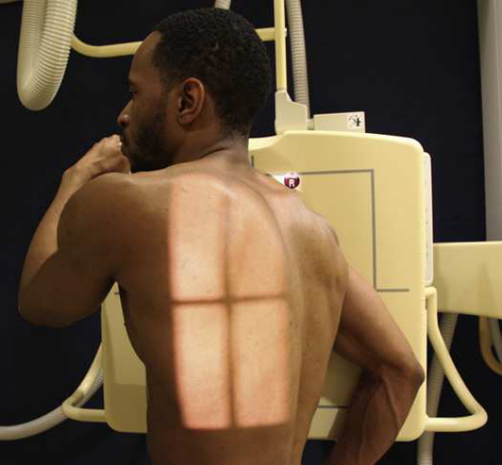

# Rx articulațiile zigapofizare toracale — incidență de profil dreaptă (Merrill)

  📷 Radiografie Convențională (Rx)
  <strong>Actualizat:</strong> 2026-09-16
  <strong>Autor:</strong> Referință Merrill

---

-   __1. Rezumat Clinic & Indicații__

    ---

    === "Indicații Clinice"

        - Conform reperelor anatomice standard din tratat

    === "Ghid Național IRIS"

        !!! info "Referință Primară: Ghidul Național IRIS (Ordinul MS 1342/2012)"
            - **Capitol Ghid IRIS:** *Ghidul Național IRIS*
            - **Grad de Recomandare:** **De verificat pe indicație; fără grad atribuit automat**
            - **Nivel de Iradiere Estimată:** `De verificat pentru examinarea și populația selectate`

            [:octicons-search-16: Deschide Ghidul IRIS](../../iris.md){ .md-button .md-button--primary } [:material-open-in-new: Aplicația Oficială PWA](https://radiologie-pediatrica.ro/iris/){ .md-button target="_blank" rel="noopener" }
-   __2. Poziționare & Centrare Fascicul__

    ---

    - **Poziție Pacient:** se poziționează pacientul, în ortostatism sau așezat în ortostatism, în incidență de profil (lateral), în fața grilei verticale; se rotește corpul cu 20 grade anterior (PA oblic) sau posterior (AP oblic), astfel încât planul coronal să formeze un unghi de 70 grade față de planul receptorului de imagine. se centrează coloana vertebrală a pacientului pe linia mediană a grilei și se instruiește pacientul să mențină umărul adiacent ferm lipit de aceasta pentru sprijin. se ajustează înălțimea receptorului de imagine la 1½–2 inches (3.8–5 cm) deasupra umerilor și se centrează receptorul de imagine la T7. pentru PA oblic, se flectează cotul brațului adiacent grilei și se sprijină mâna pe șold. pentru AP oblic, brațul adiacent grilei este adus anterior pentru a evita suprapunerea humerusului peste coloana toracală superioară. pentru PA oblic, se instruiește pacientul să apuce partea laterală a dispozitivului grilei cu mâna externă (Fig. 9.78). pentru AP oblic, se instruiește pacientul să așeze mâna externă pe șold. se ajustează umerii pacientului astfel încât să se afle în același plan orizontal. se instruiește pacientul să stea drept și să așeze axa longitudinală a coloanei vertebrale paralel cu receptorul de imagine. greutatea corpului pacientului trebuie distribuită uniform pe picioare, iar capul nu trebuie rotit lateral. se efectuează ecranarea gonadelor cu șorț plumbat.
    - **Punct de Centrare Fascicul:** Conform reperelor anatomice standard din tratat
    - **Distanță Focar-Film (DFF / SID):** Nespecificat în fragmentul extras; de verificat în sursă
    - **Comandă Respiratorie:** Apnee la sfârșitul expirului complet.

-   __3. Parametri Tehnici Expunere__

    ---

    | Parametru Tehnic | Valoare Configurare Generator / Tub |
    |:-----------------|:-------------------------------------|
    | **Tensiune Tub (kV)** | DE CONFIGURAT PE APARAT |
    | **Sarcină / Produs Curent-Timp (mAs)** | DE CONFIGURAT PE APARAT |
    | **Distanță Focar-Film (DFF / SID)** | Nespecificat în fragmentul extras; de verificat în sursă |
    | **Grilă Antidifuzoare (Bucky)** | DE CONFIGURAT PE APARAT |
    | **Dimensiune Focar** | DE CONFIGURAT PE APARAT |
    | **Camere de Ionizare AEC** | DE CONFIGURAT PE APARAT |
    | **Colimare Fascicul** | Conform reperelor anatomice standard din tratat |
    | **Filtrare Tub** | DE CONFIGURAT PE APARAT |

-   __4. Criterii de Calitate & Reușită Imagine__

    ---

    - Conform reperelor anatomice standard din tratat

-   __5. Protecție Radiologică (ALARA)__

    ---

    - Nespecificat în fragmentul extras; de verificat în sursă

!!! note "Observații Clinice & Tehnice"
    Vezi p. 440 pentru Rezumatul incidențelor oblice.

### 🖼️ Imagini

<figure class="protocol-image-card" markdown>

<figcaption><strong>Merrill — pagina 718, imaginea 1</strong> — Imagine din fragmentul sursă; asocierea necesită revizie.</figcaption>

</figure>

=== "Ghid Rapid de Execuție"

    1. **Identificarea și verificarea pacientului:** verificare identitate, zonă de examinat, consimțământ conform procedurii și evaluarea posibilității unei sarcini, când este relevantă.
    2. **Pregătire:** îndepărtarea oricăror obiecte radiopace (bijuterii, agrafe, fermoare, proteze, pansamente dense).
    3. **Poziționare precisă:** alinierea receptorului de imagine și a tubului la distanța prescrisă (Nespecificat în fragmentul extras; de verificat în sursă).
    4. **Colimare strictă:** adaptarea fasciculului strict la regiunea de diagnostic pentru scăderea iradierii și reducerea radiației difuze.
    5. **Radioprotecție:** verificarea [politicii RX](../radioprotectie.md), cu măsuri distincte pentru pacient, personal și însoțitor.

## Surse de documentare

- [Merrill’s Atlas, 9. Vertebral Column, pagini 717–718](https://books.google.com/books/about/Merrill_s_Atlas_of_Radiographic_Position.html?id=BM0lEQAAQBAJ)

## Fragmente sursă traduse (referință tehnică)

### note

Vezi p. 440 pentru Rezumatul incidențelor oblice.

### part_pos

• se rotește corpul cu 20 grade anterior (PA oblic) sau posterior (AP oblic), astfel încât planul coronal să formeze un unghi de 70 grade față de planul receptorului de imagine.
• se centrează coloana vertebrală a pacientului pe linia mediană a grilei și se instruiește pacientul să mențină umărul adiacent ferm lipit de aceasta pentru sprijin.
• se ajustează înălțimea receptorului de imagine la 1½–2 inches (3.8–5 cm) deasupra umerilor și se centrează receptorul de imagine la T7.
• pentru PA oblic, se flectează cotul brațului adiacent grilei și se sprijină mâna pe șold. pentru AP oblic, brațul adiacent grilei este adus anterior pentru a evita suprapunerea humerusului peste coloana toracală superioară.
• pentru PA oblic, se instruiește pacientul să apuce partea laterală a dispozitivului grilei cu mâna externă (Fig. 9.78). pentru AP oblic, pacientul așază mâna externă pe șold.
• se ajustează umerii pacientului astfel încât să se afle în același plan orizontal.
• se instruiește pacientul să stea drept și să așeze axa longitudinală a coloanei vertebrale paralel cu receptorul de imagine.
• greutatea corpului pacientului trebuie distribuită uniform pe picioare, iar capul nu trebuie rotit lateral.
• se efectuează ecranarea gonadelor cu șorț plumbat.

### patient_pos

• se poziționează pacientul, în ortostatism sau așezat în ortostatism, în poziție de profil (lateral), în fața grilei verticale.

### respirație

Apnee la sfârșitul expirului complet.

### tehnică

Poziționat conform indicațiilor producătorului sau protocolului departamentului pentru orientarea corectă a afișării structurilor anatomice; raza centrală, placă: 14 × 17 țoli (35 ×
43 cm), longitudinal.

