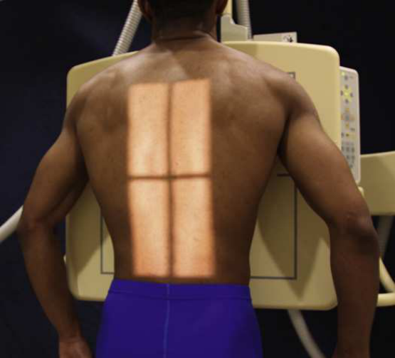
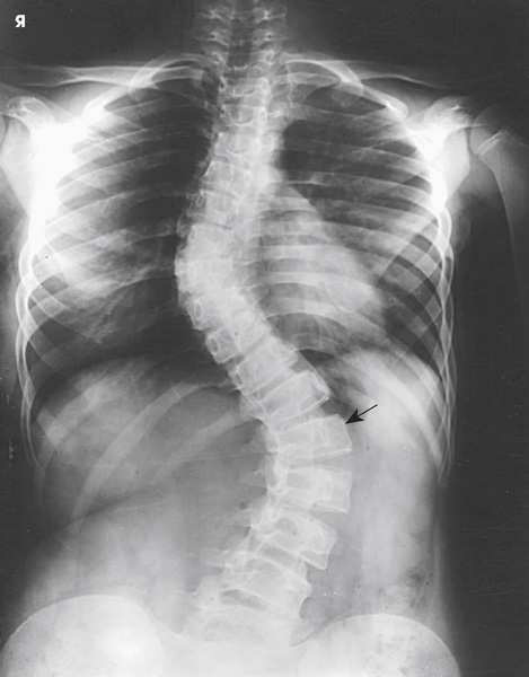
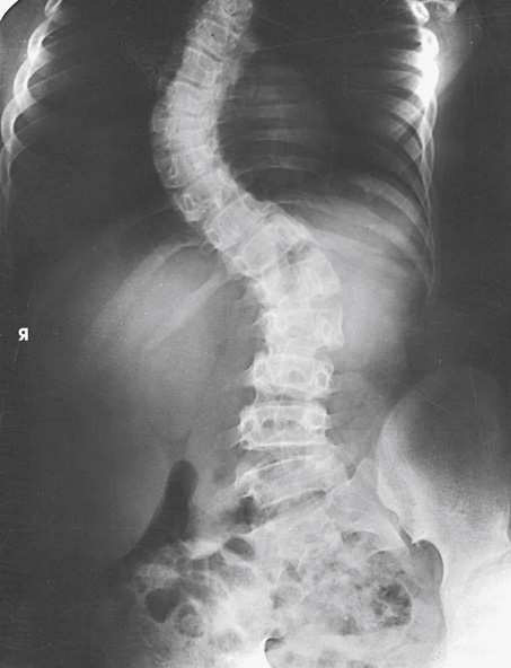
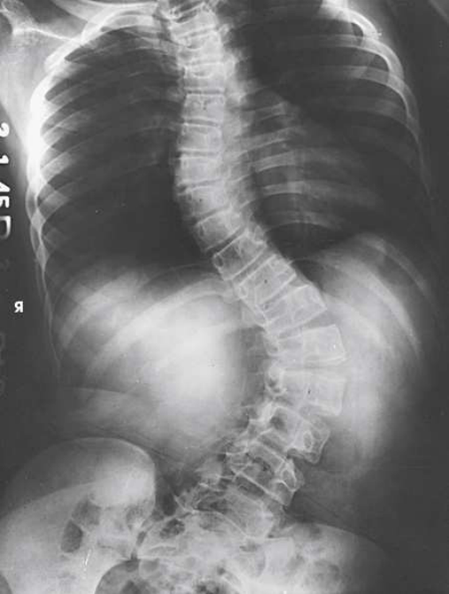

# Rx Thoracolumbar Spine: Scoliosis — Incidență Postero-Anterioară (PA) — Incidență Scolioză / Joncțiune L5-S1 (Metoda Ferguson) 32 (Merrill)

  📷 Radiografie Convențională (Rx)
  <strong>Actualizat:</strong> 2026-09-16
  <strong>Autor:</strong> Referință Merrill

---

-   __1. Rezumat Clinic & Indicații__

    ---

    === "Indicații Clinice"

        - Conform reperelor anatomice standard din tratat

    === "Ghid Național IRIS"

        !!! info "Referință Primară: Ghidul Național IRIS (Ordinul MS 1342/2012)"
            - **Capitol Ghid IRIS:** *Ghidul Național IRIS*
            - **Grad de Recomandare:** **De verificat pe indicație; fără grad atribuit automat**
            - **Nivel de Iradiere Estimată:** `De verificat pentru examinarea și populația selectate`

            [:octicons-search-16: Deschide Ghidul IRIS](../../iris.md){ .md-button .md-button--primary } [:material-open-in-new: Aplicația Oficială PWA](https://radiologie-pediatrica.ro/iris/){ .md-button target="_blank" rel="noopener" }
-   __2. Poziționare & Centrare Fascicul__

    ---

    - **Poziție Pacient:** pentru Incidență Postero-Anterioară (PA), se așază pacientul în Poziție Șezândă sau în ortostatism poziție în front de stativ vertical Bucky (Fig. 9.137).; First radiografie se ajustează pacient în normally Poziție Șezândă sau în ortostatism poziție la check spinal curvature. se centrează MSP de pacientul’s corp la linia mediană grilă. Allow pacientul’s brațe la hang relaxat la sides. If pacientul este Poziție Șezândă, se flectează coate și rest mâinile pe lap (Fig. 9.138). Do nu support pacientul. se efectuează ecranarea gonadelor cu șorț plumbat.
    - **Punct de Centrare Fascicul:** perpendicular pe midpoint de receptorul de imagine. centering points pentru fiecare radiografie în sequence will fie dictated prin system used.
    - **Distanță Focar-Film (DFF / SID):** Nespecificat în fragmentul extras; de verificat în sursă
    - **Comandă Respiratorie:** apnee (oprirea respirației). Second radiografie Elevate pacientul’s Șold sau Picior pe convex side de primary curve approximately 3 sau 4 inches (7.6 la 10.2 cm) prin placing block, book, sau săculeți cu nisip under buttock sau Picior (Fig. 9.139). Ferguson 32 specified that elevation trebuie să fie suficient la make pacientul expend some efort în maintaining poziție. Do nu support pacientul. se efectuează ecranarea gonadelor cu șorț plumbat. apnee (oprirea respirației). Obtain additional radiografii (if needed) cu elevation de Șold pe side opposite major sau primary curve (Fig. 9.140), sau cu pacientul în Decubit poziție (Fig. 9.141).

-   __3. Parametri Tehnici Expunere__

    ---

    | Parametru Tehnic | Valoare Configurare Generator / Tub |
    |:-----------------|:-------------------------------------|
    | **Tensiune Tub (kV)** | DE CONFIGURAT PE APARAT |
    | **Sarcină / Produs Curent-Timp (mAs)** | DE CONFIGURAT PE APARAT |
    | **Distanță Focar-Film (DFF / SID)** | Nespecificat în fragmentul extras; de verificat în sursă |
    | **Grilă Antidifuzoare (Bucky)** | DE CONFIGURAT PE APARAT |
    | **Dimensiune Focar** | DE CONFIGURAT PE APARAT |
    | **Camere de Ionizare AEC** | DE CONFIGURAT PE APARAT |
    | **Colimare Fascicul** | Extent de collimation depends pe type de imaging system used, ca well ca severity de pacientul’s scoliosis. Care trebuie să fie taken la include only anatomy de interest. width de câmp colimat trebuie să fie less than width de receptorul de imagine. Always check previous examination imagini la determine extent de curvature. |
    | **Filtrare Tub** | DE CONFIGURAT PE APARAT |

-   __4. Criterii de Calitate & Reușită Imagine__

    ---

    - Criterii radiologice de calitate imaginii:
    - Evidence de corect collimation și presence de marker de lateralitate (D/S) plasat clear de anatomy de interest
    - Thoracic și coloană lombară la include about 1 inch (2.5 cm) de crestele iliace
    - coloană vertebrală aliniat down center de imagine
    - Bony detalii trabeculare osoase și surrounding soft tissues

-   __5. Protecție Radiologică (ALARA)__

    ---

    - Nespecificat în fragmentul extras; de verificat în sursă

!!! note "Observații Clinice & Tehnice"
    Another widely used scoliosis series consists de four imagini de thoracic și Coloană Lombară: direct Incidență Postero-Anterioară (PA) cu pacientul în ortostatism, direct Incidență Postero-Anterioară (PA) cu pacientul Decubit ventral, și PA incidențe cu alternate drept și stâng lateral flexion în Decubit ventral poziție. drept și stâng bending poziții sunt described în next section. Young et al. 33 described their application de this scoliosis procedure în detail. They recommended addition de Incidență de Profil (lateral), made cu pacientul în ortostatism în ortostatism, la show spondylolisthesis sau la show exaСerated grade de kyphosis sau lordosis. Kittleson și Lim 34 described Ferguson și Cobb methods de measurement de scoliosis.

### 🖼️ Imagini

<figure class="protocol-image-card" markdown>

<figcaption><strong>Merrill — pagina PDF 768, imaginea 1</strong> — Imagine din fragmentul sursă; asocierea necesită revizie.</figcaption>

</figure>

<figure class="protocol-image-card" markdown>

<figcaption><strong>Merrill — pagina PDF 769, imaginea 2</strong> — Imagine din fragmentul sursă; asocierea necesită revizie.</figcaption>

</figure>

<figure class="protocol-image-card" markdown>

<figcaption><strong>Merrill — pagina PDF 770, imaginea 3</strong> — Imagine din fragmentul sursă; asocierea necesită revizie.</figcaption>

</figure>

<figure class="protocol-image-card" markdown>

<figcaption><strong>Merrill — pagina PDF 771, imaginea 4</strong> — Imagine din fragmentul sursă; asocierea necesită revizie.</figcaption>

</figure>

=== "Ghid Rapid de Execuție"

    1. **Identificarea și verificarea pacientului:** verificare identitate, zonă de examinat, consimțământ conform procedurii și evaluarea posibilității unei sarcini, când este relevantă.
    2. **Pregătire:** îndepărtarea oricăror obiecte radiopace (bijuterii, agrafe, fermoare, proteze, pansamente dense).
    3. **Poziționare precisă:** alinierea receptorului de imagine și a tubului la distanța prescrisă (Nespecificat în fragmentul extras; de verificat în sursă).
    4. **Colimare strictă:** adaptarea fasciculului strict la regiunea de diagnostic pentru scăderea iradierii și reducerea radiației difuze.
    5. **Radioprotecție:** verificarea [politicii RX](../radioprotectie.md), cu măsuri distincte pentru pacient, personal și însoțitor.

## Surse de documentare

- [Merrill’s Atlas, 9. Vertebral Column, pagini PDF 767–771](../../assets/protocols/sources/a56d45c16829_Merrills_Atlas_of_Radiographic_Positioning__Procedures_3Vol_Set.pdf#page=767)

## Fragmente sursă traduse (referință tehnică)

### anatomy

thoracic și coloană lombară, pentru comparison la distinguish deforming sau primary curve de la compensatory curve în pacienți cu
scoliosis (see Figs. 9.138–9.141).

### collimation

• Extent de collimation depends pe type de imaging system used, ca well ca severity de pacientul’s scoliosis. Care trebuie să fie taken
la include only anatomy de interest. width de câmp colimat trebuie să fie less than width de receptorul de imagine. Always check previous
examination imagini la determine extent de curvature.

### cr

• perpendicular pe midpoint de receptorul de imagine. centering points pentru fiecare radiografie în sequence will fie dictated prin system used.

### criteria

Criterii radiologice de calitate imaginii:
• Evidence de corect collimation și presence de marker de lateralitate (D/S) plasat clear de anatomy de interest
• Thoracic și coloană lombară la include about 1 inch (2.5 cm) de crestele iliace
• coloană vertebrală aliniat down center de imagine
• Bony detalii trabeculare osoase și surrounding soft tissues

### notes

Another widely used scoliosis series consists de four imagini de thoracic și lumbar coloană vertebrală: direct PA incidență cu pacient în ortostatism, direct PA incidență cu pacientul în decubit ventral, și PA incidențe cu alternate drept și stâng lateral flexion în decubit ventral
poziție. drept și stâng bending poziții sunt described în next section.
Young et al. 33 described their application de this scoliosis procedure în detail. They recommended addition de poziție de profil (lateral),
made cu pacientul în ortostatism în ortostatism, la show spondylolisthesis sau la show exaСerated grade de kyphosis sau lordosis. Kittleson și Lim
34 described Ferguson și Cobb methods de measurement de scoliosis.

### part_pos

First radiografie
• se ajustează pacient în normally așezat pe scaun sau în ortostatism poziție la check spinal curvature.
• se centrează MSP de pacientul’s corp la linia mediană grilă.
• Allow pacientul’s brațe la hang relaxat la sides. If pacientul este așezat pe scaun, se flectează coate și rest mâinile pe lap (Fig. 9.138).
• Do nu support pacientul.
• se efectuează ecranarea gonadelor cu șorț plumbat.

### patient_pos

• pentru PA incidență, se așază pacientul în așezat pe scaun sau în ortostatism poziție în front de stativ vertical Bucky (Fig. 9.137).

### respiration

apnee (oprirea respirației).
Second radiografie
• Elevate pacientul’s hip sau picior pe convex side de primary curve approximately 3 sau 4 inches (7.6 la 10.2 cm) prin placing block,
book, sau săculeți cu nisip under buttock sau picior (Fig. 9.139). Ferguson 32 specified that elevation trebuie să fie suficient la make pacient expend some efort în maintaining poziție.
• Do nu support pacientul.
• se efectuează ecranarea gonadelor cu șorț plumbat.
apnee (oprirea respirației).
• Obtain additional radiografii (if needed) cu elevation de hip pe side opposite major sau primary curve (Fig. 9.140), sau cu
pacientul în recumbent poziție (Fig. 9.141).

### tech

poziționat prin manufacturer sau department protocol pentru corect anatomy display orientation. variety de devices și receptorul de imagine
holders have been developed pentru ambele raza centrală și DR systems. toate systems allow multiple imagini encompassing entire coloană vertebrală la fie captured
fără need pentru repositioning de pacientul. acquired imagini sunt combined, sau “stitched,” prin computer system into composite
imagine that evidențiază entire coloană vertebrală în one imagine.

