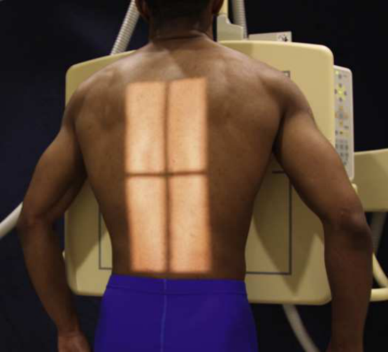
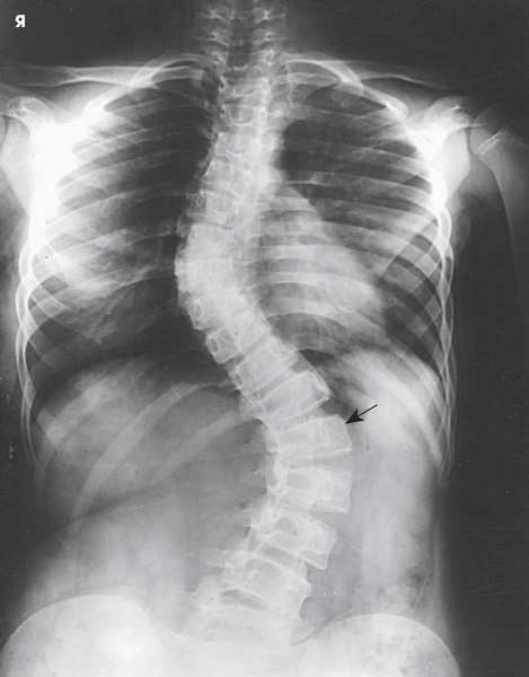
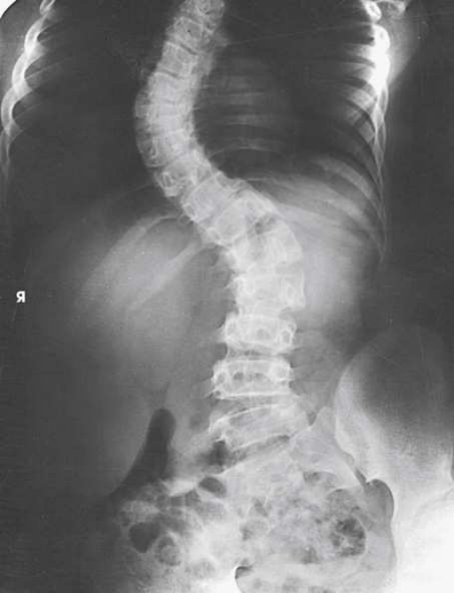
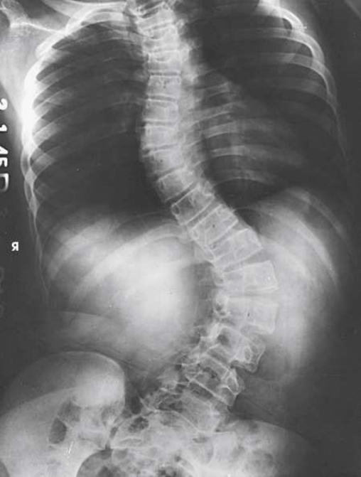

# Rx coloană toracolombară: scolioză — incidență postero-anterioară (PA) — incidență pentru scolioză / joncțiunea L5-S1 (metoda Ferguson) 32 (Merrill)

  📷 Radiografie Convențională (Rx)
  <strong>Actualizat:</strong> 2026-09-16
  <strong>Autor:</strong> Referință Merrill

---

-   __1. Rezumat Clinic & Indicații__

    ---

    === "Indicații Clinice"

        - Conform reperelor anatomice standard din tratat

    === "Ghid Național IRIS"

        !!! info "Referință Primară: Ghidul Național IRIS (Ordinul MS 1342/2012)"
            - **Capitol Ghid IRIS:** *Ghidul Național IRIS*
            - **Grad de Recomandare:** **De verificat pe indicație; fără grad atribuit automat**
            - **Nivel de Iradiere Estimată:** `De verificat pentru examinarea și populația selectate`

            [:octicons-search-16: Deschide Ghidul IRIS](../../iris.md){ .md-button .md-button--primary } [:material-open-in-new: Aplicația Oficială PWA](https://radiologie-pediatrica.ro/iris/){ .md-button target="_blank" rel="noopener" }
-   __2. Poziționare & Centrare Fascicul__

    ---

    - **Poziție Pacient:** pentru incidența PA, se așază pacientul în poziție șezândă sau în ortostatism, în fața stativului vertical Bucky (Fig. 9.137). Prima radiografie: pacientul este așezat în mod obișnuit sau se află în ortostatism pentru verificarea curburii coloanei vertebrale. se centrează MSP al corpului pacientului pe linia mediană a grilei. se lasă brațele pacientului să atârne relaxat pe lângă corp. dacă pacientul este în poziție șezândă, se flectează coatele și se sprijină mâinile pe coapse (Fig. 9.138). Nu se sprijină pacientul. se efectuează ecranarea gonadelor cu șorț plumbat.
    - **Punct de Centrare Fascicul:** perpendicular pe punctul de mijloc al receptorului de imagine. punctele de centrare pentru fiecare radiografie din serie vor fi dictate de sistemul utilizat.
    - **Distanță Focar-Film (DFF / SID):** Nespecificat în fragmentul extras; de verificat în sursă
    - **Comandă Respiratorie:** apnee (oprirea respirației). A doua radiografie: se ridică șoldul sau piciorul pacientului de pe partea convexă a curburii primare cu aproximativ 3 sau 4 inches (7.6–10.2 cm), plasând un bloc, o carte sau săculeți cu nisip sub fesă sau picior (Fig. 9.139). Ferguson 32 a specificat că ridicarea trebuie să fie suficientă pentru a-l determina pe pacient să depună un anumit efort pentru menținerea poziției. Nu se sprijină pacientul. se efectuează ecranarea gonadelor cu șorț plumbat. apnee (oprirea respirației). se obțin radiografii suplimentare (dacă este necesar), cu ridicarea șoldului de pe partea opusă curburii majore sau primare (Fig. 9.140) sau cu pacientul în poziție de decubit (Fig. 9.141).

-   __3. Parametri Tehnici Expunere__

    ---

    | Parametru Tehnic | Valoare Configurare Generator / Tub |
    |:-----------------|:-------------------------------------|
    | **Tensiune Tub (kV)** | DE CONFIGURAT PE APARAT |
    | **Sarcină / Produs Curent-Timp (mAs)** | DE CONFIGURAT PE APARAT |
    | **Distanță Focar-Film (DFF / SID)** | Nespecificat în fragmentul extras; de verificat în sursă |
    | **Grilă Antidifuzoare (Bucky)** | DE CONFIGURAT PE APARAT |
    | **Dimensiune Focar** | DE CONFIGURAT PE APARAT |
    | **Camere de Ionizare AEC** | DE CONFIGURAT PE APARAT |
    | **Colimare Fascicul** | amploarea colimării depinde de tipul sistemului de imagistică utilizat, precum și de severitatea scoliozei pacientului. trebuie acordată atenție includerii exclusiv a anatomiei de interes. lățimea câmpului colimat trebuie să fie mai mică decât lățimea receptorului de imagine. se verifică întotdeauna imaginile examinării anterioare pentru a determina amploarea curburii. |
    | **Filtrare Tub** | DE CONFIGURAT PE APARAT |

-   __4. Criterii de Calitate & Reușită Imagine__

    ---

    - Criterii radiologice de calitate a imaginii:
    - Evidențierea colimării corecte și prezența markerului de lateralitate (D/S), plasat fără a se suprapune peste anatomia de interes
    - coloana toracală și lombară trebuie să includă aproximativ 1 inch (2.5 cm) din crestele iliace
    - coloana vertebrală aliniată pe centrul imaginii
    - Detalii trabeculare osoase și țesuturile moi înconjurătoare

-   __5. Protecție Radiologică (ALARA)__

    ---

    - Nespecificat în fragmentul extras; de verificat în sursă

!!! note "Observații Clinice & Tehnice"
    O altă serie de radiografii pentru scolioză, utilizată pe scară largă, constă din patru imagini ale coloanei toracale și lombare: incidență PA directă cu pacientul în ortostatism, incidență PA directă cu pacientul în decubit ventral și incidențe PA cu flexie laterală alternativă dreaptă și stângă, în poziție de decubit ventral. pozițiile de înclinare dreaptă și stângă sunt descrise în secțiunea următoare. Young et al. 33 au descris în detaliu aplicarea acestei proceduri pentru scolioză. Ei au recomandat adăugarea unei incidențe de profil (lateral), efectuată cu pacientul în ortostatism, pentru evidențierea spondilolistezisului sau a unui grad exagerat de cifoză ori lordoză. Kittleson și Lim 34 au descris metodele Ferguson și Cobb de măsurare a scoliozei.

### 🖼️ Imagini

<figure class="protocol-image-card" markdown>

<figcaption><strong>Merrill — pagina 768, imaginea 1</strong> — Imagine din fragmentul sursă; asocierea necesită revizie.</figcaption>

</figure>

<figure class="protocol-image-card" markdown>

<figcaption><strong>Merrill — pagina 769, imaginea 2</strong> — Imagine din fragmentul sursă; asocierea necesită revizie.</figcaption>

</figure>

<figure class="protocol-image-card" markdown>

<figcaption><strong>Merrill — pagina 770, imaginea 3</strong> — Imagine din fragmentul sursă; asocierea necesită revizie.</figcaption>

</figure>

<figure class="protocol-image-card" markdown>

<figcaption><strong>Merrill — pagina 771, imaginea 4</strong> — Imagine din fragmentul sursă; asocierea necesită revizie.</figcaption>

</figure>

=== "Ghid Rapid de Execuție"

    1. **Identificarea și verificarea pacientului:** verificare identitate, zonă de examinat, consimțământ conform procedurii și evaluarea posibilității unei sarcini, când este relevantă.
    2. **Pregătire:** îndepărtarea oricăror obiecte radiopace (bijuterii, agrafe, fermoare, proteze, pansamente dense).
    3. **Poziționare precisă:** alinierea receptorului de imagine și a tubului la distanța prescrisă (Nespecificat în fragmentul extras; de verificat în sursă).
    4. **Colimare strictă:** adaptarea fasciculului strict la regiunea de diagnostic pentru scăderea iradierii și reducerea radiației difuze.
    5. **Radioprotecție:** verificarea [politicii RX](../radioprotectie.md), cu măsuri distincte pentru pacient, personal și însoțitor.

## Surse de documentare

- [Merrill’s Atlas, 9. Vertebral Column, pagini 767–771](https://books.google.com/books/about/Merrill_s_Atlas_of_Radiographic_Position.html?id=BM0lEQAAQBAJ)

## Fragmente sursă traduse (referință tehnică)

### anatomie

coloana toracală și lombară, pentru comparație și diferențierea curburii deformante sau primare de curbura compensatorie la pacienții cu scolioză (vezi Fig. 9.138–9.141).

### colimare

• amploarea colimării depinde de tipul sistemului de imagistică utilizat, precum și de severitatea scoliozei pacientului. trebuie acordată atenție includerii exclusiv a anatomiei de interes. lățimea câmpului colimat trebuie să fie mai mică decât lățimea receptorului de imagine. se verifică întotdeauna imaginile examinării anterioare pentru a determina amploarea curburii.

### raza centrală

• perpendicular pe punctul de mijloc al receptorului de imagine. punctele de centrare pentru fiecare radiografie din serie vor fi dictate de sistemul utilizat.

### criterii

Criterii radiologice de calitate a imaginii:
• dovada colimării corecte și prezența markerului de lateralitate (D/S), plasat clar față de anatomia de interes
• coloana toracală și lombară trebuie să includă aproximativ 1 inch (2.5 cm) din crestele iliace
• coloana vertebrală aliniată pe centrul imaginii
• detalii osoase trabeculare și țesuturile moi înconjurătoare

### note

O altă serie de radiografii pentru scolioză, utilizată pe scară largă, constă din patru imagini ale coloanei toracale și lombare: incidență PA directă cu pacientul în ortostatism, incidență PA directă cu pacientul în decubit ventral și incidențe PA cu flexie laterală alternativă dreaptă și stângă, în poziție de decubit ventral. pozițiile de înclinare dreaptă și stângă sunt descrise în secțiunea următoare.
Young et al. 33 au descris în detaliu aplicarea acestei proceduri pentru scolioză. Ei au recomandat adăugarea unei poziții de profil (lateral), efectuată cu pacientul în ortostatism, pentru evidențierea spondilolistezisului sau a unui grad exagerat de cifoză ori lordoză. Kittleson și Lim 34 au descris metodele Ferguson și Cobb de măsurare a scoliozei.

### part_pos

Prima radiografie
• se poziționează pacientul în mod obișnuit, așezat pe scaun sau în ortostatism, pentru verificarea curburii coloanei vertebrale.
• se centrează MSP al corpului pacientului pe linia mediană a grilei.
• se lasă brațele pacientului să atârne relaxat pe lângă corp. dacă pacientul este așezat pe scaun, se flectează coatele și se sprijină mâinile pe coapse (Fig. 9.138).
• Nu se sprijină pacientul.
• se efectuează ecranarea gonadelor cu șorț plumbat.

### patient_pos

• pentru incidența PA, se așază pacientul în poziție șezândă sau în ortostatism, în fața stativului vertical Bucky (Fig. 9.137).

### respirație

apnee (oprirea respirației).
A doua radiografie
• se ridică șoldul sau piciorul pacientului de pe partea convexă a curburii primare cu aproximativ 3 sau 4 inches (7.6–10.2 cm), plasând un bloc, o carte sau săculeți cu nisip sub fesă sau picior (Fig. 9.139). Ferguson 32 a specificat că ridicarea trebuie să fie suficientă pentru a determina pacientul să depună un anumit efort pentru menținerea poziției.
• Nu se sprijină pacientul.
• se efectuează ecranarea gonadelor cu șorț plumbat.
apnee (oprirea respirației).
• se obțin radiografii suplimentare (dacă este necesar), cu ridicarea șoldului de pe partea opusă curburii majore sau primare (Fig. 9.140) sau cu pacientul în poziție de decubit (Fig. 9.141).

### tehnică

poziționat de producător sau prin protocolul departamentului pentru orientarea corectă a afișării anatomiei. au fost dezvoltate diverse dispozitive și suporturi pentru receptoare de imagine, atât pentru sistemele cu rază centrală, cât și pentru sistemele DR. toate sistemele permit captarea mai multor imagini care cuprind întreaga coloană vertebrală, fără a fi necesară repoziționarea pacientului. imaginile obținute sunt combinate sau „asamblate” de sistemul informatic într-o imagine compozită care evidențiază întreaga coloană vertebrală într-o singură imagine.

