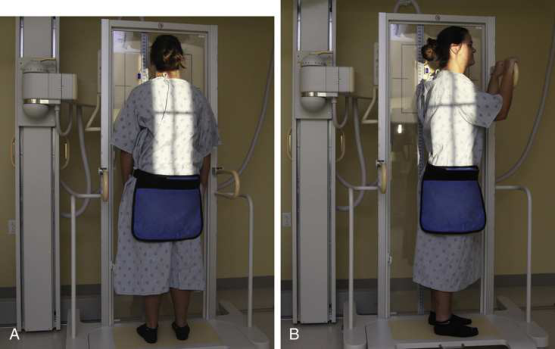
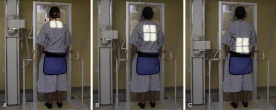
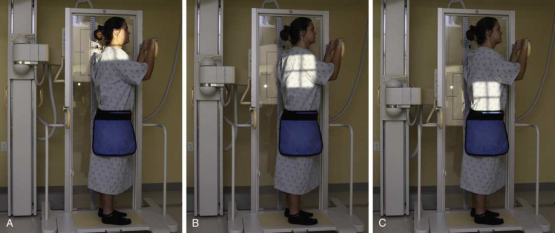
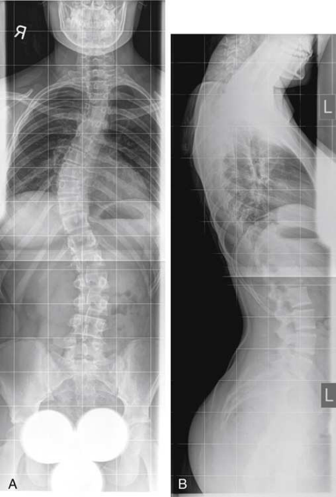
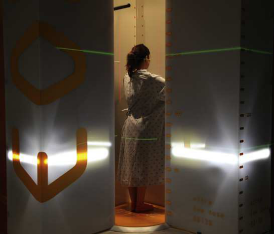
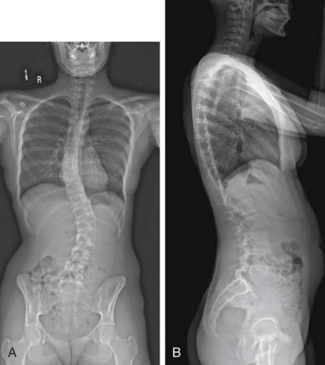

# Rx Thoracolumbar Spine: Scoliosis — Pa And Incidență de Profil (Lateral) — Frank et al. Method 27–29 (Merrill)

  📷 Radiografie Convențională (Rx)
  <strong>Actualizat:</strong> 2026-09-16
  <strong>Autor:</strong> Referință Merrill

---

-   __1. Rezumat Clinic & Indicații__

    ---

    === "Indicații Clinice"

        - Conform reperelor anatomice standard din tratat

    === "Ghid Național IRIS"

        !!! info "Referință Primară: Ghidul Național IRIS (Ordinul MS 1342/2012)"
            - **Capitol Ghid IRIS:** *Ghidul Național IRIS*
            - **Grad de Recomandare:** **De verificat pe indicație; fără grad atribuit automat**
            - **Nivel de Iradiere Estimată:** `De verificat pentru examinarea și populația selectate`

            [:octicons-search-16: Deschide Ghidul IRIS](../../iris.md){ .md-button .md-button--primary } [:material-open-in-new: Aplicația Oficială PWA](https://radiologie-pediatrica.ro/iris/){ .md-button target="_blank" rel="noopener" }
-   __2. Poziționare & Centrare Fascicul__

    ---

    - **Poziție Pacient:** This procedure este usually performed cu pacientul în ortostatism.; PA (sau AP) pacient faces stativ vertical Bucky pentru PA sau rests back pe / sprijinit de device pentru AP. se ajustează pacient’s Bazin (bazin (pelvis)) pentru rotație prin ensuring that spină iliacă antero-superioară (SIAS) sunt echidistant față de receptorul de imagine. se centrează MSP de pacientul’s corp la linia mediană stativ vertical Bucky (Fig. 9.131A). Let pacientul’s brațe hang prin sides. poziție special ruler adjacent la coloană vertebrală, if needed. se efectuează ecranarea gonadelor cu șorț plumbat și breasts ca appropriate.
    - **Punct de Centrare Fascicul:** perpendicular pe centrul receptorului de imagine. centering points pentru fiecare radiografie în sequence will fie dictated prin system used. two- (sau three-) imagine sequence este performed pentru ambele PA și lateral incidențe (Figs. 9.132 și 9.133).
    - **Distanță Focar-Film (DFF / SID):** Nespecificat în fragmentul extras; de verificat în sursă
    - **Comandă Respiratorie:** apnee (oprirea respirației). lateral se poziționează pacientul’s side pe / sprijinit de stativ vertical Bucky. se ajustează poziție de pacientul astfel încât MSP de corp este paralel cu receptorul de imagine și adjacent Umăr este touching grila device. se centrează thorax la grila; MCP trebuie să fie perpendicular și centrat pe linia mediană grilă (see Fig. 9.131B). poziție special ruler adjacent la coloană vertebrală, if needed. Se instruiește pacientul să se extinde brațe upward la prevent superimposition over coloană vertebrală. se efectuează ecranarea gonadelor cu șorț plumbat și breasts ca appropriate. apnee (oprirea respirației).

-   __3. Parametri Tehnici Expunere__

    ---

    | Parametru Tehnic | Valoare Configurare Generator / Tub |
    |:-----------------|:-------------------------------------|
    | **Tensiune Tub (kV)** | DE CONFIGURAT PE APARAT |
    | **Sarcină / Produs Curent-Timp (mAs)** | DE CONFIGURAT PE APARAT |
    | **Distanță Focar-Film (DFF / SID)** | Nespecificat în fragmentul extras; de verificat în sursă |
    | **Grilă Antidifuzoare (Bucky)** | DE CONFIGURAT PE APARAT |
    | **Dimensiune Focar** | DE CONFIGURAT PE APARAT |
    | **Camere de Ionizare AEC** | DE CONFIGURAT PE APARAT |
    | **Colimare Fascicul** | Extent de collimation depends pe type de imaging system used, ca well ca extent de pacientul’s scoliosis. Care trebuie să fie taken la include only anatomy de interest. If possible, width de câmp colimat trebuie să fie less than width de receptorul de imagine. Always check previous examination imagini la determine extent de curvature. |
    | **Filtrare Tub** | DE CONFIGURAT PE APARAT |

-   __4. Criterii de Calitate & Reușită Imagine__

    ---

    - Criterii radiologice de calitate imaginii:
    - Evidence de corect collimation, presence de special ruler if used, și presence de marker de lateralitate (D/S) plasat clear de anatomy de interest
    - Entire cervical, thoracic, și lumbosacral spines
    - coloană vertebrală aliniat down center de imagine
    - Bony detalii trabeculare osoase și surrounding soft tissues

-   __5. Protecție Radiologică (ALARA)__

    ---

    - Nespecificat în fragmentul extras; de verificat în sursă

!!! note "Observații Clinice & Tehnice"
    Conform reperelor anatomice standard din tratat

### 🖼️ Imagini

<figure class="protocol-image-card" markdown>

<figcaption><strong>Merrill — pagina PDF 763, imaginea 1</strong> — Imagine din fragmentul sursă; asocierea necesită revizie.</figcaption>

</figure>

<figure class="protocol-image-card" markdown>

<figcaption><strong>Merrill — pagina PDF 763, imaginea 2</strong> — Imagine din fragmentul sursă; asocierea necesită revizie.</figcaption>

</figure>

<figure class="protocol-image-card" markdown>

<figcaption><strong>Merrill — pagina PDF 764, imaginea 3</strong> — Imagine din fragmentul sursă; asocierea necesită revizie.</figcaption>

</figure>

<figure class="protocol-image-card" markdown>

<figcaption><strong>Merrill — pagina PDF 765, imaginea 4</strong> — Imagine din fragmentul sursă; asocierea necesită revizie.</figcaption>

</figure>

<figure class="protocol-image-card" markdown>

<figcaption><strong>Merrill — pagina PDF 766, imaginea 5</strong> — Imagine din fragmentul sursă; asocierea necesită revizie.</figcaption>

</figure>

<figure class="protocol-image-card" markdown>

<figcaption><strong>Merrill — pagina PDF 767, imaginea 6</strong> — Imagine din fragmentul sursă; asocierea necesită revizie.</figcaption>

</figure>

=== "Ghid Rapid de Execuție"

    1. **Identificarea și verificarea pacientului:** verificare identitate, zonă de examinat, consimțământ conform procedurii și evaluarea posibilității unei sarcini, când este relevantă.
    2. **Pregătire:** îndepărtarea oricăror obiecte radiopace (bijuterii, agrafe, fermoare, proteze, pansamente dense).
    3. **Poziționare precisă:** alinierea receptorului de imagine și a tubului la distanța prescrisă (Nespecificat în fragmentul extras; de verificat în sursă).
    4. **Colimare strictă:** adaptarea fasciculului strict la regiunea de diagnostic pentru scăderea iradierii și reducerea radiației difuze.
    5. **Radioprotecție:** verificarea [politicii RX](../radioprotectie.md), cu măsuri distincte pentru pacient, personal și însoțitor.

## Surse de documentare

- [Merrill’s Atlas, 9. Vertebral Column, pagini PDF 761–767](../../assets/protocols/sources/a56d45c16829_Merrills_Atlas_of_Radiographic_Positioning__Procedures_3Vol_Set.pdf#page=761)

## Fragmente sursă traduse (referință tehnică)

### anatomy

entire coloană vertebrală de la base de skull la tip de coccyx (Fig. 9.134).

### collimation

• Extent de collimation depends pe type de imaging system used, ca well ca extent de pacientul’s scoliosis. Care trebuie să fie taken
la include only anatomy de interest. If possible, width de câmp colimat trebuie să fie less than width de receptorul de imagine. Always
check previous examination imagini la determine extent de curvature.

### cr

• perpendicular pe centrul receptorului de imagine. centering points pentru fiecare radiografie în sequence will fie dictated prin system used.
• two- (sau three-) imagine sequence este performed pentru ambele PA și lateral incidențe (Figs. 9.132 și 9.133).

### criteria

Criterii radiologice de calitate imaginii:
• Evidence de corect collimation, presence de special ruler if used, și presence de marker de lateralitate (D/S) plasat clear de anatomy de interest
• Entire cervical, thoracic, și lumbosacral spines
• coloană vertebrală aliniat down center de imagine
• Bony detalii trabeculare osoase și surrounding soft tissues

### part_pos

PA (sau AP)
• pacient faces stativ vertical Bucky pentru PA sau rests back pe / sprijinit de device pentru AP.
• se ajustează pacient’s bazin (pelvis) pentru rotație prin ensuring that spină iliacă antero-superioară (SIAS) sunt echidistant față de receptorul de imagine.
• se centrează MSP de pacientul’s corp la linia mediană stativ vertical Bucky (Fig. 9.131A).
• Let pacientul’s brațe hang prin sides.
• poziție special ruler adjacent la coloană vertebrală, if needed.
• se efectuează ecranarea gonadelor cu șorț plumbat și breasts ca appropriate.

### patient_pos

• This procedure este usually performed cu pacientul în ortostatism.

### respiration

apnee (oprirea respirației).
lateral
• se poziționează pacientul’s side pe / sprijinit de stativ vertical Bucky.
• se ajustează poziție de pacientul astfel încât MSP de corp este paralel cu receptorul de imagine și adjacent umăr este touching grila
device.
• se centrează thorax la grila; MCP trebuie să fie perpendicular și centrat pe linia mediană grilă (see Fig. 9.131B).
• poziție special ruler adjacent la coloană vertebrală, if needed.
• Se instruiește pacientul să se extinde brațe upward la prevent superimposition over coloană vertebrală.
• se efectuează ecranarea gonadelor cu șorț plumbat și breasts ca appropriate.
apnee (oprirea respirației).

### tech

poziționat prin manufacturer sau department protocol pentru corect anatomy display orientation. variety de devices și receptorul de imagine
holders have been developed pentru ambele raza centrală și DR systems. toate systems allow multiple imagini encompassing entire coloană vertebrală la fie captured
fără need pentru repositioning de pacientul. acquired imagini sunt combined, sau “stitched,” prin computer system into composite
imagine that evidențiază entire coloană vertebrală în one imagine.

