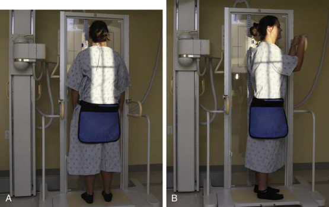
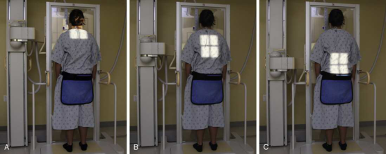
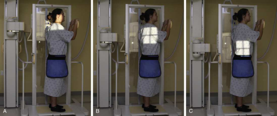
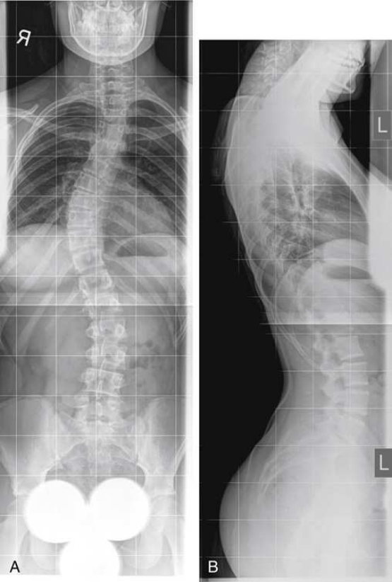
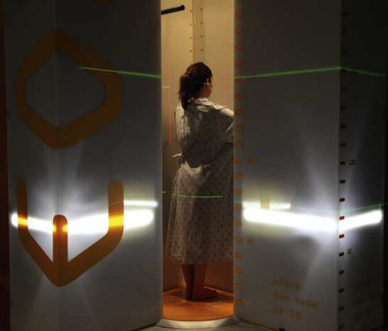
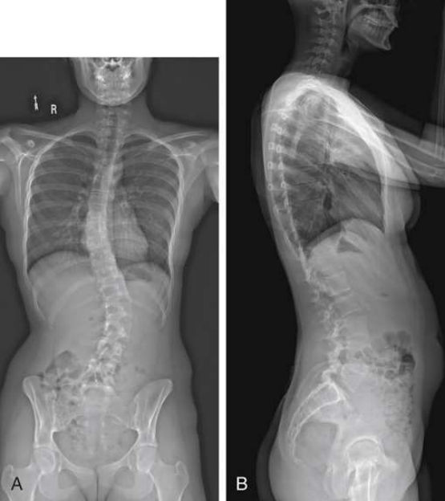

# Radiografia coloanei toracolombare: scolioză — PA și incidență de profil — metoda Frank, 27–29 (Merrill)

  📷 Radiografie Convențională (Rx)
  <strong>Actualizat:</strong> 2026-09-16
  <strong>Autor:</strong> Referință Merrill

---

-   __1. Rezumat Clinic & Indicații__

    ---

    === "Indicații Clinice"

        - Conform reperelor anatomice standard din tratat

    === "Ghid Național IRIS"

        !!! info "Referință Primară: Ghidul Național IRIS (Ordinul MS 1342/2012)"
            - **Capitol Ghid IRIS:** *Ghidul Național IRIS*
            - **Grad de Recomandare:** **De verificat pe indicație; fără grad atribuit automat**
            - **Nivel de Iradiere Estimată:** `De verificat pentru examinarea și populația selectate`

            [:octicons-search-16: Deschide Ghidul IRIS](../../iris.md){ .md-button .md-button--primary } [:material-open-in-new: Aplicația Oficială PWA](https://radiologie-pediatrica.ro/iris/){ .md-button target="_blank" rel="noopener" }
-   __2. Poziționare & Centrare Fascicul__

    ---

    - **Poziție Pacient:** Această procedură se efectuează de obicei cu pacientul în ortostatism. PA (sau AP): pacientul este orientat cu fața către stativul vertical Bucky pentru PA sau se sprijină cu spatele pe dispozitiv pentru AP. se ajustează bazinul pacientului pentru rotație, asigurându-se că spinele iliace antero-superioare (SIAS) sunt echidistante față de receptorul de imagine. se centrează MSP al corpului pacientului pe linia mediană a stativului vertical Bucky (Fig. 9.131A). se lasă brațele pacientului să atârne pe lângă corp. se poziționează un reper special adiacent coloanei vertebrale, dacă este necesar. se efectuează ecranarea gonadelor cu șorț plumbat și a sânilor, după caz.
    - **Punct de Centrare Fascicul:** perpendicular pe centrul receptorului de imagine. punctele de centrare pentru fiecare radiografie din serie vor fi dictate de sistemul utilizat. se efectuează o serie de două (sau trei) imagini atât pentru incidențele PA, cât și pentru cele de profil (Fig. 9.132 și 9.133).
    - **Distanță Focar-Film (DFF / SID):** Nespecificat în fragmentul extras; de verificat în sursă
    - **Comandă Respiratorie:** apnee (oprirea respirației). lateral: se poziționează partea laterală a pacientului pe sau lipită de stativul vertical Bucky. se ajustează poziția pacientului astfel încât MSP al corpului să fie paralel cu receptorul de imagine, iar umărul adiacent să atingă dispozitivul grilei. se centrează toracele la nivelul grilei; MCP trebuie să fie perpendiculară și centrată pe linia mediană a grilei (vezi Fig. 9.131B). se poziționează un reper special adiacent coloanei vertebrale, dacă este necesar. se instruiește pacientul să extindă brațele în sus pentru a preveni suprapunerea peste coloana vertebrală. se efectuează ecranarea gonadelor cu șorț plumbat și a sânilor, după caz. apnee (oprirea respirației).

-   __3. Parametri Tehnici Expunere__

    ---

    | Parametru Tehnic | Valoare Configurare Generator / Tub |
    |:-----------------|:-------------------------------------|
    | **Tensiune Tub (kV)** | DE CONFIGURAT PE APARAT |
    | **Sarcină / Produs Curent-Timp (mAs)** | DE CONFIGURAT PE APARAT |
    | **Distanță Focar-Film (DFF / SID)** | Nespecificat în fragmentul extras; de verificat în sursă |
    | **Grilă Antidifuzoare (Bucky)** | DE CONFIGURAT PE APARAT |
    | **Dimensiune Focar** | DE CONFIGURAT PE APARAT |
    | **Camere de Ionizare AEC** | DE CONFIGURAT PE APARAT |
    | **Colimare Fascicul** | Extinderea colimării depinde de tipul sistemului de imagistică utilizat, precum și de amploarea scoliozei pacientului. Trebuie avut grijă să fie inclusă numai anatomia de interes. Dacă este posibil, lățimea câmpului colimat trebuie să fie mai mică decât lățimea receptorului de imagine. Se verifică întotdeauna imaginile examinării anterioare pentru a determina amploarea curburii. |
    | **Filtrare Tub** | DE CONFIGURAT PE APARAT |

-   __4. Criterii de Calitate & Reușită Imagine__

    ---

    - Criterii radiologice de calitate a imaginii:
    - dovada colimării corecte, prezența reperului special, dacă a fost utilizat, și prezența markerului de lateralitate (D/S), plasat clar față de anatomia de interes
    - întreaga coloană cervicală, toracală și lombosacrală
    - coloana vertebrală aliniată pe centrul imaginii
    - Detalii trabeculare osoase și țesuturile moi înconjurătoare

-   __5. Protecție Radiologică (ALARA)__

    ---

    - Nespecificat în fragmentul extras; de verificat în sursă

!!! note "Observații Clinice & Tehnice"
    Conform reperelor anatomice standard din tratat

### 🖼️ Imagini

<figure class="protocol-image-card" markdown>

<figcaption><strong>Merrill — pagina 763, imaginea 1</strong> — Imagine din fragmentul sursă; asocierea necesită revizie.</figcaption>

</figure>

<figure class="protocol-image-card" markdown>

<figcaption><strong>Merrill — pagina 763, imaginea 2</strong> — Imagine din fragmentul sursă; asocierea necesită revizie.</figcaption>

</figure>

<figure class="protocol-image-card" markdown>

<figcaption><strong>Merrill — pagina 764, imaginea 3</strong> — Imagine din fragmentul sursă; asocierea necesită revizie.</figcaption>

</figure>

<figure class="protocol-image-card" markdown>

<figcaption><strong>Merrill — pagina 765, imaginea 4</strong> — Imagine din fragmentul sursă; asocierea necesită revizie.</figcaption>

</figure>

<figure class="protocol-image-card" markdown>

<figcaption><strong>Merrill — pagina 766, imaginea 5</strong> — Imagine din fragmentul sursă; asocierea necesită revizie.</figcaption>

</figure>

<figure class="protocol-image-card" markdown>

<figcaption><strong>Merrill — pagina 767, imaginea 6</strong> — Imagine din fragmentul sursă; asocierea necesită revizie.</figcaption>

</figure>

=== "Ghid Rapid de Execuție"

    1. **Identificarea și verificarea pacientului:** verificare identitate, zonă de examinat, consimțământ conform procedurii și evaluarea posibilității unei sarcini, când este relevantă.
    2. **Pregătire:** îndepărtarea oricăror obiecte radiopace (bijuterii, agrafe, fermoare, proteze, pansamente dense).
    3. **Poziționare precisă:** alinierea receptorului de imagine și a tubului la distanța prescrisă (Nespecificat în fragmentul extras; de verificat în sursă).
    4. **Colimare strictă:** adaptarea fasciculului strict la regiunea de diagnostic pentru scăderea iradierii și reducerea radiației difuze.
    5. **Radioprotecție:** verificarea [politicii RX](../radioprotectie.md), cu măsuri distincte pentru pacient, personal și însoțitor.

## Surse de documentare

- [Merrill’s Atlas, 9. Vertebral Column, pagini 761–767](https://books.google.com/books/about/Merrill_s_Atlas_of_Radiographic_Position.html?id=BM0lEQAAQBAJ)

## Fragmente sursă traduse (referință tehnică)

### anatomie

întreaga coloană vertebrală, de la baza craniului până la vârful coccisului (Fig. 9.134).

### colimare

• amploarea colimării depinde de tipul sistemului de imagistică utilizat, precum și de extinderea scoliozei pacientului. trebuie acordată atenție includerii exclusiv a anatomiei de interes. dacă este posibil, lățimea câmpului colimat trebuie să fie mai mică decât lățimea receptorului de imagine. se verifică întotdeauna imaginile examinării anterioare pentru a determina amploarea curburii.

### raza centrală

• perpendicular pe centrul receptorului de imagine. punctele de centrare pentru fiecare radiografie din serie vor fi dictate de sistemul utilizat.
• se efectuează o serie de două (sau trei) imagini atât pentru incidențele PA, cât și pentru cele de profil (Fig. 9.132 și 9.133).

### criterii

Criterii radiologice de calitate a imaginii:
• dovada colimării corecte, prezența reperului special, dacă a fost utilizat, și prezența markerului de lateralitate (D/S), plasat clar față de anatomia de interes
• întreaga coloană cervicală, toracală și lombosacrală
• coloana vertebrală aliniată pe centrul imaginii
• detalii osoase trabeculare și țesuturile moi înconjurătoare

### part_pos

PA (sau AP)
• pacientul este orientat cu fața spre stativul vertical Bucky pentru PA sau cu spatele sprijinit de dispozitiv pentru AP.
• se ajustează bazinul pacientului pentru rotație, asigurându-se că spinele iliace antero-superioare (SIAS) sunt echidistante față de receptorul de imagine.
• se centrează MSP al corpului pacientului pe linia mediană a stativului vertical Bucky (Fig. 9.131A).
• Se lasă brațele pacientului să atârne pe lângă corp.
• se poziționează rigla specială adiacent coloanei vertebrale, dacă este necesar.
• se efectuează ecranarea gonadelor cu șorț plumbat și a sânilor, după caz.

### patient_pos

• Această procedură se efectuează de obicei cu pacientul în ortostatism.

### respirație

apnee (oprirea respirației).
profil
• se poziționează pacientul cu partea laterală sprijinită de stativul vertical Bucky.
• se ajustează poziția pacientului astfel încât MSP al corpului să fie paralel cu receptorul de imagine, iar umărul adiacent să atingă dispozitivul grilei.
• se centrează toracele pe grilă; MCP trebuie să fie perpendicular și centrat pe linia mediană a grilei (vezi Fig. 9.131B).
• se poziționează rigla specială adiacent coloanei vertebrale, dacă este necesar.
• Se instruiește pacientul să ridice brațele în sus pentru a preveni suprapunerea peste coloana vertebrală.
• se efectuează ecranarea gonadelor cu șorț plumbat și a sânilor, după caz.
apnee (oprirea respirației).

### tehnică

poziționat de producător sau prin protocolul departamentului pentru orientarea corectă a afișării anatomiei. au fost dezvoltate diverse dispozitive și suporturi pentru receptoare de imagine, atât pentru sistemele cu rază centrală, cât și pentru sistemele DR. toate sistemele permit captarea mai multor imagini care cuprind întreaga coloană vertebrală, fără a fi necesară repoziționarea pacientului. imaginile obținute sunt combinate sau „asamblate” de sistemul informatic într-o imagine compozită care evidențiază întreaga coloană vertebrală într-o singură imagine.

