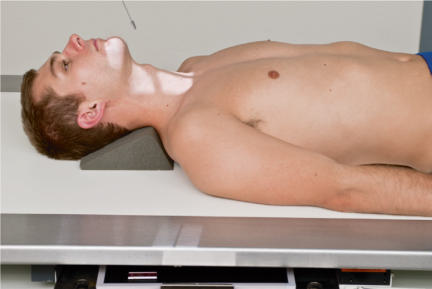
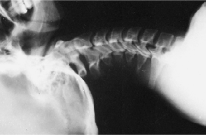
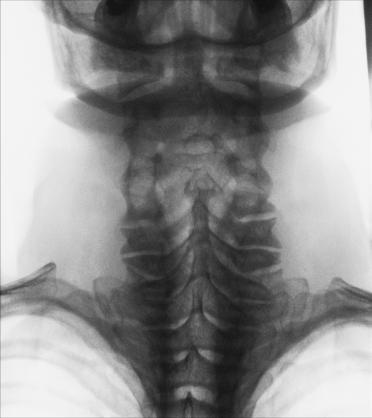

# Rx VERTEBRAL ARCH (PILLARS) AP Axială (Coloană Cervicală)

  📷 Radiografie Convențională (Rx)
  <strong>Actualizat:</strong> 2026-09-15
  <strong>Autor:</strong> Departamentul de Radiologie / Referință Bontrager

---

-   __1. Rezumat Clinic & Indicații__

    ---

    === "Indicații Clinice"

        - Pathology or traumatism acuttism / Regim Urgență involving the posterior vertebral arch (particularly the pillars) of C4 to C7 and spinous processes of cervicothoracic vertebrae with whiplashtype injuries (see previous warning)

    === "Ghid Național IRIS"

        !!! info "Referință Primară: Ghidul Național IRIS (Ordinul MS 1342/2012)"
            - **Capitol Ghid IRIS:** *Ghidul Național IRIS*
            - **Grad de Recomandare:** **De verificat pe indicație; fără grad atribuit automat**
            - **Nivel de Iradiere Estimată:** `De verificat pentru examinarea și populația selectate`

            [:octicons-search-16: Deschide Ghidul IRIS](../../iris.md){ .md-button .md-button--primary } [:material-open-in-new: Aplicația Oficială PWA](https://radiologie-pediatrica.ro/iris/){ .md-button target="_blank" rel="noopener" }
-   __2. Poziționare & Centrare Fascicul__

    ---

    - **Poziție Pacient:** Pacient: Decubit Dorsal Position Position patient in the Decubit Dorsal position with arms at side.; Regiune anatomică: Align midsagittal plane to CR and midline of table and/or IR. Hyperextend the neck if patient is able (see warning above) (Fig. 8.77). Ensure that Absența rotației anatomice: clavicule echidistante față de linia apofizelor spinoase of the head or thorax exists.
    - **Punct de Centrare Fascicul:** Fig. 8.77 AP axial (pillars), 20°–30° caudal angle. Inset, Demonstrates caudal CR angle parallel with zygapophyseal joint spaces.
    - **Distanță Focar-Film (DFF / SID):** 100 cm
    - **Comandă Respiratorie:** Suspend respiration. Ask patient to not swallow during the exposure.

-   __3. Parametri Tehnici Expunere__

    ---

    | Parametru Tehnic | Valoare Configurare Generator / Tub |
    |:-----------------|:-------------------------------------|
    | **Tensiune Tub (kV)** | 70-85 kV |
    | **Sarcină / Produs Curent-Timp (mAs)** | DE CONFIGURAT PE APARAT |
    | **Distanță Focar-Film (DFF / SID)** | 100 cm |
    | **Grilă Antidifuzoare (Bucky)** | Cu grilă antidifuzoare Bucky |
    | **Dimensiune Focar** | Focar Mic (0.6 mm) |
    | **Camere de Ionizare AEC** | Camerele laterale (sau camera centrală funcție de regiune) |
    | **Colimare Fascicul** | Collimate on four sides to anatomy of interest. |
    | **Filtrare Tub** | Totală ≥ 2.5 mm Al echivalent |

-   __4. Criterii de Calitate & Reușită Imagine__

    ---

    - Posterior elements of mid and distal cervical and proximal thoracic vertebrae.
    - In particular, the articulations (zygapophyseal joints) between the lateral masses (or pillars) are open and well demonstrated, along with the laminae and spinous processes (Figs. 8.78 and 8.79). Position
    - Absența rotației anatomice: clavicule echidistante față de linia apofizelor spinoase indicated by spinous processes equidistant from the lateral borders of the spinal column.
    - The Mandibulă and the base of the Craniu should be superimposed over the first two or three cervical vertebrae.
    - Collimation to area of interest. Exposure
    - Optimal image receptor exposure and contrast. Clear demonstration of soft tissue margins and of bony margins and trabecular markings of cervical vertebrae. R Fig. 8.78 AP axial (pillars). (Courtesy Teresa EastonPorter.) Superior articular process (C5) Articular pillar (lateral mass) of C1-atlas Articular pillar (lateral mass) C5 R Spinous process (T1) Zygapophyseal joint (C5-C6) Fig. 8.79 AP axial (pillars).

-   __5. Protecție Radiologică (ALARA)__

    ---

    - Ecranare gonadică și a organelor radiosensibile conform procedurilor locale de radioprotecție ALARA.
    - Colimare strictă la aria de interes pentru limitarea radiației difuze.
    - Verificarea posibilității unei sarcini la pacientele de vârstă fertilă înainte de expunere.

!!! note "Observații Clinice & Tehnice"
    Sufficient hyperextension of neck and caudal CR angle is essential for demonstrating the posterior aspects of the mid and lower cervical vertebrae. The amount of the CR angle (20° to 30°) is determined by the amount of natural cervical lordotic curvature. Some support may have to be placed under the shoulders for sufficient hyperextension. Coloană Cervicală SPECIAL Cervicothoracic lateral (Swimmer’s) Lateral—hyperflexion and hyperextension AP (Fuchs method), pA (Judd method) AP wagging jaw (ottonello method) AP axial (pillars)

### 🖼️ Imagini

<figure class="protocol-image-card" markdown>

<figcaption><strong>Fig. 8.77 AP axial (pillars), 20°–30° caudal angle. Inset, Demonstrates</strong> — Poziționare pacient conform Ghidului Bontrager (Fig. 8.77 AP axial (pillars), 20°–30° caudal angle. Inset, Demonstrates)</figcaption>

</figure>

<figure class="protocol-image-card" markdown>

<figcaption><strong>Fig. 8.78 AP axial (pillars). (Courtesy Teresa Easton-</strong> — Aspect radiografic de referință conform Ghidului Bontrager (Fig. 8.78 AP axial (pillars). (Courtesy Teresa Easton-)</figcaption>

</figure>

<figure class="protocol-image-card" markdown>

<figcaption><strong>Fig. 8.79 AP axial (pillars).</strong> — Aspect radiografic de referință conform Ghidului Bontrager (Fig. 8.79 AP axial (pillars).)</figcaption>

</figure>

<figure class="protocol-image-card" markdown>

<figcaption><strong>Figura 4</strong> — Aspect radiografic de referință conform Ghidului Bontrager (Figura 4)</figcaption>

</figure>

=== "Ghid Rapid de Execuție"

    1. **Identificarea și verificarea pacientului:** verificare identitate, zonă de examinat, consimțământ conform procedurii și evaluarea posibilității unei sarcini, când este relevantă.
    2. **Pregătire:** îndepărtarea oricăror obiecte radiopace (bijuterii, agrafe, fermoare, proteze, pansamente dense).
    3. **Poziționare precisă:** alinierea receptorului de imagine și a tubului la distanța prescrisă (100 cm).
    4. **Colimare strictă:** adaptarea fasciculului strict la regiunea de diagnostic pentru scăderea iradierii și reducerea radiației difuze.
    5. **Radioprotecție:** verificarea [politicii RX](../radioprotectie.md), cu măsuri distincte pentru pacient, personal și însoțitor.

## Surse de documentare

- [Bontrager's Textbook of Radiographic Positioning (Ed. 9/10), Pagina 341](https://www.elsevier.com/books/textbook-of-radiographic-positioning-and-related-anatomy/lampignano/978-0-323-65367-1)
