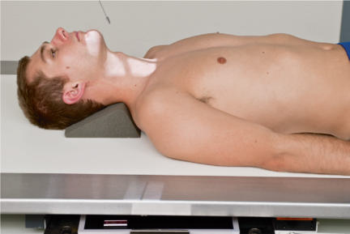
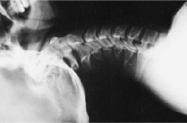
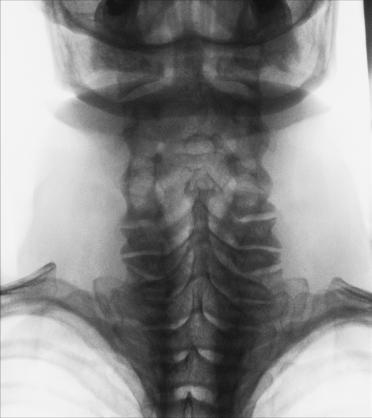

# RADIOGRAFIA ARCULUI VERTEBRAL (PILIERI) AP AXIALĂ (COLOANA CERVICALĂ)

  📷 Radiografie Convențională (Rx)
  <strong>Actualizat:</strong> 2026-09-15
  <strong>Autor:</strong> Departamentul de Radiologie / Referință Bontrager

---

-   __1. Rezumat Clinic & Indicații__

    ---

    === "Indicații Clinice"

        - Patologie sau traumatism acut / regim de urgență care implică arcul vertebral posterior (în special pilierii) de la C4 la C7 și procesele spinoase ale vertebrelor cervicotoracale, cu leziuni de tip „whiplash” (vezi avertizarea anterioară)

    === "Ghid Național IRIS"

        !!! info "Referință Primară: Ghidul Național IRIS (Ordinul MS 1342/2012)"
            - **Capitol Ghid IRIS:** *Coloană vertebrală & Traumatisme*
            - **Grad de Recomandare:** **Grad A**
            - **Nivel de Iradiere Estimată:** `Clasa 1 (Minimă < 0.2 mSv)`

            [:octicons-search-16: Deschide Ghidul IRIS](../../iris.md){ .md-button .md-button--primary } [:material-open-in-new: Aplicația Oficială PWA](https://radiologie-pediatrica.ro/iris/){ .md-button target="_blank" rel="noopener" }

-   __2. Poziționare & Centrare Fascicul__

    ---

    - **Poziție Pacient:** Pacient: poziție în decubit dorsal, pacientul în decubit dorsal cu brațele pe lângă corp; Regiune anatomică: se aliniază planul mediosagital cu raza centrală și cu linia mediană a mesei și/sau a receptorului de imagine. Se hiperextinde gâtul dacă pacientul poate (vezi avertizarea de mai sus) (Fig. 8.77). Se verifică absența rotației: claviculele sunt riguros echidistante față de linia proceselor spinoase; capul sau toracele este prezent.
    - **Punct de Centrare Fascicul:** Fig. 8.77 AP axială (pilieri), unghi caudal de 20°–30°. Imaginea inserată evidențiază unghiul caudal al razei centrale, paralel cu spațiile articulare zigapofizare.
    - **Distanță Focar-Film (DFF / SID):** 100 cm
    - **Comandă Respiratorie:** Apnee pe durata expunerii. Se solicită pacientului să nu înghită în timpul expunerii.

-   __3. Parametri Tehnici Expunere__

    ---

    | Parametru Tehnic | Valoare Configurare Generator / Tub |
    |:-----------------|:-------------------------------------|
    | **Tensiune Tub (kV)** | 70-85 kV |
    | **Sarcină / Produs Curent-Timp (mAs)** | DE CONFIGURAT PE APARAT |
    | **Distanță Focar-Film (DFF / SID)** | 100 cm |
    | **Grilă Antidifuzoare (Bucky)** | Cu grilă antidifuzoare Bucky |
    | **Dimensiune Focar** | Focar Mic (0.6 mm) |
    | **Camere de Ionizare AEC** | Camerele laterale (sau camera centrală, în funcție de regiune) |
    | **Colimare Fascicul** | Colimați pe cele patru laturi la anatomia de interes. |
    | **Filtrare Tub** | Totală ≥ 2.5 mm Al echivalent |

-   __4. Criterii de Calitate & Reușită Imagine__

    ---

    - elementele posterioare ale coloanei cervicale medii și distale și ale coloanei toracale proximale.
    - în special, articulațiile (articulațiile zigapofizare) dintre masele laterale (sau pilieri) sunt deschise și bine evidențiate, împreună cu lamele și procesele spinoase (Figs. 8.78 și 8.79). poziție
    - Absența rotației anatomice: claviculele echidistante față de linia apofizelor spinoase, indicată de procesele spinoase echidistante față de marginile laterale ale coloanei vertebrale.
    - Mandibula și baza craniului trebuie să se suprapună peste primele două sau trei vertebre cervicale.
    - Colimare la aria de interes diagnostic. Expunere
    - expunere optimă a receptorului de imagine și contrast. Evidențiere clară a marginilor părților moi și a marginilor osoase și a desenului trabecular al coloanei cervicale. R Fig. 8.78 AP axială (pilieri). (Cu amabilitatea Teresei Easton-Porter.) proces articular superior (C5) pilier articular (masă laterală) al C1-atlas pilier articular (masă laterală) C5 R proces spinos (T1) articulație zigapofizară (C5-C6) Fig. 8.79 AP axială (pilieri).

-   __5. Protecție Radiologică (ALARA)__

    ---

    - Ecranare gonadică și a organelor radiosensibile conform procedurilor locale de radioprotecție ALARA.
    - Colimare strictă la aria de interes pentru limitarea radiației difuze.
    - Verificarea posibilității unei sarcini la pacientele de vârstă fertilă înainte de expunere.

!!! note "Observații Clinice & Tehnice"
    Hiperextensia suficientă a gâtului și unghiul caudal al razei centrale sunt esențiale pentru evidențierea aspectelor posterioare ale coloanei cervicale medii și inferioare. Valoarea unghiului razei centrale (20° până la 30°) este determinată de amploarea curburii lordotice cervicale naturale. Uneori poate fi plasat un suport sub umeri pentru a obține o hiperextensie suficientă. COLOANA CERVICALĂ SPECIALĂ Incidență laterală cervicotoracică (Swimmer) laterală — hiperflexie și hiperextensie AP (metoda Fuchs), PA (metoda Judd), AP cu mișcarea mandibulei (metoda Ottonello), AP axială (pilieri)

### 🖼️ Imagini

<figure class="protocol-image-card" markdown>

<figcaption><strong>Fig. 8.77 AP axială (pilieri), unghi caudal de 20°–30°. Imaginea inserată evidențiază</strong> — Poziționarea pacientului conform Ghidului Bontrager (Fig. 8.77 AP axială (pilieri), unghi caudal de 20°–30°. Imaginea inserată evidențiază)</figcaption>

</figure>

<figure class="protocol-image-card" markdown>

<figcaption><strong>Fig. 8.78 AP axială (pilieri). (Cu amabilitatea Teresei Easton-</strong> — Aspect radiografic de referință conform Ghidului Bontrager (Fig. 8.78 AP axială (pilieri). (Cu amabilitatea Teresei Easton-)</figcaption>

</figure>

<figure class="protocol-image-card" markdown>

<figcaption><strong>Fig. 8.79 AP axială (pilieri).</strong> — Aspect radiografic de referință conform Ghidului Bontrager (Fig. 8.79 AP axială (pilieri).)</figcaption>

</figure>

<figure class="protocol-image-card" markdown>

<figcaption><strong>Figura 4</strong> — Aspect radiografic de referință conform Ghidului Bontrager (Figura 4)</figcaption>

</figure>

=== "Ghid Rapid de Execuție"

    1. **Identificarea și verificarea pacientului:** verificare identitate, zonă de examinat, consimțământ conform procedurii și evaluarea posibilității unei sarcini, când este relevantă.
    2. **Pregătire:** îndepărtarea oricăror obiecte radiopace (bijuterii, agrafe, fermoare, proteze, pansamente dense).
    3. **Poziționare precisă:** alinierea receptorului de imagine și a tubului la distanța prescrisă (100 cm).
    4. **Colimare strictă:** adaptarea fasciculului strict la regiunea de diagnostic pentru scăderea iradierii și reducerea radiației difuze.
    5. **Radioprotecție:** verificarea [politicii RX](../radioprotectie.md), cu măsuri distincte pentru pacient, personal și însoțitor.

## Surse de documentare

- [Bontrager's Textbook of Radiographic Positioning (Ed. 9/10), Pagina 341](https://www.elsevier.com/books/textbook-of-radiographic-positioning-and-related-anatomy/lampignano/978-0-323-65367-1)
