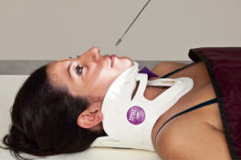
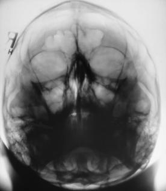
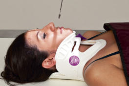
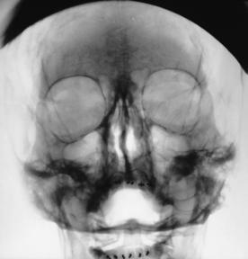

# RADIOGRAFIA ACANTHIOPARIETALEI (INCIDENȚĂ OCCIPITO-MENTONIERĂ INVERSĂ (METODA WATERS)) ȘI A MASIVULUI FACIAL (OASELE FEȚEI) (ACANTHIOPARIETALĂ MODIFICATĂ (INCIDENȚĂ WATERS INVERSĂ MODIFICATĂ))

  📷 Radiografie Convențională (Rx)
  <strong>Actualizat:</strong> 2026-09-15
  <strong>Autor:</strong> Departamentul de Radiologie / Referință Bontrager

---

-   __1. Rezumat Clinic & Indicații__

    ---

    === "Indicații Clinice"

        - suspiciune de fractură, leziuni penetrante și corp străin radioopac / corpuri străine radio-opace

    === "Ghid Național IRIS"

        !!! info "Referință Primară: Ghidul Național IRIS (Ordinul MS 1342/2012)"
            - **Capitol Ghid IRIS:** *Cap — ORL*
            - **Grad de Recomandare:** **Grad B**
            - **Nivel de Iradiere Estimată:** `Clasa 1 (Minimă < 0.1 mSv)`

            [:octicons-search-16: Deschide Ghidul IRIS](../../iris.md){ .md-button .md-button--primary } [:material-open-in-new: Aplicația Oficială PWA](https://radiologie-pediatrica.ro/iris/){ .md-button target="_blank" rel="noopener" }

-   __2. Poziționare & Centrare Fascicul__

    ---

    - **Poziție Pacient:** Pacient: Acanthioparietală (incidență occipito-mentonieră inversă (metoda Waters)), pacient în decubit dorsal; se îndepărtează toate obiectele metalice, din plastic sau alte obiecte detașabile de la nivelul capului. Nu se îndepărtează gulerul cervical decât cu aprobarea medicului curant; Regiune anatomică: Acanthioparietală modificată (incidență occipito-mentonieră inversă modificată (metoda Waters)) (Fig. 15.83), MSP perpendicular pe linia mediană a grilei sau a mesei (vezi avertizarea anterioară).
    - **Punct de Centrare Fascicul:** Unghiul cranial al razei centrale, după caz, pentru a alinia raza centrală paralel cu LML.
    - **Distanță Focar-Film (DFF / SID):** 100 cm
    - **Comandă Respiratorie:** Apnee pe durata expunerii. Masiv facial (oasele feței) traumatism acut / regim de urgență lateral, fascicul orizontal Acanthioparietală (incidență occipito-mentonieră inversă (metoda Waters)) AP (vezi paginile anterioare) OPȚIONALĂ Acanthioparietală modificată (incidență occipito-mentonieră inversă modificată (metoda Waters)) Fig. 15.81 Acanthioparietală (incidență occipito-mentonieră inversă (metoda Waters)) — raza centrală paralelă cu linia mentomeatală (LMM), centrată pe acantion. Fig. 15.82 Acanthioparietală (incidență occipito-mentonieră inversă (metoda Waters)). Fig. 15.83 Acanthioparietală modificată (incidență occipito-mentonieră inversă modificată (metoda Waters)) — raza centrală paralelă cu LML, centrată pe acantion. Fig. 15.84 Acanthioparietală modificată (incidență occipito-mentonieră inversă modificată (metoda Waters)).

-   __3. Parametri Tehnici Expunere__

    ---

    | Parametru Tehnic | Valoare Configurare Generator / Tub |
    |:-----------------|:-------------------------------------|
    | **Tensiune Tub (kV)** | 70-85 kV |
    | **Sarcină / Produs Curent-Timp (mAs)** | DE CONFIGURAT PE APARAT |
    | **Distanță Focar-Film (DFF / SID)** | 100 cm |
    | **Grilă Antidifuzoare (Bucky)** | Cu grilă antidifuzoare Bucky |
    | **Dimensiune Focar** | Focar Mic (0.6 mm) |
    | **Camere de Ionizare AEC** | Camerele laterale (sau camera centrală, în funcție de regiune) |
    | **Colimare Fascicul** | Colimare strictă pe regiunea anatomică de interes diagnostic |
    | **Filtrare Tub** | Totală ≥ 2.5 mm Al echivalent |

-   __4. Criterii de Calitate & Reușită Imagine__

    ---

    - Vizualizarea completă a regiunii anatomice explorate
    - Absența artefactelor de mișcare sau a suprapunerilor neadecvate
    - Contrast și penetrare optime pentru decelarea structurilor osoase și a părților moi

-   __5. Protecție Radiologică (ALARA)__

    ---

    - Ecranare gonadică și a organelor radiosensibile conform procedurilor locale de radioprotecție ALARA.
    - Colimare strictă la aria de interes pentru limitarea radiației difuze.
    - Verificarea posibilității unei sarcini la pacientele de vârstă fertilă înainte de expunere.

!!! note "Observații Clinice & Tehnice"
    Această incidență evidențiază cel mai bine planșeul orbitelor și oferă o incidență a întregilor reborduri orbitare. Stâncile temporale (piramidele pietroase) sunt vizualizate în regiunea sinusurilor maxilare (Fig. 15.84). Se centrează pe acantion; apoi se centrează receptorul de imagine pe proiecția razei centrale. Siguranța radiologică: selectarea factorilor de expunere trebuie optimizată în conformitate cu ALARA. Se efectuează colimarea pe toate cele patru laturi la nivelul anatomiei de interes.

### 🖼️ Imagini

<figure class="protocol-image-card" markdown>

<figcaption><strong>Fig. 15.81 Acanthioparietală (incidență occipito-mentonieră inversă (metoda Waters)) — raza centrală paralelă cu</strong> — Poziționarea pacientului conform Ghidului Bontrager (Fig. 15.81 Acanthioparietală (metoda Waters inversă) — raza centrală paralelă cu)</figcaption>

</figure>

<figure class="protocol-image-card" markdown>

<figcaption><strong>Fig. 15.82 Acanthioparietală (incidență occipito-mentonieră inversă (metoda Waters)).</strong> — Aspect radiografic de referință conform Ghidului Bontrager (Fig. 15.82 Acanthioparietală (metoda Waters inversă).)</figcaption>

</figure>

<figure class="protocol-image-card" markdown>

<figcaption><strong>Fig. 15.83 Acanthioparietală modificată (incidență Waters inversă modificată</strong> — Aspect radiografic de referință conform Ghidului Bontrager (Fig. 15.83 Acanthioparietală modificată (incidență Waters inversă modificată)</figcaption>

</figure>

<figure class="protocol-image-card" markdown>

<figcaption><strong>Fig. 15.84 Acanthioparietală modificată (incidență Waters inversă modificată</strong> — Aspect radiografic de referință conform Ghidului Bontrager (Fig. 15.84 Acanthioparietală modificată (incidență Waters inversă modificată)</figcaption>

</figure>

=== "Ghid Rapid de Execuție"

    1. **Identificarea și verificarea pacientului:** verificare identitate, zonă de examinat, consimțământ conform procedurii și evaluarea posibilității unei sarcini, când este relevantă.
    2. **Pregătire:** îndepărtarea oricăror obiecte radiopace (bijuterii, agrafe, fermoare, proteze, pansamente dense).
    3. **Poziționare precisă:** alinierea receptorului de imagine și a tubului la distanța prescrisă (100 cm).
    4. **Colimare strictă:** adaptarea fasciculului strict la regiunea de diagnostic pentru scăderea iradierii și reducerea radiației difuze.
    5. **Radioprotecție:** verificarea [politicii RX](../radioprotectie.md), cu măsuri distincte pentru pacient, personal și însoțitor.

## Surse de documentare

- [Bontrager's Textbook of Radiographic Positioning (Ed. 9/10), Pagina 619](https://www.elsevier.com/books/textbook-of-radiographic-positioning-and-related-anatomy/lampignano/978-0-323-65367-1)
