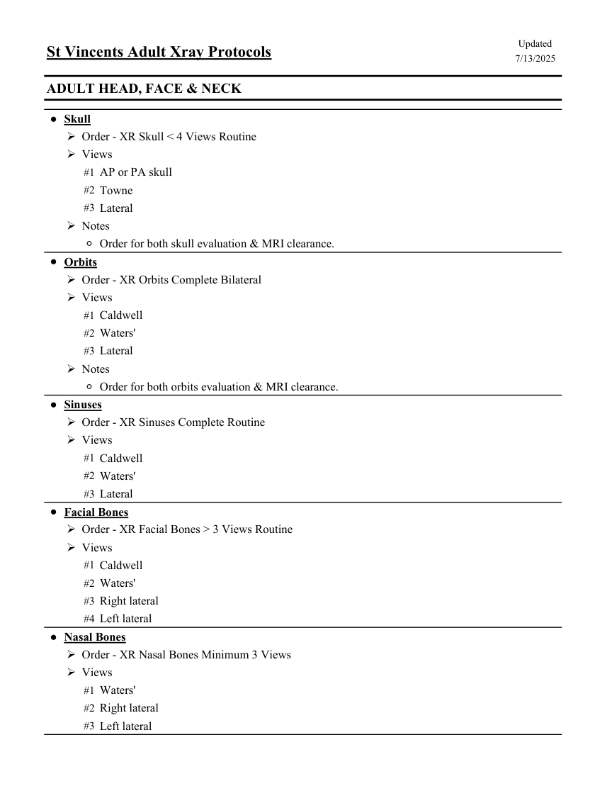
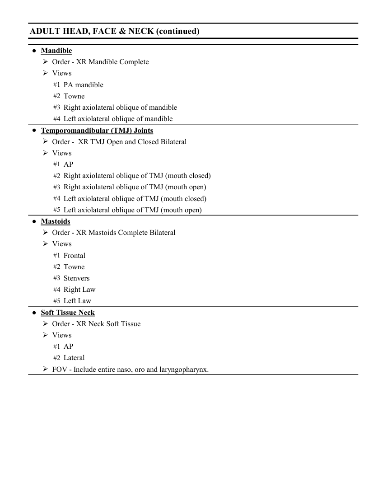

# RX — Adult: craniu, față și gât (MCB)

## Documentul original MCB — Adult: craniu, față și gât

**Colecție de protocoale · 2 pagini · consultat la 2026-09-27.**

[Descarcă PDF-ul integral](../../assets/mcb-modalities/rx-adult-craniu-fata-si-gat-mcb/document.pdf) · [Sursa MCB](https://ref.mcbradiology.com/Protocols,%20Policies,%20Worksheets%20&%20Forms/Xray/Adult%20Protocols/8%20Adult%20Head.pdf) · [Catalogul MCB pentru această modalitate](../mcb/index.md)

Instrucțiunile, valorile și ilustrațiile din documentul original sunt păstrate în **engleză**. Titlul și navigarea sunt în română.

### Pagina 1

{ loading=lazy }

### Pagina 2

{ loading=lazy }

## Textul documentului original

??? abstract "Pagina 1 — text în engleză"

    
Updated
    St Vincents Adult Xray Protocols
    7/13/2025
    ADULT HEAD, FACE &amp; NECK
    ●Skull
    Order - XR Skull &lt; 4 Views Routine
    Views
    #1 AP or PA skull
    #2 Towne
    #3 Lateral
    Notes
    ◦Order for both skull evaluation &amp; MRI clearance.
    ●Orbits
    Order - XR Orbits Complete Bilateral
    Views
    #1 Caldwell
    #2 Waters&#x27;
    #3 Lateral
    Notes
    ◦Order for both orbits evaluation &amp; MRI clearance.
    ●Sinuses
    Order - XR Sinuses Complete Routine
    Views
    #1 Caldwell
    #2 Waters&#x27;
    #3 Lateral
    ●Facial Bones
    Order - XR Facial Bones &gt; 3 Views Routine
    Views
    #1 Caldwell
    #2 Waters&#x27;
    #3 Right lateral
    #4 Left lateral
    ●Nasal Bones
    Order - XR Nasal Bones Minimum 3 Views
    Views
    #1 Waters&#x27;
    #2 Right lateral
    #3 Left lateral
    

??? abstract "Pagina 2 — text în engleză"

    
ADULT HEAD, FACE &amp; NECK (continued)
    ●Mandible
    Order - XR Mandible Complete
    Views
    #1 PA mandible
    #2 Towne
    #3 Right axiolateral oblique of mandible
    #4 Left axiolateral oblique of mandible
    ●Temporomandibular (TMJ) Joints
    Order -  XR TMJ Open and Closed Bilateral
    Views
    #1 AP
    #2 Right axiolateral oblique of TMJ (mouth closed)
    #3 Right axiolateral oblique of TMJ (mouth open)
    #4 Left axiolateral oblique of TMJ (mouth closed)
    #5 Left axiolateral oblique of TMJ (mouth open)
    ●Mastoids
    Order - XR Mastoids Complete Bilateral
    Views
    #1 Frontal
    #2 Towne
    #3 Stenvers
    #4 Right Law
    #5 Left Law
    ●Soft Tissue Neck
    Order - XR Neck Soft Tissue
    Views
    #1 AP
    #2 Lateral
    FOV - Include entire naso, oro and laryngopharynx.
    

