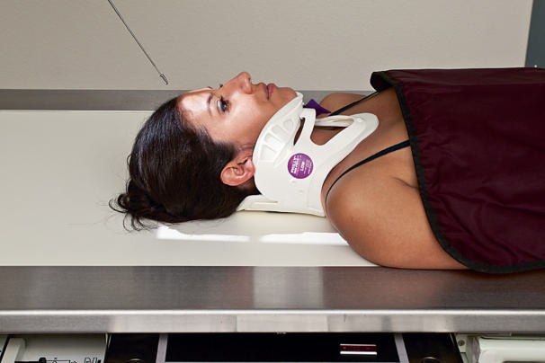

# Rx craniu AP (incidență AP axială, metoda Towne), unghi în grade: 30

  📷 Radiografie Convențională (Rx)
  <strong>Actualizat:</strong> 2026-09-15
  <strong>Autor:</strong> Departamentul de Radiologie / Referință Bontrager

---

-   __1. Rezumat Clinic & Indicații__

    ---

    === "Indicații Clinice"

        - Suspiciune de fractură calvarială, leziuni penetrante și corp străin radioopac / corpuri străine radio-opace

    === "Ghid Național IRIS"

        !!! info "Referință Primară: Ghidul Național IRIS (Ordinul MS 1342/2012)"
            - **Capitol Ghid IRIS:** *Traumatisme — Față și orbite*
            - **Grad de Recomandare:** **Grad B**
            - **Nivel de Iradiere Estimată:** `Clasa 1 (Minimă < 0.2 mSv)`

            [:octicons-search-16: Deschide Ghidul IRIS](../../iris.md){ .md-button .md-button--primary } [:material-open-in-new: Aplicația Oficială PWA](https://radiologie-pediatrica.ro/iris/){ .md-button target="_blank" rel="noopener" }

-   __2. Poziționare & Centrare Fascicul__

    ---

    - **Poziție Pacient:** Pacient: pacient în decubit dorsal; se îndepărtează toate obiectele metalice, din plastic și alte obiecte detașabile de la nivelul capului. Nu se îndepărtează gulerul cervical decât cu aprobarea medicului curant; Regiune anatomică: incidență AP axială (metoda Towne), se aliniază MSP perpendicular pe linia mediană a grilei sau a mesei (vezi AVERTIZAREA anterioară). Se centrează receptorul de imagine pe raza centrală.
    - **Punct de Centrare Fascicul:** Incidență AP axială (metoda Towne) (Fig. 15.79) Unghiul razei centrale: 30 grade caudal față de linia orbitomeatală (LOM) sau 37 grade caudal față de linia infraorbitomeatală (LIOM). (Din nou, se observă că pacientul cu guler cervical și gâtul extins va avea OML și IOML care diferă de relațiile convenționale paralele și perpendiculare formate prin poziționarea de rutină; vezi NOTA.) Se centrează raza centrală pentru a trece la jumătatea distanței dintre EAM și a ieși prin gaura occipitală mare (foramen magnum). Aceasta centrează raza centrală pe planul mediosagital, la 2¼ țoli (6 cm) deasupra arcului superciliar; apoi se centrează receptorul de imagine pe proiecția razei centrale.
    - **Distanță Focar-Film (DFF / SID):** 100 cm
    - **Comandă Respiratorie:** Apnee pe durata expunerii. Craniu traumatism acut / regim de urgență lateral, fascicul orizontal AP AP axială Fig. 15.79 AP axială Towne — raza centrală la 30 grade caudal față de linia orbitomeatală (LOM), centrată pe punctul de mijloc dintre EAM.

-   __3. Parametri Tehnici Expunere__

    ---

    | Parametru Tehnic | Valoare Configurare Generator / Tub |
    |:-----------------|:-------------------------------------|
    | **Tensiune Tub (kV)** | 75-90 kV |
    | **Sarcină / Produs Curent-Timp (mAs)** | DE CONFIGURAT PE APARAT |
    | **Distanță Focar-Film (DFF / SID)** | 100 cm |
    | **Grilă Antidifuzoare (Bucky)** | Cu grilă antidifuzoare Bucky |
    | **Dimensiune Focar** | Focar Mare (1.0 - 1.2 mm) |
    | **Camere de Ionizare AEC** | Camerele laterale (sau camera centrală, în funcție de regiune) |
    | **Colimare Fascicul** | Colimare strictă pe regiunea anatomică de interes diagnostic |
    | **Filtrare Tub** | Totală ≥ 2.5 mm Al echivalent |

-   __4. Criterii de Calitate & Reușită Imagine__

    ---

    - Vizualizarea completă a regiunii anatomice explorate
    - Absența artefactelor de mișcare sau a suprapunerilor neadecvate
    - Contrast și penetrare optime pentru decelarea structurilor osoase și a părților moi

-   __5. Protecție Radiologică (ALARA)__

    ---

    - Ecranare gonadică și a organelor radiosensibile conform procedurilor locale de radioprotecție ALARA.
    - Colimare strictă la aria de interes pentru limitarea radiației difuze.
    - Verificarea posibilității unei sarcini la pacientele de vârstă fertilă înainte de expunere.

!!! note "Observații Clinice & Tehnice"
    raza centrală pentru AP axială nu trebuie să depășească 45 grade, deoarece distorsiunea excesivă va împiedica vizualizarea anatomiei esențiale. Dacă raza centrală nu poate fi înclinată la 30 grade față de linia orbitomeatală (LOM) (înainte de atingerea unghiului maxim de 45 grade), dorsul șeii și procesele clinoide posterioare vor fi vizualizate superior față de gaura occipitală mare (foramen magnum). Siguranța radiologică: selectarea factorilor de expunere trebuie optimizată în conformitate cu ALARA. Se efectuează colimarea pe toate cele patru laturi la nivelul anatomiei de interes. Se respectă reglementările locale, politica departamentului și protocolul utilizat pentru ecranare.

### 🖼️ Imagini

<figure class="protocol-image-card" markdown>

<figcaption><strong>Fig. 15.79 AP axială Towne — raza centrală la 30 grade caudal față de linia orbitomeatală (LOM), centrată</strong> — Poziționarea pacientului conform Ghidului Bontrager (Fig. 15.79 AP axială Towne — raza centrală la 30 grade caudal față de linia orbitomeatală (LOM), centrată)</figcaption>

</figure>

=== "Ghid Rapid de Execuție"

    1. **Identificarea și verificarea pacientului:** verificare identitate, zonă de examinat, consimțământ conform procedurii și evaluarea posibilității unei sarcini, când este relevantă.
    2. **Pregătire:** îndepărtarea oricăror obiecte radiopace (bijuterii, agrafe, fermoare, proteze, pansamente dense).
    3. **Poziționare precisă:** alinierea receptorului de imagine și a tubului la distanța prescrisă (100 cm).
    4. **Colimare strictă:** adaptarea fasciculului strict la regiunea de diagnostic pentru scăderea iradierii și reducerea radiației difuze.
    5. **Radioprotecție:** verificarea [politicii RX](../radioprotectie.md), cu măsuri distincte pentru pacient, personal și însoțitor.

## Surse de documentare

- [Bontrager's Textbook of Radiographic Positioning (Ed. 9/10), Pagina 617](https://www.elsevier.com/books/textbook-of-radiographic-positioning-and-related-anatomy/lampignano/978-0-323-65367-1)
