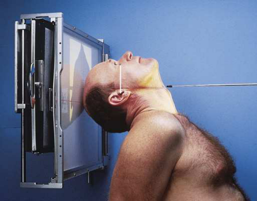
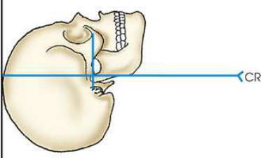
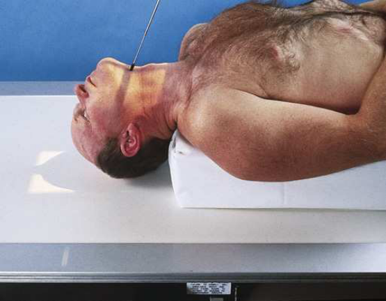
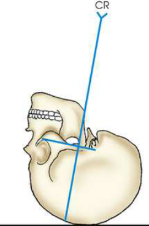
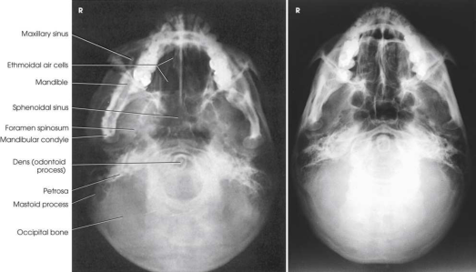

# Rx Bază de Craniu — Submentovertical Incidență — Metoda Schüller (Merrill)

  📷 Radiografie Convențională (Rx)
  <strong>Actualizat:</strong> 2026-09-16
  <strong>Autor:</strong> Referință Merrill

---

-   __1. Rezumat Clinic & Indicații__

    ---

    === "Indicații Clinice"

        - Conform reperelor anatomice standard din tratat

    === "Ghid Național IRIS"

        !!! info "Referință Primară: Ghidul Național IRIS (Ordinul MS 1342/2012)"
            - **Capitol Ghid IRIS:** *Ghidul Național IRIS*
            - **Grad de Recomandare:** **De verificat pe indicație; fără grad atribuit automat**
            - **Nivel de Iradiere Estimată:** `De verificat pentru examinarea și populația selectate`

            [:octicons-search-16: Deschide Ghidul IRIS](../../iris.md){ .md-button .md-button--primary } [:material-open-in-new: Aplicația Oficială PWA](https://radiologie-pediatrica.ro/iris/){ .md-button target="_blank" rel="noopener" }
-   __2. Poziționare & Centrare Fascicul__

    ---

    - **Poziție Pacient:** success de submentovertical (SMV) incidență de cranial base depends pe placing linie infraorbitomeatală (LIOM) ca nearly paralel cu plane de receptorul de imagine ca possible și directing raza centrală perpendicular pe linie infraorbitomeatală (LIOM). following steps sunt taken: se așază pacientul în Decubit dorsal sau Poziție Șezândă-ortostatism; latter este more comfortable. If chair that supports back este used, ortostatism allows greater freedom în positioning pacientul’s corp la place linie infraorbitomeatală (LIOM) paralel cu receptorul de imagine. If pacientul este Poziție Șezândă far enough away de la stativ vertical Bucky, capul poate usually fie ajustat fără placing great pressure pe gâtul. When pacientul este așezat în Decubit dorsal poziție, elevate torso pe firm pillows sau suitable pad la allow capul la rest pe vertex cu gâtul în hyperextension. se flectează pacient’s genunchi la relax abdominal muscles. se poziționează pacientul’s brațe în comfortable poziție, și se ajustează umeri la lie în same plan orizontal. Do nu keep pacientul în final adjustment longer than este absolutely necessary, because Decubit dorsal poziție places considerable strain pe gâtul.; cu MSP de pacientul’s corp centrat pe linia mediană grilă, se extinde pacient’s neck la greatest extent ca poate fie achieved, placing linie infraorbitomeatală (LIOM) ca paralel ca possible la receptorul de imagine. se ajustează pacient’s cap so that MSP este perpendicular pe receptorul de imagine (RI) (Figs. 11.82–11.85).
    - **Punct de Centrare Fascicul:** orientat through șa turcească perpendicular pe linie infraorbitomeatală (LIOM). raza centrală enters MSP de throat între angles de Mandibulă și passes through point inch (1.9 cm) anterior la level de conduct auditiv extern (CAE). Se centrează receptorul de imagine pe raza centrală. receptorul de imagine trebuie să fie paralel cu linie infraorbitomeatală (LIOM).
    - **Distanță Focar-Film (DFF / SID):** Nespecificat în fragmentul extras; de verificat în sursă
    - **Comandă Respiratorie:** apnee (oprirea respirației).

-   __3. Parametri Tehnici Expunere__

    ---

    | Parametru Tehnic | Valoare Configurare Generator / Tub |
    |:-----------------|:-------------------------------------|
    | **Tensiune Tub (kV)** | DE CONFIGURAT PE APARAT |
    | **Sarcină / Produs Curent-Timp (mAs)** | DE CONFIGURAT PE APARAT |
    | **Distanță Focar-Film (DFF / SID)** | Nespecificat în fragmentul extras; de verificat în sursă |
    | **Grilă Antidifuzoare (Bucky)** | DE CONFIGURAT PE APARAT |
    | **Dimensiune Focar** | DE CONFIGURAT PE APARAT |
    | **Camere de Ionizare AEC** | DE CONFIGURAT PE APARAT |
    | **Colimare Fascicul** | se ajustează câmp de iradiere la extend 1 inch (2.5 cm) beyond shadow de tip de nasul și 1 inch (2.5 cm) beyond lateral margini. Place marker de lateralitate (D/S) în collimated expunere field. |
    | **Filtrare Tub** | DE CONFIGURAT PE APARAT |

-   __4. Criterii de Calitate & Reușită Imagine__

    ---

    - Criterii radiologice de calitate imaginii: n Evidence de corect collimation și presence de marker de lateralitate (D/S) plasat clear de anatomy de interest n Entire Craniu, fără tilt sau rotație, evidențiat prin:
    - Equal distances de la lateral margini de Craniu la mandibular condyles pe ambele părți (bilateral)
    - simetric petrosae n linie infraorbitomeatală (LIOM) este paralel cu receptorul de imagine (full neck extension), evidențiat prin:
    - Mental protuberance superimposed over anterior frontal bone
    - Mandibular condyles anterior la petrosae n Bony details de cranial base și surrounding soft tissues.

-   __5. Protecție Radiologică (ALARA)__

    ---

    - Nespecificat în fragmentul extras; de verificat în sursă

!!! note "Observații Clinice & Tehnice"
    pacienți plasat în Decubit dorsal poziție pentru cranial base poate have increased intracranial pressure. ca result, they poate fie dizzy sau unstable pentru few minutes after having been în this poziție. Use de ortostatism poate alleviate some de this pressure. se imobilizează pacient’s cap. în absence de cap clamp, place suitably backed strip de adhesive tape across tip de bărbia și anchor it la sides de radiographic unit if needed. (part de tape touching skin trebuie să fie covered.) Schüller 7 described și illustrated basal incidențe—SMV și verticosubmental (VSM)—but Pfeifer 8 gave specific directions pentru raza centrală angulation.

### 🖼️ Imagini

<figure class="protocol-image-card" markdown>

<figcaption><strong>Merrill — pagina PDF 888, imaginea 1</strong> — Imagine din fragmentul sursă; asocierea necesită revizie.</figcaption>

</figure>

<figure class="protocol-image-card" markdown>

<figcaption><strong>Merrill — pagina PDF 888, imaginea 2</strong> — Imagine din fragmentul sursă; asocierea necesită revizie.</figcaption>

</figure>

<figure class="protocol-image-card" markdown>

<figcaption><strong>Merrill — pagina PDF 889, imaginea 3</strong> — Imagine din fragmentul sursă; asocierea necesită revizie.</figcaption>

</figure>

<figure class="protocol-image-card" markdown>

<figcaption><strong>Merrill — pagina PDF 889, imaginea 4</strong> — Imagine din fragmentul sursă; asocierea necesită revizie.</figcaption>

</figure>

<figure class="protocol-image-card" markdown>

<figcaption><strong>Merrill — pagina PDF 890, imaginea 5</strong> — Imagine din fragmentul sursă; asocierea necesită revizie.</figcaption>

</figure>

=== "Ghid Rapid de Execuție"

    1. **Identificarea și verificarea pacientului:** verificare identitate, zonă de examinat, consimțământ conform procedurii și evaluarea posibilității unei sarcini, când este relevantă.
    2. **Pregătire:** îndepărtarea oricăror obiecte radiopace (bijuterii, agrafe, fermoare, proteze, pansamente dense).
    3. **Poziționare precisă:** alinierea receptorului de imagine și a tubului la distanța prescrisă (Nespecificat în fragmentul extras; de verificat în sursă).
    4. **Colimare strictă:** adaptarea fasciculului strict la regiunea de diagnostic pentru scăderea iradierii și reducerea radiației difuze.
    5. **Radioprotecție:** verificarea [politicii RX](../radioprotectie.md), cu măsuri distincte pentru pacient, personal și însoțitor.

## Surse de documentare

- [Merrill’s Atlas, 11. Cranium, pagini PDF 887–890](../../assets/protocols/sources/a56d45c16829_Merrills_Atlas_of_Radiographic_Positioning__Procedures_3Vol_Set.pdf#page=887)

## Fragmente sursă traduse (referință tehnică)

### anatomy

simetric imagini de petrosae, mastoid processes, foramina ovale și spinosum (which sunt best vizualizat în this incidență), carotid
canals, sphenoidal și sinusuri etmoidale, mandible, bony nasal septum, dens de axis, și occipital bone. maxillary
sinuses sunt superimposed over mandible (Fig. 11.86).
SMV incidență este also used la evidențiază zygomatic arches, mandible, ethmoidal, și sinusuri sfenoidale cu adjustment în expunere
factors (see sections pe Facial Bone radiografie și Sinus radiografie later în this chapter).

### collimation

• se ajustează câmp de iradiere la extend 1 inch (2.5 cm) beyond shadow de tip de nasul și 1 inch (2.5 cm) beyond lateral
margini. Place marker de lateralitate (D/S) în collimated expunere field.

### cr

• orientat through șa turcească perpendicular pe linie infraorbitomeatală (LIOM). raza centrală enters MSP de throat între angles de mandible și passes through point
inch (1.9 cm) anterior la level de conduct auditiv extern (CAE).
• Se centrează receptorul de imagine pe raza centrală. receptorul de imagine trebuie să fie paralel cu linie infraorbitomeatală (LIOM).

### criteria

Criterii radiologice de calitate imaginii:
n Evidence de corect collimation și presence de marker de lateralitate (D/S) plasat clear de anatomy de interest
n Entire cranium, fără tilt sau rotație, evidențiat prin:
• Equal distances de la lateral margini de craniul la mandibular condyles pe ambele părți (bilateral)
• simetric petrosae
n linie infraorbitomeatală (LIOM) este paralel cu receptorul de imagine (full neck extension), evidențiat prin:
• Mental protuberance superimposed over anterior frontal bone
• Mandibular condyles anterior la petrosae
n Bony details de cranial base și surrounding soft tissues.

### notes

pacienți plasat în decubit dorsal pentru cranial base poate have increased intracranial pressure. ca result, they poate fie dizzy sau
unstable pentru few minutes after having been în this poziție. Use de ortostatism poate alleviate some de this pressure.
• se imobilizează pacient’s cap. în absence de cap clamp, place suitably backed strip de adhesive tape across tip de bărbia
și anchor it la sides de radiographic unit if needed. (part de tape touching skin trebuie să fie covered.)
Schüller 7 described și illustrated basal incidențe—SMV și verticosubmental (VSM)—but Pfeifer 8 gave specific directions
pentru raza centrală angulation.

### part_pos

• cu MSP de pacientul’s corp centrat pe linia mediană grilă, se extinde pacient’s neck la greatest extent ca poate fie achieved,
placing linie infraorbitomeatală (LIOM) ca paralel ca possible la receptorul de imagine.
• se ajustează pacient’s cap so that MSP este perpendicular pe receptorul de imagine (RI) (Figs. 11.82–11.85).

### patient_pos

success de submentovertical (SMV) incidență de cranial base depends pe placing linie infraorbitomeatală (LIOM) ca nearly paralel cu plane de receptorul de imagine
ca possible și directing raza centrală perpendicular pe linie infraorbitomeatală (LIOM). following steps sunt taken:
• se așază pacientul în decubit dorsal sau așezat pe scaun-ortostatism; latter este more comfortable. If chair that supports back este used,
ortostatism allows greater freedom în positioning pacientul’s corp la place linie infraorbitomeatală (LIOM) paralel cu receptorul de imagine. If pacientul este
așezat pe scaun far enough away de la stativ vertical Bucky, capul poate usually fie ajustat fără placing great pressure pe gâtul.
• When pacientul este așezat în decubit dorsal, elevate torso pe firm pillows sau suitable pad la allow capul la rest pe vertex cu gâtul în hyperextension.
• se flectează pacient’s genunchi la relax abdominal muscles.
• se poziționează pacientul’s brațe în comfortable poziție, și se ajustează umeri la lie în same plan orizontal.
• Do nu keep pacientul în final adjustment longer than este absolutely necessary, because decubit dorsal places considerable
strain pe gâtul.

### respiration

apnee (oprirea respirației).

### tech

poziționat prin manufacturer sau department protocol pentru corect anatomy display orientation; raza centrală plate: 10 × 12 inches (24 ×
30 cm) longitudinal.

