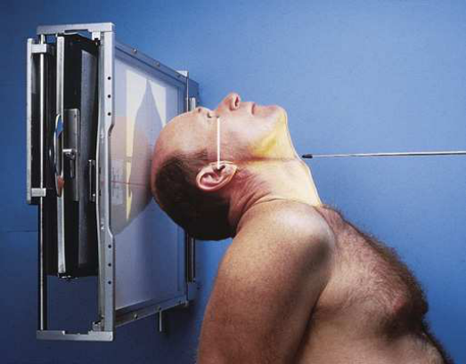
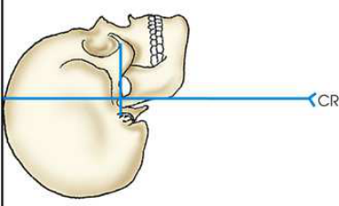
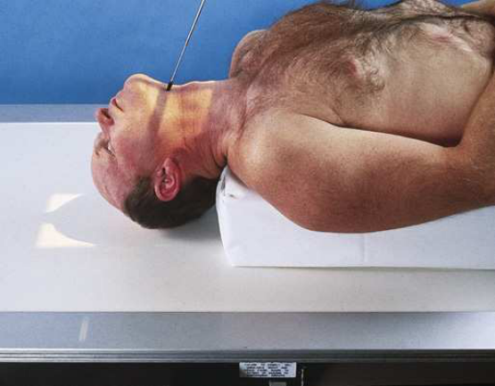
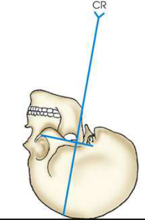
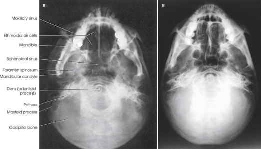

# Rx Baza craniului — Incidență submentovertex — Metoda Schüller (Merrill)

  📷 Radiografie Convențională (Rx)
  <strong>Actualizat:</strong> 2026-09-16
  <strong>Autor:</strong> Referință Merrill

---

-   __1. Rezumat Clinic & Indicații__

    ---

    === "Indicații Clinice"

        - Conform reperelor anatomice standard din tratat

    === "Ghid Național IRIS"

        !!! info "Referință Primară: Ghidul Național IRIS (Ordinul MS 1342/2012)"
            - **Capitol Ghid IRIS:** *Traumatisme — Față și orbite*
            - **Grad de Recomandare:** **Grad B**
            - **Nivel de Iradiere Estimată:** `Clasa 1 (Minimă < 0.2 mSv)`

            [:octicons-search-16: Deschide Ghidul IRIS](../../iris.md){ .md-button .md-button--primary } [:material-open-in-new: Aplicația Oficială PWA](https://radiologie-pediatrica.ro/iris/){ .md-button target="_blank" rel="noopener" }

-   __2. Poziționare & Centrare Fascicul__

    ---

    - **Poziție Pacient:** Succesul incidenței submentovertex (SMV) pentru baza craniului depinde de poziționarea liniei infraorbitomeatale (LIOM) cât mai paralel cu planul receptorului de imagine și de orientarea razei centrale perpendicular pe linia infraorbitomeatală (LIOM). Se urmează pașii următori: se așază pacientul în decubit dorsal sau în poziție șezândă-ortostatism; aceasta din urmă este mai confortabilă. Dacă se utilizează un scaun care susține spatele, ortostatismul permite o libertate mai mare în poziționarea corpului pacientului pentru a plasa linia infraorbitomeatală (LIOM) paralel cu receptorul de imagine. Dacă pacientul este așezat pe scaun suficient de departe de stativul vertical Bucky, capul poate fi de obicei ajustat fără a exercita presiune mare asupra gâtului. Când pacientul este așezat în decubit dorsal, se ridică trunchiul pe perne ferme sau pe un suport adecvat pentru a permite capului să se sprijine pe vertex, cu gâtul în hiperextensie. Se flectează genunchii pacientului pentru relaxarea mușchilor abdominali. Se poziționează brațele pacientului într-o poziție confortabilă și se ajustează umerii astfel încât să se afle în același plan orizontal. Nu se menține pacientul în poziția finală mai mult decât este absolut necesar, deoarece decubitul dorsal solicită considerabil gâtul.; cu MSP al corpului pacientului centrat pe linia mediană a grilei, se extinde gâtul pacientului la maximum, astfel încât linia infraorbitomeatală (LIOM) să fie cât mai paralelă posibil cu receptorul de imagine. Se ajustează capul pacientului astfel încât MSP să fie perpendicular pe receptorul de imagine (RI) (Figs. 11.82–11.85).
    - **Punct de Centrare Fascicul:** orientată prin șaua turcească, perpendicular pe linia infraorbitomeatală (LIOM). Raza centrală pătrunde prin MSP al gâtului, între unghiurile mandibulei, și trece printr-un punct situat la [valoare lipsă în sursă] țoli (1.9 cm) anterior de nivelul conductului auditiv extern (CAE). Se centrează receptorul de imagine pe raza centrală. Receptorul de imagine trebuie să fie paralel cu linia infraorbitomeatală (LIOM).
    - **Distanță Focar-Film (DFF / SID):** Nespecificat în fragmentul extras; de verificat în sursă
    - **Comandă Respiratorie:** apnee (oprirea respirației).

-   __3. Parametri Tehnici Expunere__

    ---

    | Parametru Tehnic | Valoare Configurare Generator / Tub |
    |:-----------------|:-------------------------------------|
    | **Tensiune Tub (kV)** | DE CONFIGURAT PE APARAT |
    | **Sarcină / Produs Curent-Timp (mAs)** | DE CONFIGURAT PE APARAT |
    | **Distanță Focar-Film (DFF / SID)** | Nespecificat în fragmentul extras; de verificat în sursă |
    | **Grilă Antidifuzoare (Bucky)** | DE CONFIGURAT PE APARAT |
    | **Dimensiune Focar** | DE CONFIGURAT PE APARAT |
    | **Camere de Ionizare AEC** | DE CONFIGURAT PE APARAT |
    | **Colimare Fascicul** | se ajustează câmpul de iradiere astfel încât să se extindă 1 țol (2.5 cm) dincolo de umbra vârfului nasului și 1 țol (2.5 cm) dincolo de marginile laterale. Se plasează markerul de lateralitate (D/S) în câmpul de expunere colimat. |
    | **Filtrare Tub** | DE CONFIGURAT PE APARAT |

-   __4. Criterii de Calitate & Reușită Imagine__

    ---

    - Criterii radiologice de calitate a imaginii: n Dovezi de colimare corectă și prezența markerului de lateralitate (D/S), plasat clar în afara anatomiei de interes n Întregul craniu, fără înclinare sau rotație, evidențiat prin:
    - Distanțe egale de la marginile laterale ale craniului la condilii mandibulari de ambele părți (bilateral)
    - pietroase simetrice n Linia infraorbitomeatală (LIOM) este paralelă cu receptorul de imagine (extensie completă a gâtului), evidențiată prin:
    - Proeminența mentonieră suprapusă peste osul frontal anterior
    - Condilii mandibulari anterior față de oasele pietroase n Detalii osoase ale bazei craniului și țesuturile moi înconjurătoare.

-   __5. Protecție Radiologică (ALARA)__

    ---

    - Nespecificat în fragmentul extras; de verificat în sursă

!!! note "Observații Clinice & Tehnice"
    Pacienții plasați în decubit dorsal pentru baza craniului pot avea presiune intracraniană crescută. Ca rezultat, pot fi amețiți sau instabili timp de câteva minute după ce au fost în această poziție. Utilizarea ortostatismului poate ameliora o parte din această presiune. Se imobilizează capul pacientului. În absența unei cleme pentru cap, se plasează, dacă este necesar, o fâșie de bandă adezivă cu suport adecvat peste vârful bărbiei și se fixează de părțile laterale ale aparatului radiologic. (Porțiunea benzii care atinge pielea trebuie acoperită.) Schüller 7 a descris și ilustrat incidențele bazale—SMV și verticosubmentală (VSM)—dar Pfeifer 8 a oferit indicații specifice pentru angularea razei centrale.

### 🖼️ Imagini

<figure class="protocol-image-card" markdown>

<figcaption><strong>Merrill — pagina 888, imaginea 1</strong> — Imagine din fragmentul sursă; asocierea necesită revizie.</figcaption>

</figure>

<figure class="protocol-image-card" markdown>

<figcaption><strong>Merrill — pagina 888, imaginea 2</strong> — Imagine din fragmentul sursă; asocierea necesită revizie.</figcaption>

</figure>

<figure class="protocol-image-card" markdown>

<figcaption><strong>Merrill — pagina 889, imaginea 3</strong> — Imagine din fragmentul sursă; asocierea necesită revizie.</figcaption>

</figure>

<figure class="protocol-image-card" markdown>

<figcaption><strong>Merrill — pagina 889, imaginea 4</strong> — Imagine din fragmentul sursă; asocierea necesită revizie.</figcaption>

</figure>

<figure class="protocol-image-card" markdown>

<figcaption><strong>Merrill — pagina 890, imaginea 5</strong> — Imagine din fragmentul sursă; asocierea necesită revizie.</figcaption>

</figure>

=== "Ghid Rapid de Execuție"

    1. **Identificarea și verificarea pacientului:** verificare identitate, zonă de examinat, consimțământ conform procedurii și evaluarea posibilității unei sarcini, când este relevantă.
    2. **Pregătire:** îndepărtarea oricăror obiecte radiopace (bijuterii, agrafe, fermoare, proteze, pansamente dense).
    3. **Poziționare precisă:** alinierea receptorului de imagine și a tubului la distanța prescrisă (Nespecificat în fragmentul extras; de verificat în sursă).
    4. **Colimare strictă:** adaptarea fasciculului strict la regiunea de diagnostic pentru scăderea iradierii și reducerea radiației difuze.
    5. **Radioprotecție:** verificarea [politicii RX](../radioprotectie.md), cu măsuri distincte pentru pacient, personal și însoțitor.

## Surse de documentare

- [Merrill’s Atlas, 11. Cranium, pagini 887–890](https://books.google.com/books/about/Merrill_s_Atlas_of_Radiographic_Position.html?id=BM0lEQAAQBAJ)
