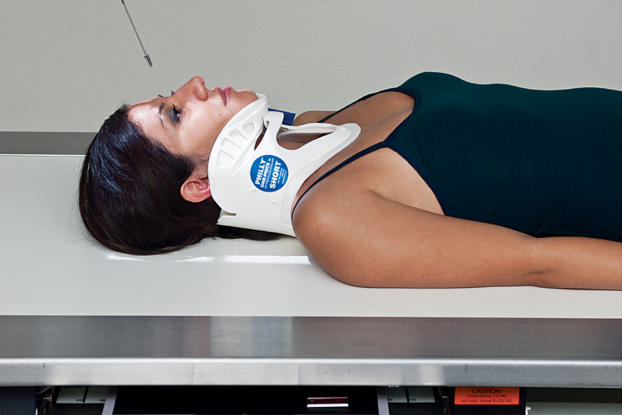
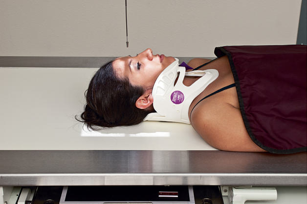

# Rx craniu AP, AP axială la 15 grade (incidență occipito-frontală inversată, metoda Caldwell)

  📷 Radiografie Convențională (Rx)
  <strong>Actualizat:</strong> 2026-09-15
  <strong>Autor:</strong> Departamentul de Radiologie / Referință Bontrager

---

-   __1. Rezumat Clinic & Indicații__

    ---

    === "Indicații Clinice"

        - Suspiciune de fractură calvarială, leziuni penetrante și corp străin radioopac / corpuri străine radio-opace

    === "Ghid Național IRIS"

        !!! info "Referință Primară: Ghidul Național IRIS (Ordinul MS 1342/2012)"
            - **Capitol Ghid IRIS:** *Cap — ORL*
            - **Grad de Recomandare:** **Grad B**
            - **Nivel de Iradiere Estimată:** `Clasa 1 (Minimă < 0.1 mSv)`

            [:octicons-search-16: Deschide Ghidul IRIS](../../iris.md){ .md-button .md-button--primary } [:material-open-in-new: Aplicația Oficială PWA](https://radiologie-pediatrica.ro/iris/){ .md-button target="_blank" rel="noopener" }

-   __2. Poziționare & Centrare Fascicul__

    ---

    - **Poziție Pacient:** Pacient: pacient în decubit dorsal; se îndepărtează toate obiectele metalice, din plastic și alte obiecte detașabile de la nivelul capului. Nu se îndepărtează gulerul cervical decât cu aprobarea medicului curant.; Regiune anatomică: AP și AP axial 15 grade. Se aliniază MSP perpendicular pe linia mediană a grilei sau a mesei (vezi AVERTISMENTUL anterior). Se centrează receptorul de imagine pe raza centrală.
    - **Punct de Centrare Fascicul:** Incidența AP la linia orbitomeatală (Fig. 15.77) Unghiul razei centrale paralel cu linia orbitomeatală (LOM): la pacientul cu guler cervical, acesta este adesea de aproximativ 10 la 15 grade caudal, dar fiecare pacient și fiecare situație vor fi diferite. Se centrează raza centrală la glabelă; apoi se centrează receptorul de imagine pe proiecția razei centrale. Incidența AP axială 15 grade, occipitofrontală inversă (Metoda Caldwell) (Fig. 15.78) Unghiul razei centrale 15 grade cranial față de linia orbitomeatală (LOM): pentru realizarea acesteia, se identifică mai întâi linia orbitomeatală (LOM) la pacient; aceasta variază la pacienții cu gulere cervicale și gâtul extins. Apoi se angulează raza centrală 15 grade cefalic față de linia orbitomeatală (LOM) a pacientului. Se centrează raza centrală la nazion; apoi se centrează receptorul de imagine pe proiecția razei centrale. Selectarea factorilor de expunere pentru siguranța radiologică trebuie optimizată în conformitate cu ALARA. Se colimează pe patru laturi la nivelul anatomiei de interes. Se respectă reglementările locale, politica departamentului și protocolul utilizat pentru ecranare.
    - **Distanță Focar-Film (DFF / SID):** 100 cm
    - **Comandă Respiratorie:** Apnee pe durata expunerii. Traumatism acut al craniului / Regim de urgență, profil, fascicul orizontal AP AP axial Fig. 15.77 AP raza centrală paralelă cu linia orbitomeatală (LOM), centrată pe glabelă. Fig. 15.78 AP axial 15 grade, incidență occipitofrontală inversă (Metoda Caldwell)—raza centrală 15 grade cranial față de linia orbitomeatală (LOM), centrată pe nazion.

-   __3. Parametri Tehnici Expunere__

    ---

    | Parametru Tehnic | Valoare Configurare Generator / Tub |
    |:-----------------|:-------------------------------------|
    | **Tensiune Tub (kV)** | 75-90 kV |
    | **Sarcină / Produs Curent-Timp (mAs)** | DE CONFIGURAT PE APARAT |
    | **Distanță Focar-Film (DFF / SID)** | 100 cm |
    | **Grilă Antidifuzoare (Bucky)** | Cu grilă antidifuzoare Bucky |
    | **Dimensiune Focar** | Focar Mare (1.0 - 1.2 mm) |
    | **Camere de Ionizare AEC** | Camerele laterale (sau camera centrală, în funcție de regiune) |
    | **Colimare Fascicul** | Colimare strictă pe regiunea anatomică de interes diagnostic |
    | **Filtrare Tub** | Totală ≥ 2.5 mm Al echivalent |

-   __4. Criterii de Calitate & Reușită Imagine__

    ---

    - Vizualizarea completă a regiunii anatomice explorate
    - Absența artefactelor de mișcare sau a suprapunerilor neadecvate
    - Contrast și penetrare optime pentru decelarea structurilor osoase și a părților moi

-   __5. Protecție Radiologică (ALARA)__

    ---

    - Ecranare gonadică și a organelor radiosensibile conform procedurilor locale de radioprotecție ALARA.
    - Colimare strictă la aria de interes pentru limitarea radiației difuze.
    - Verificarea posibilității unei sarcini la pacientele de vârstă fertilă înainte de expunere.

!!! note "Observații Clinice & Tehnice"
    Scanarea CT dinamică este disponibilă pe scară largă în majoritatea spitalelor care tratează pacienți cu traumatisme craniene; astfel, utilizarea de rutină a CT a fost susținută ca instrument de screening pentru triajul pacienților cu traumatisme craniene minore sau ușoare care necesită internare sau intervenție chirurgicală, dintre cei care pot fi externați în siguranță fără internare.13

### 🖼️ Imagini

<figure class="protocol-image-card" markdown>

<figcaption><strong>Fig. 15.77 AP raza centrală paralelă cu linia orbitomeatală (LOM), centrată pe glabelă.</strong> — Poziționarea pacientului conform Ghidului Bontrager (Fig. 15.77 AP raza centrală paralelă cu linia orbitomeatală (LOM), centrată pe glabelă.)</figcaption>

</figure>

<figure class="protocol-image-card" markdown>

<figcaption><strong>Fig. 15.78 AP axial 15 grade, incidență occipitofrontală inversă (Metoda Caldwell)—raza centrală 15 grade</strong> — Aspect radiografic de referință conform Ghidului Bontrager (Fig. 15.78 AP axial 15 grade, metoda Caldwell inversă — raza centrală 15 grade)</figcaption>

</figure>

=== "Ghid Rapid de Execuție"

    1. **Identificarea și verificarea pacientului:** verificare identitate, zonă de examinat, consimțământ conform procedurii și evaluarea posibilității unei sarcini, când este relevantă.
    2. **Pregătire:** îndepărtarea oricăror obiecte radiopace (bijuterii, agrafe, fermoare, proteze, pansamente dense).
    3. **Poziționare precisă:** alinierea receptorului de imagine și a tubului la distanța prescrisă (100 cm).
    4. **Colimare strictă:** adaptarea fasciculului strict la regiunea de diagnostic pentru scăderea iradierii și reducerea radiației difuze.
    5. **Radioprotecție:** verificarea [politicii RX](../radioprotectie.md), cu măsuri distincte pentru pacient, personal și însoțitor.

## Surse de documentare

- [Bontrager's Textbook of Radiographic Positioning (Ed. 9/10), Pagina 616](https://www.elsevier.com/books/textbook-of-radiographic-positioning-and-related-anatomy/lampignano/978-0-323-65367-1)
