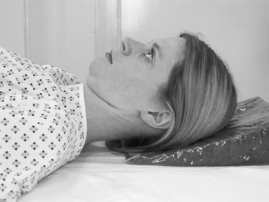
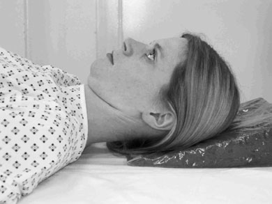
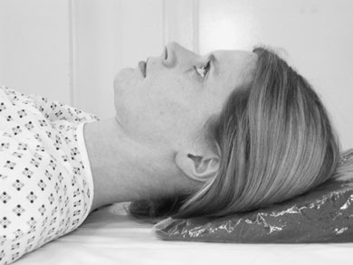
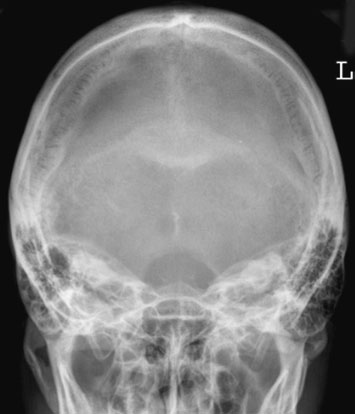
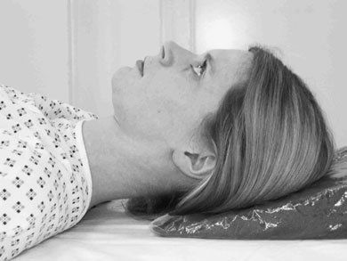

# Rx Craniu Fronto - occipital

  📷 Radiografie Convențională (Rx)
  <strong>Actualizat:</strong> 2026-09-16
  <strong>Autor:</strong> Departamentul de Radiologie / Referință Clark (Ed. 12)

---

-   __1. Rezumat Clinic & Indicații__

    ---

    === "Indicații Clinice"

        - See occipito-frontal incidențe (p. 240).
        - gaură occipitală mare (foramen magnum) trebuie să fie seen clearly pe this incidență. margins poate fie obscured prin incorrect angulation, thus hiding important suspiciune de fractură.
        - zygoma poate fie seen well pe this incidență. If suspiciune de fracturăd, this gives clue la presence de associated facial injury.

    === "Ghid Național IRIS"

        !!! info "Referință Primară: Ghidul Național IRIS (Ordinul MS 1342/2012)"
            - **Capitol Ghid IRIS:** *Ghidul Național IRIS*
            - **Grad de Recomandare:** **De verificat pe indicație; fără grad atribuit automat**
            - **Nivel de Iradiere Estimată:** `De verificat pentru examinarea și populația selectate`

            [:octicons-search-16: Deschide Ghidul IRIS](../../iris.md){ .md-button .md-button--primary } [:material-open-in-new: Aplicația Oficială PWA](https://radiologie-pediatrica.ro/iris/){ .md-button target="_blank" rel="noopener" }
-   __2. Poziționare & Centrare Fascicul__

    ---

    - **Poziție Pacient:** • pacientul este culcat Decubit dorsal pe trolley sau masa radiologică, sau cu posterior aspect de Craniu resting pe casetă cu grilă antidifuzoare.
• capul este ajustat la bring planul mediosagital la rightangles la film radiologic și coincident cu its midline. în this poziție, extern auditory meatuses sunt echidistant față de caseta.
• orbito-meatal baseline trebuie să fie perpendicular pe casetă.

• pacientul este culcat Decubit dorsal pe trolley sau masa radiologică, cu posterior aspect de Craniu resting pe casetă cu grilă antidifuzoare.
• capul este ajustat la bring planul mediosagital la rightangles la caseta și so it este coincident cu its midline.
• orbito-meatal base line trebuie să fie perpendicular pe film radiologic.
    - **Punct de Centrare Fascicul:** toate angulations pentru fronto-occipital incidențe sunt made cranially.
Fronto-occipital
• raza centrală este orientat perpendicular pe casetă sau Bucky along planul mediosagital.
• collimation field trebuie să fie set pentru include vertex de Craniu superiorly, base de occipital bone inferiorly, și Profil (lateral) skin margins. It este important la ensure that toate de tubul este centred la middle de Bucky.
Fronto-occipital caudal angulation:
10, 15 și 20 grade
• technique used pentru these three incidențe este similar la that employed pentru occipito-frontal, except that cranial angulation este applied. grade de angulation will depend pe incidență required.
• Remember that caseta sau Bucky trebuie să fie displaced superiorly la allow pentru tubul angulation, otherwise aria de interes diagnostic will fie projected off film radiologic. pentru a 20-grade angle, top de caseta will need la fie 5 cm above Craniu vertex.

• raza centrală este înclinat caudally so it makes angle de 30 grade la orbito-meatal plane.
• Centre în linia mediană astfel încât fascicul passes midway între extern auditory meatuses. This este la point approximately 5 cm above glabelă.
• top de caseta trebuie să fie poziționat adjacent la vertex de Craniu la ensure that fascicul angulation does nu project aria de interes diagnostic off bottom de imagine.
    - **Distanță Focar-Film (DFF / SID):** 100 cm
    - **Comandă Respiratorie:** Apnee pe durata expunerii (apnee în inspir pentru torace; expir pentru Abdomen/bazin).

-   __3. Parametri Tehnici Expunere__

    ---

    | Parametru Tehnic | Valoare Configurare Generator / Tub |
    |:-----------------|:-------------------------------------|
    | **Tensiune Tub (kV)** | DE CONFIGURAT PE APARAT |
    | **Sarcină / Produs Curent-Timp (mAs)** | Conform AEC / grosime anatomică |
    | **Distanță Focar-Film (DFF / SID)** | 100 cm |
    | **Grilă Antidifuzoare (Bucky)** | Cu grilă antidifuzoare Bucky |
    | **Dimensiune Focar** | Focar Mic (0.6 mm) |
    | **Camere de Ionizare AEC** | Camerele laterale (sau camera centrală funcție de regiune) |
    | **Colimare Fascicul** | Colimare strictă la aria anatomică de interes diagnostic |
    | **Filtrare Tub** | Totală ≥ 2.5 mm Al echivalent (conform Clark: 3.0 mm Al eq.) |

-   __4. Criterii de Calitate & Reușită Imagine__

    ---

    - șa turcească de sphenoid bone este projected within gaură occipitală mare (foramen magnum).
    - imagine trebuie să include toate de occipital bone și posterior parts de parietal bone, și lambdoidal suture trebuie să fie visualized clearly.
    - Craniu trebuie să nu fie rotit. This poate also fie assessed prin ensuring that șa turcească appears în middle de gaură occipitală mare (foramen magnum).
    - Erori de evitat / remedii: See occipito-frontal incidențe (p. 241).
    - Erori de evitat / remedii: Remember that increasing grade de cranial angulation will project stânci temporale (piramide pietroase) further down orbits.
    - Erori de evitat / remedii: Under-angulation: gaură occipitală mare (foramen magnum) este nu clar evidențiat(e) above stânci temporale (piramide pietroase). This este probably most common fault, ca pacientul poate find it difficult la maintain baseline perpendicular pe film radiologic.

-   __5. Protecție Radiologică (ALARA)__

    ---

    - Ecranare gonadică cu șorț plumbat dacă gonadele sunt în apropierea fasciculului util (regula ALARA).
    - Colimare precisă la dimensiunea anatomică strict necesară pentru reducerea dozei și a radiației difuze.
    - Verificarea posibilității unei sarcini la pacientele de vârstă fertilă înainte de expunere.

!!! note "Observații Clinice & Tehnice"
    See occipito-frontal incidențe (p. 241).
• în example given below, FO20°↓incidență este required, but pacientul poate only maintain their orbito-meatal base line în poziție 10 grade back de la perpendicular (i.e. cu bărbia raised slightly). în order la achieve overall 20-grade angle, ten-grade cranial angulation will need la fie applied la tubul.
• Similarly, if pacientul’s chin was raised astfel încât baseline was 20 grade la perpendicular, then FO20°↓ incidență could fie achieved prin using straight tube perpendicular pe film radiologic.
20° 10° 10° FO20°↑incidență achieved cu 10° tube angle și RBL raised 10° FO incidență FO20°↑incidență

### 🖼️ Imagini

<figure class="protocol-image-card" markdown>

<figcaption><strong>Figura 1: Aspect radiografic / Poziționare (Clark Ed. 12)</strong> — Poziționare pacient și centrare fascicul conform Clark (Ed. 12)</figcaption>

</figure>

<figure class="protocol-image-card" markdown>

<figcaption><strong>Figura 2: Aspect radiografic / Poziționare (Clark Ed. 12)</strong> — Aspect radiografic / ghid de poziționare conform tratatului Clark (Ed. 12)</figcaption>

</figure>

<figure class="protocol-image-card" markdown>

<figcaption><strong>Figura 3: Aspect radiografic / Poziționare (Clark Ed. 12)</strong> — Aspect radiografic / ghid de poziționare conform tratatului Clark (Ed. 12)</figcaption>

</figure>

<figure class="protocol-image-card" markdown>

<figcaption><strong>thus hiding important suspiciune de fractură.</strong> — Aspect radiografic / ghid de poziționare conform tratatului Clark (Ed. 12)</figcaption>

</figure>

<figure class="protocol-image-card" markdown>

<figcaption><strong>Figura 5: Aspect radiografic / Poziționare (Clark Ed. 12)</strong> — Aspect radiografic / ghid de poziționare conform tratatului Clark (Ed. 12)</figcaption>

</figure>

<figure class="protocol-image-card" markdown>

<figcaption><strong>Figura 6: Aspect radiografic / Poziționare (Clark Ed. 12)</strong> — Aspect radiografic / ghid de poziționare conform tratatului Clark (Ed. 12)</figcaption>

</figure>

=== "Ghid Rapid de Execuție"

    1. **Identificarea și verificarea pacientului:** verificare identitate, zonă de examinat, consimțământ conform procedurii și evaluarea posibilității unei sarcini, când este relevantă.
    2. **Pregătire:** îndepărtarea oricăror obiecte radiopace (bijuterii, agrafe, fermoare, proteze, pansamente dense).
    3. **Poziționare precisă:** alinierea receptorului de imagine și a tubului la distanța prescrisă (100 cm).
    4. **Colimare strictă:** adaptarea fasciculului strict la regiunea de diagnostic pentru scăderea iradierii și reducerea radiației difuze.
    5. **Radioprotecție:** verificarea [politicii RX](../radioprotectie.md), cu măsuri distincte pentru pacient, personal și însoțitor.

## Surse de documentare

- [Clark's Positioning in Radiography (Ed. 12), Pagina 257](../../assets/protocols/sources/Clark___Positioning_in_Radiography__12th_edition.pdf#page=257)
