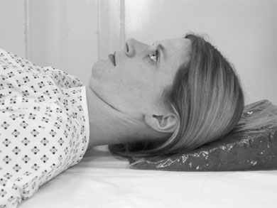
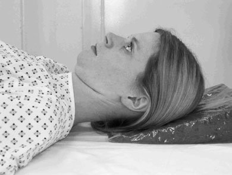
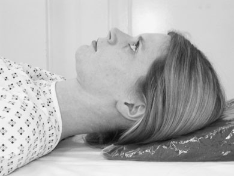
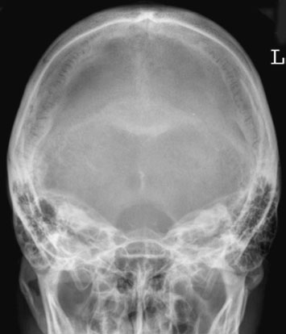
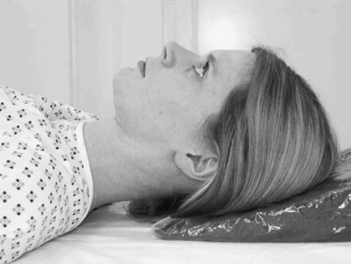

# Rx Craniu Fronto-occipital

  📷 Radiografie Convențională (Rx)
  <strong>Actualizat:</strong> 2026-09-16
  <strong>Autor:</strong> Departamentul de Radiologie / Referință Clark (Ed. 12)

---

-   __1. Rezumat Clinic & Indicații__

    ---

    === "Indicații Clinice"

        - Consultați incidențele occipito-frontale (p. 240).
        - Gaura occipitală mare (foramen magnum) trebuie vizualizată clar pe această incidență. Marginile pot fi mascate de angulația incorectă, ascunzând astfel o suspiciune importantă de fractură.
        - Zigomul poate fi vizualizat bine pe această incidență. Dacă există suspiciune de fractură, aceasta oferă un indiciu privind prezența unei leziuni faciale asociate.

    === "Ghid Național IRIS"

        !!! info "Referință Primară: Ghidul Național IRIS (Ordinul MS 1342/2012)"
            - **Capitol Ghid IRIS:** *Traumatisme — Față și orbite*
            - **Grad de Recomandare:** **Grad B**
            - **Nivel de Iradiere Estimată:** `Clasa 1 (Minimă < 0.2 mSv)`

            [:octicons-search-16: Deschide Ghidul IRIS](../../iris.md){ .md-button .md-button--primary } [:material-open-in-new: Aplicația Oficială PWA](https://radiologie-pediatrica.ro/iris/){ .md-button target="_blank" rel="noopener" }

-   __2. Poziționare & Centrare Fascicul__

    ---

    - **Poziție Pacient:**
        - Pacientul este culcat în decubit dorsal pe targa mobilă sau pe masa radiologică ori cu fața posterioară a craniului sprijinită pe caseta cu grilă antidifuzoare.
        - Capul este ajustat pentru a aduce planul mediosagital perpendicular pe filmul radiologic și coincident cu linia sa mediană. În această poziție, conductele auditive externe sunt echidistante față de casetă.
        - Linia de bază orbito-meatală trebuie să fie perpendiculară pe casetă.
        - Pacientul este culcat în decubit dorsal pe targa mobilă sau pe masa radiologică, cu fața posterioară a craniului sprijinită pe caseta cu grilă antidifuzoare.
        - Capul este ajustat pentru a aduce planul mediosagital perpendicular pe casetă și astfel încât să fie coincident cu linia sa mediană.
        - Linia de bază orbito-meatală trebuie să fie perpendiculară pe filmul radiologic.
    - **Punct de Centrare Fascicul:**
        Toate angulațiile pentru incidențele fronto-occipitale sunt efectuate cranial.

        Fronto-occipital

        - Raza centrală este orientată perpendicular pe casetă sau Bucky, de-a lungul planului mediosagital.
        - Câmpul de colimare trebuie reglat astfel încât să includă vertexul superior al craniului, baza inferioară a osului occipital și marginile cutanate de profil (lateral). Este important să se asigure că tubul este centrat pe mijlocul dispozitivului Bucky. Angulație caudală fronto-occipitală: 10, 15 și 20 grade
        - Tehnica utilizată pentru aceste trei incidențe este similară celei folosite pentru incidența occipito-frontală, cu excepția faptului că se aplică angulația cranială. Gradul angulației va depinde de incidența necesară.
        - Rețineți că filmul sau dispozitivul Bucky trebuie deplasat superior pentru a permite angulația tubului; în caz contrar, aria de interes diagnostic va fi proiectată în afara filmului radiologic. Pentru un unghi de 20 grade, partea superioară a casetei va trebui să se afle la 5 cm deasupra vertexului craniului.
        - Raza centrală este înclinată caudal astfel încât formează un unghi de 30 grade cu linia orbitomeatală.
        - Centrați pe linia mediană astfel încât fasciculul să treacă la jumătatea distanței dintre conductele auditive externe. Acesta se află la aproximativ 5 cm deasupra glabelei.
        - Partea superioară a casetei trebuie poziționată adiacent vertexului craniului pentru a vă asigura că angulația fasciculului nu proiectează aria de interes diagnostic în afara părții inferioare a imaginii.
    - **Distanță Focar-Film (DFF / SID):** 100 cm
    - **Comandă Respiratorie:** Apnee pe durata expunerii (apnee în inspir pentru torace; expir pentru Abdomen/bazin).

-   __3. Parametri Tehnici Expunere__

    ---

    | Parametru Tehnic | Valoare Configurare Generator / Tub |
    |:-----------------|:-------------------------------------|
    | **Tensiune Tub (kV)** | DE CONFIGURAT PE APARAT |
    | **Sarcină / Produs Curent-Timp (mAs)** | Conform AEC / grosimii anatomice |
    | **Distanță Focar-Film (DFF / SID)** | 100 cm |
    | **Grilă Antidifuzoare (Bucky)** | Cu grilă antidifuzoare Bucky |
    | **Dimensiune Focar** | Focar Mic (0.6 mm) |
    | **Camere de Ionizare AEC** | Camerele laterale (sau camera centrală, în funcție de regiune) |
    | **Colimare Fascicul** | Colimare strictă la aria anatomică de interes diagnostic |
    | **Filtrare Tub** | Totală ≥ 2.5 mm Al echivalent (conform Clark: 3.0 mm Al echivalent) |

-   __4. Criterii de Calitate & Reușită Imagine__

    ---

    - Șaua turcească a osului sfenoid este proiectată în interiorul găurii occipitale mari (foramen magnum).
    - Imaginea trebuie să includă întregul os occipital și porțiunile posterioare ale oaselor parietale, iar sutura lambdoidă trebuie vizualizată clar.
    - Craniul nu trebuie să fie rotit. Acest lucru poate fi evaluat și prin verificarea faptului că șaua turcească apare în mijlocul găurii occipitale mari (foramen magnum).
    - Erori de evitat / remedii: Consultați incidențele occipito-frontale (p. 241).
    - Erori de evitat / remedii: Rețineți că mărirea gradului de angulație cranială va proiecta stâncile temporale (piramidele pietroase) mai jos în orbite.
    - Erori de evitat / remedii: Subangulație: gaura occipitală mare (foramen magnum) nu este evidențiată clar deasupra stâncilor temporale (piramidelor pietroase). Aceasta este probabil cea mai frecventă eroare, deoarece pacientului îi poate fi dificil să mențină linia de bază perpendiculară pe filmul radiologic.

-   __5. Protecție Radiologică (ALARA)__

    ---

    - Ecranare gonadică cu șorț plumbat dacă gonadele sunt în apropierea fasciculului util (regula ALARA).
    - Colimare precisă la dimensiunea anatomică strict necesară pentru reducerea dozei și a radiației difuze.
    - Verificarea posibilității unei sarcini la pacientele de vârstă fertilă înainte de expunere.

!!! note "Observații Clinice & Tehnice"
    Consultați incidențele occipito-frontale (p. 241).

    - În exemplul de mai jos, este necesară incidența FO20°↓, dar pacientul își poate menține linia de bază orbito-meatală doar la 10 grade înapoi față de perpendiculară (adică având bărbia ușor ridicată). Pentru a obține un unghi total de 20 grade, va trebui aplicată o angulație cranială de zece grade tubului.
    - În mod similar, dacă bărbia pacientului ar fi ridicată astfel încât linia de bază să fie la 20 grade față de perpendiculară, incidența FO20°↓ ar putea fi obținută utilizând tubul drept, perpendicular pe filmul radiologic. 20° 10° 10° Incidență FO20°↑ obținută cu un unghi al tubului de 10° și RBL ridicată cu 10° Incidență FO Incidență FO20°↑

### 🖼️ Imagini

<figure class="protocol-image-card" markdown>

<figcaption><strong>Figura 1: Aspect radiografic / Poziționare (Clark Ed. 12)</strong> — Poziționarea pacientului și centrarea fasciculului conform Clark (Ed. 12)</figcaption>

</figure>

<figure class="protocol-image-card" markdown>

<figcaption><strong>Figura 2: Aspect radiografic / Poziționare (Clark Ed. 12)</strong> — Aspect radiografic / ghid de poziționare conform tratatului Clark (Ed. 12)</figcaption>

</figure>

<figure class="protocol-image-card" markdown>

<figcaption><strong>Figura 3: Aspect radiografic / Poziționare (Clark Ed. 12)</strong> — Aspect radiografic / ghid de poziționare conform tratatului Clark (Ed. 12)</figcaption>

</figure>

<figure class="protocol-image-card" markdown>

<figcaption><strong>ascunzând astfel o suspiciune importantă de fractură.</strong> — Aspect radiografic / ghid de poziționare conform tratatului Clark (Ed. 12)</figcaption>

</figure>

<figure class="protocol-image-card" markdown>

<figcaption><strong>Figura 5: Aspect radiografic / Poziționare (Clark Ed. 12)</strong> — Aspect radiografic / ghid de poziționare conform tratatului Clark (Ed. 12)</figcaption>

</figure>

<figure class="protocol-image-card" markdown>

<figcaption><strong>Figura 6: Aspect radiografic / Poziționare (Clark Ed. 12)</strong> — Aspect radiografic / ghid de poziționare conform tratatului Clark (Ed. 12)</figcaption>

</figure>

=== "Ghid Rapid de Execuție"

    1. **Identificarea și verificarea pacientului:** verificare identitate, zonă de examinat, consimțământ conform procedurii și evaluarea posibilității unei sarcini, când este relevantă.
    2. **Pregătire:** îndepărtarea oricăror obiecte radiopace (bijuterii, agrafe, fermoare, proteze, pansamente dense).
    3. **Poziționare precisă:** alinierea receptorului de imagine și a tubului la distanța prescrisă (100 cm).
    4. **Colimare strictă:** adaptarea fasciculului strict la regiunea de diagnostic pentru scăderea iradierii și reducerea radiației difuze.
    5. **Radioprotecție:** verificarea [politicii RX](../radioprotectie.md), cu măsuri distincte pentru pacient, personal și însoțitor.

## Surse de documentare

- [Clark's Positioning in Radiography (Ed. 12), Pagina 257](https://books.google.com/books/about/Clark_s_Positioning_in_Radiography.html?id=Xxu6MwEACAAJ)
