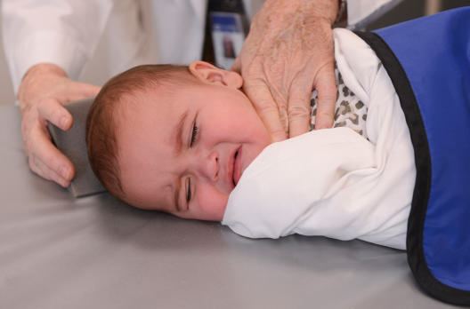
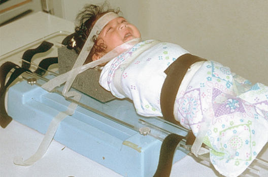
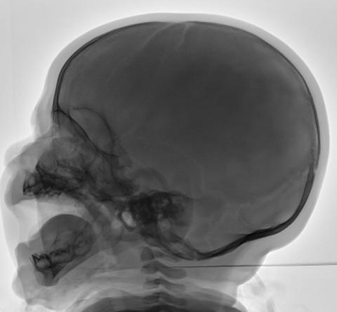

# Rx Craniu (HEAD) Profil (Lateral)

  📷 Radiografie Convențională (Rx)
  <strong>Actualizat:</strong> 2026-09-15
  <strong>Autor:</strong> Departamentul de Radiologie / Referință Bontrager

---

-   __1. Rezumat Clinic & Indicații__

    ---

    === "Indicații Clinice"

        - sunt same ca vizualizat pentru Incidență Antero-Posterioară (AP) pe preceding page

    === "Ghid Național IRIS"

        !!! info "Referință Primară: Ghidul Național IRIS (Ordinul MS 1342/2012)"
            - **Capitol Ghid IRIS:** *Ghidul Național IRIS*
            - **Grad de Recomandare:** **De verificat pe indicație; fără grad atribuit automat**
            - **Nivel de Iradiere Estimată:** `De verificat pentru examinarea și populația selectate`

            [:octicons-search-16: Deschide Ghidul IRIS](../../iris.md){ .md-button .md-button--primary } [:material-open-in-new: Aplicația Oficială PWA](https://radiologie-pediatrica.ro/iris/){ .md-button target="_blank" rel="noopener" }
-   __2. Poziționare & Centrare Fascicul__

    ---

    - **Poziție Pacient:** Pacient: imobilizare techniques trebuie să fie used when necessary. pacient este în semiprone poziție, centrat pe linia mediană mesei.; Regiune anatomică: Rotate cap into true Incidență de Profil (lateral), și maintain poziție prin placing sponge sau folded towel under Mandibulă (Figs. 16.56 și 16.57).
    - **Punct de Centrare Fascicul:** perpendicular pe receptorul de imagine, centrat midway între glabelă și occipital protuberance sau inion, 2 inches (5 cm) above conduct auditiv extern (CAE) receptorul de imagine centrat pe raza centrală
    - **Distanță Focar-Film (DFF / SID):** 100 cm
    - **Comandă Respiratorie:** Apnee pe durata expunerii (sau conform cooperării pacientului)

-   __3. Parametri Tehnici Expunere__

    ---

    | Parametru Tehnic | Valoare Configurare Generator / Tub |
    |:-----------------|:-------------------------------------|
    | **Tensiune Tub (kV)** | 70-80 kV |
    | **Sarcină / Produs Curent-Timp (mAs)** | DE CONFIGURAT PE APARAT |
    | **Distanță Focar-Film (DFF / SID)** | 100 cm |
    | **Grilă Antidifuzoare (Bucky)** | Cu grilă antidifuzoare Bucky |
    | **Dimensiune Focar** | Focar Mic (0.6 mm) |
    | **Camere de Ionizare AEC** | Camerele laterale (sau camera centrală funcție de regiune) |
    | **Colimare Fascicul** | Field Size Collimate closely pe four sides la outer margins de Craniu. Fig. 16.56 lateral Craniu. Craniu (cap) ROUTINE AP AP Caldwell AP Towne lateral 24 (30) (24) |
    | **Filtrare Tub** | Totală ≥ 2.5 mm Al echivalent |

-   __4. Criterii de Calitate & Reușită Imagine__

    ---

    - Entire Craniu este evidențiat (Fig. 16.58). poziție:
    - Absența rotației anatomice: clavicule echidistante față de linia apofizelor spinoase este evidenced prin superimposed rami de Mandibulă, orbital roofs, și greater și lesser wings de sphenoid.
    - șa turcească și clivus sunt evidențiat în profile fără rotație.
    - Collimation field size la aria de interes diagnostic. expunere:
    - fără mișcare, ca evidenced prin net margins de bony structures.
    - Penetration și expunere sunt sufficient la visualize parietal region și lateral incidență outline de șa turcească fără overexposing perimeter margins de Craniu. Fig. 16.57 orizontal fascicul lateral cu Tamem board. RT Fig. 16.58 lateral Craniu. (Case courtesy Dr. Ian Bickle, Radiopaedia.org, rID: 46692.)

-   __5. Protecție Radiologică (ALARA)__

    ---

    - Ecranare gonadică și a organelor radiosensibile conform procedurilor locale de radioprotecție ALARA.
    - Colimare strictă la aria de interes pentru limitarea radiației difuze.
    - Verificarea posibilității unei sarcini la pacientele de vârstă fertilă înainte de expunere.

### 🖼️ Imagini

<figure class="protocol-image-card" markdown>

<figcaption><strong>Fig. 16.56 lateral Craniu.</strong> — Poziționare pacient conform Ghidului Bontrager (Fig. 16.56 lateral skull.)</figcaption>

</figure>

<figure class="protocol-image-card" markdown>

<figcaption><strong>Fig. 16.57 orizontal fascicul lateral cu Tam-</strong> — Aspect radiografic de referință conform Ghidului Bontrager (Fig. 16.57 orizontal fascicul lateral cu Tam-)</figcaption>

</figure>

<figure class="protocol-image-card" markdown>

<figcaption><strong>Fig. 16.58 lateral Craniu. (Case courtesy Dr. Ian Bickle,</strong> — Aspect radiografic de referință conform Ghidului Bontrager (Fig. 16.58 lateral skull. (Case courtesy Dr. Ian Bickle,)</figcaption>

</figure>

=== "Ghid Rapid de Execuție"

    1. **Identificarea și verificarea pacientului:** verificare identitate, zonă de examinat, consimțământ conform procedurii și evaluarea posibilității unei sarcini, când este relevantă.
    2. **Pregătire:** îndepărtarea oricăror obiecte radiopace (bijuterii, agrafe, fermoare, proteze, pansamente dense).
    3. **Poziționare precisă:** alinierea receptorului de imagine și a tubului la distanța prescrisă (100 cm).
    4. **Colimare strictă:** adaptarea fasciculului strict la regiunea de diagnostic pentru scăderea iradierii și reducerea radiației difuze.
    5. **Radioprotecție:** verificarea [politicii RX](../radioprotectie.md), cu măsuri distincte pentru pacient, personal și însoțitor.

## Surse de documentare

- [Bontrager's Textbook of Radiographic Positioning (Ed. 9/10), Pagina 664](https://www.elsevier.com/books/textbook-of-radiographic-positioning-and-related-anatomy/lampignano/978-0-323-65367-1)
