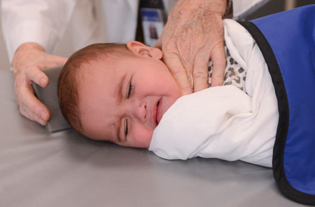
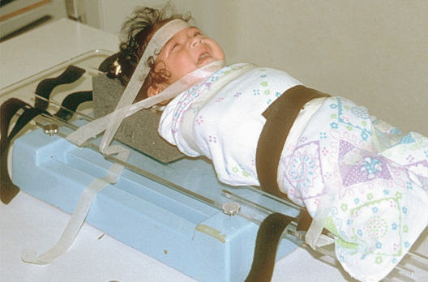
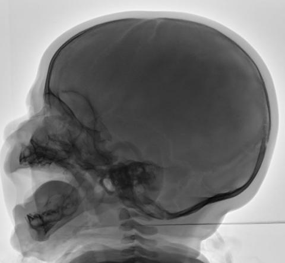

# Rx craniu (cap), profil (lateral)

  📷 Radiografie Convențională (Rx)
  <strong>Actualizat:</strong> 2026-09-15
  <strong>Autor:</strong> Departamentul de Radiologie / Referință Bontrager

---

-   __1. Rezumat Clinic & Indicații__

    ---

    === "Indicații Clinice"

        - sunt aceleași cu cele vizualizate pentru incidența antero-posterioară (AP) pe pagina precedentă

    === "Ghid Național IRIS"

        !!! info "Referință Primară: Ghidul Național IRIS (Ordinul MS 1342/2012)"
            - **Capitol Ghid IRIS:** *Ghidul Național IRIS*
            - **Grad de Recomandare:** **De verificat pe indicație; fără grad atribuit automat**
            - **Nivel de Iradiere Estimată:** `De verificat pentru examinarea și populația selectate`

            [:octicons-search-16: Deschide Ghidul IRIS](../../iris.md){ .md-button .md-button--primary } [:material-open-in-new: Aplicația Oficială PWA](https://radiologie-pediatrica.ro/iris/){ .md-button target="_blank" rel="noopener" }
-   __2. Poziționare & Centrare Fascicul__

    ---

    - **Poziție Pacient:** Pacient: tehnicile de imobilizare trebuie utilizate atunci când este necesar. Pacientul este în poziție semipronă, centrat pe linia mediană a mesei.; Regiune anatomică: Rotiți capul în incidență de profil (lateral) adevărată și mențineți poziția prin plasarea unui burete sau a unui prosop împăturit sub mandibulă (Figs. 16.56 și 16.57).
    - **Punct de Centrare Fascicul:** perpendicular pe receptorul de imagine, centrat la jumătatea distanței dintre glabelă și protuberanța occipitală sau inion, la 2 inches (5 cm) deasupra conductului auditiv extern (CAE); receptorul de imagine este centrat pe raza centrală
    - **Distanță Focar-Film (DFF / SID):** 100 cm
    - **Comandă Respiratorie:** Apnee pe durata expunerii (sau conform cooperării pacientului)

-   __3. Parametri Tehnici Expunere__

    ---

    | Parametru Tehnic | Valoare Configurare Generator / Tub |
    |:-----------------|:-------------------------------------|
    | **Tensiune Tub (kV)** | 70-80 kV |
    | **Sarcină / Produs Curent-Timp (mAs)** | DE CONFIGURAT PE APARAT |
    | **Distanță Focar-Film (DFF / SID)** | 100 cm |
    | **Grilă Antidifuzoare (Bucky)** | Cu grilă antidifuzoare Bucky |
    | **Dimensiune Focar** | Focar Mic (0.6 mm) |
    | **Camere de Ionizare AEC** | Camerele laterale (sau camera centrală, în funcție de regiune) |
    | **Colimare Fascicul** | Dimensiunea câmpului: colimați strâns pe toate cele patru laturi până la marginile externe ale craniului. Fig. 16.56 craniu lateral. Craniu (cap) DE RUTINĂ AP AP Caldwell AP Towne lateral 24 (30) (24) |
    | **Filtrare Tub** | Totală ≥ 2.5 mm Al echivalent |

-   __4. Criterii de Calitate & Reușită Imagine__

    ---

    - Întregul craniu este evidențiat (Fig. 16.58). Poziție:
    - Absența rotației anatomice: claviculele echidistante față de linia apofizelor spinoase este evidențiată prin suprapunerea ramurilor mandibulei, a acoperișurilor orbitare și a aripilor mari și mici ale sfenoidului.
    - Șaua turcească și clivusul sunt evidențiate de profil, fără rotație.
    - Dimensiunea câmpului de colimare până la aria de interes diagnostic. Expunere:
    - fără mișcare, evidențiată prin marginile nete ale structurilor osoase.
    - Penetrarea și expunerea sunt suficiente pentru vizualizarea regiunii parietale și a conturului lateral al șeii turcești, fără supraexpunerea marginilor periferice ale craniului. Fig. 16.57 fascicul orizontal lateral cu Tamem board. RT Fig. 16.58 craniu lateral. (Caz oferit cu amabilitate de Dr. Ian Bickle, Radiopaedia.org, rID: 46692.)

-   __5. Protecție Radiologică (ALARA)__

    ---

    - Ecranare gonadică și a organelor radiosensibile conform procedurilor locale de radioprotecție ALARA.
    - Colimare strictă la aria de interes pentru limitarea radiației difuze.
    - Verificarea posibilității unei sarcini la pacientele de vârstă fertilă înainte de expunere.

### 🖼️ Imagini

<figure class="protocol-image-card" markdown>

<figcaption><strong>Fig. 16.56 craniu lateral.</strong> — Poziționarea pacientului conform Ghidului Bontrager (Fig. 16.56 craniu de profil.)</figcaption>

</figure>

<figure class="protocol-image-card" markdown>

<figcaption><strong>Fig. 16.57 fascicul orizontal lateral cu Tam-</strong> — Aspect radiografic de referință conform Ghidului Bontrager (Fig. 16.57 fascicul orizontal lateral cu Tam-)</figcaption>

</figure>

<figure class="protocol-image-card" markdown>

<figcaption><strong>Fig. 16.58 craniu lateral. (Caz oferit cu amabilitate de Dr. Ian Bickle,</strong> — Aspect radiografic de referință conform Ghidului Bontrager (Fig. 16.58 craniu lateral. (Caz oferit cu amabilitate de Dr. Ian Bickle,)</figcaption>

</figure>

=== "Ghid Rapid de Execuție"

    1. **Identificarea și verificarea pacientului:** verificare identitate, zonă de examinat, consimțământ conform procedurii și evaluarea posibilității unei sarcini, când este relevantă.
    2. **Pregătire:** îndepărtarea oricăror obiecte radiopace (bijuterii, agrafe, fermoare, proteze, pansamente dense).
    3. **Poziționare precisă:** alinierea receptorului de imagine și a tubului la distanța prescrisă (100 cm).
    4. **Colimare strictă:** adaptarea fasciculului strict la regiunea de diagnostic pentru scăderea iradierii și reducerea radiației difuze.
    5. **Radioprotecție:** verificarea [politicii RX](../radioprotectie.md), cu măsuri distincte pentru pacient, personal și însoțitor.

## Surse de documentare

- [Bontrager's Textbook of Radiographic Positioning (Ed. 9/10), Pagina 664](https://www.elsevier.com/books/textbook-of-radiographic-positioning-and-related-anatomy/lampignano/978-0-323-65367-1)
