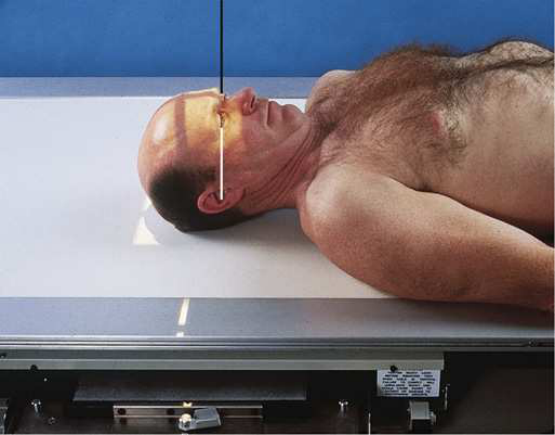
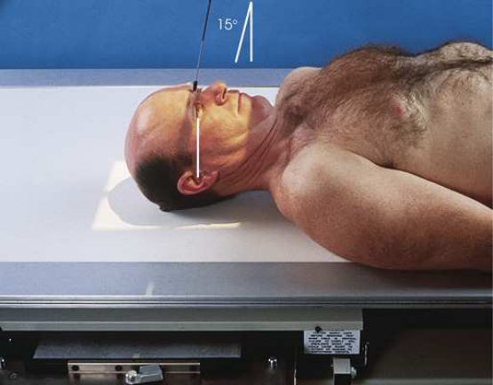
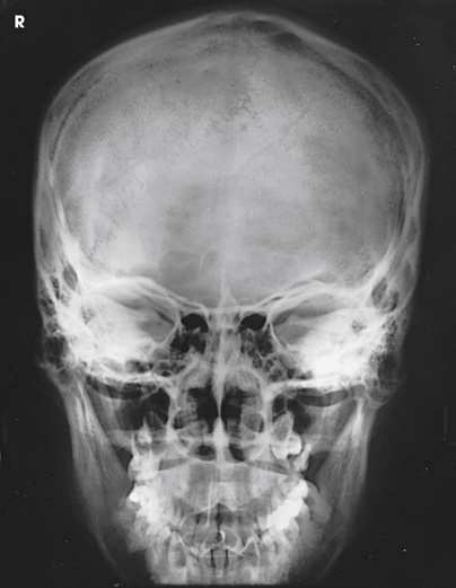

# Rx Craniu — Incidență Antero-Posterioară (AP) And Incidență AP Axială — Reverse Incidență Occipito-Frontală (Metoda Caldwell) (Merrill)

  📷 Radiografie Convențională (Rx)
  <strong>Actualizat:</strong> 2026-09-16
  <strong>Autor:</strong> Referință Merrill

---

-   __1. Rezumat Clinic & Indicații__

    ---

    === "Indicații Clinice"

        - Conform reperelor anatomice standard din tratat

    === "Ghid Național IRIS"

        !!! info "Referință Primară: Ghidul Național IRIS (Ordinul MS 1342/2012)"
            - **Capitol Ghid IRIS:** *Ghidul Național IRIS*
            - **Grad de Recomandare:** **De verificat pe indicație; fără grad atribuit automat**
            - **Nivel de Iradiere Estimată:** `De verificat pentru examinarea și populația selectate`

            [:octicons-search-16: Deschide Ghidul IRIS](../../iris.md){ .md-button .md-button--primary } [:material-open-in-new: Aplicația Oficială PWA](https://radiologie-pediatrica.ro/iris/){ .md-button target="_blank" rel="noopener" }
-   __2. Poziționare & Centrare Fascicul__

    ---

    - **Poziție Pacient:** Conform reperelor anatomice standard din tratat; Conform reperelor anatomice standard din tratat
    - **Punct de Centrare Fascicul:** perpendicular (Fig. 11.63) sau orientat la nazion la angle 15 grade cranial (Fig. 11.64). Center receptorul de imagine la raza centrală.
    - **Distanță Focar-Film (DFF / SID):** Nespecificat în fragmentul extras; de verificat în sursă
    - **Comandă Respiratorie:** Conform reperelor anatomice standard din tratat

-   __3. Parametri Tehnici Expunere__

    ---

    | Parametru Tehnic | Valoare Configurare Generator / Tub |
    |:-----------------|:-------------------------------------|
    | **Tensiune Tub (kV)** | DE CONFIGURAT PE APARAT |
    | **Sarcină / Produs Curent-Timp (mAs)** | DE CONFIGURAT PE APARAT |
    | **Distanță Focar-Film (DFF / SID)** | Nespecificat în fragmentul extras; de verificat în sursă |
    | **Grilă Antidifuzoare (Bucky)** | DE CONFIGURAT PE APARAT |
    | **Dimensiune Focar** | DE CONFIGURAT PE APARAT |
    | **Camere de Ionizare AEC** | DE CONFIGURAT PE APARAT |
    | **Colimare Fascicul** | Adjust câmp de iradiere la extend 1 inch (2.5 cm) beyond skin line de Craniu. Check pentru light above vertex și pe ambele părți (bilateral) de fața. Place marker de lateralitate (D/S) în collimated expunere field. |
    | **Filtrare Tub** | DE CONFIGURAT PE APARAT |

-   __4. Criterii de Calitate & Reușită Imagine__

    ---

    - Criterii radiologice de calitate imaginii: n Evidence de corect collimation și presence de marker de lateralitate (D/S) plasat clear de anatomy de interest n Entire Craniu fără rotație sau tilt, evidențiat prin:
    - Equal distances de la lateral margini de Craniu la lateral margini de Orbite pe ambele părți (bilateral)
    - simetric stânci temporale (piramide pietroase)
    - MSP de Craniu aliniat cu axa longitudinală de câmp colimat n stânci temporale (piramide pietroase) culcat în lower third de orbit cu cranial raza centrală angulation de 15 grade și filling Orbite cu a 0-grade raza centrală angulation n Entire cranial perimeter evidențiind three distinct areas de squamous bone n Bony detail de frontal bone și surrounding soft tissues

-   __5. Protecție Radiologică (ALARA)__

    ---

    - Nespecificat în fragmentul extras; de verificat în sursă

!!! note "Observații Clinice & Tehnice"
    Conform reperelor anatomice standard din tratat

### 🖼️ Imagini

<figure class="protocol-image-card" markdown>

<figcaption><strong>Merrill — pagina PDF 876, imaginea 1</strong> — Imagine din fragmentul sursă; asocierea necesită revizie.</figcaption>

</figure>

<figure class="protocol-image-card" markdown>

<figcaption><strong>Merrill — pagina PDF 877, imaginea 2</strong> — Imagine din fragmentul sursă; asocierea necesită revizie.</figcaption>

</figure>

<figure class="protocol-image-card" markdown>

<figcaption><strong>Merrill — pagina PDF 877, imaginea 3</strong> — Imagine din fragmentul sursă; asocierea necesită revizie.</figcaption>

</figure>

=== "Ghid Rapid de Execuție"

    1. **Identificarea și verificarea pacientului:** verificare identitate, zonă de examinat, consimțământ conform procedurii și evaluarea posibilității unei sarcini, când este relevantă.
    2. **Pregătire:** îndepărtarea oricăror obiecte radiopace (bijuterii, agrafe, fermoare, proteze, pansamente dense).
    3. **Poziționare precisă:** alinierea receptorului de imagine și a tubului la distanța prescrisă (Nespecificat în fragmentul extras; de verificat în sursă).
    4. **Colimare strictă:** adaptarea fasciculului strict la regiunea de diagnostic pentru scăderea iradierii și reducerea radiației difuze.
    5. **Radioprotecție:** verificarea [politicii RX](../radioprotectie.md), cu măsuri distincte pentru pacient, personal și însoțitor.

## Surse de documentare

- [Merrill’s Atlas, 11. Cranium, pagini PDF 875–877](../../assets/protocols/sources/a56d45c16829_Merrills_Atlas_of_Radiographic_Positioning__Procedures_3Vol_Set.pdf#page=875)

## Fragmente sursă traduse (referință tehnică)

### anatomy

structures vizualizat pe AP incidență sunt same ca structures vizualizat pe PA incidență. pe AP incidență (Fig. 11.65), orbits sunt considerably magnified because de increased object–la–receptorul de imagine distance (OID). Similarly, because de magnification, distance de la lateral margin de orbit la lateral margin de temporal bone measures less pe AP incidență than pe PA
incidență.

### collimation

• Adjust câmp de iradiere la extend 1 inch (2.5 cm) beyond skin line de craniul. Check pentru light above vertex și pe ambele părți (bilateral) de
fața. Place marker de lateralitate (D/S) în collimated expunere field.

### cr

• perpendicular (Fig. 11.63) sau orientat la nazion la angle 15 grade cranial (Fig. 11.64).
• Center receptorul de imagine la raza centrală.

### criteria

Criterii radiologice de calitate imaginii:
n Evidence de corect collimation și presence de marker de lateralitate (D/S) plasat clear de anatomy de interest
n Entire cranium fără rotație sau tilt, evidențiat prin:
• Equal distances de la lateral margini de skull la lateral margini de orbits pe ambele părți (bilateral)
• simetric stânci temporale (piramide pietroase)
• MSP de cranium aliniat cu axa longitudinală de câmp colimat
n stânci temporale (piramide pietroase) culcat în lower third de orbit cu cranial raza centrală angulation de 15 grade și filling orbits cu a 0-grade
raza centrală angulation
n Entire cranial perimeter evidențiind three distinct areas de squamous bone
n Bony detail de frontal bone și surrounding soft tissues

### tech

poziționat prin manufacturer sau department protocol pentru corect anatomy display orientation; raza centrală plate: 10 × 12 inches (24 ×
30 cm) longitudinal.
When pacientul cannot fie poziționat pentru PA sau PA axial incidență, similar but magnified imagine poate fie obtained cu AP incidență.
AP axial este often referred la ca reverse Caldwell.
poziție de pacient și part
• se poziționează pacientul în decubit dorsal cu MSP de corp centrat pe grila.
• Ensure that MSP și linie orbitomeatală (LOM) sunt perpendicular pe receptorul de imagine (RI).

