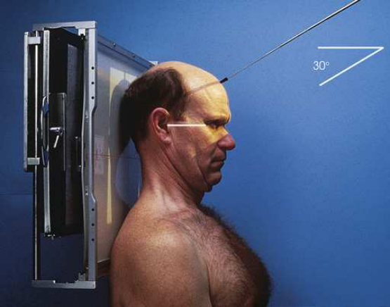
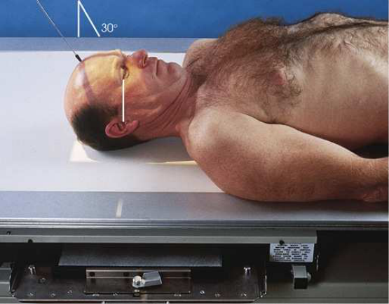
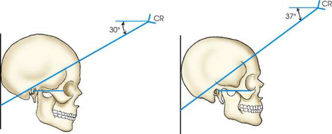
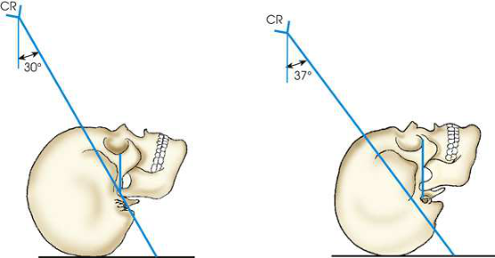
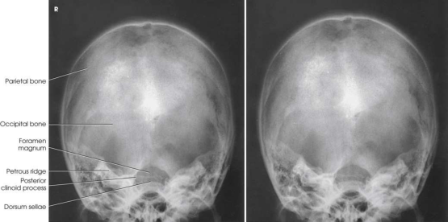
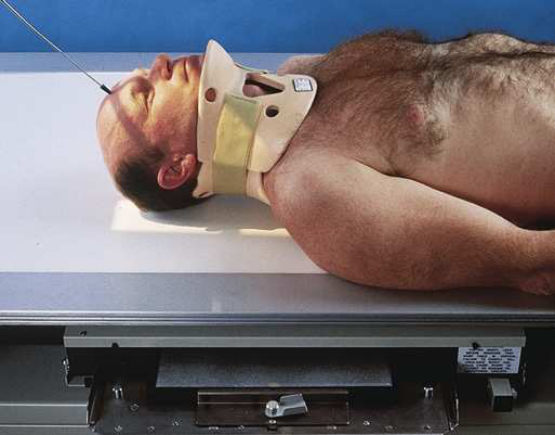
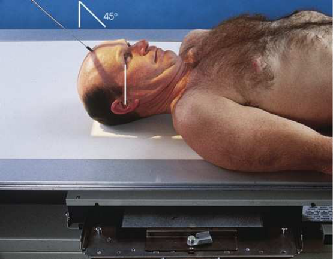

# Rx Craniu — Incidență AP Axială — Incidență AP Axială (Metoda Towne) (Merrill)

  📷 Radiografie Convențională (Rx)
  <strong>Actualizat:</strong> 2026-09-16
  <strong>Autor:</strong> Referință Merrill

---

-   __1. Rezumat Clinic & Indicații__

    ---

    === "Indicații Clinice"

        - Conform reperelor anatomice standard din tratat

    === "Ghid Național IRIS"

        !!! info "Referință Primară: Ghidul Național IRIS (Ordinul MS 1342/2012)"
            - **Capitol Ghid IRIS:** *Ghidul Național IRIS*
            - **Grad de Recomandare:** **De verificat pe indicație; fără grad atribuit automat**
            - **Nivel de Iradiere Estimată:** `De verificat pentru examinarea și populația selectate`

            [:octicons-search-16: Deschide Ghidul IRIS](../../iris.md){ .md-button .md-button--primary } [:material-open-in-new: Aplicația Oficială PWA](https://radiologie-pediatrica.ro/iris/){ .md-button target="_blank" rel="noopener" }
-   __2. Poziționare & Centrare Fascicul__

    ---

    - **Poziție Pacient:** cu pacientul Decubit dorsal sau Poziție Șezândă în ortostatism, center MSP de pacientul’s corp la linia mediană grilă. se poziționează pacientul’s brațe în comfortable poziție, și se ajustează umeri la lie în same plan orizontal. la ensure pacientul’s comfort fără increasing receptorul de imagine distance, examine hypersthenic sau obese pacient în Poziție Șezândă-ortostatism, if possible. Craniu poate fie brought closer la receptorul de imagine prin having pacientul lean back lordotically și rest umerii pe / sprijinit de stativ vertical Bucky. When this este impossible, desired incidență de occipitobasal region poate fie obtained prin using Incidență PA Axială described prin Haas (pp. 50-51). Metoda Haas este reverse de Incidență AP Axială și produces comparable result.; se ajustează pacient’s cap so that MSP este perpendicular pe linia mediană receptorul de imagine. se flectează pacient’s neck enough la place linie orbitomeatală (LOM) perpendicular pe plane de receptorul de imagine. When pacientul cannot se flectează neck la this extent, se ajustează neck astfel încât linie infraorbitomeatală (LIOM) este perpendicular și then increase raza centrală angulation prin 7 grade (Figs. 11.66–11.69). poziție receptorul de imagine center la sau near level de gaură occipitală mare (foramen magnum). pentru localized imagine de dorsum sellae și stânci temporale (piramide pietroase), se ajustează receptorul de imagine so that its midpoint coincides cu raza centrală centrală. receptorul de imagine este centrat la nivelul sau slightly sub nivelul plan ocluzal. Recheck poziție și Se imobilizează capul pacientului.
    - **Punct de Centrare Fascicul:** orientat through gaură occipitală mare (foramen magnum) la caudal angle de 30 grade la linie orbitomeatală (LOM) sau 37 grade la linie infraorbitomeatală (LIOM). raza centrală enters approximately 2 inches (6.3 cm) above glabelă și passes through level de conduct auditiv extern (CAE).
    - **Distanță Focar-Film (DFF / SID):** Nespecificat în fragmentul extras; de verificat în sursă
    - **Comandă Respiratorie:** apnee (oprirea respirației).

-   __3. Parametri Tehnici Expunere__

    ---

    | Parametru Tehnic | Valoare Configurare Generator / Tub |
    |:-----------------|:-------------------------------------|
    | **Tensiune Tub (kV)** | DE CONFIGURAT PE APARAT |
    | **Sarcină / Produs Curent-Timp (mAs)** | DE CONFIGURAT PE APARAT |
    | **Distanță Focar-Film (DFF / SID)** | Nespecificat în fragmentul extras; de verificat în sursă |
    | **Grilă Antidifuzoare (Bucky)** | DE CONFIGURAT PE APARAT |
    | **Dimensiune Focar** | DE CONFIGURAT PE APARAT |
    | **Camere de Ionizare AEC** | DE CONFIGURAT PE APARAT |
    | **Colimare Fascicul** | se ajustează câmp de iradiere la extend 1 inch (2.5 cm) beyond skin line de Craniu. Check pentru light la vertex și pe ambele părți (bilateral). Place marker de lateralitate (D/S) în collimated expunere field. |
    | **Filtrare Tub** | DE CONFIGURAT PE APARAT |

-   __4. Criterii de Calitate & Reușită Imagine__

    ---

    - Criterii radiologice de calitate imaginii: n Evidence de corect collimation și presence de marker de lateralitate (D/S) plasat clear de anatomy de interest n Entire Craniu, fără rotație sau tilt, evidențiat prin:
    - Equal distances de la lateral margini de Craniu la lateral margins de gaură occipitală mare (foramen magnum) pe ambele părți (bilateral)
    - simetric stânci temporale (piramide pietroase)
    - MSP de Craniu aliniat cu axa longitudinală de câmp colimat n Dorsum sellae și posterior clinoid processes vizibil within gaură occipitală mare (foramen magnum) n Bony detail de occipital bone și surrounding soft tissues

-   __5. Protecție Radiologică (ALARA)__

    ---

    - Nespecificat în fragmentul extras; de verificat în sursă

!!! note "Observații Clinice & Tehnice"
    Although this technique este most commonly referred la ca Incidență AP Axială (Metoda Towne), 3 numerous authors have described slightly diferit variations. în 1912 Grashey 4 published first description de Incidență AP Axială de Craniu. în 1926 Altschul 5 și Towne 3 described poziție. Altschul recommended strong depression de bărbia și direction de raza centrală through gaură occipitală mare (foramen magnum) la caudal angle de 40 grade. Towne (citing Chamberlain) recommended that cu pacientul’s chin coborât, raza centrală trebuie să fie orientat through MSP de la point about 3 inches (7.6 cm) above eyebrows la gaură occipitală mare (foramen magnum). Towne gave fără specific raza centrală angulation, but angulation would depend pe flexion de gâtul.

### 🖼️ Imagini

<figure class="protocol-image-card" markdown>

<figcaption><strong>Merrill — pagina PDF 878, imaginea 1</strong> — Imagine din fragmentul sursă; asocierea necesită revizie.</figcaption>

</figure>

<figure class="protocol-image-card" markdown>

<figcaption><strong>Merrill — pagina PDF 879, imaginea 2</strong> — Imagine din fragmentul sursă; asocierea necesită revizie.</figcaption>

</figure>

<figure class="protocol-image-card" markdown>

<figcaption><strong>Merrill — pagina PDF 879, imaginea 3</strong> — Imagine din fragmentul sursă; asocierea necesită revizie.</figcaption>

</figure>

<figure class="protocol-image-card" markdown>

<figcaption><strong>Merrill — pagina PDF 880, imaginea 4</strong> — Imagine din fragmentul sursă; asocierea necesită revizie.</figcaption>

</figure>

<figure class="protocol-image-card" markdown>

<figcaption><strong>Merrill — pagina PDF 881, imaginea 5</strong> — Imagine din fragmentul sursă; asocierea necesită revizie.</figcaption>

</figure>

<figure class="protocol-image-card" markdown>

<figcaption><strong>Merrill — pagina PDF 881, imaginea 6</strong> — Imagine din fragmentul sursă; asocierea necesită revizie.</figcaption>

</figure>

<figure class="protocol-image-card" markdown>

<figcaption><strong>Merrill — pagina PDF 882, imaginea 7</strong> — Imagine din fragmentul sursă; asocierea necesită revizie.</figcaption>

</figure>

=== "Ghid Rapid de Execuție"

    1. **Identificarea și verificarea pacientului:** verificare identitate, zonă de examinat, consimțământ conform procedurii și evaluarea posibilității unei sarcini, când este relevantă.
    2. **Pregătire:** îndepărtarea oricăror obiecte radiopace (bijuterii, agrafe, fermoare, proteze, pansamente dense).
    3. **Poziționare precisă:** alinierea receptorului de imagine și a tubului la distanța prescrisă (Nespecificat în fragmentul extras; de verificat în sursă).
    4. **Colimare strictă:** adaptarea fasciculului strict la regiunea de diagnostic pentru scăderea iradierii și reducerea radiației difuze.
    5. **Radioprotecție:** verificarea [politicii RX](../radioprotectie.md), cu măsuri distincte pentru pacient, personal și însoțitor.

## Surse de documentare

- [Merrill’s Atlas, 11. Cranium, pagini PDF 877–882](../../assets/protocols/sources/a56d45c16829_Merrills_Atlas_of_Radiographic_Positioning__Procedures_3Vol_Set.pdf#page=877)

## Fragmente sursă traduse (referință tehnică)

### anatomy

simetric imagine de stânci temporale (piramide pietroase), posterior portion de gaură occipitală mare (foramen magnum), dorsum sellae, și posterior clinoid processes
projected within gaură occipitală mare (foramen magnum), occipital bone, și posterior portion de parietal bones (Fig. 11.70).

### collimation

• se ajustează câmp de iradiere la extend 1 inch (2.5 cm) beyond skin line de craniul. Check pentru light la vertex și pe ambele părți (bilateral).
Place marker de lateralitate (D/S) în collimated expunere field.

### cr

• orientat through gaură occipitală mare (foramen magnum) la caudal angle de 30 grade la linie orbitomeatală (LOM) sau 37 grade la linie infraorbitomeatală (LIOM). raza centrală enters
approximately 2
inches (6.3 cm) above glabelă și passes through level de conduct auditiv extern (CAE).

### criteria

Criterii radiologice de calitate imaginii:
n Evidence de corect collimation și presence de marker de lateralitate (D/S) plasat clear de anatomy de interest
n Entire cranium, fără rotație sau tilt, evidențiat prin:
• Equal distances de la lateral margini de skull la lateral margins de gaură occipitală mare (foramen magnum) pe ambele părți (bilateral)
• simetric stânci temporale (piramide pietroase)
• MSP de cranium aliniat cu axa longitudinală de câmp colimat
n Dorsum sellae și posterior clinoid processes vizibil within gaură occipitală mare (foramen magnum)
n Bony detail de occipital bone și surrounding soft tissues

### notes

Although this technique este most commonly referred la ca Towne method, 3 numerous authors have described slightly diferit
variations. în 1912 Grashey 4 published first description de AP axial incidență de cranium. în 1926 Altschul 5 și Towne 3 described
poziție. Altschul recommended strong depression de bărbia și direction de raza centrală through gaură occipitală mare (foramen magnum) la caudal angle
de 40 grade. Towne (citing Chamberlain) recommended that cu pacientul’s chin coborât, raza centrală trebuie să fie orientat through MSP de la point about 3 inches (7.6 cm) above eyebrows la gaură occipitală mare (foramen magnum). Towne gave fără specific raza centrală angulation, but angulation would depend pe flexion de gâtul.

### part_pos

• se ajustează pacient’s cap so that MSP este perpendicular pe linia mediană receptorul de imagine.
• se flectează pacient’s neck enough la place linie orbitomeatală (LOM) perpendicular pe plane de receptorul de imagine.
• When pacientul cannot se flectează neck la this extent, se ajustează neck astfel încât linie infraorbitomeatală (LIOM) este perpendicular și then increase central
ray angulation prin 7 grade (Figs. 11.66–11.69).
• poziție receptorul de imagine center la sau near level de gaură occipitală mare (foramen magnum).
• pentru localized imagine de dorsum sellae și stânci temporale (piramide pietroase), se ajustează receptorul de imagine so that its midpoint coincides cu raza centrală centrală. receptorul de imagine este centrat la nivelul sau slightly sub nivelul plan ocluzal.
• Recheck poziție și Se imobilizează capul pacientului.

### patient_pos

• cu pacientul în decubit dorsal sau așezat pe scaun în ortostatism, center MSP de pacientul’s corp la linia mediană grilă.
• se poziționează pacientul’s brațe în comfortable poziție, și se ajustează umeri la lie în same plan orizontal.
• la ensure pacientul’s comfort fără increasing receptorul de imagine distance, examine hypersthenic sau obese pacient în așezat pe scaun-în ortostatism
poziție, if possible.
• craniul poate fie brought closer la receptorul de imagine prin having pacientul lean back lordotically și rest umerii pe / sprijinit de vertical grilă
device. When this este impossible, desired incidență de occipitobasal region poate fie obtained prin using PA axial incidență
described prin Haas (pp. 50-51). Haas method este reverse de AP axial incidență și produces comparable result.

### respiration

apnee (oprirea respirației).

### tech

poziționat prin manufacturer sau department protocol pentru corect anatomy display orientation; raza centrală plate: 10 × 12 inches (24 ×
30 cm) longitudinal.

