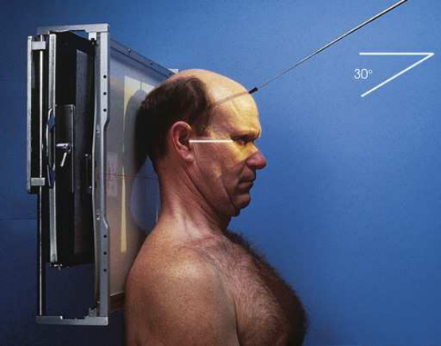
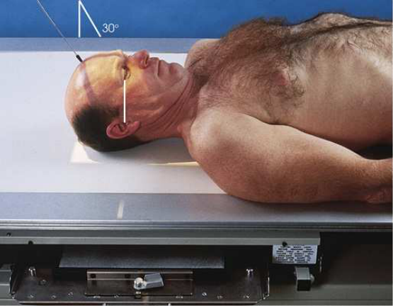
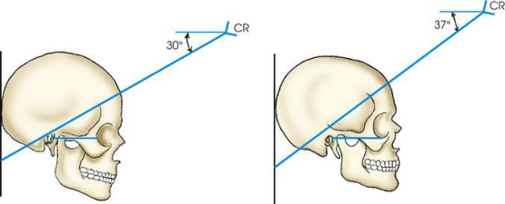
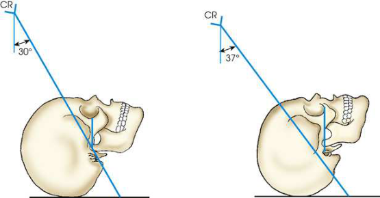
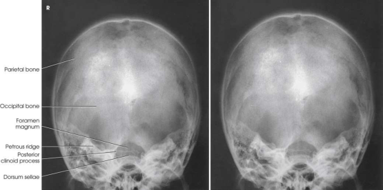
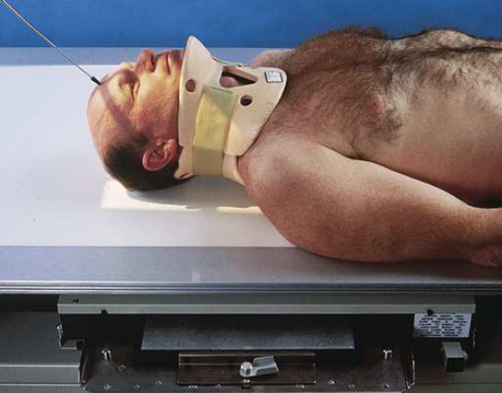
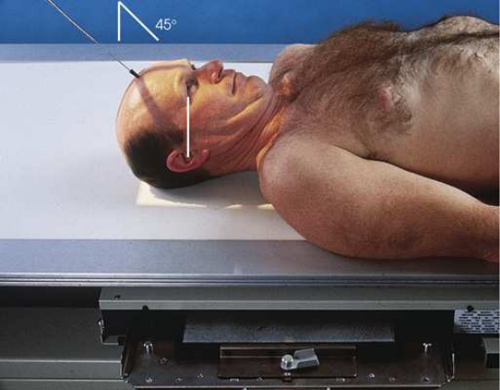

# Rx Craniu — Incidență AP Axială — Incidență AP Axială (Metoda Towne) (Merrill)

  📷 Radiografie Convențională (Rx)
  <strong>Actualizat:</strong> 2026-09-16
  <strong>Autor:</strong> Referință Merrill

---

-   __1. Rezumat Clinic & Indicații__

    ---

    === "Indicații Clinice"

        - Conform reperelor anatomice standard din tratat

    === "Ghid Național IRIS"

        !!! info "Referință Primară: Ghidul Național IRIS (Ordinul MS 1342/2012)"
            - **Capitol Ghid IRIS:** *Traumatisme — Față și orbite*
            - **Grad de Recomandare:** **Grad B**
            - **Nivel de Iradiere Estimată:** `Clasa 1 (Minimă < 0.2 mSv)`

            [:octicons-search-16: Deschide Ghidul IRIS](../../iris.md){ .md-button .md-button--primary } [:material-open-in-new: Aplicația Oficială PWA](https://radiologie-pediatrica.ro/iris/){ .md-button target="_blank" rel="noopener" }

-   __2. Poziționare & Centrare Fascicul__

    ---

    - **Poziție Pacient:** Cu pacientul în decubit dorsal sau așezat în ortostatism, se centrează MSP al corpului pacientului pe linia mediană a grilei. Se poziționează brațele pacientului într-o poziție confortabilă și se ajustează umerii pentru a se afla în același plan orizontal. Pentru a asigura confortul pacientului fără creșterea distanței până la receptorul de imagine, se examinează pacientul hiperstenic sau obez în poziție șezândă-în ortostatism, dacă este posibil. Craniul poate fi apropiat de receptorul de imagine solicitând pacientului să se aplece posterior în lordoză și să-și sprijine umerii pe/de stativul vertical Bucky. Când acest lucru este imposibil, incidența dorită a regiunii occipitobazale poate fi obținută utilizând incidența PA axială descrisă de Haas (pp. 50-51). Metoda Haas este inversa incidenței AP axiale și produce un rezultat comparabil.; se ajustează capul pacientului astfel încât MSP să fie perpendicular pe linia mediană a receptorului de imagine. Se flectează gâtul pacientului suficient pentru a plasa linia orbitomeatală (LOM) perpendicular pe planul receptorului de imagine. Când pacientul nu poate flecta gâtul în această măsură, se ajustează gâtul astfel încât linia infraorbitomeatală (LIOM) să fie perpendiculară și apoi se mărește angulația razei centrale cu 7 grade (Fig. 11.66–11.69). Se poziționează centrul receptorului de imagine la nivelul sau în apropierea nivelului găurii occipitale mari (foramen magnum). Pentru imaginea localizată a dorsum sellae și a stâncilor temporale (piramidele pietroase), se ajustează receptorul de imagine astfel încât punctul său median să coincidă cu raza centrală. Receptorul de imagine este centrat la nivelul sau puțin sub nivelul planului ocluzal. Se verifică din nou poziția și se imobilizează capul pacientului.
    - **Punct de Centrare Fascicul:** orientat prin gaura occipitală mare (foramen magnum) la un unghi caudal de 30 grade față de linia orbitomeatală (LOM) sau de 37 grade față de linia infraorbitomeatală (LIOM). Raza centrală intră la aproximativ 2 țoli (6.3 cm) deasupra glabelei și trece prin nivelul conductului auditiv extern (CAE).
    - **Distanță Focar-Film (DFF / SID):** Nespecificat în fragmentul extras; de verificat în sursă
    - **Comandă Respiratorie:** apnee (oprirea respirației).

-   __3. Parametri Tehnici Expunere__

    ---

    | Parametru Tehnic | Valoare Configurare Generator / Tub |
    |:-----------------|:-------------------------------------|
    | **Tensiune Tub (kV)** | DE CONFIGURAT PE APARAT |
    | **Sarcină / Produs Curent-Timp (mAs)** | DE CONFIGURAT PE APARAT |
    | **Distanță Focar-Film (DFF / SID)** | Nespecificat în fragmentul extras; de verificat în sursă |
    | **Grilă Antidifuzoare (Bucky)** | DE CONFIGURAT PE APARAT |
    | **Dimensiune Focar** | DE CONFIGURAT PE APARAT |
    | **Camere de Ionizare AEC** | DE CONFIGURAT PE APARAT |
    | **Colimare Fascicul** | Se ajustează câmpul de iradiere pentru a se extinde 1 țol (2.5 cm) dincolo de conturul cutanat al craniului. Se verifică lumina la vertex și pe ambele părți (bilateral). Se plasează markerul de lateralitate (D/S) în câmpul de expunere colimat. |
    | **Filtrare Tub** | DE CONFIGURAT PE APARAT |

-   __4. Criterii de Calitate & Reușită Imagine__

    ---

    - Criterii radiologice de calitate a imaginii:
    - Dovada colimării corecte și prezența markerului de lateralitate (D/S), plasat clar față de anatomia de interes
    - Craniul în întregime, fără rotație sau înclinare, evidențiat prin:
    - Distanțe egale de la marginile laterale ale craniului la marginile laterale ale găurii occipitale mari (foramen magnum), pe ambele părți (bilateral)
    - stânci temporale (piramide pietroase) simetrice
    - MSP al craniului aliniat cu axa longitudinală a câmpului colimat
    - Dorsum sellae și procesele clinoide posterioare vizibile în interiorul găurii occipitale mari (foramen magnum)
    - Detaliu osos al osului occipital și al țesuturilor moi înconjurătoare

-   __5. Protecție Radiologică (ALARA)__

    ---

    - Nespecificat în fragmentul extras; de verificat în sursă

!!! note "Observații Clinice & Tehnice"
    Deși această tehnică este denumită cel mai frecvent Incidență AP Axială (Metoda Towne), 3 autori numeroși au descris variații ușor diferite. În 1912, Grashey 4 a publicat prima descriere a incidenței AP axiale a craniului. În 1926, Altschul 5 și Towne 3 au descris poziția. Altschul a recomandat coborârea accentuată a bărbiei și direcționarea razei centrale prin gaura occipitală mare (foramen magnum) la un unghi caudal de 40 grade. Towne (citându-l pe Chamberlain) a recomandat ca, având bărbia coborâtă, raza centrală să fie orientată prin MSP dintr-un punct situat la aproximativ 3 țoli (7.6 cm) deasupra sprâncenelor către gaura occipitală mare (foramen magnum). Towne nu a specificat angulația razei centrale, însă aceasta ar depinde de flexia gâtului.

### 🖼️ Imagini

<figure class="protocol-image-card" markdown>

<figcaption><strong>Merrill — pagina 878, imaginea 1</strong> — Imagine din fragmentul sursă; asocierea necesită revizie.</figcaption>

</figure>

<figure class="protocol-image-card" markdown>

<figcaption><strong>Merrill — pagina 879, imaginea 2</strong> — Imagine din fragmentul sursă; asocierea necesită revizie.</figcaption>

</figure>

<figure class="protocol-image-card" markdown>

<figcaption><strong>Merrill — pagina 879, imaginea 3</strong> — Imagine din fragmentul sursă; asocierea necesită revizie.</figcaption>

</figure>

<figure class="protocol-image-card" markdown>

<figcaption><strong>Merrill — pagina 880, imaginea 4</strong> — Imagine din fragmentul sursă; asocierea necesită revizie.</figcaption>

</figure>

<figure class="protocol-image-card" markdown>

<figcaption><strong>Merrill — pagina 881, imaginea 5</strong> — Imagine din fragmentul sursă; asocierea necesită revizie.</figcaption>

</figure>

<figure class="protocol-image-card" markdown>

<figcaption><strong>Merrill — pagina 881, imaginea 6</strong> — Imagine din fragmentul sursă; asocierea necesită revizie.</figcaption>

</figure>

<figure class="protocol-image-card" markdown>

<figcaption><strong>Merrill — pagina 882, imaginea 7</strong> — Imagine din fragmentul sursă; asocierea necesită revizie.</figcaption>

</figure>

=== "Ghid Rapid de Execuție"

    1. **Identificarea și verificarea pacientului:** verificare identitate, zonă de examinat, consimțământ conform procedurii și evaluarea posibilității unei sarcini, când este relevantă.
    2. **Pregătire:** îndepărtarea oricăror obiecte radiopace (bijuterii, agrafe, fermoare, proteze, pansamente dense).
    3. **Poziționare precisă:** alinierea receptorului de imagine și a tubului la distanța prescrisă (Nespecificat în fragmentul extras; de verificat în sursă).
    4. **Colimare strictă:** adaptarea fasciculului strict la regiunea de diagnostic pentru scăderea iradierii și reducerea radiației difuze.
    5. **Radioprotecție:** verificarea [politicii RX](../radioprotectie.md), cu măsuri distincte pentru pacient, personal și însoțitor.

## Surse de documentare

- [Merrill’s Atlas, 11. Cranium, pagini 877–882](https://books.google.com/books/about/Merrill_s_Atlas_of_Radiographic_Position.html?id=BM0lEQAAQBAJ)
