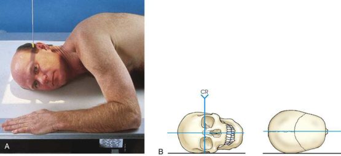
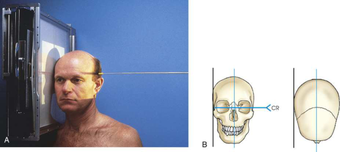
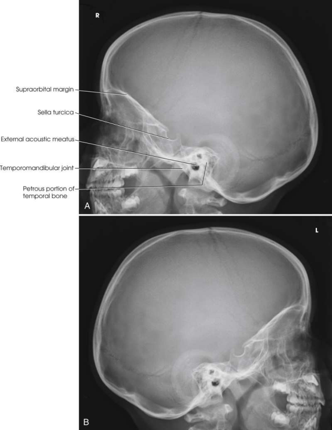
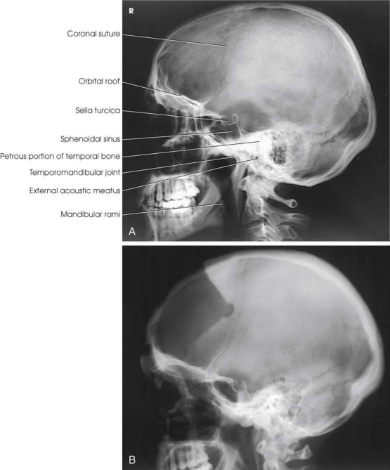

# Rx Craniu — Incidență de Profil (Lateral) — Profil (Drept sau Stâng) (Merrill)

  📷 Radiografie Convențională (Rx)
  <strong>Actualizat:</strong> 2026-09-16
  <strong>Autor:</strong> Referință Merrill

---

-   __1. Rezumat Clinic & Indicații__

    ---

    === "Indicații Clinice"

        - Conform reperelor anatomice standard din tratat

    === "Ghid Național IRIS"

        !!! info "Referință Primară: Ghidul Național IRIS (Ordinul MS 1342/2012)"
            - **Capitol Ghid IRIS:** *Ghidul Național IRIS*
            - **Grad de Recomandare:** **De verificat pe indicație; fără grad atribuit automat**
            - **Nivel de Iradiere Estimată:** `De verificat pentru examinarea și populația selectate`

            [:octicons-search-16: Deschide Ghidul IRIS](../../iris.md){ .md-button .md-button--primary } [:material-open-in-new: Aplicația Oficială PWA](https://radiologie-pediatrica.ro/iris/){ .md-button target="_blank" rel="noopener" }
-   __2. Poziționare & Centrare Fascicul__

    ---

    - **Poziție Pacient:** se așază pacientul în anterior Incidență Oblică, Poziție Șezândă în ortostatism sau Decubit. If Decubit anterior Incidență Oblică este used, Se instruiește pacientul să rest pe Antebraț și se flectează Genunchi de ridicat side.; se ajustează pacient’s cap astfel încât MSP este paralel cu plane de receptorul de imagine. If necessary, place support under side de Mandibulă la prevent it de la saСing. se ajustează flexion de pacientul’s neck astfel încât linie infraorbitomeatală (LIOM) este perpendicular pe front edge de receptorul de imagine. linie infraorbitomeatală (LIOM) trebuie să also fie paralel cu axa longitudinală de receptorul de imagine. poziție capul la place linie interpupilară (LIP) perpendicular pe receptorul de imagine (RI) (Figs. 11.52 și 11.53). pacient’s cap usually rests pe auricle de ear. Se imobilizează capul pacientului.
    - **Punct de Centrare Fascicul:** perpendicular, entering 2 inches (5 cm) superior la conduct auditiv extern (CAE). Se centrează receptorul de imagine pe raza centrală.
    - **Distanță Focar-Film (DFF / SID):** Nespecificat în fragmentul extras; de verificat în sursă
    - **Comandă Respiratorie:** apnee (oprirea respirației).

-   __3. Parametri Tehnici Expunere__

    ---

    | Parametru Tehnic | Valoare Configurare Generator / Tub |
    |:-----------------|:-------------------------------------|
    | **Tensiune Tub (kV)** | DE CONFIGURAT PE APARAT |
    | **Sarcină / Produs Curent-Timp (mAs)** | DE CONFIGURAT PE APARAT |
    | **Distanță Focar-Film (DFF / SID)** | Nespecificat în fragmentul extras; de verificat în sursă |
    | **Grilă Antidifuzoare (Bucky)** | DE CONFIGURAT PE APARAT |
    | **Dimensiune Focar** | DE CONFIGURAT PE APARAT |
    | **Camere de Ionizare AEC** | DE CONFIGURAT PE APARAT |
    | **Colimare Fascicul** | Adjust câmp de iradiere la extend 1 inch (2.5 cm) beyond skin line de Craniu. Check pentru light la vertex, anterior, posterior, și base de Craniu margini. Place marker de lateralitate (D/S) în collimated expunere field. |
    | **Filtrare Tub** | DE CONFIGURAT PE APARAT |

-   __4. Criterii de Calitate & Reușită Imagine__

    ---

    - Criterii radiologice de calitate imaginii: n Evidence de corect collimation și presence de marker de lateralitate (D/S) plasat clear de anatomy de interest n Entire Craniu fără rotație sau tilt, evidențiat prin:
    - Superimposed orbital roofs și greater wings de sphenoid
    - Superimposed mastoid regions și conduct auditiv extern (CAE)
    - Superimposed TMīs
    - șa turcească în profile n fără overlap de Coloană Cervicală prin Mandibulă n Bony detail de Craniu și surrounding soft tissues

-   __5. Protecție Radiologică (ALARA)__

    ---

    - Nespecificat în fragmentul extras; de verificat în sursă

!!! note "Observații Clinice & Tehnice"
    Conform reperelor anatomice standard din tratat

### 🖼️ Imagini

<figure class="protocol-image-card" markdown>

<figcaption><strong>Merrill — pagina PDF 869, imaginea 1</strong> — Imagine din fragmentul sursă; asocierea necesită revizie.</figcaption>

</figure>

<figure class="protocol-image-card" markdown>

<figcaption><strong>Merrill — pagina PDF 870, imaginea 2</strong> — Imagine din fragmentul sursă; asocierea necesită revizie.</figcaption>

</figure>

<figure class="protocol-image-card" markdown>

<figcaption><strong>Merrill — pagina PDF 870, imaginea 3</strong> — Imagine din fragmentul sursă; asocierea necesită revizie.</figcaption>

</figure>

<figure class="protocol-image-card" markdown>

<figcaption><strong>Merrill — pagina PDF 871, imaginea 4</strong> — Imagine din fragmentul sursă; asocierea necesită revizie.</figcaption>

</figure>

=== "Ghid Rapid de Execuție"

    1. **Identificarea și verificarea pacientului:** verificare identitate, zonă de examinat, consimțământ conform procedurii și evaluarea posibilității unei sarcini, când este relevantă.
    2. **Pregătire:** îndepărtarea oricăror obiecte radiopace (bijuterii, agrafe, fermoare, proteze, pansamente dense).
    3. **Poziționare precisă:** alinierea receptorului de imagine și a tubului la distanța prescrisă (Nespecificat în fragmentul extras; de verificat în sursă).
    4. **Colimare strictă:** adaptarea fasciculului strict la regiunea de diagnostic pentru scăderea iradierii și reducerea radiației difuze.
    5. **Radioprotecție:** verificarea [politicii RX](../radioprotectie.md), cu măsuri distincte pentru pacient, personal și însoțitor.

## Surse de documentare

- [Merrill’s Atlas, 11. Cranium, pagini PDF 868–871](../../assets/protocols/sources/a56d45c16829_Merrills_Atlas_of_Radiographic_Positioning__Procedures_3Vol_Set.pdf#page=868)

## Fragmente sursă traduse (referință tehnică)

### anatomy

Superimposed halves de cranium cu details de side adjacent la receptorul de imagine. șa turcească, anterior clinoid processes, dorsum sellae,
și posterior clinoid processes sunt well vizualizat în lateral incidență (Figs. 11.54 și 11.55).

### collimation

Adjust câmp de iradiere la extend 1 inch (2.5 cm) beyond skin line de craniul. Check pentru light la vertex, anterior, posterior, și base de skull margini. Place marker de lateralitate (D/S) în collimated expunere field.

### cr

• perpendicular, entering 2 inches (5 cm) superior la conduct auditiv extern (CAE).
• Se centrează receptorul de imagine pe raza centrală.

### criteria

Criterii radiologice de calitate imaginii:
n Evidence de corect collimation și presence de marker de lateralitate (D/S) plasat clear de anatomy de interest
n Entire cranium fără rotație sau tilt, evidențiat prin:
• Superimposed orbital roofs și greater wings de sphenoid
• Superimposed mastoid regions și conduct auditiv extern (CAE)
• Superimposed TMīs
• șa turcească în profile
n fără overlap de cervical coloană vertebrală prin mandible
n Bony detail de cranium și surrounding soft tissues

### part_pos

• se ajustează pacient’s cap astfel încât MSP este paralel cu plane de receptorul de imagine. If necessary, place support under side de mandible
la prevent it de la saСing.
• se ajustează flexion de pacientul’s neck astfel încât linie infraorbitomeatală (LIOM) este perpendicular pe front edge de receptorul de imagine. linie infraorbitomeatală (LIOM) trebuie să also fie paralel
la axa longitudinală de receptorul de imagine.
• poziție capul la place linie interpupilară (LIP) perpendicular pe receptorul de imagine (RI) (Figs. 11.52 și 11.53). pacient’s cap usually rests pe auricle de ear.
• Se imobilizează capul pacientului.

### patient_pos

• se așază pacientul în anterior oblic poziție, așezat pe scaun în ortostatism sau recumbent.
• If recumbent anterior oblic poziție este used, Se instruiește pacientul să rest pe forearm și se flectează genunchi de ridicat side.

### respiration

apnee (oprirea respirației).

### tech

poziționat prin manufacturer sau department protocol pentru corect anatomy display orientation; raza centrală plate: 10 × 12 inches (24 ×
30 cm) transversal.

