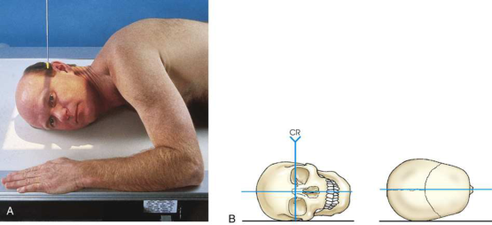
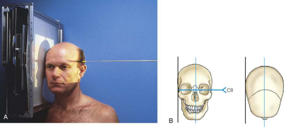
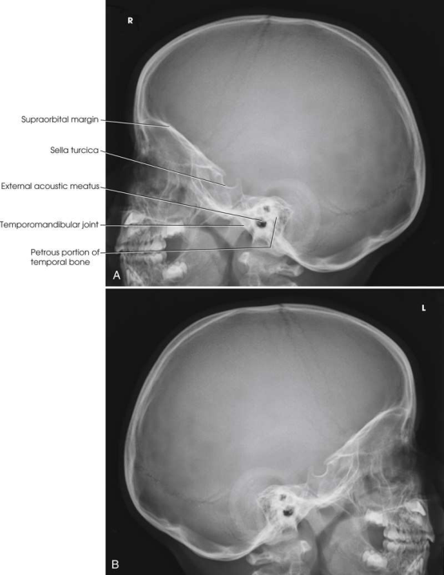
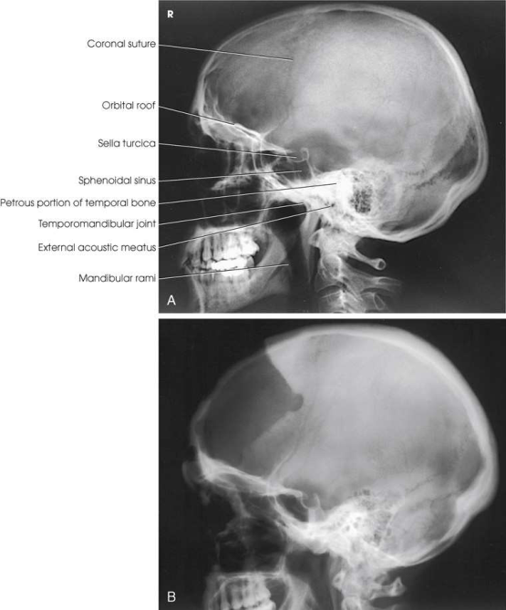

# Rx Craniu — Incidență de Profil (Lateral) — Profil (Drept sau Stâng) (Merrill)

  📷 Radiografie Convențională (Rx)
  <strong>Actualizat:</strong> 2026-09-16
  <strong>Autor:</strong> Referință Merrill

---

-   __1. Rezumat Clinic & Indicații__

    ---

    === "Indicații Clinice"

        - Conform reperelor anatomice standard din tratat

    === "Ghid Național IRIS"

        !!! info "Referință Primară: Ghidul Național IRIS (Ordinul MS 1342/2012)"
            - **Capitol Ghid IRIS:** *Ghidul Național IRIS*
            - **Grad de Recomandare:** **De verificat pe indicație; fără grad atribuit automat**
            - **Nivel de Iradiere Estimată:** `De verificat pentru examinarea și populația selectate`

            [:octicons-search-16: Deschide Ghidul IRIS](../../iris.md){ .md-button .md-button--primary } [:material-open-in-new: Aplicația Oficială PWA](https://radiologie-pediatrica.ro/iris/){ .md-button target="_blank" rel="noopener" }
-   __2. Poziționare & Centrare Fascicul__

    ---

    - **Poziție Pacient:** Se așază pacientul în incidență oblică anterioară, în poziție șezândă în ortostatism sau în decubit. Dacă se utilizează incidența oblică anterioară în decubit, pacientul este instruit să se sprijine pe antebraț și se flectează genunchiul pentru a ridica partea respectivă.; se ajustează capul pacientului astfel încât MSP să fie paralel cu planul receptorului de imagine. Dacă este necesar, se plasează un suport sub partea mandibulei pentru a preveni alunecarea acesteia. Se ajustează flexia gâtului pacientului astfel încât linia infraorbitomeatală (LIOM) să fie perpendiculară pe marginea anterioară a receptorului de imagine. Linia infraorbitomeatală (LIOM) trebuie să fie, de asemenea, paralelă cu axa longitudinală a receptorului de imagine. Se poziționează capul astfel încât linia interpupilară (LIP) să fie perpendiculară pe receptorul de imagine (RI) (Fig. 11.52 și 11.53). Capul pacientului se sprijină de obicei pe pavilionul urechii. Se imobilizează capul pacientului.
    - **Punct de Centrare Fascicul:** Perpendiculară, intrând la 2 inches (5 cm) superior de conductul auditiv extern (CAE). Se centrează receptorul de imagine pe raza centrală.
    - **Distanță Focar-Film (DFF / SID):** Nespecificat în fragmentul extras; de verificat în sursă
    - **Comandă Respiratorie:** apnee (oprirea respirației).

-   __3. Parametri Tehnici Expunere__

    ---

    | Parametru Tehnic | Valoare Configurare Generator / Tub |
    |:-----------------|:-------------------------------------|
    | **Tensiune Tub (kV)** | DE CONFIGURAT PE APARAT |
    | **Sarcină / Produs Curent-Timp (mAs)** | DE CONFIGURAT PE APARAT |
    | **Distanță Focar-Film (DFF / SID)** | Nespecificat în fragmentul extras; de verificat în sursă |
    | **Grilă Antidifuzoare (Bucky)** | DE CONFIGURAT PE APARAT |
    | **Dimensiune Focar** | DE CONFIGURAT PE APARAT |
    | **Camere de Ionizare AEC** | DE CONFIGURAT PE APARAT |
    | **Colimare Fascicul** | Se ajustează câmpul de iradiere pentru a se extinde 1 inch (2.5 cm) dincolo de conturul cutanat al craniului. Se verifică lumina la vertex, marginile anterioară, posterioară și bazală ale craniului. Se plasează markerul de lateralitate (D/S) în câmpul de expunere colimat. |
    | **Filtrare Tub** | DE CONFIGURAT PE APARAT |

-   __4. Criterii de Calitate & Reușită Imagine__

    ---

    - Criterii radiologice de calitate a imaginii: n Dovada colimării corecte și prezența markerului de lateralitate (D/S), plasat clar în afara anatomiei de interes n Întregul craniu fără rotație sau înclinare, evidențiat prin:
    - Plafoanele orbitare și aripile mari ale sfenoidului suprapuse
    - Regiunile mastoidiene și conductele auditive externe (CAE) suprapuse
    - TMI suprapuse
    - Șaua turcească în profil
• Fără suprapunerea coloanei cervicale prin mandibulă
• Detaliu osos al craniului și al țesuturilor moi înconjurătoare

-   __5. Protecție Radiologică (ALARA)__

    ---

    - Nespecificat în fragmentul extras; de verificat în sursă

!!! note "Observații Clinice & Tehnice"
    Conform reperelor anatomice standard din tratat

### 🖼️ Imagini

<figure class="protocol-image-card" markdown>

<figcaption><strong>Merrill — pagina 869, imaginea 1</strong> — Imagine din fragmentul sursă; asocierea necesită revizie.</figcaption>

</figure>

<figure class="protocol-image-card" markdown>

<figcaption><strong>Merrill — pagina 870, imaginea 2</strong> — Imagine din fragmentul sursă; asocierea necesită revizie.</figcaption>

</figure>

<figure class="protocol-image-card" markdown>

<figcaption><strong>Merrill — pagina 870, imaginea 3</strong> — Imagine din fragmentul sursă; asocierea necesită revizie.</figcaption>

</figure>

<figure class="protocol-image-card" markdown>

<figcaption><strong>Merrill — pagina 871, imaginea 4</strong> — Imagine din fragmentul sursă; asocierea necesită revizie.</figcaption>

</figure>

=== "Ghid Rapid de Execuție"

    1. **Identificarea și verificarea pacientului:** verificare identitate, zonă de examinat, consimțământ conform procedurii și evaluarea posibilității unei sarcini, când este relevantă.
    2. **Pregătire:** îndepărtarea oricăror obiecte radiopace (bijuterii, agrafe, fermoare, proteze, pansamente dense).
    3. **Poziționare precisă:** alinierea receptorului de imagine și a tubului la distanța prescrisă (Nespecificat în fragmentul extras; de verificat în sursă).
    4. **Colimare strictă:** adaptarea fasciculului strict la regiunea de diagnostic pentru scăderea iradierii și reducerea radiației difuze.
    5. **Radioprotecție:** verificarea [politicii RX](../radioprotectie.md), cu măsuri distincte pentru pacient, personal și însoțitor.

## Surse de documentare

- [Merrill’s Atlas, 11. Cranium, pagini 868–871](https://books.google.com/books/about/Merrill_s_Atlas_of_Radiographic_Position.html?id=BM0lEQAAQBAJ)

## Fragmente sursă traduse (referință tehnică)

### anatomie

Jumătățile suprapuse ale craniului, cu detalii ale părții adiacente receptorului de imagine. Șaua turcească, procesele clinoide anterioare, dorsum sellae și procesele clinoide posterioare sunt bine vizualizate în incidența de profil (Fig. 11.54 și 11.55).

### colimare

Se ajustează câmpul de iradiere pentru a se extinde 1 inch (2.5 cm) dincolo de conturul cutanat al craniului. Se verifică lumina la vertex, marginile anterioară, posterioară și bazală ale craniului. Se plasează markerul de lateralitate (D/S) în câmpul de expunere colimat.

### raza centrală

• Perpendiculară, intrând la 2 inches (5 cm) superior de conductul auditiv extern (CAE).
• Se centrează receptorul de imagine pe raza centrală.

### criterii

Criterii radiologice de calitate a imaginii:
• Dovada colimării corecte și prezența markerului de lateralitate (D/S), plasat clar față de anatomia de interes
• Craniul în întregime, fără rotație sau înclinare, evidențiat prin:
• Plafoanele orbitare și aripile mari ale sfenoidului suprapuse
• Regiunile mastoidiene și conductele auditive externe (CAE) suprapuse
• TMI suprapuse
• Șaua turcească în profil
• Fără suprapunerea coloanei vertebrale cervicale prin mandibulă
• Detaliu osos al craniului și al țesuturilor moi înconjurătoare

### part_pos

• Se ajustează capul pacientului astfel încât MSP să fie paralel cu planul receptorului de imagine. Dacă este necesar, se plasează un suport sub partea mandibulei pentru a preveni alunecarea acesteia.
• Se ajustează flexia gâtului pacientului astfel încât linia infraorbitomeatală (LIOM) să fie perpendiculară pe marginea anterioară a receptorului de imagine. Linia infraorbitomeatală (LIOM) trebuie să fie, de asemenea, paralelă cu axa longitudinală a receptorului de imagine.
• Se poziționează capul astfel încât linia interpupilară (LIP) să fie perpendiculară pe receptorul de imagine (RI) (Fig. 11.52 și 11.53). Capul pacientului se sprijină de obicei pe pavilionul urechii.
• Se imobilizează capul pacientului.

### patient_pos

• Se așază pacientul în poziție oblică anterioară, în șezut pe scaun în ortostatism sau în decubit.
• Dacă se utilizează poziția oblică anterioară în decubit, pacientul este instruit să se sprijine pe antebraț și se flectează genunchiul pentru a ridica partea respectivă.

### respirație

apnee (oprirea respirației).

### tehnică

Poziționat conform protocolului producătorului sau al departamentului pentru orientarea corectă a afișării anatomiei; placa pentru raza centrală: 10 × 12 inches (24 ×
30 cm), transversal.

