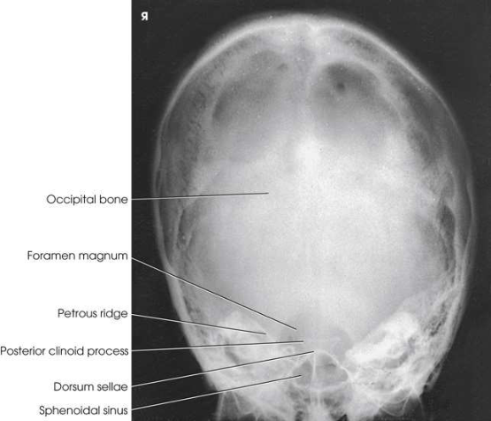

# Rx Craniu — Incidență PA Axială — Metoda Haas (Merrill)

  📷 Radiografie Convențională (Rx)
  <strong>Actualizat:</strong> 2026-09-16
  <strong>Autor:</strong> Referință Merrill

---

-   __1. Rezumat Clinic & Indicații__

    ---

    === "Indicații Clinice"

        - Conform reperelor anatomice standard din tratat

    === "Ghid Național IRIS"

        !!! info "Referință Primară: Ghidul Național IRIS (Ordinul MS 1342/2012)"
            - **Capitol Ghid IRIS:** *Ghidul Național IRIS*
            - **Grad de Recomandare:** **De verificat pe indicație; fără grad atribuit automat**
            - **Nivel de Iradiere Estimată:** `De verificat pentru examinarea și populația selectate`

            [:octicons-search-16: Deschide Ghidul IRIS](../../iris.md){ .md-button .md-button--primary } [:material-open-in-new: Aplicația Oficială PWA](https://radiologie-pediatrica.ro/iris/){ .md-button target="_blank" rel="noopener" }
-   __2. Poziționare & Centrare Fascicul__

    ---

    - **Poziție Pacient:** se ajustează pacient în Decubit ventral sau Poziție Șezândă-ortostatism, și center MSP de corp la linia mediană grilă. se flectează pacient’s coate, place brațele în comfortable poziție, și se ajustează umeri la lie în same plan orizontal.; se sprijină pacientul’s forehead și nose pe masa de examinare, cu MSP perpendicular pe linia mediană grilă. se ajustează flexion de gâtul astfel încât linie orbitomeatală (LOM) este perpendicular pe receptorul de imagine (RI) (Figs. 11.77–11.79). Se imobilizează capul pacientului. pentru localized imagine de sellar region sau stânci temporale (piramide pietroase), sau ambele, se ajustează poziție de receptorul de imagine astfel încât midpoint coincides cu raza centrală centrală; shift receptorul de imagine cranial approximately 3 inches (7.6 cm) pentru include vertex de Craniu.
    - **Punct de Centrare Fascicul:** orientat la cranial angle de 25 grade la linie orbitomeatală (LOM) la enter point 1 inches (3.8 cm) below extern occipital protuberance (inion) și la exit approximately 1 inches (3.8 cm) superior la nazion. raza centrală poate fie varied la show other cranial anatomy.
    - **Distanță Focar-Film (DFF / SID):** Nespecificat în fragmentul extras; de verificat în sursă
    - **Comandă Respiratorie:** apnee (oprirea respirației).

-   __3. Parametri Tehnici Expunere__

    ---

    | Parametru Tehnic | Valoare Configurare Generator / Tub |
    |:-----------------|:-------------------------------------|
    | **Tensiune Tub (kV)** | DE CONFIGURAT PE APARAT |
    | **Sarcină / Produs Curent-Timp (mAs)** | DE CONFIGURAT PE APARAT |
    | **Distanță Focar-Film (DFF / SID)** | Nespecificat în fragmentul extras; de verificat în sursă |
    | **Grilă Antidifuzoare (Bucky)** | DE CONFIGURAT PE APARAT |
    | **Dimensiune Focar** | DE CONFIGURAT PE APARAT |
    | **Camere de Ionizare AEC** | DE CONFIGURAT PE APARAT |
    | **Colimare Fascicul** | se ajustează câmp de iradiere la extend 1 inch (2.5 cm) beyond skin line de Craniu. Check pentru light above vertex și pe ambele părți (bilateral). Place marker de lateralitate (D/S) în collimated expunere field. |
    | **Filtrare Tub** | DE CONFIGURAT PE APARAT |

-   __4. Criterii de Calitate & Reușită Imagine__

    ---

    - Criterii radiologice de calitate imaginii: n Evidence de corect collimation și presence de marker de lateralitate (D/S) plasat clear de anatomy de interest n Entire Craniu, fără rotație sau tilt, evidențiat prin:
    - Equal distances de la lateral margini de Craniu la lateral margins de gaură occipitală mare (foramen magnum) pe ambele părți (bilateral)
    - simetric stânci temporale (piramide pietroase)
    - MSP de Craniu aliniat cu axa longitudinală de câmp colimat n Dorsum sellae și posterior clinoid processes within gaură occipitală mare (foramen magnum) n Bony detail de occipital bone și surrounding soft tissues

-   __5. Protecție Radiologică (ALARA)__

    ---

    - Nespecificat în fragmentul extras; de verificat în sursă

!!! note "Observații Clinice & Tehnice"
    Conform reperelor anatomice standard din tratat

### 🖼️ Imagini

<figure class="protocol-image-card" markdown>

<figcaption><strong>Merrill — pagina PDF 886, imaginea 1</strong> — Imagine din fragmentul sursă; asocierea necesită revizie.</figcaption>

</figure>

=== "Ghid Rapid de Execuție"

    1. **Identificarea și verificarea pacientului:** verificare identitate, zonă de examinat, consimțământ conform procedurii și evaluarea posibilității unei sarcini, când este relevantă.
    2. **Pregătire:** îndepărtarea oricăror obiecte radiopace (bijuterii, agrafe, fermoare, proteze, pansamente dense).
    3. **Poziționare precisă:** alinierea receptorului de imagine și a tubului la distanța prescrisă (Nespecificat în fragmentul extras; de verificat în sursă).
    4. **Colimare strictă:** adaptarea fasciculului strict la regiunea de diagnostic pentru scăderea iradierii și reducerea radiației difuze.
    5. **Radioprotecție:** verificarea [politicii RX](../radioprotectie.md), cu măsuri distincte pentru pacient, personal și însoțitor.

## Surse de documentare

- [Merrill’s Atlas, 11. Cranium, pagini PDF 885–886](../../assets/protocols/sources/a56d45c16829_Merrills_Atlas_of_Radiographic_Positioning__Procedures_3Vol_Set.pdf#page=885)

## Fragmente sursă traduse (referință tehnică)

### anatomy

occipital region de cranium, simetric imagine de stânci temporale (piramide pietroase), și dorsum sellae și posterior clinoid processes within gaură occipitală mare (foramen magnum) (Figs. 11.80 și 11.81).

### collimation

• se ajustează câmp de iradiere la extend 1 inch (2.5 cm) beyond skin line de craniul. Check pentru light above vertex și pe ambele părți (bilateral).
Place marker de lateralitate (D/S) în collimated expunere field.

### cr

• orientat la cranial angle de 25 grade la linie orbitomeatală (LOM) la enter point 1
inches (3.8 cm) below extern occipital protuberance (inion) și la exit approximately 1
inches (3.8 cm) superior la nazion. raza centrală poate fie varied la show other cranial anatomy.

### criteria

Criterii radiologice de calitate imaginii:
n Evidence de corect collimation și presence de marker de lateralitate (D/S) plasat clear de anatomy de interest
n Entire cranium, fără rotație sau tilt, evidențiat prin:
• Equal distances de la lateral margini de skull la lateral margins de gaură occipitală mare (foramen magnum) pe ambele părți (bilateral)
• simetric stânci temporale (piramide pietroase)
• MSP de cranium aliniat cu axa longitudinală de câmp colimat
n Dorsum sellae și posterior clinoid processes within gaură occipitală mare (foramen magnum)
n Bony detail de occipital bone și surrounding soft tissues

### part_pos

• se sprijină pacientul’s forehead și nose pe masa de examinare, cu MSP perpendicular pe linia mediană grilă.
• se ajustează flexion de gâtul astfel încât linie orbitomeatală (LOM) este perpendicular pe receptorul de imagine (RI) (Figs. 11.77–11.79).
• Se imobilizează capul pacientului.
• pentru localized imagine de sellar region sau stânci temporale (piramide pietroase), sau ambele, se ajustează poziție de receptorul de imagine astfel încât midpoint coincides
cu raza centrală centrală; shift receptorul de imagine cranial approximately 3 inches (7.6 cm) pentru include vertex de craniul.

### patient_pos

• se ajustează pacient în decubit ventral sau așezat pe scaun-ortostatism, și center MSP de corp la linia mediană grilă.
• se flectează pacient’s coate, place brațele în comfortable poziție, și se ajustează umeri la lie în same plan orizontal.

### respiration

apnee (oprirea respirației).

### tech

poziționat prin manufacturer sau department protocol pentru corect anatomy display orientation; raza centrală plate: 10 × 12 inches (24
× 30 cm) longitudinal.

