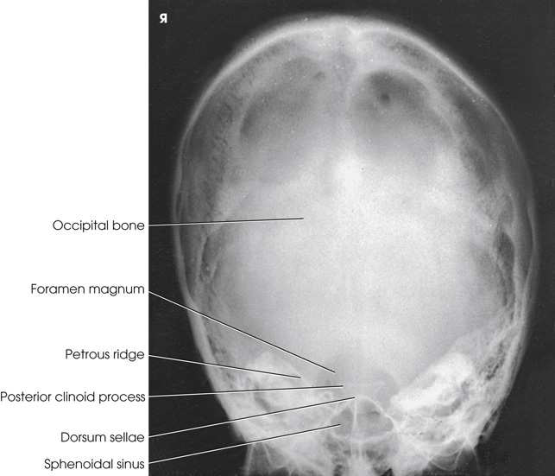

# Rx Craniu — Incidență PA Axială — Metoda Haas (Merrill)

  📷 Radiografie Convențională (Rx)
  <strong>Actualizat:</strong> 2026-09-16
  <strong>Autor:</strong> Referință Merrill

---

-   __1. Rezumat Clinic & Indicații__

    ---

    === "Indicații Clinice"

        - Conform reperelor anatomice standard din tratat

    === "Ghid Național IRIS"

        !!! info "Referință Primară: Ghidul Național IRIS (Ordinul MS 1342/2012)"
            - **Capitol Ghid IRIS:** *Ghidul Național IRIS*
            - **Grad de Recomandare:** **De verificat pe indicație; fără grad atribuit automat**
            - **Nivel de Iradiere Estimată:** `De verificat pentru examinarea și populația selectate`

            [:octicons-search-16: Deschide Ghidul IRIS](../../iris.md){ .md-button .md-button--primary } [:material-open-in-new: Aplicația Oficială PWA](https://radiologie-pediatrica.ro/iris/){ .md-button target="_blank" rel="noopener" }
-   __2. Poziționare & Centrare Fascicul__

    ---

    - **Poziție Pacient:** Se poziționează pacientul în decubit ventral sau în poziție șezândă-în ortostatism și se centrează MSP al corpului pe linia mediană a grilei. Se flectează coatele pacientului, se așază brațele într-o poziție confortabilă și se ajustează umerii pentru a se afla în același plan orizontal.; se sprijină fruntea și nasul pacientului pe masa de examinare, cu MSP perpendicular pe linia mediană a grilei. Se ajustează flexia gâtului astfel încât linia orbitomeatală (LOM) să fie perpendiculară pe receptorul de imagine (RI) (Fig. 11.77–11.79). Se imobilizează capul pacientului. Pentru imaginea localizată a regiunii selare sau a stâncilor temporale (piramidele pietroase), sau a ambelor, se ajustează poziția receptorului de imagine astfel încât punctul median să coincidă cu raza centrală; se deplasează receptorul de imagine cranial cu aproximativ 3 inches (7.6 cm) pentru a include vertexul craniului.
    - **Punct de Centrare Fascicul:** Orientată cu un unghi cranial de 25 grade față de linia orbitomeatală (LOM), la punctul de intrare situat la 1 inches (3.8 cm) sub protuberanța occipitală externă (inion) și la punctul de ieșire situat la aproximativ 1 inches (3.8 cm) superior de nazion. Raza centrală poate fi variată pentru a evidenția alte structuri anatomice craniene.
    - **Distanță Focar-Film (DFF / SID):** Nespecificat în fragmentul extras; de verificat în sursă
    - **Comandă Respiratorie:** apnee (oprirea respirației).

-   __3. Parametri Tehnici Expunere__

    ---

    | Parametru Tehnic | Valoare Configurare Generator / Tub |
    |:-----------------|:-------------------------------------|
    | **Tensiune Tub (kV)** | DE CONFIGURAT PE APARAT |
    | **Sarcină / Produs Curent-Timp (mAs)** | DE CONFIGURAT PE APARAT |
    | **Distanță Focar-Film (DFF / SID)** | Nespecificat în fragmentul extras; de verificat în sursă |
    | **Grilă Antidifuzoare (Bucky)** | DE CONFIGURAT PE APARAT |
    | **Dimensiune Focar** | DE CONFIGURAT PE APARAT |
    | **Camere de Ionizare AEC** | DE CONFIGURAT PE APARAT |
    | **Colimare Fascicul** | se ajustează câmpul de iradiere pentru a se extinde cu 1 inch (2.5 cm) dincolo de conturul cutanat al craniului. Se verifică lumina deasupra vertexului și pe ambele părți (bilateral). Se plasează markerul de lateralitate (D/S) în câmpul de expunere colimat. |
    | **Filtrare Tub** | DE CONFIGURAT PE APARAT |

-   __4. Criterii de Calitate & Reușită Imagine__

    ---

    - Criterii radiologice de calitate a imaginii:
• Dovada colimării corecte și prezența markerului de lateralitate (D/S), plasat clar față de anatomia de interes
• Craniul în întregime, fără rotație sau înclinare, evidențiat prin:
    - Distanțe egale de la marginile laterale ale craniului la marginile laterale ale găurii occipitale mari (foramen magnum), pe ambele părți (bilateral)
    - stânci temporale (piramide pietroase) simetrice
    - MSP al craniului aliniat cu axa longitudinală a câmpului colimat
• Dorsum sellae și procesele clinoide posterioare în interiorul găurii occipitale mari (foramen magnum)
• Detaliu osos al osului occipital și al țesuturilor moi înconjurătoare

-   __5. Protecție Radiologică (ALARA)__

    ---

    - Nespecificat în fragmentul extras; de verificat în sursă

!!! note "Observații Clinice & Tehnice"
    Conform reperelor anatomice standard din tratat

### 🖼️ Imagini

<figure class="protocol-image-card" markdown>

<figcaption><strong>Merrill — pagina 886, imaginea 1</strong> — Imagine din fragmentul sursă; asocierea necesită revizie.</figcaption>

</figure>

=== "Ghid Rapid de Execuție"

    1. **Identificarea și verificarea pacientului:** verificare identitate, zonă de examinat, consimțământ conform procedurii și evaluarea posibilității unei sarcini, când este relevantă.
    2. **Pregătire:** îndepărtarea oricăror obiecte radiopace (bijuterii, agrafe, fermoare, proteze, pansamente dense).
    3. **Poziționare precisă:** alinierea receptorului de imagine și a tubului la distanța prescrisă (Nespecificat în fragmentul extras; de verificat în sursă).
    4. **Colimare strictă:** adaptarea fasciculului strict la regiunea de diagnostic pentru scăderea iradierii și reducerea radiației difuze.
    5. **Radioprotecție:** verificarea [politicii RX](../radioprotectie.md), cu măsuri distincte pentru pacient, personal și însoțitor.

## Surse de documentare

- [Merrill’s Atlas, 11. Cranium, pagini 885–886](https://books.google.com/books/about/Merrill_s_Atlas_of_Radiographic_Position.html?id=BM0lEQAAQBAJ)

## Fragmente sursă traduse (referință tehnică)

### anatomie

Regiunea occipitală a craniului, imagine simetrică a stâncilor temporale (piramidelor pietroase) și dorsum sellae și procesele clinoide posterioare în interiorul găurii occipitale mari (foramen magnum) (Fig. 11.80 și 11.81).

### colimare

• se ajustează câmpul de iradiere pentru a se extinde cu 1 inch (2.5 cm) dincolo de conturul cutanat al craniului. Se verifică lumina deasupra vertexului și pe ambele părți (bilateral).
Se plasează markerul de lateralitate (D/S) în câmpul de expunere colimat.

### raza centrală

• se orientează la un unghi cranial de 25 grade față de linia orbitomeatală (LOM), cu punctul de intrare la 1
inch (3.8 cm) sub protuberanța occipitală externă (inion) și cu punctul de ieșire la aproximativ 1
inch (3.8 cm) superior de nazion. Raza centrală poate fi variată pentru a evidenția alte structuri craniene.

### criterii

Criterii radiologice de calitate a imaginii:
• Dovezi de colimare corectă și prezența markerului de lateralitate (D/S), plasat clar față de anatomia de interes
• Întregul craniu, fără rotație sau înclinare, evidențiat prin:
• distanțe egale de la marginile laterale ale craniului la marginile laterale ale găurii occipitale mari (foramen magnum), pe ambele părți (bilateral)
• stânci temporale (piramide pietroase) simetrice
• MSP al craniului aliniat cu axa longitudinală a câmpului colimat
• Dorsum sellae și procesele clinoide posterioare în interiorul găurii occipitale mari (foramen magnum)
• Detaliu osos al osului occipital și al țesuturilor moi adiacente

### part_pos

• se sprijină fruntea și nasul pacientului pe masa de examinare, cu MSP perpendicular pe linia mediană a grilei.
• se ajustează flexia gâtului astfel încât linia orbitomeatală (LOM) să fie perpendiculară pe receptorul de imagine (RI) (Figs. 11.77–11.79).
• Se imobilizează capul pacientului.
• pentru imagine localizată a regiunii șeii turcești sau a stâncilor temporale (piramide pietroase), ori a ambelor, se ajustează poziția receptorului de imagine astfel încât punctul de mijloc să coincidă cu raza centrală; se deplasează receptorul de imagine cranial cu aproximativ 3 inches (7.6 cm) pentru a include vertexul craniului.

### patient_pos

• se ajustează pacientul în decubit ventral sau în poziție șezândă pe scaun-ortostatism și se centrează MSP al corpului pe linia mediană a grilei.
• se flectează coatele pacientului, se așază brațele într-o poziție confortabilă și se ajustează umerii pentru a se afla în același plan orizontal.

### respirație

apnee (oprirea respirației).

### tehnică

poziționat conform indicațiilor producătorului sau protocolului departamentului pentru orientarea corectă a afișării anatomiei; placa razei centrale: 10 × 12 țoli (24
× 30 cm), longitudinal.

