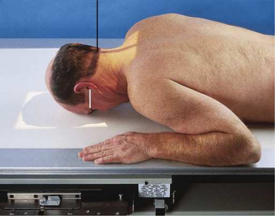
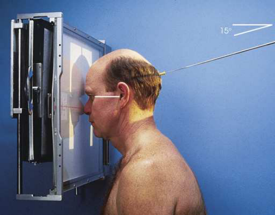
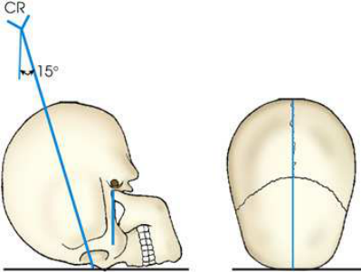
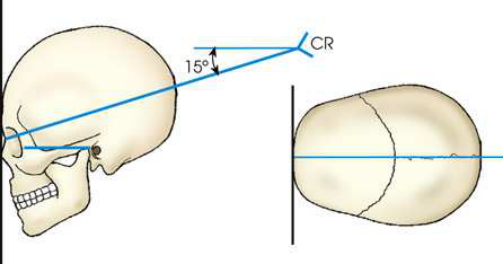
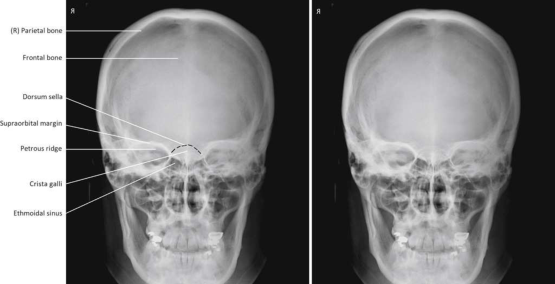
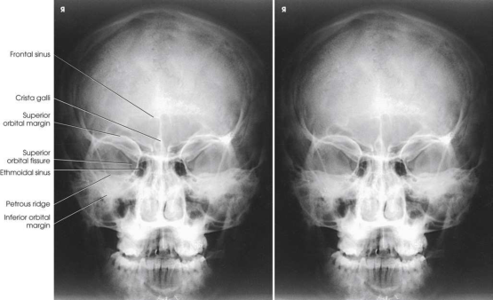

# Rx Craniu — Incidență Postero-Anterioară (PA) And Incidență PA Axială — Incidență Occipito-Frontală (Metoda Caldwell) (Merrill)

  📷 Radiografie Convențională (Rx)
  <strong>Actualizat:</strong> 2026-09-16
  <strong>Autor:</strong> Referință Merrill

---

-   __1. Rezumat Clinic & Indicații__

    ---

    === "Indicații Clinice"

        - Conform reperelor anatomice standard din tratat

    === "Ghid Național IRIS"

        !!! info "Referință Primară: Ghidul Național IRIS (Ordinul MS 1342/2012)"
            - **Capitol Ghid IRIS:** *Ghidul Național IRIS*
            - **Grad de Recomandare:** **De verificat pe indicație; fără grad atribuit automat**
            - **Nivel de Iradiere Estimată:** `De verificat pentru examinarea și populația selectate`

            [:octicons-search-16: Deschide Ghidul IRIS](../../iris.md){ .md-button .md-button--primary } [:material-open-in-new: Aplicația Oficială PWA](https://radiologie-pediatrica.ro/iris/){ .md-button target="_blank" rel="noopener" }
-   __2. Poziționare & Centrare Fascicul__

    ---

    - **Poziție Pacient:** se așază pacientul în Decubit ventral sau Poziție Șezândă poziție. Center MSP de pacientul’s corp la linia mediană grilă. se sprijină pacientul’s forehead și nose pe masa de examinare sau pe / sprijinit de stativ vertical Bucky. se flectează pacient’s coate, și place brațele în comfortable poziție.; se ajustează flexion de pacientul’s neck astfel încât linie orbitomeatală (LOM) este perpendicular pe plane de receptorul de imagine. If pacientul este Decubit, support bărbia pe radiolucent sponge if needed. If pacientul este obese sau hypersthenic, small radiolucent sponge poate need la fie plasat under (sau în front oΥ) forehead. Align MSP perpendicular pe receptorul de imagine (RI). This este accomplished prin adjusting lateral margins de Orbite sau conduct auditiv extern (CAE) echidistant față de tabletop. se imobilizează pacient’s cap, și se centrează receptorul de imagine la nazion.
    - **Punct de Centrare Fascicul:** pentru Incidență Postero-Anterioară (PA), when frontal bone este de primary interest, se orientează raza centrală centrală perpendicular la exit nazion (Fig. 11.56). pentru Incidență PA Axială, Incidență Occipito-Frontală (Metoda Caldwell), se orientează raza centrală centrală la exit nazion la un unghi de 15 grade caudal (Figs. 11.57– 11.59). Se centrează receptorul de imagine pe raza centrală. la show superior orbital fissures, se orientează raza centrală centrală through mid-Orbite la un unghi de 20 la 25 grade caudal. la show rotundum foramina, se orientează raza centrală centrală la nazion la un unghi de 25 la 30 grade caudal. (Incidență Occipito-Mentonieră (Metoda Waters), presented în Sinus radiografie section, este also used la show rotundum foramina.)
    - **Distanță Focar-Film (DFF / SID):** Nespecificat în fragmentul extras; de verificat în sursă
    - **Comandă Respiratorie:** apnee (oprirea respirației).

-   __3. Parametri Tehnici Expunere__

    ---

    | Parametru Tehnic | Valoare Configurare Generator / Tub |
    |:-----------------|:-------------------------------------|
    | **Tensiune Tub (kV)** | DE CONFIGURAT PE APARAT |
    | **Sarcină / Produs Curent-Timp (mAs)** | DE CONFIGURAT PE APARAT |
    | **Distanță Focar-Film (DFF / SID)** | Nespecificat în fragmentul extras; de verificat în sursă |
    | **Grilă Antidifuzoare (Bucky)** | DE CONFIGURAT PE APARAT |
    | **Dimensiune Focar** | DE CONFIGURAT PE APARAT |
    | **Camere de Ionizare AEC** | DE CONFIGURAT PE APARAT |
    | **Colimare Fascicul** | Adjust câmp de iradiere la extend 1 inch (2.5 cm) beyond skin line de Craniu. Check pentru light la vertex și pe ambele părți (bilateral). Place marker de lateralitate (D/S) în collimated expunere field. |
    | **Filtrare Tub** | DE CONFIGURAT PE APARAT |

-   __4. Criterii de Calitate & Reușită Imagine__

    ---

    - Conform reperelor anatomice standard din tratat

-   __5. Protecție Radiologică (ALARA)__

    ---

    - Nespecificat în fragmentul extras; de verificat în sursă

!!! note "Observații Clinice & Tehnice"
    Conform reperelor anatomice standard din tratat

### 🖼️ Imagini

<figure class="protocol-image-card" markdown>

<figcaption><strong>Merrill — pagina PDF 872, imaginea 1</strong> — Imagine din fragmentul sursă; asocierea necesită revizie.</figcaption>

</figure>

<figure class="protocol-image-card" markdown>

<figcaption><strong>Merrill — pagina PDF 873, imaginea 2</strong> — Imagine din fragmentul sursă; asocierea necesită revizie.</figcaption>

</figure>

<figure class="protocol-image-card" markdown>

<figcaption><strong>Merrill — pagina PDF 873, imaginea 3</strong> — Imagine din fragmentul sursă; asocierea necesită revizie.</figcaption>

</figure>

<figure class="protocol-image-card" markdown>

<figcaption><strong>Merrill — pagina PDF 873, imaginea 4</strong> — Imagine din fragmentul sursă; asocierea necesită revizie.</figcaption>

</figure>

<figure class="protocol-image-card" markdown>

<figcaption><strong>Merrill — pagina PDF 874, imaginea 5</strong> — Imagine din fragmentul sursă; asocierea necesită revizie.</figcaption>

</figure>

<figure class="protocol-image-card" markdown>

<figcaption><strong>Merrill — pagina PDF 874, imaginea 6</strong> — Imagine din fragmentul sursă; asocierea necesită revizie.</figcaption>

</figure>

=== "Ghid Rapid de Execuție"

    1. **Identificarea și verificarea pacientului:** verificare identitate, zonă de examinat, consimțământ conform procedurii și evaluarea posibilității unei sarcini, când este relevantă.
    2. **Pregătire:** îndepărtarea oricăror obiecte radiopace (bijuterii, agrafe, fermoare, proteze, pansamente dense).
    3. **Poziționare precisă:** alinierea receptorului de imagine și a tubului la distanța prescrisă (Nespecificat în fragmentul extras; de verificat în sursă).
    4. **Colimare strictă:** adaptarea fasciculului strict la regiunea de diagnostic pentru scăderea iradierii și reducerea radiației difuze.
    5. **Radioprotecție:** verificarea [politicii RX](../radioprotectie.md), cu măsuri distincte pentru pacient, personal și însoțitor.

## Surse de documentare

- [Merrill’s Atlas, 11. Cranium, pagini PDF 871–874](../../assets/protocols/sources/a56d45c16829_Merrills_Atlas_of_Radiographic_Positioning__Procedures_3Vol_Set.pdf#page=871)

## Fragmente sursă traduse (referință tehnică)

### anatomy

pentru PA incidență cu perpendicular raza centrală (Fig. 11.60), orbits sunt filled prin margins de stânci temporale (piramide pietroase). Other structures
vizualizat include posterior ethmoidal air cells, crista galli, frontal bone, și sinusuri frontale. dorsum sellae este seen ca curved line extending
între orbits, just above ethmoidal air cells.
When raza centrală este Înclinat 15 grade caudal la nazion pentru PA axial incidență, Caldwell method, many de same structures that
appear în PA incidență sunt seen (Fig. 11.61); however, stânci temporale (piramide pietroase) sunt projected into lower third de orbits. Caldwell method
also shows anterior ethmoidal air cells. Schüller, 2 who first described this positioning pentru craniul, recommended caudal angle de 25
grade.
Stretcher și bedside examinations

### collimation

• Adjust câmp de iradiere la extend 1 inch (2.5 cm) beyond skin line de craniul. Check pentru light la vertex și pe ambele părți (bilateral). Place marker de lateralitate (D/S) în collimated expunere field.

### cr

• pentru PA incidență, when frontal bone este de primary interest, se orientează raza centrală centrală perpendicular la exit nazion (Fig. 11.56).
• pentru PA axial incidență, Caldwell method, se orientează raza centrală centrală la exit nazion la un unghi de 15 grade caudal (Figs. 11.57–
11.59).
• Se centrează receptorul de imagine pe raza centrală.
• la show superior orbital fissures, se orientează raza centrală centrală through mid-orbits la un unghi de 20 la 25 grade caudal.
• la show rotundum foramina, se orientează raza centrală centrală la nazion la un unghi de 25 la 30 grade caudal. (Waters method,
presented în Sinus radiografie section, este also used la show rotundum foramina.)

### part_pos

• se ajustează flexion de pacientul’s neck astfel încât linie orbitomeatală (LOM) este perpendicular pe plane de receptorul de imagine.
• If pacientul este recumbent, support bărbia pe radiolucent sponge if needed.
• If pacientul este obese sau hypersthenic, small radiolucent sponge poate need la fie plasat under (sau în front oΥ) forehead.
• Align MSP perpendicular pe receptorul de imagine (RI). This este accomplished prin adjusting lateral margins de orbits sau conduct auditiv extern (CAE) echidistant față de
tabletop.
• se imobilizează pacient’s cap, și se centrează receptorul de imagine la nazion.

### patient_pos

• se așază pacientul în decubit ventral sau așezat pe scaun poziție.
• Center MSP de pacientul’s corp la linia mediană grilă.
• se sprijină pacientul’s forehead și nose pe masa de examinare sau pe / sprijinit de stativ vertical Bucky.
• se flectează pacient’s coate, și place brațele în comfortable poziție.

### respiration

apnee (oprirea respirației).

### tech

poziționat prin manufacturer sau department protocol pentru corect anatomy display orientation; raza centrală plate: 10 × 12 inches (24 ×
30 cm) longitudinal.

