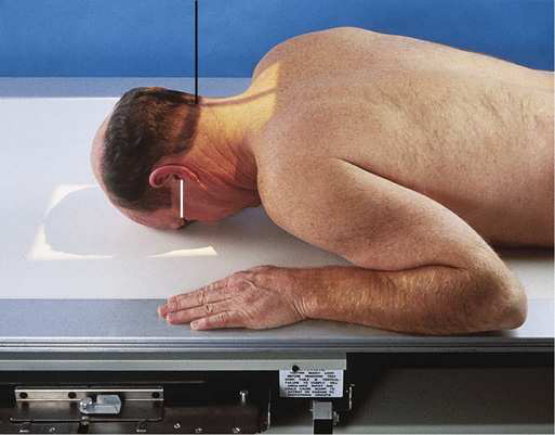
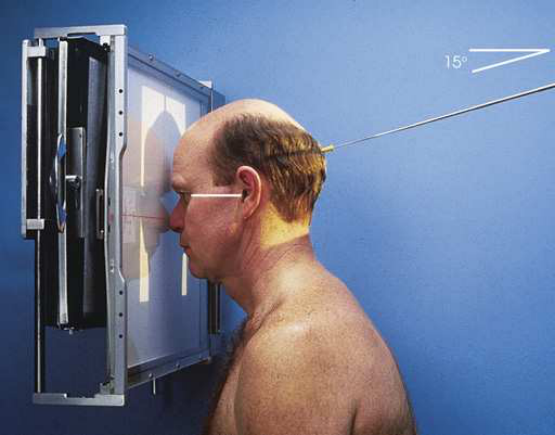
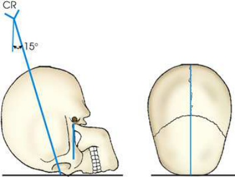
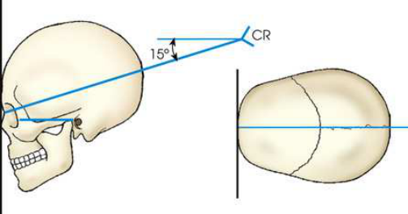
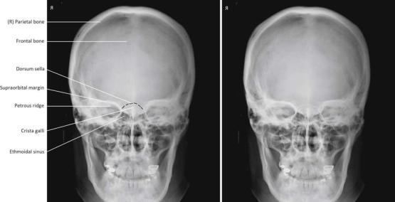
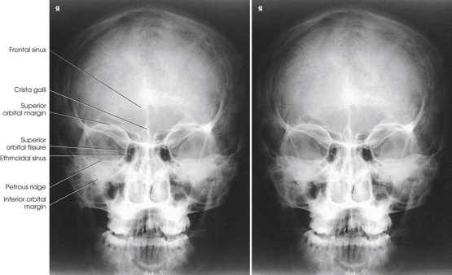

# Rx Craniu — Incidență Postero-Anterioară (PA) și Incidență PA Axială — Incidență Occipito-Frontală (Metoda Caldwell) (Merrill)

  📷 Radiografie Convențională (Rx)
  <strong>Actualizat:</strong> 2026-09-16
  <strong>Autor:</strong> Referință Merrill

---

-   __1. Rezumat Clinic & Indicații__

    ---

    === "Indicații Clinice"

        - Conform reperelor anatomice standard din tratat

    === "Ghid Național IRIS"

        !!! info "Referință Primară: Ghidul Național IRIS (Ordinul MS 1342/2012)"
            - **Capitol Ghid IRIS:** *Ghidul Național IRIS*
            - **Grad de Recomandare:** **De verificat pe indicație; fără grad atribuit automat**
            - **Nivel de Iradiere Estimată:** `De verificat pentru examinarea și populația selectate`

            [:octicons-search-16: Deschide Ghidul IRIS](../../iris.md){ .md-button .md-button--primary } [:material-open-in-new: Aplicația Oficială PWA](https://radiologie-pediatrica.ro/iris/){ .md-button target="_blank" rel="noopener" }
-   __2. Poziționare & Centrare Fascicul__

    ---

    - **Poziție Pacient:** se așază pacientul în decubit ventral sau în poziție șezândă. Se centrează MSP al corpului pacientului pe linia mediană a grilei. Se sprijină fruntea și nasul pacientului pe masa de examinare sau pe stativul vertical Bucky. Se flectează coatele pacientului și se așază brațele într-o poziție confortabilă; se ajustează flexia gâtului pacientului astfel încât linia orbitomeatală (LOM) să fie perpendiculară pe planul receptorului de imagine. Dacă pacientul este în decubit, se sprijină bărbia pe un burete radiotransparent, dacă este necesar. Dacă pacientul este obez sau hiperstenic, poate fi necesar să se plaseze un burete radiotransparent mic sub (sau în fața) frunții. Se aliniază MSP perpendicular pe receptorul de imagine (RI). Aceasta se realizează prin ajustarea marginilor laterale ale orbitelor sau ale conductelor auditive externe (CAE), la distanțe egale față de masa de examinare. Se imobilizează capul pacientului și se centrează receptorul de imagine la nazion.
    - **Punct de Centrare Fascicul:** pentru incidența postero-anterioară (PA), când osul frontal este de interes principal, se orientează raza centrală perpendicular pe nazion (Fig. 11.56). Pentru incidența PA axială, incidența occipito-frontală (metoda Caldwell), se orientează raza centrală spre nazion, la un unghi de 15 grade caudal (Figs. 11.57–11.59). Se centrează receptorul de imagine pe raza centrală. Pentru evidențierea fisurilor orbitare superioare, se orientează raza centrală prin mijlocul orbitelor, la un unghi de 20 la 25 grade caudal. Pentru evidențierea foramina rotundum, se orientează raza centrală spre nazion, la un unghi de 25 la 30 grade caudal. (Incidența occipito-mentonieră [metoda Waters], prezentată în secțiunea Radiografia sinusurilor, este de asemenea utilizată pentru evidențierea foramina rotundum.)
    - **Distanță Focar-Film (DFF / SID):** Nespecificat în fragmentul extras; de verificat în sursă
    - **Comandă Respiratorie:** apnee (oprirea respirației).

-   __3. Parametri Tehnici Expunere__

    ---

    | Parametru Tehnic | Valoare Configurare Generator / Tub |
    |:-----------------|:-------------------------------------|
    | **Tensiune Tub (kV)** | DE CONFIGURAT PE APARAT |
    | **Sarcină / Produs Curent-Timp (mAs)** | DE CONFIGURAT PE APARAT |
    | **Distanță Focar-Film (DFF / SID)** | Nespecificat în fragmentul extras; de verificat în sursă |
    | **Grilă Antidifuzoare (Bucky)** | DE CONFIGURAT PE APARAT |
    | **Dimensiune Focar** | DE CONFIGURAT PE APARAT |
    | **Camere de Ionizare AEC** | DE CONFIGURAT PE APARAT |
    | **Colimare Fascicul** | Se ajustează câmpul de iradiere pentru a se extinde cu 1 inch (2.5 cm) dincolo de conturul cutanat al craniului. Se verifică lumina la vertex și pe ambele părți (bilateral). Se plasează markerul de lateralitate (D/S) în câmpul de expunere colimat. |
    | **Filtrare Tub** | DE CONFIGURAT PE APARAT |

-   __4. Criterii de Calitate & Reușită Imagine__

    ---

    - Conform reperelor anatomice standard din tratat

-   __5. Protecție Radiologică (ALARA)__

    ---

    - Nespecificat în fragmentul extras; de verificat în sursă

!!! note "Observații Clinice & Tehnice"
    Conform reperelor anatomice standard din tratat

### 🖼️ Imagini

<figure class="protocol-image-card" markdown>

<figcaption><strong>Merrill — pagina 872, imaginea 1</strong> — Imagine din fragmentul sursă; asocierea necesită revizie.</figcaption>

</figure>

<figure class="protocol-image-card" markdown>

<figcaption><strong>Merrill — pagina 873, imaginea 2</strong> — Imagine din fragmentul sursă; asocierea necesită revizie.</figcaption>

</figure>

<figure class="protocol-image-card" markdown>

<figcaption><strong>Merrill — pagina 873, imaginea 3</strong> — Imagine din fragmentul sursă; asocierea necesită revizie.</figcaption>

</figure>

<figure class="protocol-image-card" markdown>

<figcaption><strong>Merrill — pagina 873, imaginea 4</strong> — Imagine din fragmentul sursă; asocierea necesită revizie.</figcaption>

</figure>

<figure class="protocol-image-card" markdown>

<figcaption><strong>Merrill — pagina 874, imaginea 5</strong> — Imagine din fragmentul sursă; asocierea necesită revizie.</figcaption>

</figure>

<figure class="protocol-image-card" markdown>

<figcaption><strong>Merrill — pagina 874, imaginea 6</strong> — Imagine din fragmentul sursă; asocierea necesită revizie.</figcaption>

</figure>

=== "Ghid Rapid de Execuție"

    1. **Identificarea și verificarea pacientului:** verificare identitate, zonă de examinat, consimțământ conform procedurii și evaluarea posibilității unei sarcini, când este relevantă.
    2. **Pregătire:** îndepărtarea oricăror obiecte radiopace (bijuterii, agrafe, fermoare, proteze, pansamente dense).
    3. **Poziționare precisă:** alinierea receptorului de imagine și a tubului la distanța prescrisă (Nespecificat în fragmentul extras; de verificat în sursă).
    4. **Colimare strictă:** adaptarea fasciculului strict la regiunea de diagnostic pentru scăderea iradierii și reducerea radiației difuze.
    5. **Radioprotecție:** verificarea [politicii RX](../radioprotectie.md), cu măsuri distincte pentru pacient, personal și însoțitor.

## Surse de documentare

- [Merrill’s Atlas, 11. Cranium, pagini 871–874](https://books.google.com/books/about/Merrill_s_Atlas_of_Radiographic_Position.html?id=BM0lEQAAQBAJ)

## Fragmente sursă traduse (referință tehnică)

### anatomie

pentru incidența PA cu raza centrală perpendiculară (Fig. 11.60), orbitele sunt ocupate de marginile stâncilor temporale (piramidele pietroase). Alte structuri vizualizate includ celulele etmoidale aerice posterioare, crista galli, osul frontal și sinusurile frontale. Dorsum sellae este vizibil ca o linie curbată care se extinde între orbite, imediat deasupra celulelor etmoidale aerice.
Când raza centrală este înclinată cu 15 grade caudal spre nazion pentru incidența PA axială, metoda Caldwell, sunt vizibile multe dintre aceleași structuri care apar în incidența PA (Fig. 11.61); totuși, stâncile temporale (piramidele pietroase) sunt proiectate în treimea inferioară a orbitelor. Metoda Caldwell evidențiază, de asemenea, celulele etmoidale aerice anterioare. Schüller, 2 care a descris primul această poziționare pentru craniu, a recomandat un unghi caudal de 25
grade.
Examinări pe targă și la patul pacientului

### colimare

• Se ajustează câmpul de iradiere pentru a se extinde cu 1 inch (2.5 cm) dincolo de conturul cutanat al craniului. Se verifică lumina la vertex și pe ambele părți (bilateral). Se plasează markerul de lateralitate (D/S) în câmpul de expunere colimat.

### raza centrală

• pentru incidența PA, când osul frontal este de interes principal, se orientează raza centrală perpendicular pe nazion (Fig. 11.56).
• pentru incidența PA axială, metoda Caldwell, se orientează raza centrală spre nazion, la un unghi de 15 grade caudal (Figs. 11.57–
11.59).
• Se centrează receptorul de imagine pe raza centrală.
• pentru evidențierea fisurilor orbitare superioare, se orientează raza centrală prin mijlocul orbitelor, la un unghi de 20 la 25 grade caudal.
• pentru evidențierea foramina rotundum, se orientează raza centrală spre nazion, la un unghi de 25 la 30 grade caudal. (Metoda Waters,
prezentată în secțiunea Radiografia sinusurilor, este de asemenea utilizată pentru evidențierea foramina rotundum.)

### part_pos

• se ajustează flexia gâtului pacientului astfel încât linia orbitomeatală (LOM) să fie perpendiculară pe planul receptorului de imagine.
• Dacă pacientul este în decubit, se sprijină bărbia pe un burete radiotransparent, dacă este necesar.
• Dacă pacientul este obez sau hiperstenic, poate fi necesar să se plaseze un burete radiotransparent mic sub (sau în fața) frunții.
• Se aliniază MSP perpendicular pe receptorul de imagine (RI). Aceasta se realizează prin ajustarea marginilor laterale ale orbitelor sau ale conductelor auditive externe (CAE), la distanțe egale față de masa de examinare.
• se imobilizează capul pacientului și se centrează receptorul de imagine la nazion.

### patient_pos

• se așază pacientul în decubit ventral sau în poziție șezândă pe scaun.
• Se centrează MSP al corpului pacientului pe linia mediană a grilei.
• se sprijină fruntea și nasul pacientului pe masa de examinare sau pe stativul vertical Bucky.
• se flectează coatele pacientului și se așază brațele într-o poziție confortabilă.

### respirație

apnee (oprirea respirației).

### tehnică

Poziționat conform indicațiilor producătorului sau protocolului departamentului pentru orientarea corectă a afișării structurilor anatomice; placă pentru raza centrală: 10 × 12 țoli (24 ×
30 cm), longitudinal.

