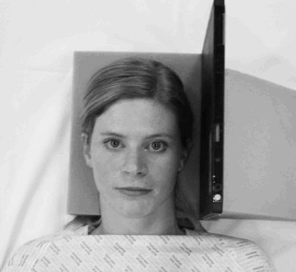
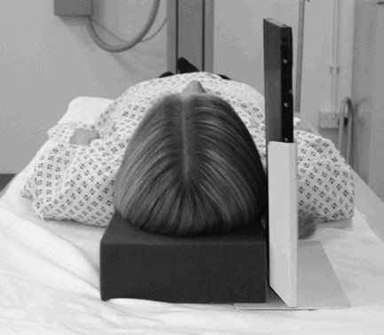
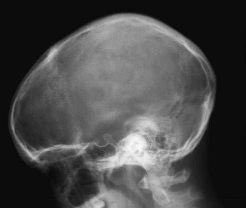
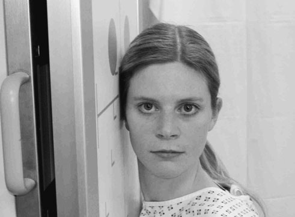
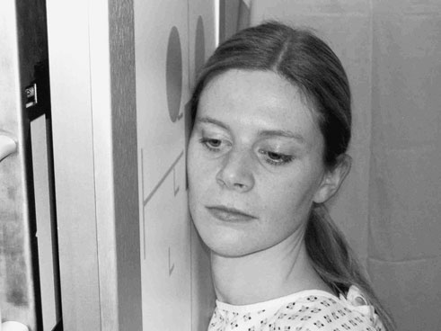

# Rx Craniu: non - isocentric technique

  📷 Radiografie Convențională (Rx)
  <strong>Actualizat:</strong> 2026-09-16
  <strong>Autor:</strong> Departamentul de Radiologie / Referință Clark (Ed. 12)

---

-   __1. Rezumat Clinic & Indicații__

    ---

    === "Indicații Clinice"

        - This incidență este performed ca part de Advanced Trauma și Life Support (ATLS) primary screen.
        - Craniu-base suspiciune de fractură sunt potentially life-threatening due la risk de intracranial proces infecțios / inflamator și sunt often very difficult la detect. Profil (lateral) Craniu incidențe taken Decubit dorsal cu Fascicul Orizontal poate reveal sinus nivele hidroaerice, which poate fie marker de Craniu-base injury. They poate also help la confirm presence de liber intracranial air, which este another sign de breach de integrity de Craniu.

    === "Ghid Național IRIS"

        !!! info "Referință Primară: Ghidul Național IRIS (Ordinul MS 1342/2012)"
            - **Capitol Ghid IRIS:** *Ghidul Național IRIS*
            - **Grad de Recomandare:** **De verificat pe indicație; fără grad atribuit automat**
            - **Nivel de Iradiere Estimată:** `De verificat pentru examinarea și populația selectate`

            [:octicons-search-16: Deschide Ghidul IRIS](../../iris.md){ .md-button .md-button--primary } [:material-open-in-new: Aplicația Oficială PWA](https://radiologie-pediatrica.ro/iris/){ .md-button target="_blank" rel="noopener" }
-   __2. Poziționare & Centrare Fascicul__

    ---

    - **Poziție Pacient:** • pacientul este culcat Decubit dorsal, cu capul raised și imobilizat pe non-opaque Craniu pad. This will ensure that occipital region este included pe final imagine.
• capul este ajustat, astfel încât plan mediosagital este perpendicular pe table/trolley și interorbital line este perpendicular pe casetă.
• Support casetă cu grilă antidifuzoare vertically pe / sprijinit de Profil (lateral) aspect de capul paralel cu plan mediosagital, cu its long edge 5 cm above vertex de Craniu.

• pacientul stă așezat facing Ortostatism Bucky și capul este then rotit, astfel încât plan mediosagital este paralel cu Bucky și inter-orbital line este perpendicular la it.
• Umerii pot fi rotiți ușor pentru permite obținerea poziției corecte. Pacientul se poate sprijini de stativul Bucky pentru stabilitate.
• poziție caseta transversely în Ortostatism Bucky, such that its upper margine este 5 cm above vertex de Craniu.
• radiolucent pad poate fie plasat under bărbia pentru support.
    - **Punct de Centrare Fascicul:** • raza centrală orizontală centrală este orientat paralel cu interorbital line, such that it este la drept-angles la planul mediosagital.
• Centre midway între glabelă și extern occipital protuberance la point approximately 5 cm superior la extern auditory meatus.
• axa longitudinală de caseta trebuie să fie coincident cu axa longitudinală de Craniu.

• X-ray tube trebuie să have been centred previously la Bucky.
• se ajustează height de Bucky/tube astfel încât pacient este comfortable (NB: do nu decentre tubul de la Bucky la this point).
• Centre midway între glabelă și extern occipital protuberance la point approximately 5 cm superior la extern auditory meatus.
    - **Distanță Focar-Film (DFF / SID):** 100 cm
    - **Comandă Respiratorie:** Apnee pe durata expunerii (apnee în inspir pentru torace; expir pentru Abdomen/bazin).

-   __3. Parametri Tehnici Expunere__

    ---

    | Parametru Tehnic | Valoare Configurare Generator / Tub |
    |:-----------------|:-------------------------------------|
    | **Tensiune Tub (kV)** | DE CONFIGURAT PE APARAT |
    | **Sarcină / Produs Curent-Timp (mAs)** | Conform AEC / grosime anatomică |
    | **Distanță Focar-Film (DFF / SID)** | 100 cm |
    | **Grilă Antidifuzoare (Bucky)** | Cu grilă antidifuzoare Bucky |
    | **Dimensiune Focar** | Focar Mic (0.6 mm) |
    | **Camere de Ionizare AEC** | Camerele laterale (sau camera centrală funcție de regiune) |
    | **Colimare Fascicul** | Colimare strictă adaptată pe receptor 24 x 30 cm |
    | **Filtrare Tub** | Totală ≥ 2.5 mm Al echivalent (conform Clark: 3.0 mm Al eq.) |

-   __4. Criterii de Calitate & Reușită Imagine__

    ---

    - imagine trebuie să contain toate de cranial bones și first cervical vertebra. ambele inner și outer Craniu tables trebuie să fie included.
    - true Profil (lateral) will result în perfect superimposition de Profil (lateral) portions de floors de anterior cranial fossa și those de posterior cranial fossa. clinoid processes de șa turcească trebuie să also fie superimposed (see p. 232).
    - Erori de evitat / remedii: Failure pentru include occipital region ca result de nu using pad that ensures capul este raised far enough de la masa de examinare/ trolley surface.
    - Erori de evitat / remedii: Poor superimposition de Profil (lateral) floors de cranial fossa. Always ensure that inter-orbital line este perpendicular pe film radiologic și that planul mediosagital este exactly perpendicular pe table/trolley top. This este nu easy poziție pentru pacientul la maintain. Check poziție de toate planes immediately before expunere, ca pacientul probably will have moved.

-   __5. Protecție Radiologică (ALARA)__

    ---

    - Ecranare gonadică cu șorț plumbat dacă gonadele sunt în apropierea fasciculului util (regula ALARA).
    - Colimare precisă la dimensiunea anatomică strict necesară pentru reducerea dozei și a radiației difuze.
    - Verificarea posibilității unei sarcini la pacientele de vârstă fertilă înainte de expunere.

!!! note "Observații Clinice & Tehnice"
    • choice de Profil (lateral) will depend pe site de suspected pathology.
• If suspected pathology este la stâng side de capul, then stâng Profil (lateral) trebuie să fie undertaken cu caseta sprijinit pe stâng side de pacientul, și vice versa. This will ensure that pathology este vizualizat la maximum possible resolution due la minimization de geometric unsharpness.
• This este incidență de choice pentru majority de trauma cases pe trolley.
MSP

• This incidență poate also fie performed cu pacientul Decubit ventral pe floating-top table.
• incidență poate fie performed usefully pe babies în Decubit dorsal poziție, cu capul rotit la either side.
• air/nivele hidroaerice în sinusuri sfenoidale (indicator pentru base-de-Craniu suspiciune de fractură) will nu fie vizibil if pacientul este imaged cu vertical raza centrală. This este nu relevant în young babies, ca sinus este nu developed fully.
Correct positioning Incorrect positioning

### 🖼️ Imagini

<figure class="protocol-image-card" markdown>

<figcaption><strong>• Craniu-base suspiciune de fractură sunt potentially life-threatening due la</strong> — Poziționare pacient și centrare fascicul conform Clark (Ed. 12)</figcaption>

</figure>

<figure class="protocol-image-card" markdown>

<figcaption><strong>Figura 2: Aspect radiografic / Poziționare (Clark Ed. 12)</strong> — Aspect radiografic / ghid de poziționare conform tratatului Clark (Ed. 12)</figcaption>

</figure>

<figure class="protocol-image-card" markdown>

<figcaption><strong>base-de-Craniu suspiciune de fractură) will nu fie vizibil if pacientul este</strong> — Aspect radiografic / ghid de poziționare conform tratatului Clark (Ed. 12)</figcaption>

</figure>

<figure class="protocol-image-card" markdown>

<figcaption><strong>Figura 4: Aspect radiografic / Poziționare (Clark Ed. 12)</strong> — Aspect radiografic / ghid de poziționare conform tratatului Clark (Ed. 12)</figcaption>

</figure>

<figure class="protocol-image-card" markdown>

<figcaption><strong>Figura 5: Aspect radiografic / Poziționare (Clark Ed. 12)</strong> — Aspect radiografic / ghid de poziționare conform tratatului Clark (Ed. 12)</figcaption>

</figure>

=== "Ghid Rapid de Execuție"

    1. **Identificarea și verificarea pacientului:** verificare identitate, zonă de examinat, consimțământ conform procedurii și evaluarea posibilității unei sarcini, când este relevantă.
    2. **Pregătire:** îndepărtarea oricăror obiecte radiopace (bijuterii, agrafe, fermoare, proteze, pansamente dense).
    3. **Poziționare precisă:** alinierea receptorului de imagine și a tubului la distanța prescrisă (100 cm).
    4. **Colimare strictă:** adaptarea fasciculului strict la regiunea de diagnostic pentru scăderea iradierii și reducerea radiației difuze.
    5. **Radioprotecție:** verificarea [politicii RX](../radioprotectie.md), cu măsuri distincte pentru pacient, personal și însoțitor.

## Surse de documentare

- [Clark's Positioning in Radiography (Ed. 12), Pagina 253](../../assets/protocols/sources/Clark___Positioning_in_Radiography__12th_edition.pdf#page=253)
