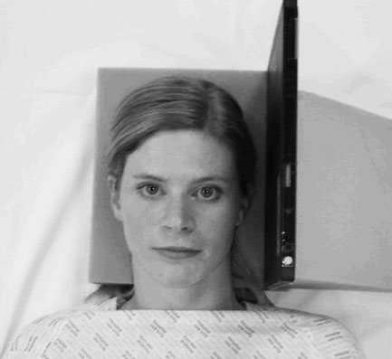
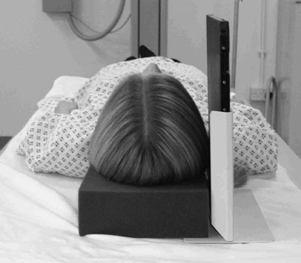
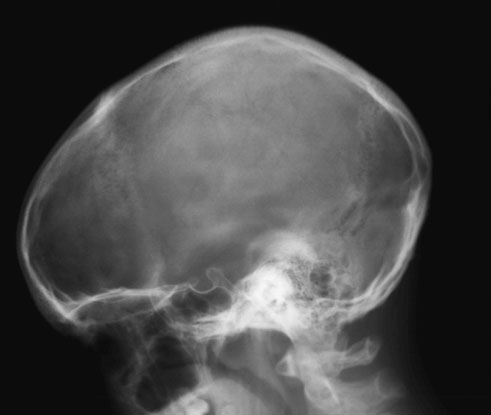
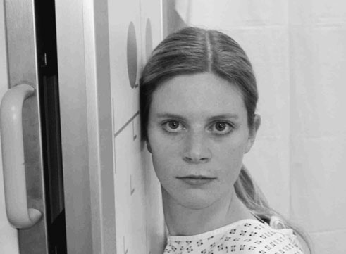
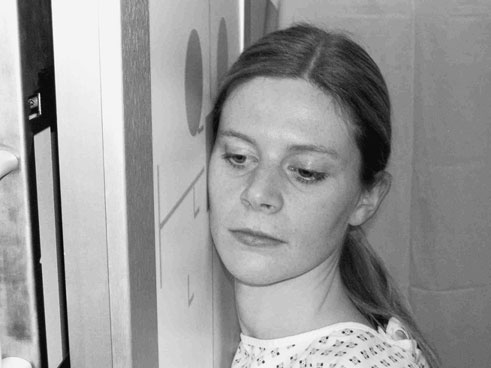

# Radiografia craniului: tehnică non-izocentrică

  📷 Radiografie Convențională (Rx)
  <strong>Actualizat:</strong> 2026-09-16
  <strong>Autor:</strong> Departamentul de Radiologie / Referință Clark (Ed. 12)

---

-   __1. Rezumat Clinic & Indicații__

    ---

    === "Indicații Clinice"

        - Această incidență se efectuează în cadrul evaluării primare din Suportul Vital Avansat în Traumă (ATLS).
        - Suspiciunile de fractură a bazei craniului sunt potențial amenințătoare de viață din cauza riscului de proces infecțios / inflamator intracranian și sunt adesea foarte dificil de detectat. Incidențele de profil ale craniului, efectuate în decubit dorsal cu fascicul orizontal, pot evidenția niveluri hidroaerice în sinusuri, care pot fi un marker al unei leziuni a bazei craniului. De asemenea, pot contribui la confirmarea prezenței aerului intracranian liber, care reprezintă un alt semn al afectării integrității craniului.

    === "Ghid Național IRIS"

        !!! info "Referință Primară: Ghidul Național IRIS (Ordinul MS 1342/2012)"
            - **Capitol Ghid IRIS:** *Ghidul Național IRIS*
            - **Grad de Recomandare:** **De verificat pe indicație; fără grad atribuit automat**
            - **Nivel de Iradiere Estimată:** `De verificat pentru examinarea și populația selectate`

            [:octicons-search-16: Deschide Ghidul IRIS](../../iris.md){ .md-button .md-button--primary } [:material-open-in-new: Aplicația Oficială PWA](https://radiologie-pediatrica.ro/iris/){ .md-button target="_blank" rel="noopener" }
-   __2. Poziționare & Centrare Fascicul__

    ---

    - **Poziție Pacient:** • Pacientul este culcat în decubit dorsal, cu capul ridicat și imobilizat pe suportul radiotransparent pentru craniu. Astfel se va asigura includerea regiunii occipitale în imaginea finală.
• Capul este ajustat astfel încât planul mediosagital să fie perpendicular pe masă/targă, iar linia interorbitară să fie perpendiculară pe casetă.
• Susțineți caseta cu grilă antidifuzoare în poziție verticală pe/lângă aspectul de profil al capului, paralel cu planul mediosagital, cu marginea sa lungă la 5 cm deasupra vertexului craniului.

• Pacientul stă așezat cu fața spre stativul Bucky vertical, iar capul este apoi rotit astfel încât planul mediosagital să fie paralel cu Bucky, iar linia interorbitară să fie perpendiculară pe acesta.
• Umerii pot fi rotiți ușor pentru a permite obținerea poziției corecte. Pacientul se poate sprijini de stativul Bucky pentru stabilitate.
• Poziționați caseta transversal în stativul Bucky vertical, astfel încât marginea sa superioară să fie la 5 cm deasupra vertexului craniului.
• Un suport radiotransparent poate fi plasat sub bărbie pentru susținere.
    - **Punct de Centrare Fascicul:** • raza centrală orizontală este orientată paralel cu linia interorbitală, astfel încât este în unghi drept față de planul mediosagital.
• Se centrează la jumătatea distanței dintre glabelă și protuberanța occipitală externă, într-un punct situat la aproximativ 5 cm superior de conductul auditiv extern.
• axa longitudinală a casetei trebuie să coincidă cu axa longitudinală a craniului.

• Tubul de raze X trebuie să fi fost centrat anterior la Bucky.
• se ajustează înălțimea Bucky/tubului astfel încât pacientul să fie confortabil (NB: nu se decentrează tubul față de Bucky în acest moment).
• Se centrează la jumătatea distanței dintre glabelă și protuberanța occipitală externă, într-un punct situat la aproximativ 5 cm superior de conductul auditiv extern.
    - **Distanță Focar-Film (DFF / SID):** 100 cm
    - **Comandă Respiratorie:** Apnee pe durata expunerii (apnee în inspir pentru torace; expir pentru Abdomen/bazin).

-   __3. Parametri Tehnici Expunere__

    ---

    | Parametru Tehnic | Valoare Configurare Generator / Tub |
    |:-----------------|:-------------------------------------|
    | **Tensiune Tub (kV)** | DE CONFIGURAT PE APARAT |
    | **Sarcină / Produs Curent-Timp (mAs)** | Conform AEC / grosimii anatomice |
    | **Distanță Focar-Film (DFF / SID)** | 100 cm |
    | **Grilă Antidifuzoare (Bucky)** | Cu grilă antidifuzoare Bucky |
    | **Dimensiune Focar** | Focar Mic (0.6 mm) |
    | **Camere de Ionizare AEC** | Camerele laterale (sau camera centrală, în funcție de regiune) |
    | **Colimare Fascicul** | Colimare strictă adaptată pe receptor 24 x 30 cm |
    | **Filtrare Tub** | Totală ≥ 2.5 mm Al echivalent (conform Clark: 3.0 mm Al echivalent) |

-   __4. Criterii de Calitate & Reușită Imagine__

    ---

    - Imaginea trebuie să conțină toate oasele craniene și prima vertebră cervicală. Ambele table craniene, internă și externă, trebuie incluse.
    - Un profil adevărat va determina suprapunerea perfectă a porțiunilor de profil ale planșeelor foselor craniene anterioară și posterioară. Procesele clinoide ale șeii turcești trebuie, de asemenea, să fie suprapuse (vezi p. 232).
    - Erori de evitat / remedii: Neincluderea regiunii occipitale ca urmare a neutilizării unui suport care să asigure ridicarea suficientă a capului față de suprafața mesei de examinare/tărgii.
    - Erori de evitat / remedii: Suprapunere deficitară a planșeelor foselor craniene în profil. Asigurați-vă întotdeauna că linia interorbitară este perpendiculară pe filmul radiologic și că planul mediosagital este exact perpendicular pe partea superioară a mesei/tărgii. Aceasta nu este o poziție ușor de menținut de către pacient. Verificați poziția în toate planurile imediat înainte de expunere, deoarece pacientul probabil se va fi mișcat.

-   __5. Protecție Radiologică (ALARA)__

    ---

    - Ecranare gonadică cu șorț plumbat dacă gonadele sunt în apropierea fasciculului util (regula ALARA).
    - Colimare precisă la dimensiunea anatomică strict necesară pentru reducerea dozei și a radiației difuze.
    - Verificarea posibilității unei sarcini la pacientele de vârstă fertilă înainte de expunere.

!!! note "Observații Clinice & Tehnice"
    • Alegerea incidenței de profil va depinde de localizarea patologiei suspectate.
• Dacă patologia suspectată este pe partea stângă a capului, atunci profilul stâng trebuie efectuat cu caseta sprijinită pe partea stângă a pacientului și viceversa. Astfel se va asigura vizualizarea patologiei la rezoluția maximă posibilă, datorită minimizării neclarității geometrice.
• Aceasta este incidența de elecție pentru majoritatea cazurilor de traumă efectuate pe targă.
MSP

• Această incidență poate fi efectuată și cu pacientul în decubit ventral pe masa cu blat mobil.
• Incidența poate fi efectuată util la sugari aflați în decubit dorsal, cu capul rotit spre oricare dintre părți.
• Nivelurile hidroaerice din sinusurile sfenoidale (indicator pentru suspiciunea de fractură a bazei craniului) nu vor fi vizibile dacă pacientul este examinat cu raza centrală verticală. Acest aspect nu este relevant la sugarii mici, deoarece sinusul nu este complet dezvoltat.
Poziționare corectă Poziționare incorectă

### 🖼️ Imagini

<figure class="protocol-image-card" markdown>

<figcaption><strong>• Suspiciunile de fractură a bazei craniului sunt potențial letale din cauza</strong> — Poziționarea pacientului și centrarea fasciculului conform Clark (Ed. 12)</figcaption>

</figure>

<figure class="protocol-image-card" markdown>

<figcaption><strong>Figura 2: Aspect radiografic / Poziționare (Clark Ed. 12)</strong> — Aspect radiografic / ghid de poziționare conform tratatului Clark (Ed. 12)</figcaption>

</figure>

<figure class="protocol-image-card" markdown>

<figcaption><strong>suspiciunea de fractură a bazei craniului) nu va fi vizibilă dacă pacientul este</strong> — Aspect radiografic / ghid de poziționare conform tratatului Clark (Ed. 12)</figcaption>

</figure>

<figure class="protocol-image-card" markdown>

<figcaption><strong>Figura 4: Aspect radiografic / Poziționare (Clark Ed. 12)</strong> — Aspect radiografic / ghid de poziționare conform tratatului Clark (Ed. 12)</figcaption>

</figure>

<figure class="protocol-image-card" markdown>

<figcaption><strong>Figura 5: Aspect radiografic / Poziționare (Clark Ed. 12)</strong> — Aspect radiografic / ghid de poziționare conform tratatului Clark (Ed. 12)</figcaption>

</figure>

=== "Ghid Rapid de Execuție"

    1. **Identificarea și verificarea pacientului:** verificare identitate, zonă de examinat, consimțământ conform procedurii și evaluarea posibilității unei sarcini, când este relevantă.
    2. **Pregătire:** îndepărtarea oricăror obiecte radiopace (bijuterii, agrafe, fermoare, proteze, pansamente dense).
    3. **Poziționare precisă:** alinierea receptorului de imagine și a tubului la distanța prescrisă (100 cm).
    4. **Colimare strictă:** adaptarea fasciculului strict la regiunea de diagnostic pentru scăderea iradierii și reducerea radiației difuze.
    5. **Radioprotecție:** verificarea [politicii RX](../radioprotectie.md), cu măsuri distincte pentru pacient, personal și însoțitor.

## Surse de documentare

- [Clark's Positioning in Radiography (Ed. 12), Pagina 253](https://books.google.com/books/about/Clark_s_Positioning_in_Radiography.html?id=Xxu6MwEACAAJ)
